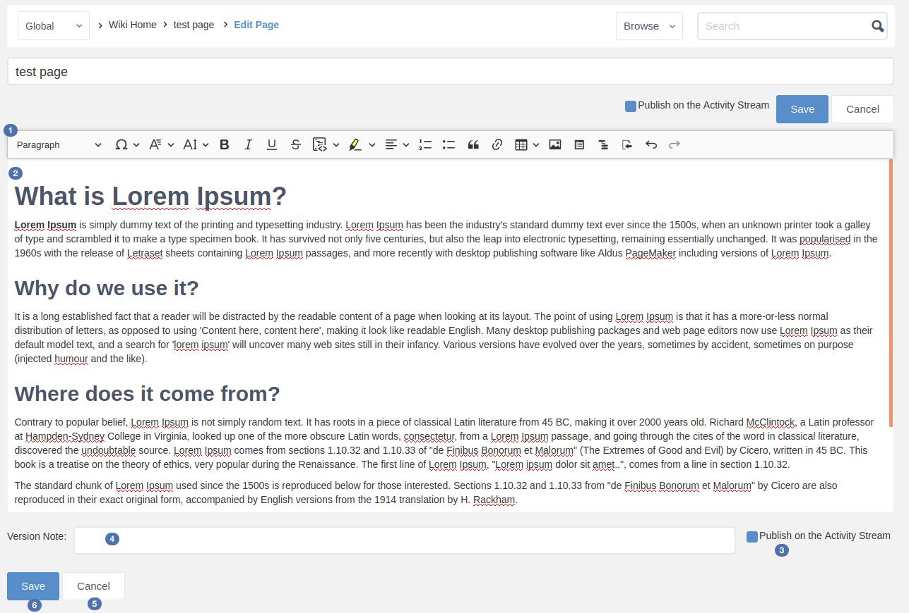

.. _Wiki:

####################
Working With Wikis
####################

    The **Wiki** application provides the content productivity to portal
    users as a tool to forge the unstructured knowledge. With **Wiki**,
    you can create and edit pages by using a simplified markup language
    or a WYSIWYG editor. Also, your company can use **Wiki** as an
    internal reference, such as work policy or a public wiki for
    comprehensive product information. **Wiki** along with **Forums**
    will complete the ideal combination that helps users enhance their
    experiences on collaboration activities and build valuable knowledge
    center for clients.
    
.. tip:: When accessing wiki application, a welcome page is displayed 
		 indicating in which wiki you are in.

			-  If you are in a user's wiki application, the welcome page
			 will display the message **Welcome to $FirstName $LastName Wiki**, where FirstName and LastName are the first and the last name of the user.
			
			|image95|
			
			-  If you are in a space's wiki application, the welcome 
			page will display the message **Welcome to Space $SpaceName 
			Wiki**, where SpaceName is the space name.
			
			|image96|

.. note:: The message of the welcome page in Wiki application, either 
		  for users profiles or spaces is a static message. 
		  
		  It tooks the first set parameters i.e. the first 
		  **$FirstName** and **$LastName** set by the user and the first
		  **$SpaceName** set by the space's creator.
		 
		  For example, in the case below, the first space name chosen by
		  its creator was "PM Team" then changed to "Product Management 
		  Team" but the wiki welcome page contains always **Welcome to 
		  Space PM Team Wiki**.
						
						|image97|

This chapter covers the following topics:

:ref:`Managing your content <Managing-Content>`

       Steps to perform common actions on a Wiki page (for example,
       creating, editing, using the editor, managing drafts, adding a
       related page, and attaching files); information about spreading
       your content; how to manage page changes (by comparing between 2
       versions or by watching); and ways to organize your content.

:ref:`Advanced settings <AdvancedSettings>`

       Steps specified for administrators to change space settings,
       manage permissions and author content via WebDAV.

.. _Wiki-layout:

**Wiki layout**

After opening Wiki, you should see the Wiki homepage as below:

|image7|

**In which**:

-  |image0|: The **Breadcrumb** which shows the page hierarchy.

-  |image1|: The Wiki administration area which allows administrators
   only to configure the Wiki settings.

-  |image2|: The **Search** box.

-  |image3|: The pages tree view.

-  |image4|: The **Page Control** area which helps users take actions
   with the current page.

-  |image5|: The page content.

-  |image6|: The page information. Click **number of attachment(s)** to
   open the **Attachments** details panel at the bottom of the page.
   Click **Public** or **Restricted** to update the permissions of the
   page.

.. _Navigate-across-spaces:

**Navigating across spaces**

The breadcrumb in Wiki shows the :ref:`page hierarchy <Page-hierarchy-wiki>` to
help you know where you are staying. Additionally, you can navigate to
another space right in the breadcrumb of the current Wiki navigation. To
quickly switch to another space, simply click the currently browsed
space name:

|image92|

Type your desired space name in the search box to filter the space and
click your space name from the search results. Then you will be
redirected to the Wiki home of the selected space. The "**My Wiki**\ "
and "**Intranet**\ " are displayed by default, which will direct you to
the homepage of your personal Wiki and Intranet Wiki accordingly.

|image93|

.. note::Only spaces where you are their member are displayed in the search result.

.. _Page-hierarchy-wiki:

**Page hierarchy in Wiki**

The **Wiki** content is organized as a page tree in which each page may
contain many sub-pages. The hierarchy is reflected on UI by the
**Breadcrumb** and the page tree in the left pane. When a page is added,
it is always defined as a sub-page to the current one. You can have
wikis for portals, wikis for groups or users.

.. _Wiki-spaces:

**Wiki Spaces**

Space is a set of pages, so the spaces partitioning means that spaces
are independent trees. This separation enables **Wiki** to provide
knowledge spaces for different groups.

There are 3 space types:

-  **Intranet wiki**: The global wiki of the Social Intranet.

An Intranet wiki is published for every user who can access that portal.

-  **Group wiki**: The wiki of a space.

A group wiki can be understood as a space wiki. The wiki application of
a space works as a group wiki for that space. The group wiki can be
accessed by members of that group.

For example:

|image94|

-  **User wiki**: The wiki of an individual user.

Every user has his own Wiki. You can switch to **My Wiki** from the
Select Location drop-down menu or from the drop-down menu of the display
name. See :ref:`Working with your wiki <Working-Wiki>` for more details.

.. note:: In this document, Spaces are referred as wikis, particularly portal
			wikis, group wikis and user wikis.
			Any space which has an implicit root page is named Wiki Home.

.. _Managing-Content:

======================
Managing your content
======================

The section consists of the following topics:

:ref:`Adding and editing pages <Adding-Editing-Wiki-Page>`

   Instructions on how to add and edit a Wiki page.

:ref:`Spreading your content <Spreading-Content>`

   Instructions on how to share your content with others by publishing
   your content on the Activity Stream, sharing a link or exporting a
   page as PDF.

:ref:`Managing page changes <ManagingContentChanges>`

   Instructions on how to manage versions of a Wiki page and watch a Wiki page.

:ref:`Organizing your content <Organizing-Content>`

   Instructions on how to move/delete a Wiki page.
   
.. _Adding-Editing-Wiki-Page:

Adding and editing pages
~~~~~~~~~~~~~~~~~~~~~~~~~~~

This section shows you how to work with Wiki pages via the following
topics:

:ref:`Creating a page <Creating-New-Page>`

:ref:`Editing a page <Editing-Page>`

:ref:`Using WYSIWYG editor (Rich Texteditor) <Editors>`

:ref:`Managing drafts <Managing-Page-Drafts>`

:ref:`Adding a related page <Adding-Related-Page>`

:ref:`Working with attachments <Working-With-Attachments>`

.. _Creating-New-Page:

Creating a page
------------------

**Creating a blank page**

1. Go to a Wiki space in which you want to create a page.

2. Click Add Page, then select Blank Page.

|image9|

3. Enter the title for your page. The page title must be unique.

4. Enter the content of your page by using :ref:`Wiki Markup <Syntax-help>` or the :ref:`WYSIWYG <Editors>` editor.

5. Click Preview if you want to see how your page looks like.

6. Click Save to finish.

**Creating a page from template**

1. Go to a Wiki space in which you want to create a page.

2. Click Add Page, then select From Template....

A list of available templates will appear.

|image10|

You can:

**i.** Click |image8| corresponding to the template you want to see. The
template preview appears.

|image11|

**ii.** Tick the checkbox corresponding to the template you want to select for your new page and click Select. The selected template appears.

3. Enter the title for your page. The page title must be unique.

4. Enter the content of your page by using :ref:`Wiki Markup <Syntax-help>` or the
:ref:`WYSIWYG <Editors>` editor.

5. Click Preview if you want to see how your page looks like.

6. Click Save to finish.

.. note:: These templates can be created, edited and deleted by administrator.
			See the :ref:`Managing a page template <Managing-Templates>` section for more details.

**Adding an undefined link for creating a page later**

In the **Wiki** application of eXo Platform, you can add a link pointing to a
page which you are going to create later. Such links are called
undefined links which are often used to remind other **Wiki** users to
create the page. You must use the :ref:`Source editor <Syntax-help>` to create the undefined links.

1. Add a link by typing the page title between square brackets '[[...]]'
into your page body.

For example:

+----------------------+----------------+
| What you type        | What you get   |
+======================+================+
| [[eXo User Guide]]   ||WYSIWYG|       |
+----------------------+----------------+

2. Click Save to save the page containing the link. The undefined link is
underlined.

3. Click this link to open the Add Page form.

4. Follow the steps stated :ref:`above <Creating-New-Page>`
to enter the page title, content and save the page.

.. _Editing-Page:

Editing a page
----------------

You can edit a page at any time if you have the **Edit** permission on
that page.

**Editing the whole page content**

To edit the whole page content, click Edit in the Page Control area.
Your page will be switched to the **Edit** mode which allows you to
rename the page and edit the page content.

|image13|

The toolbar in the **Edit** mode will be changed to activate the following actions.

|image14|

**Details:**

+--------------------+--------------------------------------------------------+
| Item               | Description                                            |
+====================+========================================================+
||image15|           | Switches to the **Rich Text (WYSIWYG)** editor.        |
+--------------------+--------------------------------------------------------+
|                    | Displays the preview mode of the currently edited      |
||image16|           | content. Previewing a page helps you verify the result |
|                    | of rendering the markup you just entered without       |
|                    | saving.                                                |
+--------------------+--------------------------------------------------------+
||image17|           | Opens the Wiki syntax help panel.                      |
+--------------------+--------------------------------------------------------+
||image18|           | Shows more syntax help.                                |
+--------------------+--------------------------------------------------------+
||image19|           | Ticks the Publish Activity checkbox to publish your    |
|                    | content modification on Activity Stream after saving   |
|                    | your changes                                           |
+--------------------+--------------------------------------------------------+
||image20|           | Inputs the edit reason if necessary.                   |
+--------------------+--------------------------------------------------------+
|                    | Saves the current page and go back to the view mode.   |
|                    | Changes will be sent to watchers via mail              |
||image21|           | notification.                                          |
+--------------------+--------------------------------------------------------+
|                    | Discards the current changes and go back to the        |
||image22|           | **View** mode.                                         |
+--------------------+--------------------------------------------------------+

**Editing a page section**

To edit only a section in the whole page content, hover your cursor over
the title of the section you want to edit, then click |image12|.

|image23|

The selected section will be switched to the **Edit** mode.

.. tip::    In the **View** mode, you can quickly edit the page title by double-clicking it, then press **Enter** when finishing.

.. _Editors:

Using WYSIWYG editor (Rich Text editor)
----------------------------------------

**WYSIWYG** stands for What You See Is What You Get. The **WYSIWYG**
editor allows you to edit an wiki page directly in the wiki markup
language. This has the advantage of being faster than the :ref:`Source Editor <Use-source-editor>`
for content formatting tasks.

.. _switch-editors:

You can switch between the **Source** and **WYSIWYG** editors at any
time by clicking |image24| or |image25|.

In the **Source** editor, which is selected by default when you edit a
page, you have to use the wiki markup language for text formatting,
while the **WYSIWYG** editor enables the content to be appeared during
editing that is very similar to the published result. Thanks to
available tools on this editor, you can format your content visually
without using wiki markups.

.. note::If the final result is not similar to what you wish when editing a
			page by the **WYSIWYG** editor, you can go back to the **Source**
			editor and use **Wiki** markups to edit the content.

    When using the **Source** editor, examples of commonly used markups
    are displayed in a lateral panel with a link to the :ref:`Full Syntax Notation <Syntax-help>`
    page for more details.

To learn more about the **WYSIWYG** editor, you can refer to the
`WYSIWYG editor user
guide <http://platform.xwiki.org/xwiki/bin/view/Features/WysiwygEditor>`__.

.. _Insert-images-files:

**Inserting images and files**

.. _insert-image:

*Inserting an image*

You can insert an attached image or an external image by clicking
|image26| on the text editor.

|image27|

-  **Inserting an attached image**

1. Select **Attached Image...** from the drop-down menu.

2. Follow the steps in the :ref:`Adding an attachment to a
page <add-an-attachment>` section.

-  **Inserting an external image**

1. Select **External Image...** from the drop-down menu.

2. Insert the image URL into the input-text box.

|image28|

3. Optionally, edit the image parameters by clicking Image Settings.

|image29|

4. Click Insert Image button to accept inserting the external image into your Wiki
page or click Change Image to select another image.

.. _Attach-files:

*Attaching files*

To attach files to a page, follow the steps in the :ref:`Adding an attachment to a page <add-an-attachment>` section.

.. _work-with-macros:

**Working with Macros**

By using macros, you can apply extra formatting, functionality and
customization to your content. You can easily add macro tags by using
the **Rich Text** editor.

1. Switch to :ref:`Rich Text editor <switch-editors>`.

2. Click Macro, then select Insert Macro... from the drop-down menu.

The Insert Macro form appears.

The macro is classified into different categories: **Content**,
**Development**, **Formatting** and **Navigation** and **Other**.

3. Select a macro category.

4. Select your desired macro from the selected categories list, then click
the Select button, or simply double-click it. For example, if you select
the Box macro, you will go to the macro parameters form.

5. Enter parameters into the corresponding fields for your selected macro.
Click Insert Macro to perform your macro insertion, or click Previous to
return to the initial Insert Macro form.

.. tip: Move up/down the scroll bar to see functional description of macros.

.. _Use-source-editor:

**Using Source Editor**

.. _Syntax-help:

*Syntax Help*

If you do not know how to use a syntax, you can use the **Syntax Help**
function. The **Syntax Help** is displayed by clicking |image30| from the
page toolbar. When being clicked, a lateral pane beside the editing area
will show all the Confluence syntax information. The lateral pane can be
hidden by clicking |image31| in the upper right corner or by clicking
|image32| again.

You can click |image33| at the bottom of the short Help Tips form to open
the **Full Syntax Notation** page.

You can insert icons, emoticons to emphasize the content. The usage is
described in the **Full Syntax Notation \| Icon/Emoticon Support** page
with examples so you can easily remember and use them.

.. _Managing-Page-Drafts:

Managing drafts
----------------

While you are creating or editing a wiki page, your modification will be
auto-saved as draft in the My drafts page, and a notification message
will be shown near the page title.

|image34|

The draft of this page will be deleted after the page has been saved
successfully.

If you cancel creating the new page, a confirmation message will pop up:

|image35|

-  Click Yes to accept saving the page as draft to My drafts.

-  Click No to cancel keeping the draft of the page.

.. note:: When you edit an existing page which has modifications saved as
			draft, a warning will be shown that you can view, resume or delete the draft.

    |image36|

You can easily manage your drafts in the My Drafts page by clicking
BrowseMy drafts.

Here, you can:

-  :ref:`Viewing drafts <view-drafts>`

-  :ref:`Resuming drafts <resume-drafts>`

-  :ref:`Deleting drafts <delete-drafts>`

.. _view-drafts:

**Viewing drafts**

Click |image37| corresponding to the draft you want to view.

-  The blue words/lines are newly added.

-  The strike-through pink words/lines are removed.

.. _resume-drafts:

**Resuming drafts**

Click your desired page title to continue editing/creating the page with
the previously saved modifications.

.. _delete-drafts:

**Deleting drafts**

Click |image48| corresponding to the draft you want to delete, then click
**OK** in the confirmation message to accept your deletion.

.. _Adding-Related-Page:

Adding a related page
----------------------

Viewing page information is accessible to users who have the View
permission on that page. The page information provides all the details
about the related pages of the current page, the hierarchy structure of
the current page, :ref:`the page history <ViewingPageHistory>`, and more.

1. Select the page you want to view the information.

2. Click More from the page toolbar, then select Page Info from the
drop-down menu.

All information of the opening page, including page summary, related
pages, page hierarchy, recent changes will be displayed.

|image39|

**Adding a related page**

This feature allows you to add pages related to your page. This function
can be done in the **Page Info** view and is activated to users with the
Edit permission.

1. Click Add More Relations in the Page Info view, then select the related
pages in the Add Related Page window.

2. Click Select to add the selected page to the list of the Related Pages.

|image40|

.. _Working-With-Attachments:

Working with attachments
---------------------------

Attachments are any files enclosed with your pages. They may be images,
documents, presentation or multimedia files.

.. _view-all:

**Viewing all attachments of a page**

The attachments are displayed at the bottom of a wiki page.

|image41|

Here, you can:

-  View or download an attachment by simply clicking the attachment name.

-  Delete an attachment by simply clicking |image42|.

.. _add-an-attachment:

**Adding an attachment to a page**

There are two ways to add an attachment to a page:

*The first way*

In this way, you need to scroll down the page to find the Attachment
panel at the bottom. In case you do not see the Attachment panel, click
|image43| at the page header first.

|image44|

1. Click Upload New File button to open the upload window.

2. Select a file from your local device, then click Open. The file will
then be auto-uploaded.

*The second way*

You can use this method when editing the page content with **WYSIWYG**
editor (Rich Text editor). This way will create a link for the uploaded
file.

1. Select a page to which you want to add an attachment.

2. Select Edit at the Page Control area. For more details, see the :ref:`Editing a page <Editing-Page>` section.

3. Select the **Rich Text** editor on the page toolbar.

|image45|

4. Click |image46| on the toolbar of the **Rich Text** editor, then select
Attached File... from the drop-down menu.

|image47|

The Link form is displayed as below.

|image48b|

5. Select a file to upload. Now you can upload a new file or select one
file from existing files.

-  **Uploading a new file:**

**i.** Double-click Upload new file/Upload file..., or click Upload new
file/Upload file... Select in the Current page or All pages tab
respectively.

**ii.** Browse a file from your local device to upload, then select
Create Link.

Optionally, you can provide the link label and tooltip by clicking Link
Settings before clicking Create Link,

-  **Selecting from existing files:** Double-click your desired file, or
   click the file and select Select.

   The form to edit the link parameters appears.

   |image49|

   Click Create Link to update the link.
   

.. _Spreading-Content:

Spreading your content
~~~~~~~~~~~~~~~~~~~~~~~

To spread your Wiki content effectively, you can follow the actions
below:

-  :ref:`Publishing activity <Publishing-activity>`

-  :ref:`Sharing your links <Sharing-links>`

-  :ref:`Exporting a page as PDF <Export-as-PDF>`

.. _Publishing-activity:

Publishing activity
---------------------

Once you have created a Wiki page, your activity will be automatically
published in the Activity Stream with the content abstract. However, if
you edit a Wiki page, you can choose to share that activity on the
Activity Stream so that people can notice your changes.

 .. note:: To share your activity, the page you are working on must be public.
			|image50|

To do this, simply check Publish Activity and press Save to save changes
and publish the activity. You can also enter your comment in the Comment
field to display your comment with the activity.

People can view the changes you made by clicking |image51| and they will
be directed to the Compare Revisions page.

|image52|

.. _Sharing-links:

Sharing your links
-------------------

A permanent link of a space or a Wiki page allows you to share/restrict
its content with other users. To achieve it, do as follows:

1. Go to a Wiki page where you want to get its permanent link.

2. Click More in the Page Control area, then select Permalink

|image53|

Or, click the Public/Restricted status indicated at the page header.

|image54|

The Permalink form will display. This form shows the public/restricted
status of the Wiki page and the link to share.

|image55|

.. _MakingPublic:

-  If the page is public, click Restrict to restrict the access. The
   form will show that the page is changed into the restricted status
   and just the authorized users can view and edit it.
   
|image56|   

-  If the page is restricted, click Make Public to make it public. The
   form will show that the page is changed into the public status, and
   anyone can view and edit it.

   |image57|

**Managing the View and Editing permissions**

You can set the View and Edit permission to given users by clicking
Manage Permissions in the Permalink form. See the :ref:`Page Permissions <PagePermissions>`
section for more details.

.. note::Manage Permissions is visible only to Space managers, to the page
		creator, and to the users that have the page Admin privilege.

.. _Export-as-PDF:

Exporting a page as PDF
------------------------

eXo Platform allows you to export a Wiki page as PDF and download it to your
local device as follows:

1. Go to the Wiki page that you want to export as PDF.

2. Click More in the Page Control area, then select Export as PDF.

|image58|

3. Select where to save the PDF file, then click Save/OK to start
downloading the PDF file.

.. _ManagingContentChanges:

Managing page changes
~~~~~~~~~~~~~~~~~~~~~~

eXo Platform allows you to easily follow page changes, view the page history
and versions, compare differences between versions, and restore to your
desired version via the following topics:

-  :ref:`Page versions <WorkingWithPageVersions>`

-  :ref:`Watching a page <WatchingPage>`

.. _WorkingWithPageVersions:

Page versions
--------------

When editing the content of a page, **Wiki** will automatically create a
version of that page after it is saved. Thanks to the page versions, you
can make changes on the page safely and roll back to an earlier version
without worrying about messing things up.

In the :ref:`Page history <ViewingPageHistory>` view, you can see all versions of a page.

By default, the version of a page is displayed in the header, and each
version includes the following information:

-  Revision numbers.

-  Author making changes.

-  Date and time when changes are made.

-  Summary (if any).

   .. note::All functions, including viewing, comparing and restoring, can also be done by clicking the Revisions link at the Page Info bar. One
			pop-up pane appears right under this bar, allowing you to do the same steps as described below.
    
.. _ViewingPageHistory:    

**Viewing a page history**

To access the page history, just click View Page History in the `Page Info <Adding-Related-Page>`
view.

The **Page History** appears.

|image60|

In which:

-  |image61|: Compares selected page versions.

-  |image62|: Selects two versions that you want to compare.

-  |image63|: Specifies the version labels of the page and link to view a
   specific version.

-  |image64|: The date and time when the page is changed.

-  |image65|: The authors who make changes of the page.

-  |image66|: The reasons why the changes are made (optional).

-  |image67|: Restores a page to the selected version.

.. _View-versions-of-page:

**Viewing versions of a page**

To view a specific version of a page, just click a version label in the
**Page History** page. The selected version of that page will be displayed.

|image69|

At a version of the page, you can do the following actions:

-  Compare the current version with the selected one |image61|.

-  Replace the current version with the selected version |image62|.

-  Go to the **Page History** page |image63|.

-  View content of the previous version by selecting Prev.

-  View content of the next version by selecting Next.

.. _Compare-page-versions:

**Comparing page versions**

**Wiki** keeps track of histories of changes on a page by maintaining a
version of the page each time it is modified. To compare two versions,
select two checkboxes corresponding to each relevant version, then click
Compare the selected versions.

|image70|

A page which shows the changes between these two versions will be displayed.

|image71|

The changes between two versions will be marked with colors:

-  Words/lines which are red-highlighted with strike-throughs indicate
   that they were removed.

-  Words/lines highlighted in green indicate that they were added.

.. note:: Only two revisions can be selected at one time.

.. _Restore-page-version:

**Restoring a page version**

When you notice that there are changes in the current page version that
you are not satisfied, you can rollback to an older version of that page
quickly.

To restore to an older version, click |image68| corresponding to your
desired version in the **Page History** page.

.. note:: Restoring to an older version will create a copy of that version.
			For example, if the [current version (v.2)] is restored to the [older version (v.1)], **Wiki** will create a new version (v.3)
			containing content of v.1. The version v.3 will become the current version.

.. _WatchingPage:

Watching a page
-----------------

Watching a page allows you to receive a notification message about any
changes in the page.

.. _Watching-page:

**Watching a page**

1. Open the page you want to watch.

2. Click More in the Page Control area, then select Watch from the drop-down menu.

|image72|

A pop-up that informs you have started watching the page will appear.
Click **OK** to close it.

.. _stop-watch-wiki-page:

**Stopping watching a page**

1. Open the page which you are watching.

2. Click More in the Page Control area, then select Stop Watching from the drop-down menu.

|image73|

A pop-up that informs you have stopped watching the page will appear.
Click **OK** to close it.

.. _Organizing-Content:

Organizing your content
~~~~~~~~~~~~~~~~~~~~~~~~

.. _Move-page:

Moving a page
--------------

1. Select a page that you want to move.

2. Click More in the Page Control area, then select Move Page from the drop-down menu.

|image74|

The form to select the destination page appears.

|image75|

3. Select the destination page.

4. Click Move.

.. _Delete-page:

Deleting a page
----------------

1. Open the page you want to delete, then select More in the Page Control area.

|image76|

2. Click Delete Page from the drop-down menu.

3. Click **OK** in the confirmation message to accept your deletion.

.. note:: The **Delete Page** action is not displayed when you are in the Wiki Home.

.. _AdvancedSettings:

=================
Advanced settings
=================

The section consists of the following topics:

:ref:`Managing a page template <Managing-Templates>`

   Instructions on how to create/edit/delete a Wiki page template. Also,
   you will know how to quickly search for your desired template.

:ref:`Managing permissions <Managing-Permissions>`

   Instructions on how to manage the permissions of specific users,
   groups and memberships on a Wiki or a page.

:ref:`WebDAV support in Wiki <Using-WebDAV>`

   Instructions on how to use WebDAV to access your workspace and edit a
   Wiki page.

.. _Managing-Templates:

Managing a page template
~~~~~~~~~~~~~~~~~~~~~~~~~~

When adding a new page, you are not required to write the content from
scratch. You can start by selecting a page template which is actually a
**Wiki** page with predefined content.

In the Browse menu, click Wiki Settings to display the templates
management form.

|image77|

|image78|

Here, you can perform the followings:

-  :ref:`Searching for a template <SearchingTemplate>` |image79|

-  :ref:`Creating a new template <CreatingTemplate>` |image80|

-  :ref:`Editing a template <EditingTemplate>` |image81|

-  :ref:`Deleting a template <DeletingTemplate>` |image82|

.. _SearchingTemplate:

Searching for a template
--------------------------

This feature allows you to find your desired template quickly from the
existing list as follows:

1. Input a word included in the title of your desired template in the
Search textbox.

2. Press the **Enter** key to start your search.

All matching results which contain your entered search term are
displayed right below the textbox.

.. note:: The **Search** function is only performed by the template titles and
			you must enter a complete word into the Search textbox. For example,
			to find the template whose title contains "daily report", you can
			input "report" rather than "repo", or "daily" rather "ly".

.. _CreatingTemplate:

Creating a new template
-------------------------

1. Click Add More Templates in the **Wiki Settings** page and the sample
template form appears.

|image83|

2. Add the title for the template.

3. Write the description in the Description....

4. Write the content for the template.

5. Click Save Template to accept creating the new template. A message will
inform your successful template creation.

.. _EditingTemplate:

Editing a template
-------------------

1. Click |image84| corresponding to the template you want to edit.

2. Change the title, the description or the content as you want.

3. Click Save Template to accept your changes.

.. _DeletingTemplate:

Deleting a template
--------------------

1. Click |image85| corresponding to the template you want to delete.

2. Click **OK** in the confirmation message to accept your deletion.

.. _Managing-Permissions:

Managing permissions
~~~~~~~~~~~~~~~~~~~~~

**Wiki** lets you decide the restrictions to apply on a wiki or a page
and to specific users, groups or memberships. So, there are two levels
of permissions in **Wiki**:

-  :ref:`Page Permissions <PagePermissions>`

-  :ref:`Wiki Permissions <WikiPermissions>`

.. _PagePermissions:

Page permissions
-----------------

The **Page Permissions** allows you to set the View and Edit permissions
for a specific Wiki page.

1. Open a Wiki page that you want to set the permissions.

2. Click More and select Page Permissions from the drop-down menu.

|image86|

The Page Permissions form appears.

|image87|

Pages are viewable/editable according to the Wiki permission. On each
page, a user with the **Admin Pages** permission will be able to
override the view and edit permissions on a specific page.

A **Page Permissions** action appears in the page action menu when the
user has the **Admin Pages** permission.

You can add and delete the **View Pages Permission** or the **Edit Pages
Permission** for the page. Do the same as :ref:`Adding Wik permissions <AddingWikiPermissions>`
and :ref:`Deleting Wiki permissions <DeletingWikiPermissions>`.

.. note::	-  When ticking any permissions above, if you select a group with the \* membership, this permission will be grated to all users of
				that group, regardless of their membership role.
			-  All **Page Permissions** are restricted to a specific page, therefore any changes made on the page's permissions will not
				affect both its children and parents.

.. _WikiPermissions:

Wiki permissions
-------------------

Wiki permissions determine which actions a user can perform. A
permission can be assigned to any users, groups or memberships.

To change the Wiki permissions, click Browse and select Wiki Settings
from the drop-down list. Select the Permission tab in the Wiki Settings
page.

|image88|

There are some permissions on a Wiki as follows:

+----------------------+-----------------------------------------------------+
| Permission           | Description                                         |
+======================+=====================================================+
| View Pages           | Specifies who can view and watch pages of this      |
|                      | Wiki, its attachments and history.                  |
+----------------------+-----------------------------------------------------+
| Edit Pages           | Specifies who can edit pages of this Wiki.          |
+----------------------+-----------------------------------------------------+
| Admin Pages          | Specifies who have the administration rights on     |
|                      | pages of this Wiki.                                 |
+----------------------+-----------------------------------------------------+
| Admin Wiki           | Specifies who can administrate the Wiki permissions |
|                      | and settings.                                       |
+----------------------+-----------------------------------------------------+

In the Permission tab, you can:

-  :ref:`Adding Wiki permissions of the users, groups and memberships <AddingWikiPermissions>`.

-  :ref:`Deleting Wiki permissions of the users, groups and memberships <DeletingWikiPermissions>`.

.. _AddingWikiPermissions:

**Adding Wiki permissions**

You can add permissions for individual users, groups of users or
memberships.

1. Click |image89| to assign permissions to a user, a membership or a group
respectively. The form to select the user, the membership and the group appears.

2. Select a user, a membership or a group, then click Add.

.. note:: When ticking any permissions above, if you select a group with the \* membership, this permission will be granted to all users of that
			group, regardless of their membership role.

3. Click Add to add the selectors to the User or Group column in the
Permission form.

4. Tick the checkboxes corresponding to each permission you want to assign
to the selectors.

5. Click Save to commit.

.. note:: View and Edit permissions are applied by default to any Wiki pages unless specific page permissions are set. The super user has all
			permissions implicitly.
    
.. _DeletingWikiPermissions:    

**Deleting Wiki permissions**

To delete the permissions of a user, group or membership, just click
|image30| corresponding to a user or group or membership in the Permissions form.

.. _Using-WebDAV:

WebDAV support in Wiki
~~~~~~~~~~~~~~~~~~~~~~

To make easy for Wiki resources management, you can access these
resources using WebDAV. Besides the way stated :ref:`here <WebDAV>`, you can use the following URL format to access the Wiki resources:

-  `http://mycompany.com:port/rest/private/jcrwiki/{RepositoryName}/{WorkspaceName}/{Path} <http://mycompany.com:port/rest/jcrwiki/{RepositoryName}/{WorkspaceName}/{Path}>`__

-  `dav://mycompany.com:port/rest/private/jcrwiki/{RepositoryName}/{WorkspaceName}/{Path} <dav://mycompany.com:port/rest/jcrwiki/{RepositoryName}/{WorkspaceName}/{Path}>`__

Accordingly, to access the Wiki Home of the "Support Team" space over
Nautilus - the file manager for example, you can use either of the
following URLs:

-  `dav://mycompany.com:port/rest/private/jcrwiki/repository/collaboration/Groups/spaces/support\_team/ApplicationData/eXoWiki/WikiHome <dav://mycompany.com:port/rest/private/jcrwiki/repository/collaboration/Groups/spaces/support_team/ApplicationData/eXoWiki/WikiHome>`__

-  `dav://mycompany.com:port/rest/private/jcr/repository/collaboration/Groups/spaces/support\_team/ApplicationData/eXoWiki/WikiHome <dav://mycompany.com:port/rest/private/jcr/repository/collaboration/Groups/spaces/support_team/ApplicationData/eXoWiki/WikiHome>`__

After successful login, you will see the WebDAV drive with all content in that Wiki space.

|image91|

-  Each folder is a wiki page. The folder name is the same as the wiki
   page title.

-  "content" is the file that stores the page content.

Now you can access this drive anytime and manage its folders/files via
WebDAV. See :ref:`Editing a wiki page using WebDAV <Edit-wiki-Webdav>` for more details.

.. _Edit-wiki-Webdav:

Editing a wiki page using WebDAV
---------------------------------

1. Go to the folder that contains the content you want to edit.

2. Use your text editor to edit the "Content" file in this folder. You can
use the wiki syntax to format content as normal.

3. Save the file.

.. note:: -  You can copy/move/delete a page by copying/moving/deleting the corresponding folder.

.. |image0| image:: images/common/1.png
.. |image1| image:: images/common/2.png
.. |image2| image:: images/common/3.png
.. |image3| image:: images/common/4.png
.. |image4| image:: images/common/5.png
.. |image5| image:: images/common/6.png
.. |image6| image:: images/common/7.png
.. |image7| image:: images/wiki/overview.png
.. |image8| image:: images/wiki/preview_template_icon.png
.. |image9| image:: images/wiki/add_page.png
.. |image10| image:: images/wiki/template.png
.. |image11| image:: images/wiki/template_preview.png
.. |image12| image:: images/common/edit_icon.png
.. |image13| image:: images/wiki/page_control.png

.. |image15| image:: images/common/1.png
.. |image16| image:: images/common/2.png
.. |image17| image:: images/common/3.png
.. |image18| image:: images/common/4.png
.. |image19| image:: images/common/5.png
.. |image20| image:: images/common/6.png
.. |image21| image:: images/common/7.png
.. |image22| image:: images/common/8.png
.. |image23| image:: images/wiki/edit_section.png
.. |image24| image:: images/wiki/wysiwyg_btn.png
.. |image25| image:: images/wiki/source_editor_btn.png
.. |image26| image:: images/wiki/image_btn.png
.. |image27| image:: images/wiki/link_to_image.png
.. |image28| image:: images/wiki/insert_the_image_url.png
.. |image29| image:: images/wiki/edit_image_parameters.png
.. |image30| image:: images/wiki/help_btn.png
.. |image31| image:: images/common/close_icon.png
.. |image32| image:: images/wiki/help_btn.png
.. |image33| image:: images/wiki/more_btn.png
.. |image34| image:: images/wiki/draft_notification.png
.. |image35| image:: images/wiki/draft_confirmation.png
.. |image36| image:: images/wiki/draft_warning.png
.. |image37| image:: images/common/revision_icon.png
.. |image38| image:: images/common/delete_icon.png
.. |image39| image:: images/wiki/page_info.png
.. |image40| image:: images/wiki/select_related_page.png
.. |image41| image:: images/wiki/attachments.png   
.. |image42| image:: images/common/delete_icon.png
.. |image43| image:: images/wiki/attachment_icon.png
.. |image44| image:: images/wiki/open_upload_file_panel.png
.. |image45| image:: images/wiki/wysiwyg_btn.png
.. |image46| image:: images/wiki/link_btn.png
.. |image47| image:: images/wiki/wysiwyg_attach_file.png
.. |image48| image:: images/common/delete_icon.png
.. |image48b| image:: images/wiki/wysiwyg_upload_image.png
.. |image49| image:: images/wiki/wysiwyg_edit_link.png
.. |image50| image:: images/wiki/public_page_information.png
.. |image51| image:: images/common/revision_icon.png
.. |image52| image:: images/wiki/activity_changes.png
.. |image53| image:: images/wiki/permalink_menu.png
.. |image54| image:: images/wiki/permalink_header.png
.. |image55| image:: images/wiki/permalink.png
.. |image56| image:: images/wiki/permalink_private.png
.. |image57| image:: images/wiki/permalink_public.png
.. |image58| image:: images/wiki/export_pdf_menu.png
.. |image60| image:: images/wiki/page_history.png
.. |image61| image:: images/common/1.png
.. |image62| image:: images/common/2.png
.. |image63| image:: images/common/3.png
.. |image64| image:: images/common/4.png
.. |image65| image:: images/common/5.png
.. |image66| image:: images/common/6.png
.. |image67| image:: images/common/7.png
.. |image68| image:: images/common/restore_icon.png
.. |image69| image:: images/wiki/view_version.png
.. |image70| image:: images/wiki/page_history_compare.png
.. |image71| image:: images/wiki/page_version_changes.png
.. |image72| image:: images/wiki/watch_menu.png
.. |image73| image:: images/wiki/watch_stop_menu.png
.. |image74| image:: images/wiki/move_page_menu.png
.. |image75| image:: images/wiki/move_page.png
.. |image76| image:: images/wiki/detete_page_menu.png
.. |image77| image:: images/wiki/manage_template_menu.png
.. |image78| image:: images/wiki/manage_template.png
.. |image79| image:: images/common/1.png
.. |image80| image:: images/common/2.png
.. |image81| image:: images/common/3.png
.. |image82| image:: images/common/4.png
.. |image83| image:: images/wiki/add_more_template.png
.. |image84| image:: images/common/edit_icon.png
.. |image85| image:: images/common/delete_icon.png
.. |image86| image:: images/wiki/page_permissions_menu.png
.. |image87| image:: images/wiki/page_permissions.png
.. |image88| image:: images/wiki/wiki_permissions.png
.. |image89| image:: images/common/select_permission_icon.png
.. |image90| image:: images/common/delete_icon.png
.. |image91| image:: images/wiki/webdav_folders.png
.. |WYSIWYG| image:: images/wiki/undefined_link.png
.. |image92| image:: images/wiki/wiki_navigation.png
.. |image93| image:: images/wiki/wiki_navigation_filter.png
.. |image94| image:: images/wiki/group_wiki.png
.. |image95| image:: images/wiki/usersWiki.png
.. |image96| image:: images/wiki/spaceWiki.png
.. |image97| image:: images/wiki/changed-name.png
