Cookbook
========

    This chapter currently focuses on how to copy a work done on the
    PRODUCT server, such as creating navigations, node types and
    templates, to another PRODUCT server throughout these topics:

    -  **`Copying a site's content folder with its version
       history <#PLFDevGuide.Cookbook.CopyingSitesContentFolderWithVersionHistory>`__**

    -  **`Copying navigation nodes of
       sites <#PLFDevGuide.Cookbook.CopyingNavigationNodesOfSites>`__**

    -  **`Copying templates of node
       types <#PLFDevGuide.Cookbook.CopyingTemplateOfNodeType>`__**

    -  **`Copying the Content
       template <#PLFDevGuide.Cookbook.CopyingWCMTemplates>`__**

    -  **`Copying a category
       tree <#PLFDevGuide.Cookbook.CopyingTaxonomyTree>`__**

    -  **`Copying metadata
       templates <#PLFDevGuide.Cookbook.CopyingMetadataTemplates>`__**

    -  **`Copying queries <#PLFDevGuide.Cookbook.CopyingQueries>`__**

    -  **`Copying scripts <#PLFDevGuide.Cookbook.CopyingScripts>`__**

    -  **`Copying drive
       configurations <#PLFDevGuide.Cookbook.CopyingDriveConfigurations>`__**

    -  **`Copying gadgets <#PLFDevGuide.Cookbook.CopyingGadgets>`__**

    -  **`Restarting the
       server <#PLFDevGuide.Cookbook.RestartingServer>`__**

The procedure of each step will be detailed as follows:

**Step 1. Copying a site's content folder with its version history.**

Go to the Sites Management drive.

Open the site node, for example "acme".

Click Export on the Action bar to export the node with its version
history as below:

|image0|

Select Export and Export Version History to perform the exporting.

Navigate to the node where you want to import the file, then click
Import to open the Import form.

Select the exported nodes and version history to be imported.

|image1|

One pop-up message will appear to inform that you have imported
successfully.

**Step 2. Copying navigation nodes of sites.**

Go to the Content Administration page and add a new drive to both target
and source servers.

|image2|

Export the navigation node.

|image3|

Import the nodes navigation.

|image4|

**Step 3. Copying templates of node types.**

Add the System drive to both servers.

|image5|

Open ``system:/jcr:system/exo:namespaces/{namespace_name}``, and export
it.

|image6|

Open ``system:/jcr:system/exo:namespaces/``, and import the exported
file as described in `**Step
2** <#PLFDevGuide.Cookbook.CopyingNavigationNodesOfSites>`__.

|image7|

Open ``system:/jcr:system/jcr:nodetypes/{node_type}``, and export it.

|image8|

Open ``system:/jcr:system/jcr:nodetypes/``, and import the exported file
as described in `**Step
4** <#PLFDevGuide.Cookbook.CopyingWCMTemplates>`__.

|image9|

    **Note**

    If you have some specific JCR namespaces and node types, you need to
    import them into the new server.

**Step 4. Copying the Content template.**

Add the DMS Administration drive to both servers.

|image10|

    **Note**

    You need to select dms-system for the Workspace field.

Open the DMS Administration drive.

Open ``dms-system:/exo:ecm/templates/{node_type}``, and export it.

|image11|

Open ``dms-system:/exo:ecm/templates/``, and import the exported file.

|image12|

Also, for the CLV templates, you can find all template views defined in
the ``dms-system:/exo:ecm/views`` path with:

-  userviews: this folder contains views of Sites Explorer with a set of
   actions.

-  templates: where you can find all gtmpl templates of:

   -  Category Navigation Portlet templates.

   -  Content List Viewer (CLV) templates and its paginator templates.

   -  ecm-explorer templates define how to display nodes in the Sites
      Explorer portlet, such as Content, List and Thumbnails views.

   -  Search templates is used in the Content Search portlet to define
      the form, layout, result and result's paginator.

If you want to reuse one of the non-predefined templates above, simply
export and import it into the new server at the same place.

    **Note**

    If you have some specific Content (CLV) views and/or templates of
    node types, you will need to import them into the new server.

**Step 5. Copying a category tree.**

By importing the whole site as described in the `**Copying a site's
content folder with its version
history** <#PLFDevGuide.Cookbook.CopyingSitesContentFolderWithVersionHistory>`__
section, you will also have the category tree imported. The default
location where the site's category is placed in a sub-folder is named
category. So, you do not need to export or import them because this step
is automatically done. But the category tree definition is still not
fully imported in the new server. What you need to do is to add this
category tree definition by following these steps:

Open the DMS Administration drive in the new server.

Go to ``dms-system:/exo:ecm/exo:taxonomyTrees/definition``.

Add a symlink to the Category Tree Root Node, for example
``collaboration:/sites/acme``.

|image13|

The name of symlink is displayed as "acme".

|image14|

The symlink will be generated as below:

|image15|

In some cases, to see changes, you need to clear the cache by
disconnecting or restarting the server.

|image16|

**Step 6. Copying metadata templates.**

Open the DMS Administration drive in the new server.

Go to ``/exo:ecm/metadata/{meta_data_name}``.

Export and import it in the same location in the new server again.

**Step 7. Copying queries.**

Open the DMS Administration drive in the new server.

Go to ``/exo:ecm/queries/{query_name}``.

Export and import it in the same location in the new server again.

**Step 8. Copying scripts.**

Open the DMS Administration drive in the new server.

Go to ``/exo:ecm/scripts/ecm-explorer``.

You will find three folders referring to the three types of groovy
scripts in PRODUCT, including:

-  action: The action scripts are launched when an ECM action triggers
   them. For more information, refer to `Managing
   actions <../../../user-guide/html/PLFUserGuide.ManagingYourDocuments.ExtendingYourActions.ManagingActions.html>`__.

-  interceptor: Interceptor scripts are triggered before and/or after
   the JCR node is saved, or when a node is created or edited. They are
   used to either validate the value entered in a form or to manipulate
   the newly created node, for example, to map the new node with a forum
   thread or any other type of discussion areas.

-  widget: Widget scripts are used to fill widgets, such as a select box
   in a dynamic way.

Export your customized script in the same location in the new server.

**Step 9. Copying drive configurations.**

Open the DMS Administration drive in the new server.

Go to ``/exo:ecm/exo:drives/{drive_name}``.

Export and import it in the same location in the new server again.

**Step 10. Copying gadgets.**

Open the drive that points into the Portal-System Workspace.

Go to your gadget by following the
``portal-system:/production/app:gadgets/{gadget_name}`` path.

Export and import it in the same location in the new server again.

**Step 11. Restarting the server.**

After importing the site navigation nodes, the site may look quite
broken, so you need to restart the server first. After the server is
restarted, the site will look like:

|image17|

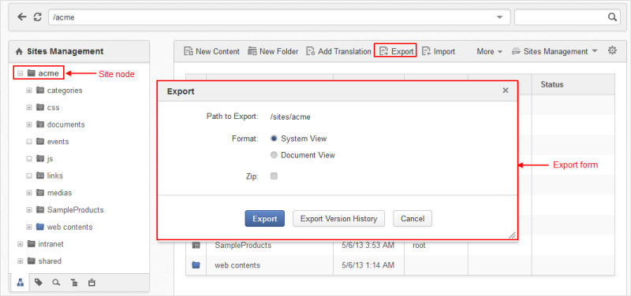
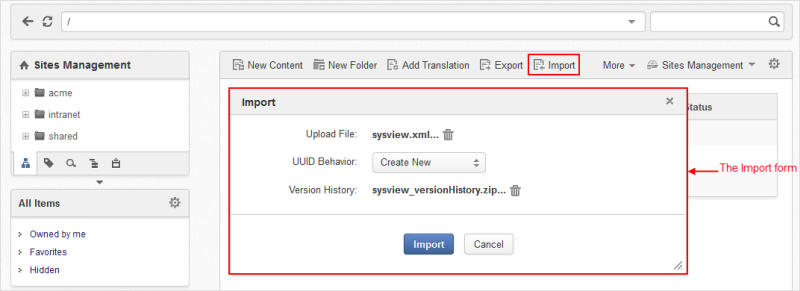
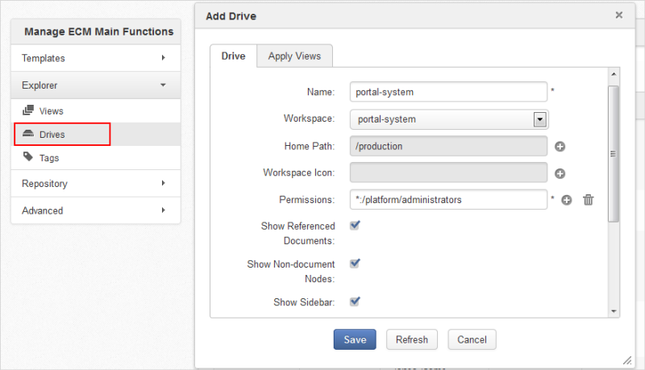
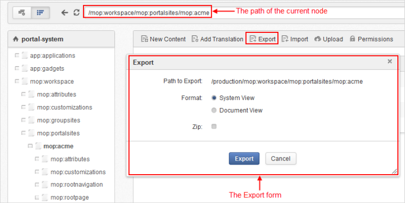
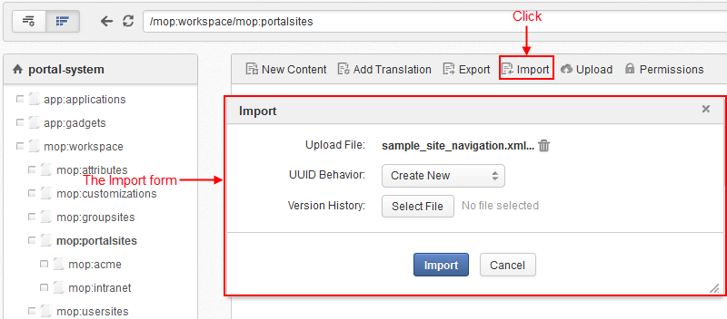
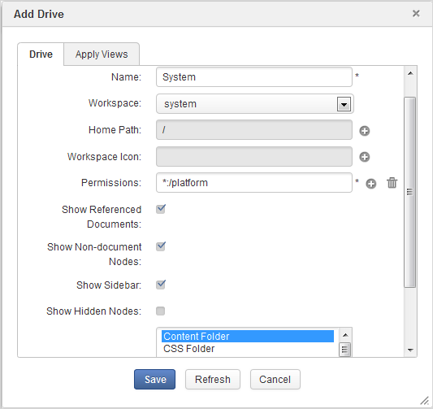
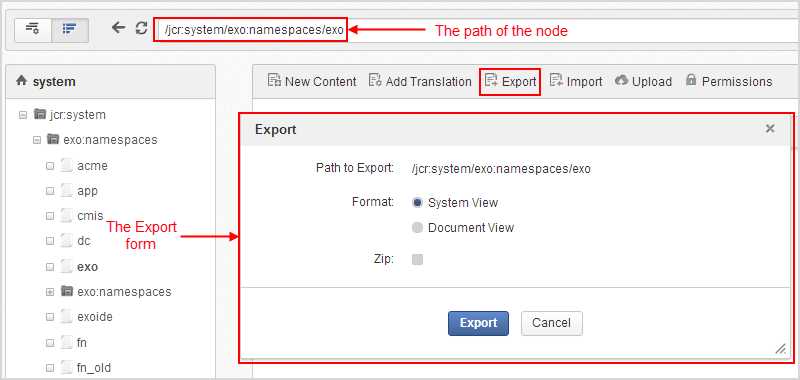
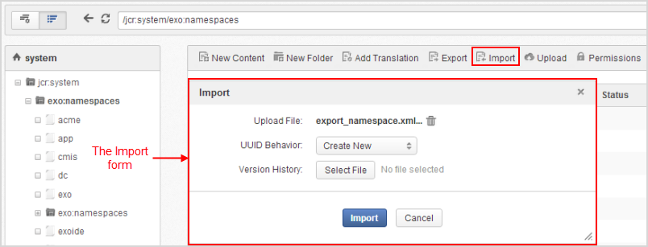
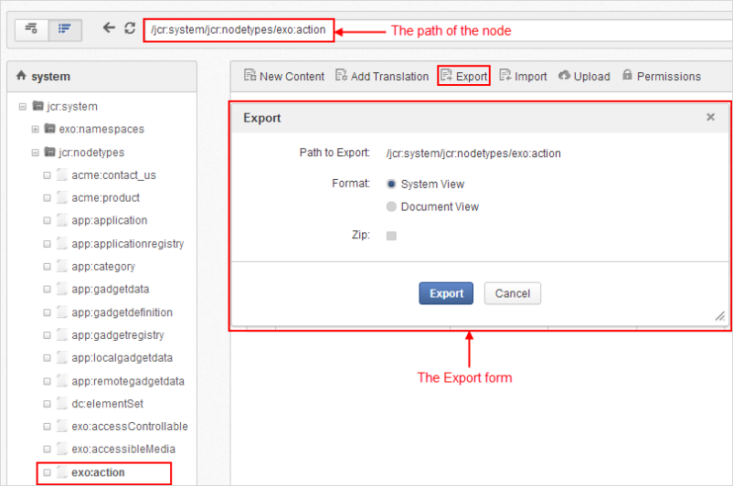
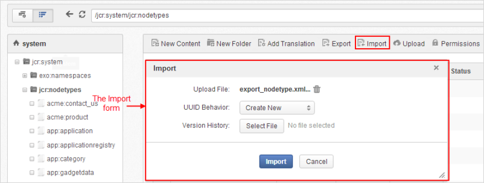
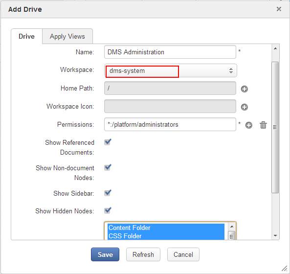
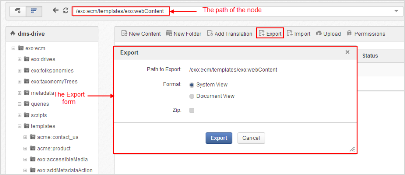
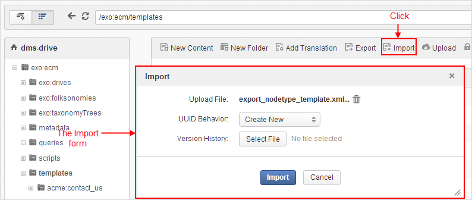
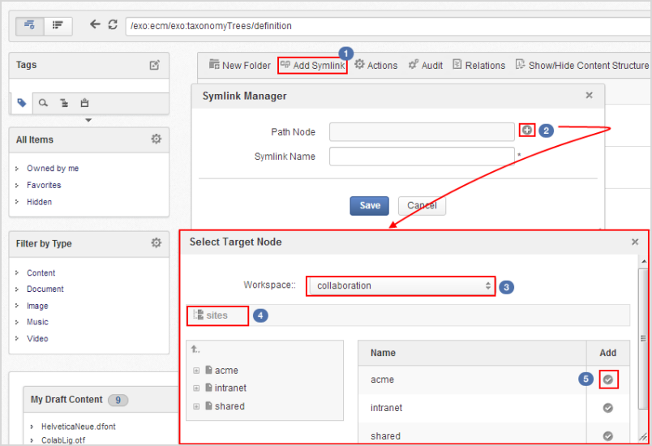
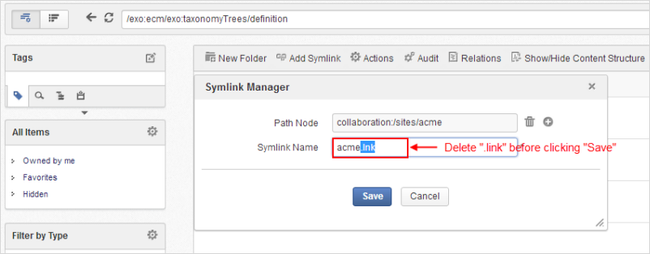
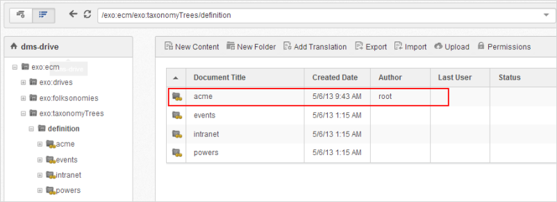
.. |image16| image:: images/how_to_copy_a_site/TaxonomyTree_added_successfully.png
.. |image17| image:: images/how_to_copy_a_site/acme_site_after_import_and_restart.png
