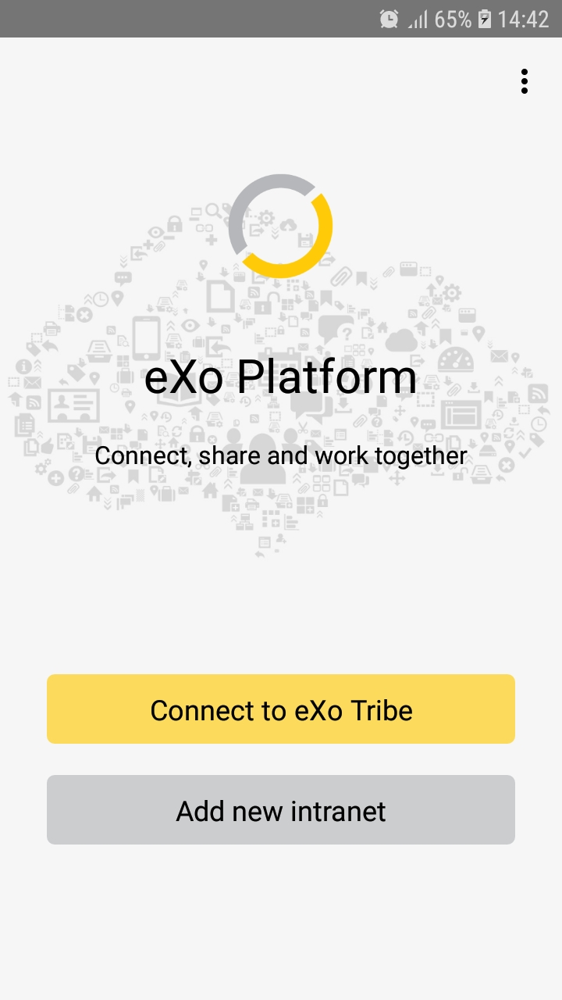
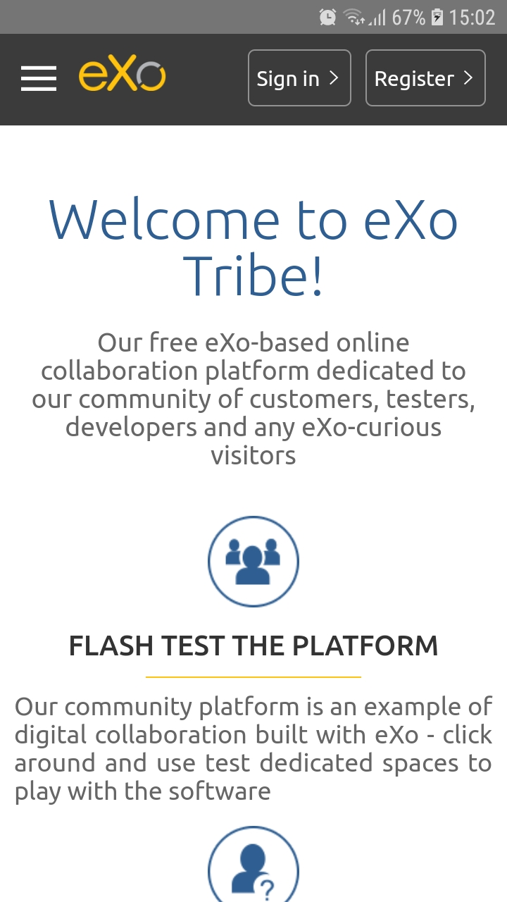
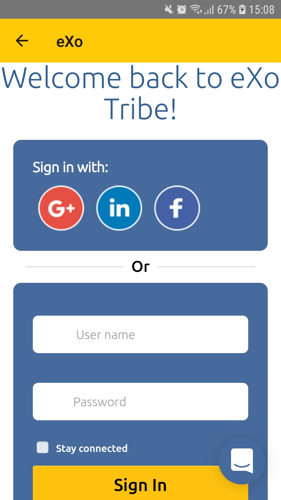
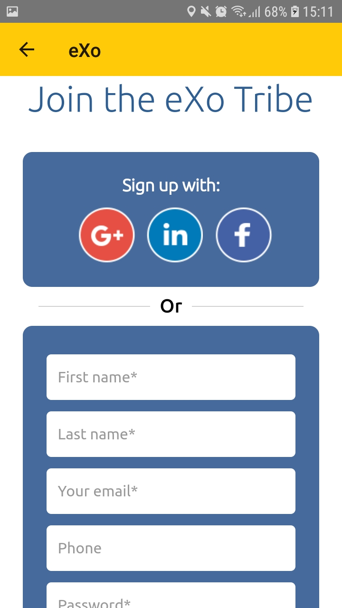
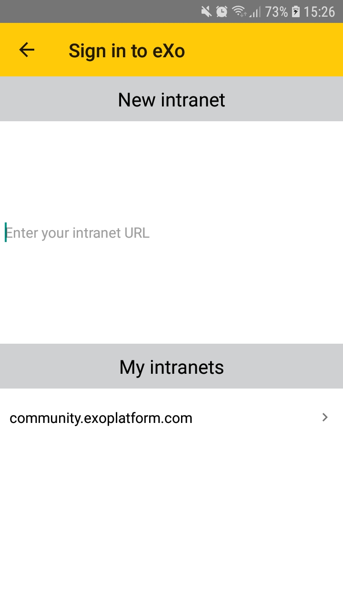
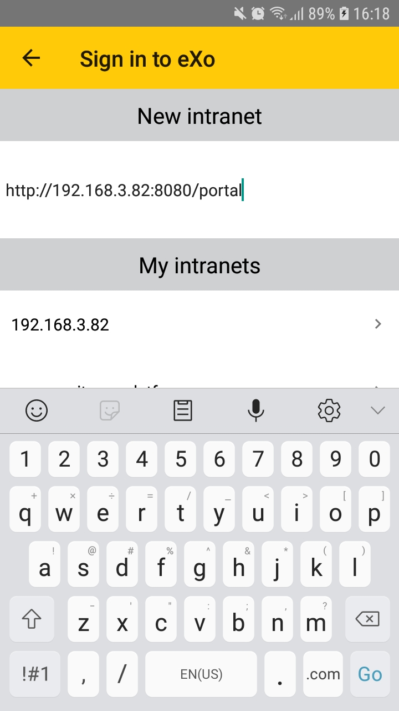
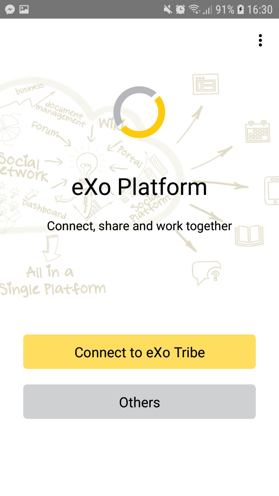
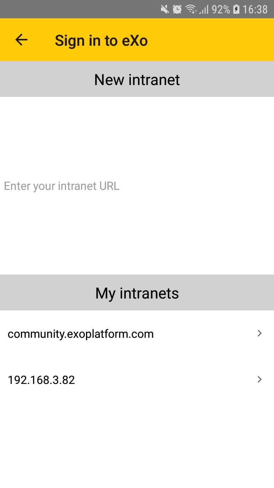

.. _eXoMobileGuide.Getting_started:

#################
Getting Started
#################

This chapter describes how to configure eXo Mobile app to connect with a
Platform site. The Platform site can be eXo Cloud, eXo Community or your
own Platform installation (called on-premises in this document).

In a nutshell, the prerequisite is you have an account on the site
already. You will configure the app using this account. The app supports
multiple accounts and you can rotate between accounts easily.

.. _eXoMobileGuide.Getting_started.Create_account:

===================
Creating an account
===================

You must have an account on either of our services, or your own
on-premises installation of Platform.

Here are the instructions for:

-  :ref:`Creating an account in eXo Community <eXoMobileGuide.Getting_started.Create_account.Community>`

-  :ref:`Creating an account in your own Platform <eXoMobileGuide.Getting_started.Create_account.On-premises>`

.. _eXoMobileGuide.Getting_started.Create_account.Community:

Creating an account in eXo Community
~~~~~~~~~~~~~~~~~~~~~~~~~~~~~~~~~~~~~~

eXo Community is the website where you can interact with eXoers and the
eXo Tribe to get news, answers for your questions, and community support
for your problems.

It is not however a place to store your own data or your organization's
data.

To create an account on eXo Community, visit `the community register page <http://community.exoplatform.com/portal/intranet/register>`__.

There, you can type in your information to register a new account. You
can alternatively register in one click with your LinkedIn, Facebook or
Google+ account.

.. note:: In case you registered with your LinkedIn, Facebook or Google+
          account, the procedure to connect via eXo mobile application is
          different. Refer to `this discussion <http://community.exoplatform.com/portal/intranet/forum/topic/topic5e76704ac06313bc1c3c17f1a03e72b5>`__
          for how-to.

.. _eXoMobileGuide.Getting_started.Create_account.On-premises:

Creating an account in your own Platform
~~~~~~~~~~~~~~~~~~~~~~~~~~~~~~~~~~~~~~~~~

If you need all hands on your Social Intranet, follow these steps:
1. `Download <https://community.exoplatform.com/portal/intranet/downloads>`__ 
   eXo Platform Tomcat bundle (Tomcat).
2. Install and run your server.
3. Follow :ref:`the Installation and Startup guide <Installation>`.

.. _eXoMobileGuide.Getting_started.Configure_account:

========================
Configuring your account
========================

This page describes how to configure your eXo account on the mobile
application.

It requires you to have an account on either eXo Cloud, eXo Community or
any on-premises eXo Platform installation. Please follow 
:ref:`the previous page <eXoMobileGuide.Getting_started.Create_account>` 
if you have not one yet.

.. note:: Though the screens you see here illustrate iOS app, the Android app
          is similar, except that there is no *Settings* button on the app
          screens. Instead you tap the device's menu button that will open an
          on-screen menu and you can find *Settings* there.

When you launch the application for the first time, the login assistant
should start immediately:

|image0|

From this screen, you can connect to `eXo Tribe <https://community.exoplatform.com>`__
or add a new intranet.

Connect to eXo Tribe
~~~~~~~~~~~~~~~~~~~~~

Click the ``Connect to eXo Tribe`` button, you will be redirected 
to the tribe's login screen.

|image1|

If you already have an account in `eXo Tribe <https://community.exoplatform.com>`__
then you click on ``Sign in`` button.

|image2|

Fill in you credentials to be redirected to the tribe's activity stream.

If you don't have an account in `eXo Tribe <https://community.exoplatform.com>`__
then click on ``Register`` to be redirected to the join form.

|image3|

Fill in the needed fields to create your account.

Add new intranet
~~~~~~~~~~~~~~~~~

Click the ``Add new intranet`` button, you will be redirected to this screen:

|image4|

Enter the URL of your intranet and click on ``Go``. 

|image5|

You will be redirected to your intranet login page.
Type your credentials to go to your intranet activity stream.

.. _eXoMobileGuide.Getting_started.Login:

=====
Login
=====

When you configured for the first time, you are automatically signed in.

This page describes what you see when you open the app later on, and you
need to sign in with an existing account.

**Authentication screen**

|image7|

If you have multiple accounts, click on ``others`` button which redirects 
you to this screen:

|image8|

In which you can:

- Add another intranet site
- Select one of the existing intranets to connect to.

**Sign in**

To sign in, enter your username and password and tap the *Login* button.

If you activated the *remember me* option, your username and password
are already filled in, you just have to tap the button.

.. |image6| image:: images/mobile/settings.jpg
   :width: 10.00000cm

