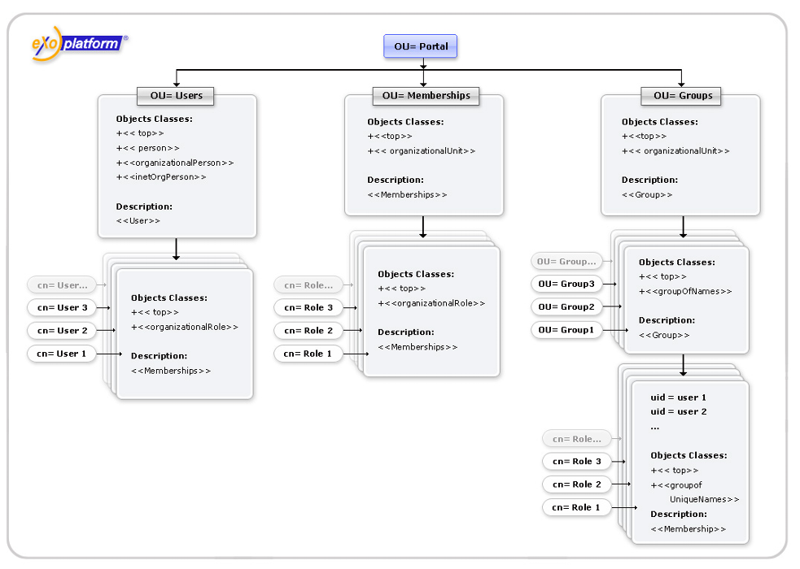

.. _eXo_Core:

##########
eXo Core
##########


    eXo Core is a set of common services, such as Authentication and
    Security, Organization, Database, Logging, JNDI, LDAP, Document
    Reader and other services. These services are used by eXo products
    and modules. It also can be used in the business logic.

    These services will be comprehensively understood via the following
    topics:

    -  :ref:`Database creator <Core.DBCreatorService>`

       Information about database creator, such as API, configuration
       retrieval and retrieval log, and examples of a DDL script.

    -  :ref:`Security service <Core.SecurityService>`

       Information about security service via two main topics: Framework
       and Usage.

    -  :ref:`Organization Service <Core.OrganizationService>`

       Introduction to organizational model and instructions on how to
       implement custom Organization Service.

    -  :ref:`Organization Service Initializer <Core.OrganizationServiceInitializer>`

       Provision of a sample configuration of the Organization Service
       Initializer to create users, groups and membership types by
       default.

    -  :ref:`Organization listener <Core.OrganizationListener>`

       Instructions on how to write and register your own organization
       listeners.

    -  :ref:`Conversation state <Core.UpdatingConversationStateWhenUserMembershipChanged>`

       Instructions on how to update users' identity in
       ``ConversationState`` when their membership was changed in
       ``OrganizationService``.

    -  :ref:`DB Schema Creator service (JDBC implementation) <Core.DBSchemacreatorserviceJDBCimplementation>`

       Information and example of DB Schema Creator configuration.

    -  :ref:`Database configuration for Hibernate <Core.DatabaseConfigurationForHibernate>`

       Instructions on how to configure database for Hibernate.

    -  :ref:`LDAP configuration <Core.LDAPConfiguration>`

       Instructions on how to configure eXo Platform to work with your
       directory.

    -  :ref:`JCR Organization Service <Core.JCROrganizationServiceConfiguration>`

       Instructions on how to use JCR Organization Service.

    -  :ref:`Organization Service TCK tests <Core.OrganizationServiceTCKTestsConfiguration>`

       Instructions on how to add TCK tests to your Maven project and
       launch them during the unit testing phase.

    -  :ref:`Tika Document Reader Service <Core.TikaDocumentReaderService>`

       Basic knowledge of ``TikaDocumentReader``, such as architecture,
       configuration, old-style DocumentReaders and Tika Parsers,
       TikaDocumentReader features and notes.

    -  :ref:`Digest authentication <Core.DigestAuthentication>`

       Instructions on how to configure your server to use the digest
       authentication, and how to make your own
       ``org.exoplatform.services.organization.OrganizationService``
       implementation use the digest authentication.

.. _Core.DBCreatorService:

================
Database creator
================


The database creator named DBCreator is responsible for executing a DDL
script at runtime. The DDL script may contain templates for database
name, username and password which will be replaced by real values at the
execution time.

Three templates are supported:

-  ${database} for database name;

-  ${username} for username;

-  ${password} for user password;

The service provides method for executing script for new database
creation. The database name which is passed as parameter will be
substituted in the DDL script instead of the ${database} template. The
DBConnectionInfo object is returned (with all necessary information of
new database's connection) or DBCreatorException exception will be
thrown if any error occurs in the other case.

.. code:: java

    public DBConnectionInfo createDatabase(String dbName) throws DBCreatorException;

For MSSQL and Sybase servers, use the autocommit mode to set "true" for
connection. It is due to that after the "create database" command is
executed, the newly created database is not available for the "use"
command. Therefore, you cannot create a new user inside database per one
script.

.. code:: java

    public DBConnectionInfo getDBConnectionInfo(String dbName) throws DBCreatorException;

Information of the database connection is returned without database
creation.

**Service's configuration**

.. code:: xml

    <component>
        <key>org.exoplatform.services.database.creator.DBCreator</key>
        <type>org.exoplatform.services.database.creator.DBCreator</type>
        <init-params>
            <properties-param>
                <name>db-connection</name>
                <description>database connection properties</description>
                <property name="driverClassName" value="com.mysql.jdbc.Driver" />
                <property name="url" value="jdbc:mysql://localhost/" />
                <property name="username" value="root" />
                <property name="password" value="admin" />
                <property name="additional_property" value="value">
                ...
                <property name="additional_property_n" value="value">
            </properties-param>
                <properties-param>
                <name>db-creation</name>.
                <description>database creation properties</description>.
                <property name="scriptPath" value="script.sql" />
                <property name="username" value="testuser" />
                <property name="password" value="testpwd" />
            </properties-param>
        </init-params>
    </component>

-  The properties section of db-connection contains parameters needed
   for connection to the database server.

-  There are four reserved and mandatory properties, including:
   *driverClassName*, *url*, *username* and *password*. However,
   db-connection may contain additional properties.

   For example, the following additional properties allow reconnecting
   to the MySQL database when connection was refused:

   .. code:: xml

       <properties-param>
           <name>db-connection</name>
           ...
           <property name="validationQuery" value="select 1"/>
           <property name="testOnReturn" value="true"/>
           ...
       </properties-param>

   The properties section of db-creation contains parameters for
   database creation using the DDL script:

   -  scriptPath: The absolute path to the DDL script file;

   -  username: The username for substitution ${username} template in
      the DDL script;

   -  password: The user password for substitution ${password} template
      in the DDL script;

**The specific properties section of db-connection for different
databases**

-  **MySQL:**

   .. code:: xml

       <property name="driverClassName" value="com.mysql.jdbc.Driver" />
       <property name="url" value="jdbc:mysql://localhost/" />
       <property name="username" value="root" />
       <property name="password" value="admin" />

-  **PostgreSQL:**

   .. code:: xml

       <property name="driverClassName" value="org.postgresql.Driver" />
       <property name="url" value="jdbc:postgresql://localhost/" />
       <property name="username" value="root" />
       <property name="password" value="admin" />

-  **PostgrePlus:**

   .. code:: xml

       <property name="driverClassName" value="com.edb.Driver" />
       <property name="url" value="jdbc:edb://localhost/" />
       <property name="username" value="root" />
       <property name="password" value="admin" />

-  **MSSQL:**

   .. code:: xml

       <property name="driverClassName" value="com.microsoft.sqlserver.jdbc.SQLServerDriver"/>
       <property name="url" value="jdbc:sqlserver://localhost:1433;"/>
       <property name="username" value="root"/>
       <property name="password" value="admin"/>

-  **Oracle:**

   .. code:: xml

       <property name="driverClassName" value="oracle.jdbc.OracleDriver" />
       <property name="url" value="jdbc:oracle:thin:@db2.exoua-int:1521:orclvm" />
       <property name="username" value="root" />
       <property name="password" value="admin" />

-  **MySQL:**

   ::

       CREATE DATABASE ${database};
       USE ${database};
       CREATE USER '${username}' IDENTIFIED BY '${password}';
       GRANT SELECT,INSERT,UPDATE,DELETE ON ${database}.* TO '${username}';

-  **PostgreSQL:**

   ::

       CREATE USER ${username} WITH PASSWORD '${password}';
       CREATE DATABASE ${database} WITH OWNER ${username};

-  **PostgrePlus:**

   .. code:: xml

       <property name="driverClassName" value="com.edb.Driver" />
       +<property name="url" value="jdbc:edb://localhost/" />
       +<property name="username" value="root" />
       +<property name="password" value="admin" />

-  **MSSQL:**

   ::

       USE MASTER;
       CREATE DATABASE ${database};
       USE ${database};
       CREATE LOGIN ${username} WITH PASSWORD = '${password}';
       CREATE USER ${username} FOR LOGIN ${username};

-  **Oracle:**

   ::

       CREATE TABLESPACE "${database}" DATAFILE '/var/oracle_db/orclvm/${database}' SIZE 10M AUTOEXTEND ON NEXT 6M MAXSIZE UNLIMITED LOGGING EXTENT MANAGEMENT LOCAL SEGMENT SPACE MANAGEMENT AUTO;
       CREATE TEMPORARY TABLESPACE "${database}.TEMP" TEMPFILE '/var/oracle_db/orclvm/${database}.temp' SIZE 5M AUTOEXTEND ON NEXT 5M MAXSIZE UNLIMITED EXTENT MANAGEMENT LOCAL UNIFORM SIZE 1M;
       CREATE USER "${username}" PROFILE "DEFAULT" IDENTIFIED BY "${password}" DEFAULT TABLESPACE "${database}" TEMPORARY TABLESPACE "${database}.TEMP" ACCOUNT UNLOCK;
       GRANT CREATE SEQUENCE TO "${username}";
       GRANT CREATE TABLE TO "${username}";
       GRANT CREATE TRIGGER TO "${username}";
       GRANT UNLIMITED TABLESPACE TO "${username}";
       GRANT "CONNECT" TO "${username}";
       GRANT "RESOURCE" TO "${username}";

.. _Core.SecurityService:

================
Security service
================

Security service makes a simple, unified way for the authentication and
the storing/propagation of user sessions through all the eXo components
and J2EE containers. JAAS is supposed to be the primary login mechanism
but the Security Service framework should not prevent other (custom or
standard) mechanisms from being used. You can learn more about JAAS in
`this tutorial <http://java.sun.com/j2se/1.5.0/docs/guide/security/jaas/tutorials/GeneralAcnAndAzn.html>`__.

The central point of this framework is the **ConversationState** object
which stores all information about the state of the current user (very
similar to the Session concept). The same **ConversationState** also
stores acquired attributes of an **Identity** which is a set of
principals to identify a user.

The ConversationState has definite lifetime. This object should be
created when the user's identity becomes known by eXo (login procedure)
and destroyed when the user leaves an eXo based application (logout
procedure).

**ConversationState and ConversationRegistry**

The **ConversationState** can be stored:

-  In a static **local thread variable**; Or,

-  As a **key-value pair** in the **ConversationRegistry** component.

Either, or both methods can be used to set/retrieve the state at
runtime. The most important thing is that they should be complementary,
for example, make sure that the conversation state is set before you try
to use it.

-  **Local Thread Variable:** Storing the ConversationState in a static
   local thread variable makes it possible to represent it as a
   **context** (current user's state).

   .. code:: java

       ConversationState.setCurrent(conversationState);
       ....
       ConversationState.getCurrent();

-  **Key-Value way**

   If you store the ConversationState inside the
   **ConversationRegistry** component as a set of key-value pairs, the
   session key is an arbitrary String (such as username, ticket id,
   httpSessionId).

   .. code:: java

       conversationRegistry.register("key", conversationState); 
       ...
       conversationRegistry.getState("key");

-  **ConversationRegistry**

   The ConversationRegistry is a mandatory component deployed into eXo
   Container as follows:

   .. code:: xml

       <component>
           <type>org.exoplatform.services.security.ConversationRegistry</type>
       </component>

**Authenticator**

An Authenticator is responsible for Identity creation. It consists of
two methods:

-  ``validateUser()`` accepts an array of credentials and returns
   ``userId`` (which can be something different from the username).

-  ``createIdentity()`` accepts ``userId`` and returns a newly created
   Identity object.

.. code:: java

    public interface Authenticator
    {
       /**
        * Authenticate user and return userId which can be different to username.
        *
        * @param credentials - list of users credentials (such as name/password, X509
        * certificate etc)
        * @return userId the user's identifier.
        * @throws LoginException in case the authentication fails
        * @throws Exception if any exception occurs
        */
       String validateUser(Credential[] credentials) throws LoginException, Exception;

       /**
        * @param userId the user's identifier
        * @return returns the Identity representing the user
        * @throws Exception if any exception occurs
        */
       Identity createIdentity(String userId) throws Exception;

       /**
        * Gives the last exception that occurs while calling {@link #validateUser(Credential[])}. This
        * allows applications outside JAAS like UI to be able to know which exception occurs
        * while calling {@link #validateUser(Credential[])}.
        * @return the original Exception that occurs while calling {@link #validateUser(Credential[])}
        * for the very last time if an exception occurred, <code>null</code> otherwise.
        */
       Exception getLastExceptionOnValidateUser();
    }

Depending on the application developer (and deployer), whether to use
the Authenticator component(s) and how many implementations of this
component should be deployed in eXo container. The developer is free to
create an Identity object using a different way, but the Authenticator
component is the highly recommended way from architectural
considerations.

The typical functionality of the **validateUser(Credential\\[]
credentials)** method is comparison of incoming credentials (such as
username/password, digest) with those credentials that are stored in an
implementation specific database. Then, **validateUser(Credential\\[]
credentials)** returns **userId** or throws a **LoginException** in case
of wrong credentials.

The default Authenticator implementation is
**org.exoplatform.services.organization.auth.OrganizationAuthenticatorImpl**
which compares incoming username/password credentials with the ones
stored in OrganizationService. See the configuration example below:

.. code:: xml

    <component>
      <key>org.exoplatform.services.security.Authenticator</key> 
      <type>org.exoplatform.services.organization.auth.OrganizationAuthenticatorImpl</type>
    </component>

**JAAS login module**

The eXo Core framework described is not coupled with any authentication
mechanism, but the most logical and implemented by default one is the
JAAS login module. The typical sequence looks as follows (see
``org.exoplatform.services.security.jaas.DefaultLoginModule``):

-  ``LoginModule.login()`` creates a list of credentials using standard
   JAAS Callbacks features, obtains an Authenticator instance, and
   creates an Identity object by calling the
   ``Authenticator.authenticate(..)`` method.

.. code:: java

    Authenticator authenticator = (Authenticator) container()
              .getComponentInstanceOfType(Authenticator.class); 
    // RolesExtractor can be null     
    RolesExtractor rolesExtractor = (RolesExtractor) container().
    getComponentInstanceOfType(RolesExtractor.class);


    Credential[] credentials = new Credential[] {new UsernameCredential(username), new PasswordCredential(password) };
    String userId = authenticator.validateUser(credentials);
    identity = authenticator.createIdentity(userId);

-  ``LoginModule.commit()`` obtains the ``IdentityRegistry`` object, and
   registers the identity using ``userId`` as a key.

When initializing the login module, you can set the ``singleLogin``
optional parameter. With this option, you can disallow the same Identity
to log in at the same time.

By default, ``singleLogin`` is disabled, so the same identity can be
registered more than once. This parameter passed in this form can be
``singleLogin=yes`` or ``singleLogin=true``.

.. code:: java

    IdentityRegistry identityRegistry = (IdentityRegistry) getContainer().getComponentInstanceOfType(IdentityRegistry.class);
          
    if (singleLogin && identityRegistry.getIdentity(identity.getUserId()) != null) 
      throw new LoginException("User " + identity.getUserId() + " already logined.");

    identity.setSubject(subject);
    identityRegistry.register(identity);

In case of using several ``LoginModules``, JAAS allows placing the
``login()`` and ``commit()`` methods in different REQUIRED modules.

After that, the web application must use the
``SetCurrentIdentityFilter`` filter which obtains the
``ConversationRegistry`` object and tries to get the
``ConversationState`` by ``sessionId (HttpSession)``. If there is no
``ConversationState``, ``SetCurrentIdentityFilter`` will create a new
one, register it and set it as the current one using
``ConversationState.setCurrent(state)``.

-  ``LoginModule.logout()`` can be called by
   ``JAASConversationStateListener`` which extends
   ``ConversationStateListener``.

This listener must be configured in ``web.xml``. The
``sessionDestroyed(HttpSessionEvent)`` method is called by
``ServletContainer``. This method removes ``ConversationState`` from
``ConversationRegistry
      ConversationRegistry.unregister(sesionId)`` and calls
``LoginModule.logout()``.

.. code:: java

    ConversationRegistry conversationRegistry = (ConversationRegistry) getContainer().getComponentInstanceOfType(ConversationRegistry.class);

    ConversationState conversationState = conversationRegistry.unregister(sesionId);

    if (conversationState != null) {
      log.info("Remove conversation state " + sesionId);
      if (conversationState.getAttribute(ConversationState.SUBJECT) != null) {
        Subject subject = (Subject) conversationState.getAttribute(ConversationState.SUBJECT); 
        LoginContext ctx = new LoginContext("exo-domain",  subject);
        ctx.logout();
    } else {
      log.warn("Subject was not found in ConversationState attributes.");
    }

.. note:: You can configure the SetCurrentIdentityFilter to re-inject the
		  identity in case it is removed from IdentityRegistry. You should add
		  ``restoreIdentity`` parameter to the filter configuration as
		  follows:

			.. code:: xml

				<filter>
					<filter-name>SetCurrentIdentityFilter</filter-name>
					<filter-class>org.exoplatform.services.security.web.SetCurrentIdentityFilter</filter-class>
					<init-param>
						<param-name>restoreIdentity</param-name>
						<param-value>true</param-value>
					</init-param>
				</filter>

**Predefined JAAS login modules**

There are several JAAS Login modules included in the eXo Platform
sources:

-  **org.exoplatform.services.security.jaas.DefaultLoginModule** which
   provides both authentication (using eXo Authenticator based
   mechanism) and authorization, filling Conversation Registry as
   described in the previous section. There are also several
   per-Application Server extensions of this login module in the
   **org.exoplatform.services.security.jaas** package, which can be used
   in appropriate AS. In particular, eXo has dedicated Login modules for
   Tomcat, JOnAS and WebSphere.

-  Besides that, in case when the third-party authentication mechanism
   is required,
   **org.exoplatform.services.security.jaas.IdentitySetLoginModule**
   catches a login identity from the third-party "authenticating" login
   module and performs the eXo specific authorization job. In this case,
   the third-party login module has to put login (user) name to the
   shared state map under the **"javax.security.auth.login.name"** key
   and third-party LM has to be configured before IdentitySetLoginModule
   like:

   ::

       exo {
          com.third.party.LoginModuleImpl required;
          org.exoplatform.services.security.jaas.IdentitySetLoginModule required;
       };

**J2EE container authentication**

As you know, when a user in JAAS is authenticated, a Subject will be
created. This Subject represents the authenticated user. It is important
to know and follow the rules regarding Subject filling that are specific
for each J2EE server, where eXo Platform is deployed.

To make it work in the particular J2EE server, it is necessary to add
specific Principals/Credentials to the Subject to be propagated into the
specific J2EE container implementation. The DefaultLoginModule is
extended by overloading its commit() method with a dedicated logic,
presently available for Tomcat and JOnAS application servers.

Furthermore, you can use the optional RolesExtractor which is
responsible for mapping primary Subject's principals (userId and a set
of groups) to J2EE Roles:

.. code:: java

    public interface RolesExtractor {
      Set <String> extractRoles(String userId, Set<MembershipEntry> memberships);
    }

This component may be used by Authenticator to create the Identity with
a particular set of **Roles**.

.. _Core.OrganizationService:

====================
Organization Service
====================

**OrganizationService** is the service that allows accessing the
Organization model. This model is composed of:

-  Users

-  Groups

-  Memberships

It is the basis of eXo personalization and authorization in eXo and is
used for the whole eXo Platform. The model is abstract and does not rely
on any specific storage. Multiple implementations exist in eXo,
including:

-  Hibernate: For storage into a RDBMS.

-  JNDI: For storage into a directory, such as an LDAP or MS Active
   Directory.

-  JCR: For storage inside a Java Content Repository.

Organizational model
~~~~~~~~~~~~~~~~~~~~~

**User**

-  Username used as the identified one.

-  Profile (identity and preferences).

**Group**

Gather a set of users.

-  Applicative or business.

-  Tree structure.

-  No inheritance.

-  Expressed as **/group/subgroup/subsubgroup**.

**Membership**

-  Qualifies the group belonging.

-  "Member of group as XXX".

-  Expressed as **manager:/organization/hr, \*:/partners**.

Implementing Custom Organization Service
~~~~~~~~~~~~~~~~~~~~~~~~~~~~~~~~~~~~~~~~~~

To create a custom Organization Service, you need to implement several
interfaces and extend some classes which will be listed below.

**Basic entities implementation**

First, you need to create classes implementing the following interfaces
(each of which represents a basic unit of organization service):

-  `org.exoplatform.services.organization.User <https://github.com/exoplatform/core/blob/stable/2.5.x/exo.core.component.organization.api/src/main/java/org/exoplatform/services/organization/User.java>`__

   This is the interface for a User data model. The OrganizationService
   implementor can implement this class in different ways. For example,
   the implementor can use the native field for each GET method or the
   Map to hold the user data.

-  `org.exoplatform.services.organization.UserProfile <https://github.com/exoplatform/core/blob/stable/2.5.x/exo.core.component.organization.api/src/main/java/org/exoplatform/services/organization/UserProfile.java>`__

   This is the interface for a UserProfile data model. The implementor
   should have a user map info in the implementation. The map should
   only accept **java.lang.String** for the key and the value.

-  `org.exoplatform.services.organization.Group <https://github.com/exoplatform/core/blob/stable/2.5.x/exo.core.component.organization.api/src/main/java/org/exoplatform/services/organization/Group.java>`__

   This is the interface for the group data model.

-  `org.exoplatform.services.organization.Membership <https://github.com/exoplatform/core/blob/stable/2.5.x/exo.core.component.organization.api/src/main/java/org/exoplatform/services/organization/Membership.java>`__

   This is the interface for the membership data model.

-  `org.exoplatform.services.organization.MembershipType <https://github.com/exoplatform/core/blob/stable/2.5.x/exo.core.component.organization.api/src/main/java/org/exoplatform/services/organization/MembershipType.java>`__

   This is the interface for the membership type data model.

.. note:: After each set method is called, the developer must call the
          **UserHandler.saveUser** (**GroupHandler.saveGroup,
          MembershipHandler.saveMembership**) method to persist changes.

You can find examples of the mentioned above implementations at Github
server:

-  `UserImpl <https://github.com/exoplatform/jcr-services/blob/stable/1.15.x/src/main/java/org/exoplatform/services/jcr/ext/organization/UserImpl.java>`__

-  `UserProfileImpl <https://github.com/exoplatform/jcr-services/blob/stable/1.15.x/src/main/java/org/exoplatform/services/jcr/ext/organization/UserProfileImpl.java>`__

-  `GroupImpl <https://github.com/exoplatform/jcr-services/blob/stable/1.15.x/src/main/java/org/exoplatform/services/jcr/ext/organization/GroupImpl.java>`__

-  `MembershipImpl <https://github.com/exoplatform/jcr-services/blob/stable/1.15.x/src/main/java/org/exoplatform/services/jcr/ext/organization/MembershipImpl.java>`__

-  `MembershipTypeImpl <https://github.com/exoplatform/jcr-services/blob/stable/1.15.x/src/main/java/org/exoplatform/services/jcr/ext/organization/MembershipTypeImpl.java>`__

**Unit handlers implementation**

After you have created basic Organization Service unit instances, you
need to create classes to handle them (for example, to persist changes,
to add listener). For that purpose, you need to implement several
interfaces correspondingly:

-  User handler

   -  `org.exoplatform.services.organization.UserHandler <https://github.com/exoplatform/core/blob/stable/2.5.x/exo.core.component.organization.api/src/main/java/org/exoplatform/services/organization/UserHandler.java>`__

      This class is acted as a sub-component of the organization
      service. It is used to manage the user account and broadcast the
      user event to all the registered listeners in the organization
      service. The user event can be: creating new, updating and
      deleting. Each event should have 2 phases: pre-event and
      post-event. The methods, including **createUser**, **saveUser**
      and **removeUser**, broadcast the event at each phase, so the
      listeners can handle the event properly.

   -  `org.exoplatform.services.organization.ExtendedUserHandler <https://github.com/exoplatform/core/blob/stable/2.5.x/exo.core.component.organization.api/src/main/java/org/exoplatform/services/organization/ExtendedUserHandler.java>`__

      This class is **optional**. You can implement this if you want to
      use `Digest access
      authentication <http://en.wikipedia.org/wiki/Digest_access_authentication>`__.
      For example, you need a one-way password encryption for
      authentication.

   -  `org.exoplatform.services.organization.UserEventListenerHandler <https://github.com/exoplatform/core/blob/stable/2.5.x/exo.core.component.organization.api/src/main/java/org/exoplatform/services/organization/UserEventListenerHandler.java>`__

      This class is **optional** that provides ability to get the list
      of
      `org.exoplatform.services.organization.UserEventListener <https://github.com/exoplatform/core/blob/stable/2.5.x/exo.core.component.organization.api/src/main/java/org/exoplatform/services/organization/UserEventListener.java>`__.
      The list should be unmodifiable to prevent modification outside of
      `org.exoplatform.services.organization.UserHandler <https://github.com/exoplatform/core/blob/stable/2.5.x/exo.core.component.organization.api/src/main/java/org/exoplatform/services/organization/UserHandler.java>`__.

-  User profile handler

   -  `org.exoplatform.services.organization.UserProfileHandler <https://github.com/exoplatform/core/blob/stable/2.5.x/exo.core.component.organization.api/src/main/java/org/exoplatform/services/organization/UserProfileHandler.java>`__

      This interface is acted as a sub-interface of the Organization
      Service. It is used to manage the UserProfile record, the extra
      information of a user, such as address, phone. The interface
      should allow developers to create, delete and update a UserProfile
      and broadcast the event to the user profile event listeners.

   -  `org.exoplatform.services.organization.UserProfileEventListenerHandler <https://github.com/exoplatform/core/blob/stable/2.5.x/exo.core.component.organization.api/src/main/java/org/exoplatform/services/organization/UserProfileEventListenerHandler.java>`__

      This class is **optional** that provides ability to get the list
      of
      `org.exoplatform.services.organization.UserProfileEventListener <https://github.com/exoplatform/core/blob/stable/2.5.x/exo.core.component.organization.api/src/main/java/org/exoplatform/services/organization/UserProfileEventListener.java>`__.
      The list should be unmodifiable to prevent modification outside of
      `org.exoplatform.services.organization.UserProfileHandler <https://github.com/exoplatform/core/blob/stable/2.5.x/exo.core.component.organization.api/src/main/java/org/exoplatform/services/organization/UserProfileHandler.java>`__.

-  Group handler

   -  `org.exoplatform.services.organization.GroupHandler <https://github.com/exoplatform/core/blob/stable/2.5.x/exo.core.component.organization.api/src/main/java/org/exoplatform/services/organization/GroupHandler.java>`__

      This class is acted as a sub-component of the organization
      service. It is used to manage the group and broadcast the group
      event to all the registered listeners in the organization service.
      The group event can be: creating new, updating and deleting. Each
      event should have 2 phases: pre-event and post-event. The methods,
      including **createGroup**, **saveGroup** and **removeGroup**,
      broadcast the event at each phase, so the listeners can handle the
      event properly.

   -  `org.exoplatform.services.organization.GroupEventListenerHandler <https://github.com/exoplatform/core/blob/stable/2.5.x/exo.core.component.organization.api/src/main/java/org/exoplatform/services/organization/GroupEventListenerHandler.java>`__

      This class is **optional** that provides ability to get the list
      of
      `org.exoplatform.services.organization.GroupEventListener <https://github.com/exoplatform/core/blob/stable/2.5.x/exo.core.component.organization.api/src/main/java/org/exoplatform/services/organization/GroupEventListener.java>`__.
      The list should be unmodifiable to prevent modification outside of
      `org.exoplatform.services.organization.GroupHandler <https://github.com/exoplatform/core/blob/stable/2.5.x/exo.core.component.organization.api/src/main/java/org/exoplatform/services/organization/GroupHandler.java>`__.

-  Membership handler

   -  `org.exoplatform.services.organization.MembershipHandler <https://github.com/exoplatform/core/blob/stable/2.5.x/exo.core.component.organization.api/src/main/java/org/exoplatform/services/organization/MembershipHandler.java>`__

      This class is acted as a sub-component of the organization
      service. It is used to manage the membership - relation of user,
      group and membership type and broadcast the membership event to
      all the registered listeners in the organization service. The
      membership event can be: creating new linked membership and
      deleting the membership type event. Each event should have 2
      phases: pre-event and post-event. The methods, including
      **linkMembership** and **removeMembership**, broadcast the event
      at each phase, so the listeners can handle the event properly.

   -  `org.exoplatform.services.organization.MembershipEventListenerHandler <https://github.com/exoplatform/core/blob/stable/2.5.x/exo.core.component.organization.api/src/main/java/org/exoplatform/services/organization/MembershipEventListenerHandler.java>`__

      This class is **optional** that provides ability to get the list
      of
      `org.exoplatform.services.organization.MembershipEventListener <https://github.com/exoplatform/core/blob/stable/2.5.x/exo.core.component.organization.api/src/main/java/org/exoplatform/services/organization/MembershipEventListener.java>`__.
      The list should be unmodifiable to prevent modification outside of
      `org.exoplatform.services.organization.MembershipHandler <https://github.com/exoplatform/core/blob/stable/2.5.x/exo.core.component.organization.api/src/main/java/org/exoplatform/services/organization/MembershipHandler.java>`__.

-  Membership type handler

   -  `org.exoplatform.services.organization.MembershipTypeHandler <https://github.com/exoplatform/core/blob/stable/2.5.x/exo.core.component.organization.api/src/main/java/org/exoplatform/services/organization/MembershipTypeHandler.java>`__

      This class is acted as a sub-component of the organization
      service. It is used to manage the membership - relation of user,
      group and membership type, and broadcast the membership event to
      all the registered listeners in the organization service. The
      membership event can be: creating new linked membership and
      deleting the membership type event. Each event should have 2
      phases: pre-event and post-event. The methods, including
      **linkMembership** and **removeMembership**, broadcast the event
      at each phase, so the listeners can handle the event properly.

   -  `org.exoplatform.services.organization.MembershipTypeEventListenerHandler <https://github.com/exoplatform/core/blob/stable/2.5.x/exo.core.component.organization.api/src/main/java/org/exoplatform/services/organization/MembershipTypeEventListenerHandler.java>`__

      This class is **optional** that provides ability to get the list
      of
      `org.exoplatform.services.organization.MembershipTypeEventListener <https://github.com/exoplatform/core/blob/stable/2.5.x/exo.core.component.organization.api/src/main/java/org/exoplatform/services/organization/MembershipTypeEventListener.java>`__.
      The list should be unmodifiable to prevent modification outside of
      `org.exoplatform.services.organization.MembershipTypeHandler <https://github.com/exoplatform/core/blob/stable/2.5.x/exo.core.component.organization.api/src/main/java/org/exoplatform/services/organization/MembershipTypeHandler.java>`__.

You can find examples of the mentioned above implementations at Github
server:

-  `UserHandlerImpl <https://github.com/exoplatform/jcr-services/blob/stable/1.15.x/src/main/java/org/exoplatform/services/jcr/ext/organization/UserHandlerImpl.java>`__

-  `UserProfileHandlerImpl <https://github.com/exoplatform/jcr-services/blob/stable/1.15.x/src/main/java/org/exoplatform/services/jcr/ext/organization/UserProfileHandlerImpl.java>`__

-  `GroupHandlerImpl <https://github.com/exoplatform/jcr-services/blob/stable/1.15.x/src/main/java/org/exoplatform/services/jcr/ext/organization/GroupHandlerImpl.java>`__

-  `MembershipHandlerImpl <https://github.com/exoplatform/jcr-services/blob/stable/1.15.x/src/main/java/org/exoplatform/services/jcr/ext/organization/MembershipHandlerImpl.java>`__

-  `MembershipTypeHandlerImpl <https://github.com/exoplatform/jcr-services/blob/stable/1.15.x/src/main/java/org/exoplatform/services/jcr/ext/organization/MembershipTypeHandlerImpl.java>`__

**Extending BaseOrganizationService class**

Finally, you need to create your main custom Organization Service class.
It must extend
`org.exoplatform.services.organization.BaseOrganizationService <https://github.com/exoplatform/core/blob/stable/2.5.x/exo.core.component.organization.api/src/main/java/org/exoplatform/services/organization/BaseOrganizationService.java>`__.
The **BaseOrganizationService** class contains Organization Service unit
handlers as protected fields, so you can initialize them according to
your purposes. It also has
`org.exoplatform.services.organization.OrganizationService <https://github.com/exoplatform/core/blob/stable/2.5.x/exo.core.component.organization.api/src/main/java/org/exoplatform/services/organization/OrganizationService.java>`__
interface methods' implementations. This is the class you need to
mention in the configuration file if you want to use your custom
Organization Service.

You can find example of this class at Github server:
`JCROrganizationServiceImpl <https://github.com/exoplatform/jcr-services/blob/stable/1.15.x/src/main/java/org/exoplatform/services/jcr/ext/organization/JCROrganizationServiceImpl.java>`__.

Make sure that your custom Organization Service implementation is fully
compliant with the Organization Service TCK tests. Tests are available
as Maven artifact:

-  groupId - *org.exoplatform.core*

-  artifactId - *exo.core.component.organization.tests*

   You can find the source code of TCK tests package
   `here <https://github.com/exoplatform/core/tree/stable/2.5.x/exo.core.component.organization.tests/>`__.

.. note:: To run unit tests, you may need to configure the following Maven plugins:

			-  `maven-dependency-plugin <http://maven.apache.org/plugins/maven-dependency-plugin/>`__

			-  `build-helper-maven-plugin <http://mojo.codehaus.org/build-helper-maven-plugin/>`__

			-  `maven-surefire-plugin <http://maven.apache.org/plugins/maven-surefire-plugin/>`__

		  Check the
		  `pom.xml <https://github.com/exoplatform/jcr-services/blob/stable/1.15.x/pom.xml>`__
		  file to find out one of the ways to configure the Maven project
		  object model. See :ref:`Organization Service TCK tests <Core.OrganizationServiceTCKTestsConfiguration>`
		  for more details.

.. _Core.OrganizationServiceInitializer:

================================
Organization Service Initializer
================================


The Organization Service Initializer is used to create users, groups and
membership types by default.

.. code:: xml

    <external-component-plugins>
        <target-component>org.exoplatform.services.organization.OrganizationService</target-component>
        <component-plugin>
          <name>init.service.listener</name>
          <set-method>addListenerPlugin</set-method>
          <type>org.exoplatform.services.organization.OrganizationDatabaseInitializer</type>
          <description>this listener populate organization data for the first launch</description>
          <init-params>
            <value-param>
              <name>checkDatabaseAlgorithm</name>
              <description>check database</description>
              <value>entry</value>
            </value-param>
            <value-param>
              <name>printInformation</name>
              <description>Print information init database</description>
              <value>false</value>
            </value-param>
            <object-param>
              <name>configuration</name>
              <description>description</description>
              <object type="org.exoplatform.services.organization.OrganizationConfig">
                <field name="membershipType">
                  <collection type="java.util.ArrayList">
                    <value>
                      <object type="org.exoplatform.services.organization.OrganizationConfig$MembershipType">
                        <field name="type">
                          <string>manager</string>
                        </field>
                        <field name="description">
                          <string>manager membership type</string>
                        </field>
                      </object>
                    </value>
                  </collection>
                </field>
                
                <field name="group">
                  <collection type="java.util.ArrayList">
                    <value>
                      <object type="org.exoplatform.services.organization.OrganizationConfig$Group">
                        <field name="name">
                          <string>platform</string>
                        </field>
                        <field name="parentId">
                          <string></string>
                        </field>
                        <field name="description">
                          <string>the /platform group</string>
                        </field>
                        <field name="label">
                          <string>Platform</string>
                        </field>
                      </object>
                    </value>
                    <value>
                      <object type="org.exoplatform.services.organization.OrganizationConfig$Group">
                        <field name="name">
                          <string>administrators</string>
                        </field>
                        <field name="parentId">
                          <string>/platform</string>
                        </field>
                        <field name="description">
                          <string>the /platform/administrators group</string>
                        </field>
                        <field name="label">
                          <string>Administrators</string>
                        </field>
                      </object>
                    </value>
                   </collection>
                </field>
                
                <field name="user">
                  <collection type="java.util.ArrayList">
                    <value>
                      <object type="org.exoplatform.services.organization.OrganizationConfig$User">
                        <field name="userName">
                          <string>root</string>
                        </field>
                        <field name="password">
                          <string>exo</string>
                        </field>
                        <field name="firstName">
                          <string>Root</string>
                        </field>
                        <field name="lastName">
                          <string>Root</string>
                        </field>
                        <field name="email">
                          <string>root@localhost</string>
                        </field>
                        <field name="groups">
                          <string>
                            manager:/platform/administrators
                          </string>
                        </field>
                      </object>
                    </value>
                  </collection>
                </field>
              </object>
            </object-param>
          </init-params>
        </component-plugin>
      </external-component-plugins>

**Parameters for membership type:**

-  ``type``: Name of the membership type.

-  ``description``: Description of the membership type.

**Params for group:**

-  ``name``: Name of the group.

-  ``parentId``: Id of the parent group. If ``parentId`` is null, it
   means that the group is at the first level. The ``parentId`` should
   have the form: **/ancestor/parent**.

-  ``description``: Description of the group.

-  ``label``: Label of the group.

**Params for user:**

-  ``userName``: Name of the user.

-  ``password``: Password of the user.

-  ``firstName``: First name of the user.

-  ``lastName``: Last name of the user.

-  ``email``: Email of the user.

-  ``groups``: Membership types and groups of the user.

.. _Core.OrganizationListener:

=====================
Organization listener
=====================

The :ref:`Organization Service <Core.OrganizationService>` provides a
mechanism to receive notifications when:

-  A User is created, deleted, modified, enabled or disabled.

-  A Group is created, deleted or modified.

-  A Membership is created or removed.

This mechanism is very useful to cascade some actions when the
organization model is modified. For example, it is currently used to:

-  Initialize the personal portal pages.

-  Initialize the personal calendars, address books and mail accounts.

-  Create drives and personal areas.

Writing your own listeners
~~~~~~~~~~~~~~~~~~~~~~~~~~~

To implement your own listener, you just need to extend some existing
listener classes. These classes define hooks that are invoked before or
after operations are performed on the organization model.

To listen to user changes, you need to extend
**org.exoplatform.services.organization.UserEventListener**.

.. code:: java

    public class MyUserListener extends UserEventListener {

      public void preSave(User user, boolean isNew) throws Exception {
        System.out.println("Before " + (isNew?"creating":"updating") + " user " + user.getUserName());
      }

      public void postSave(User user, boolean isNew) throws Exception { 
        System.out.println("After user " + user.getUserName() + (isNew?" created":" updated"));
      }

      public void preDelete(User user) throws Exception {
        System.out.println("Before deleting user " + user.getUserName());
      }

      public void postDelete(User user) throws Exception {
        System.out.println("After deleting user " + user.getUserName());
      }
      
      public void preSetEnabled(User user) throws Exception {
        System.out.println("Before enabling/disabling user " + user.getUserName());
      }

      public void postSetEnabled(User user) throws Exception {
        System.out.println("After enabling/disabling user " + user.getUserName());
      }

    }

To listen to group changes, you need to extend
**org.exoplatform.services.organization.GroupEventListener**:

.. code:: java

    public class MyGroupListener extends GroupEventListener {

      public void preSave(Group group, boolean isNew) throws Exception {
        System.out.println("Before " + (isNew?"creating":"updating") + " group " + group.getName());
      }

      public void postSave(Group group, boolean isNew) throws Exception { 
        System.out.println("After group " + group.getName() + (isNew?" created":" updated"));
      }

      public void preDelete(Group group) throws Exception {
        System.out.println("Before deleting group " + group.getName());
      }

      public void postDelete(Group group) throws Exception {
        System.out.println("After deleting group " + group.getName());
      }
    }

To listen to membership changes, you need to extend
**org.exoplatform.services.organization.MembershipEventListener**:

.. code:: java

    public class MyMembershipListener extends MembershipEventListener {

      public void preSave(Membership membership, boolean isNew) throws Exception {
        System.out.println("Before " + (isNew?"creating":"updating") + " membership.");
      }

      public void postSave(Membership membership, boolean isNew) throws Exception { 
        System.out.println("After membership " + (isNew?" created":" updated"));
      }

      public void preDelete(Membership membership) throws Exception {
        System.out.println("Before deleting membership");
      }

      public void postDelete(Membership membership) throws Exception {
        System.out.println("After deleting membership");
      }
    }

Registering your listeners
~~~~~~~~~~~~~~~~~~~~~~~~~~~

Registering the listeners is then achieved by using the ExoContainer
plugin mechanism. See :ref:`Service configuration for beginners <Kernel.ServiceConfigurationforBeginners>` 
for more information.

To effectively register organization service's listeners, you simply
need to use the addListenerPlugin set-method.

So, the easiest way to register your listeners is to pack them into a
``.jar`` and create a configuration file into it under
``mylisteners.jar!/conf/portal/configuration.xml``.

.. code:: xml

    <?xml version="1.0" encoding="ISO-8859-1"?>
    <configuration>
     <external-component-plugins>
      <target-component>org.exoplatform.services.organization.OrganizationService</target-component>
       <component-plugin>
        <name>myuserplugin</name>
        <set-method>addListenerPlugin</set-method>
        <type>org.example.MyUserListener</type>
        <description></description>      
       </component-plugin>
       <component-plugin>
        <name>mygroupplugin</name>
        <set-method>addListenerPlugin</set-method>
        <type>org.example.MyGroupListener</type>
        <description></description>      
       </component-plugin>
       <component-plugin>
        <name>mymembershipplugin</name>
        <set-method>addListenerPlugin</set-method>
        <type>org.example.MyMembershipListener</type>
        <description></description>      
       </component-plugin>
      </external-component-plugins>
    <configuration>

Now, simply deploy the ``.jar`` under ``$PLATFORM_TOMCAT_HOME/lib`` and
your listeners are ready.

.. note:: Be aware that you need to set proper ``RuntimePermission`` to add or
          remove listeners. To do that, you need to grant the following
          permission: ``permission java.lang.RuntimePermission "manageListeners"``.

.. _Core.UpdatingConversationStateWhenUserMembershipChanged:

==================
Conversation state
==================

When a user logs in the portal, **ConversationRegistry** adds
**ConversationState** for this user. **ConversationState** keeps user's
identity during his/her login, even when his/her membership is updated
in OrganizationService. The user must log out and log in again to update
his/her identity. To fix this issue, a special listener that extends
**MembershipEventListener** is added to configuration of
**OrganizationServicer**.

**Configuration example**

.. code:: xml

    <?xml version="1.0" encoding="ISO-8859-1"?>
    <configuration
       xmlns:xsi="http://www.w3.org/2001/XMLSchema-instance"
       xsi:schemaLocation="http://www.exoplatform.org/xml/ns/kernel_1_2.xsd http://www.exoplatform.org/xml/ns/kernel_1_2.xsd"
       xmlns="http://www.exoplatform.org/xml/ns/kernel_1_2.xsd">
      <external-component-plugins>
        <target-component>org.exoplatform.services.organization.OrganizationService</target-component>
    .....
    .....
        <component-plugin>
          <name>MembershipUpdateListener</name>
          <set-method>addListenerPlugin</set-method>
          <type>org.exoplatform.services.organization.impl.MembershipUpdateListener</type>
        </component-plugin>

       <external-component-plugins>
    </configuration>

.. _Core.DBSchemacreatorserviceJDBCimplementation:

=========================
DB Schema Creator service
=========================


DB Schema Creator is responsible for creating database schema, using a
DDL script inside service configuration or in an external file, calling:

.. code:: java

    org.exoplatform.services.database.jdbc.DBSchemaCreator.createTables(String dsName, String script)

via

::

    org.exoplatform.services.database.jdbc.CreateDBSchemaPlugin component plugin

-  **Example of configuration:**

   .. code:: xml

       <component>
          <key>org.exoplatform.services.database.jdbc.DBSchemaCreator</key>
          <type>org.exoplatform.services.database.jdbc.DBSchemaCreator</type>
          <component-plugins>    
             <component-plugin> 
                <name>jcr.dbschema</name>
                <set-method>addPlugin</set-method>
                <type>org.exoplatform.services.database.jdbc.CreateDBSchemaPlugin</type>
                <init-params>
                   <value-param>
                      <name>data-source</name>
                      <value>jdbcjcr</value>
                   </value-param>
                   <value-param>
                      <name>script-file</name>
                      <value>conf/storage/jcr-mjdbc.sql</value>
                   </value-param>  
                </init-params>    
             </component-plugin>
       ........

-  **Example of a DDL script:**

   ::

       CREATE TABLE JCR_MITEM(
               ID VARCHAR(255) NOT NULL PRIMARY KEY, 
               VERSION INTEGER NOT NULL, 
               PATH VARCHAR(1024) NOT NULL
               );
       CREATE INDEX JCR_IDX_MITEM_PATH ON JCR_MITEM(PATH);

.. _Core.DatabaseConfigurationForHibernate:

====================================
Database configuration for Hibernate
====================================

As usual, it is quite simple to use the configuration XML syntax to
configure and parameterize different databases for eXo tables but also
for your own use.

Generic configuration
~~~~~~~~~~~~~~~~~~~~~~

The default DB configuration uses HSQLDB - a Java database that is quite
useful for demonstration.

.. code:: xml

    <component> 
       <key>org.exoplatform.services.database.HibernateService</key>
       <jmx-name>exo-service:type=HibernateService</jmx-name>
       <type>org.exoplatform.services.database.impl.HibernateServiceImpl</type>
       <init-params>
          <properties-param>
             <name>hibernate.properties</name>
             <description>Default Hibernate Service</description>
             <property name="hibernate.show_sql" value="false"/>
             <property name="hibernate.cglib.use_reflection_optimizer" value="true"/>
             <property name="hibernate.connection.url" value="jdbc:hsqldb:file:../temp/data/portal"/>
             <property name="hibernate.connection.driver_class" value="org.hsqldb.jdbcDriver"/>
             <property name="hibernate.connection.autocommit" value="true"/>
             <property name="hibernate.connection.username" value="sa"/>
             <property name="hibernate.connection.password" value=""/>
             <property name="hibernate.dialect" value="org.hibernate.dialect.HSQLDialect"/>
             <property name="hibernate.c3p0.min_size" value="5"/>
             <property name="hibernate.c3p0.max_size" value="20"/>
             <property name="hibernate.c3p0.timeout" value="1800"/>
             <property name="hibernate.c3p0.max_statements" value="50"/>
          </properties-param>
       </init-params>
    </component>

-  The **init-params** value defines default properties of Hibernate,
   including DB URL, driver and credentials in use.

-  For any portals, those configurations can be overridden, depending on
   needs of your environment.

-  HSQLDB can only be used for development environments and for
   demonstration. In production, many databases are supported. For
   example, MySQL:

   .. code:: xml

       <component> 
          <key>org.exoplatform.services.database.HibernateService</key>
          <jmx-name>database:type=HibernateService</jmx-name>
          <type>org.exoplatform.services.database.impl.HibernateServiceImpl</type>
          <init-params>
             <properties-param>
                <name>hibernate.properties</name>
                <description>Default Hibernate Service</description>
                <property name="hibernate.show_sql" value="false"/>
                <property name="hibernate.cglib.use_reflection_optimizer" value="true"/>
                <property name="hibernate.connection.url" value="jdbc:mysql://localhost:3306/exodb?relaxAutoCommit=true&amp;amp;autoReconnect=true&amp;amp;useUnicode=true&amp;amp;characterEncoding=utf8"/>
                <property name="hibernate.connection.driver_class" value="com.mysql.jdbc.Driver"/>
                <property name="hibernate.connection.autocommit" value="true"/>
                <property name="hibernate.connection.username" value="exo"/>
                <property name="hibernate.connection.password" value="exo"/>
                <property name="hibernate.dialect" value="org.hibernate.dialect.MySQLDialect"/>
                <property name="hibernate.c3p0.min_size" value="5"/>
                <property name="hibernate.c3p0.max_size" value="20"/>
                <property name="hibernate.c3p0.timeout" value="1800"/>
                <property name="hibernate.c3p0.max_statements" value="50"/>
              </properties-param>
          </init-params>
       </component>

Caching configuration
~~~~~~~~~~~~~~~~~~~~~~~

By default, Hibernate caching is disabled by these parameters:

.. code:: xml

    <property name="hibernate.cache.use_second_level_cache" value="false"/>
    <property name="hibernate.cache.use_query_cache" value="false"/>

The Hibernate caching parameters are well described in `Hibernate
documentation <http://docs.jboss.org/hibernate/orm/4.2/devguide/en-US/html/ch06.html>`__.
There is no forced injection of eXo cache provider any more. This can be
configured via standard hibernate properties (in xml) like any other
hibernate settings.

Also, it is possible to configure size of eXoCache instances via cache
service configuration. Every region (eXoCache instance) created by
RegionFactory has its own prefix depending on its type. All prefixes
are:

.. code:: xml

    ExoCacheRegionFactory-Entity-
    ExoCacheRegionFactory-NaturalId-
    ExoCacheRegionFactory-Collection-
    ExoCacheRegionFactory-QueryResults-
    ExoCacheRegionFactory-Timestamps-

So, names of eXoCache instances will look like
"ExoCacheRegionFactory-Entity-org.exoplatform.services.organization.impl.GroupImpl".
Details about Cache service configuration can be found in :ref:`eXo Cache section <Kernel.Cache>`.

.. warning:: Hibernate's second level cache is disabled by default. In case you
             want to turn it on, you must explicitly set the
             "hibernate.cache.use\_second\_level\_cache" property to "true".

Registering custom annotated classes and Hibernate XML files into the service
~~~~~~~~~~~~~~~~~~~~~~~~~~~~~~~~~~~~~~~~~~~~~~~~~~~~~~~~~~~~~~~~~~~~~~~~~~~~~~~~

It is possible to use the eXo Hibernate service and register your
annotated classes or Hibernate ``hbm.xml`` files to leverage some add-on
features of the service, such as the table automatic creation and the
cache of the hibernate session in a ThreadLocal object during the whole
request lifecycle. To do so, you just have to add a plugin and indicate
the location of your files.

**Registering custom XML files**

.. code:: xml

    <?xml version="1.0" encoding="ISO-8859-1"?>
    <configuration>
      <external-component-plugins>
        <target-component>org.exoplatform.services.database.HibernateService</target-component>
        <component-plugin>
          <name>add.hibernate.mapping</name>
          <set-method>addPlugin</set-method>
          <type>org.exoplatform.services.database.impl.AddHibernateMappingPlugin</type>
          <init-params>
            <values-param>
              <name>hibernate.mapping</name>
              <value>org/exoplatform/services/organization/impl/UserImpl.hbm.xml</value>
              <value>org/exoplatform/services/organization/impl/MembershipImpl.hbm.xml</value>
              <value>org/exoplatform/services/organization/impl/GroupImpl.hbm.xml</value>
              <value>org/exoplatform/services/organization/impl/MembershipTypeImpl.hbm.xml</value>
              <value>org/exoplatform/services/organization/impl/UserProfileData.hbm.xml</value>
            </values-param>
          </init-params>
        </component-plugin>
      </external-component-plugins>
    </configuration>

**Registering custom annotated classes**

.. code:: xml

    <?xml version="1.0" encoding="ISO-8859-1"?>
    <configuration>
      <external-component-plugins>
        <target-component>org.exoplatform.services.database.HibernateService</target-component>
        <component-plugin>
          <name>add.hibernate.annotations</name>
          <set-method>addPlugin</set-method>
          <type>org.exoplatform.services.database.impl.AddHibernateMappingPlugin</type>
          <init-params>
            <values-param>
              <name>hibernate.annotations</name>
              <value>org.exoplatform.services.organization.impl.UserProfileData</value>
              <value>org.exoplatform.services.organization.impl.MembershipImpl</value>
              <value>org.exoplatform.services.organization.impl.GroupImpl</value>
              <value>org.exoplatform.services.organization.impl.MembershipTypeImpl</value>
            </values-param>
          </init-params>
        </component-plugin>
      </external-component-plugins>
    </configuration>

.. _Core.LDAPConfiguration:

==================
LDAP Configuration
==================

.. warning:: The Core Organization service implementation uses MD5 hashing for
             password encryption. Thus it is considered unsecure and will be
             removed in future.

eXo Platform currently uses PicketLink IDM implementation of
Organization service. It is more flexible and supports many more use
cases of LDAP integration than this so-called "legacy" implementation.

For PicketLink IDM configuration, refer to :ref:`LDAP Integration chapter, Administrator guide <LDAP>`.

Let's assume you have set up an OpenLDAP directoy, with the top DN is
``dc=example,dc=com``. You will configure eXo Platform to store
organization data (users, groups, memberships and membership types) in
the directory.

Here is a quick instruction. The details, and more advanced
configuration will be explained in later sections.

**Required libraries**

The use of LDAP requires two libraries that are not included in Platform
package:

-  ``exo.core.component.ldap``

-  ``exo.core.component.organization.ldap``

You can search and download the libraries from
https://repository.exoplatform.org.

**Configuration**

-  **Remove unused PicketLink IDM configuration**

PicketLink IDM is pre-configured, use *remove-configuration* tag to
unload it.

.. code:: xml

    <configuration xmlns="http://www.exoplatform.org/xml/ns/kernel_1_2.xsd" 
            xmlns:xsi="http://www.w3.org/2001/XMLSchema-instance" xsi:schemaLocation="http://www.exoplatform.org/xml/ns/kernel_1_2.xsd http://www.exoplatform.org/xml/ns/kernel_1_2.xsd">
        <remove-configuration>org.exoplatform.services.organization.idm.PicketLinkIDMCacheService</remove-configuration>
        <remove-configuration>org.exoplatform.services.organization.idm.PicketLinkIDMService</remove-configuration>
        <!-- Other components and plugins configuration -->
        <!-- ... -->
    </configuration>

-  **LDAPService component**

.. code:: xml

    <component>
        <key>org.exoplatform.services.ldap.LDAPService</key>
        <type>org.exoplatform.services.ldap.impl.LDAPServiceImpl</type>
        <init-params>
            <object-param>
                <name>ldap.config</name>
                <description>Default ldap config</description>
                <object type="org.exoplatform.services.ldap.impl.LDAPConnectionConfig">         
                    <field name="providerURL"><string>ldap://127.0.0.1:389,10.0.0.1:389</string></field>
                    <field name="rootdn"><string>CN=Manager,DC=exoplatform,DC=org</string></field>
                    <field name="password"><string>secret</string></field>        
                    <field name="version"><string>3</string></field>
                    <field name="minConnection"><int>5</int></field>
                    <field name="maxConnection"><int>10</int></field>     
                    <field name="referralMode"><string>follow</string></field>  
                    <field name="serverName"><string>default</string></field>
                </object>
            </object-param>
        </init-params>
    </component>

-  **OrganizationService and its OrganizationLdapInitializer plugin**

.. code:: xml

    <component>
        <key>org.exoplatform.services.organization.OrganizationService</key>
        <type>org.exoplatform.services.organization.ldap.OrganizationServiceImpl</type>
        <component-plugins>
            <component-plugin>
                <name>init.service.listener</name>
                <set-method>addListenerPlugin</set-method>
                <type>org.exoplatform.services.organization.ldap.OrganizationLdapInitializer</type>
                <description>this listener populate organization ldap service create default dn</description>      
            </component-plugin>  
        </component-plugins> 
        <init-params>
            <value-param>
                <name>ldap.userDN.key</name>
                <description>The key used to compose user DN</description>
                <value>cn</value>
            </value-param>
            <object-param>
                <name>ldap.attribute.mapping</name>
                <description>ldap attribute mapping</description>
                <object type="org.exoplatform.services.organization.ldap.LDAPAttributeMapping">                
                    <field name="userLDAPClasses"><string>top,person,organizationalPerson,inetOrgPerson</string></field>
                    <field name="profileLDAPClasses"><string>top,organizationalPerson</string></field>
                    <field name="groupLDAPClasses"><string>top,organizationalUnit</string></field>
                    <field name="membershipTypeLDAPClasses"><string>top,organizationalRole</string></field>
                    <field name="membershipLDAPClasses"><string>top,groupOfNames</string></field>
                    <field name="baseURL"><string>dc=exoplatform,dc=org</string></field>
                    <field name="groupsURL"><string>ou=groups,ou=portal,dc=exoplatform,dc=org</string></field>
                    <field name="membershipTypeURL"><string>ou=memberships,ou=portal,dc=exoplatform,dc=org</string></field>
                    <field name="userURL"><string>ou=users,ou=portal,dc=exoplatform,dc=org</string></field>
                    <field name="profileURL"><string>ou=profiles,ou=portal,dc=exoplatform,dc=org</string></field>
                    <field name="userUsernameAttr"><string>uid</string></field>
                    <field name="userPassword"><string>userPassword</string></field>
                    <field name="userFirstNameAttr"><string>givenName</string></field>
                    <field name="userLastNameAttr"><string>sn</string></field>
                    <field name="userDisplayNameAttr"><string>displayName</string></field>
                    <field name="userMailAttr"><string>mail</string></field>
                    <field name="userObjectClassFilter"><string>objectClass=person</string></field>
                    <field name="membershipTypeMemberValue"><string>member</string></field>
                    <field name="membershipTypeRoleNameAttr"><string>cn</string></field>
                    <field name="membershipTypeNameAttr"><string>cn</string></field>
                    <field name="membershipTypeObjectClassFilter"><string>objectClass=organizationalRole</string></field>
                    <field name="membershiptypeObjectClass"><string>organizationalRole</string></field>
                    <field name="groupObjectClass"><string>organizationalUnit</string></field>
                    <field name="groupObjectClassFilter"><string>objectClass=organizationalUnit</string></field>
                    <field name="membershipObjectClass"><string>groupOfNames</string></field>
                    <field name="membershipObjectClassFilter"><string>objectClass=groupOfNames</string></field>
                    <field name="ldapCreatedTimeStampAttr"><string>createdTimeStamp</string></field>
                    <field name="ldapModifiedTimeStampAttr"><string>modifiedTimeStamp</string></field>
                    <field name="ldapDescriptionAttr"><string>description</string></field>
                </object>
            </object-param>
        </init-params>     
    </component>

-  **AddHibernateMappingPlugin**

.. code:: xml

    <external-component-plugins>
        <target-component>org.exoplatform.services.database.HibernateService</target-component>
        <component-plugin>
            <name>add.hibernate.annotations</name>
            <set-method>addPlugin</set-method>
            <type>org.exoplatform.services.database.impl.AddHibernateMappingPlugin</type>
            <init-params>
                <values-param>
                <name>hibernate.annotations</name>
                <value>org.exoplatform.services.organization.impl.UserProfileData</value>
                </values-param>
            </init-params>
        </component-plugin>
    </external-component-plugins>

After the server is started, the directory is populated with users,
groups, memberships and membership types as below:

|image0|


Configuration
~~~~~~~~~~~~~~

If you have an existing LDAP server, the eXo predefined settings will
likely not match your directory structure. eXo LDAP organization service
implementation was written with flexibility and can certainly be
configured to meet your requirements.

The configuration is done in the ``ldap-configuration.xml`` file, and
this section will explain the numerous parameters it contains.

Connection settings
--------------------

Firstly, start by connection settings which will tell eXo how to connect
to your directory server. These settings are very close to `JNDI
API <http://www.oracle.com/technetwork/java/jndi/docs/index.html>`__
context parameters. This configuration is activated by the init-param
ldap.config of the LDAPServiceImpl service.

.. code:: xml

    <component>
      <key>org.exoplatform.services.ldap.LDAPService</key>
      <type>org.exoplatform.services.ldap.impl.LDAPServiceImpl</type>
      <init-params>
        <object-param>
          <name>ldap.config</name>
          <description>Default ldap config</description>
          <object type="org.exoplatform.services.ldap.impl.LDAPConnectionConfig">
            <field name="providerURL"><string>ldap://127.0.0.1:389,10.0.0.1:389</string></field>
            <field name="rootdn"><string>CN=Manager,DC=exoplatform,DC=org</string></field>
            <field name="password"><string>secret</string></field>
            <!-- field  name="authenticationType"><string>simple</string></field-->           
            <field name="version"><string>3</string></field>
            <field  name="referralMode"><string>follow</string></field>            
            <!-- field  name="serverName"><string>active.directory</string></field-->
            <field name="minConnection"><int>5</int></field>
            <field name="maxConnection"><int>10</int></field>
            <field name="timeout"><int>50000</int></field>
          </object>
        </object-param>
      </init-params>
    </component>

-  **providerURL**: LDAP server URL (see
   `PROVIDER\_URL <http://docs.oracle.com/cd/E13211_01/wle/wle50/javadoc/j2ee/jndi/javax/naming/Context.html#PROVIDER_URL>`__).
   For multiple LDAP servers, use the comma separated list of host:port
   (For example, ldap://127.0.0.1:389,10.0.0.1:389).

-  **rootdn**: dn of user that will be used by the service to
   authenticate on the server (see
   `SECURITY\_PRINCIPAL">SECURITY\_PRINCIPAL <http://docs.oracle.com/cd/E13211_01/wle/wle50/javadoc/j2ee/jndi/javax/naming/Context.html#SECURITY_PRINCIPAL>`__).

-  **password**: Password for the rootdn user (see
   `SECURITY\_CREDENTIALS <http://docs.oracle.com/cd/E13211_01/wle/wle50/javadoc/j2ee/jndi/javax/naming/Context.html#SECURITY_CREDENTIALS>`__).

-  **authenticationType**: Type of authentication to be used (see
   `SECURITY\_AUTHENTICATION <http://docs.oracle.com/cd/E13211_01/wle/wle50/javadoc/j2ee/jndi/javax/naming/Context.html#SECURITY_AUTHENTICATION>`__).
   Use one of none, simple, strong. Default is simple.

-  **version**: LDAP protocol version (see
   `java.naming.ldap.version <http://docs.oracle.com/javase/jndi/tutorial/ldap/misc/version.html>`__).
   Set to 3 if your server supports LDAP V3.

-  **referalMode**: One of follow, ignore, throw (see
   `REFERRAL <http://docs.oracle.com/cd/E13211_01/wle/wle50/javadoc/j2ee/jndi/javax/naming/Context.html#REFERRAL>`__).

-  **serverName**: You will need to set this to active.directory in
   order to work with Active Directory servers. Any other value will be
   ignore and the service will act as on a standard LDAP.

-  **maxConnection**: The maximum number of connections per connection
   identity that can be maintained concurrently.

-  **minConnection**: The number of connections per connection identity
   to create when initially creating a connection for the identity.

-  **timeout**: The number of milliseconds that an idle connection may
   remain in the pool without being closed and removed from the pool.

Organization Service
-----------------------


Next, you need to configure the eXo **OrganizationService** to tell how
the directory is structured and how to interact with it. This is managed
by a couple of init-params: **ldap.userDN.key** and
**ldap.attribute.mapping** in the ``ldap-configuration.xml`` file
(located at ``portal.war/WEB-INF/conf/organization`` by default).

.. code:: xml

    <component>
      <key>org.exoplatform.services.organization.OrganizationService</key>
      <type>org.exoplatform.services.organization.ldap.OrganizationServiceImpl</type>
      [...]
      <init-params>
        <value-param>
          <name>ldap.userDN.key</name>
          <description>The key used to compose user DN</description>
          <value>cn</value>
        </value-param>
        <object-param>
          <name>ldap.attribute.mapping</name>
          <description>ldap attribute mapping</description>
          <object type="org.exoplatform.services.organization.ldap.LDAPAttributeMapping">
          [...]
        </object-param>
      </init-params>
      [...]
    </component>

**ldap.attribute.mapping** maps your LDAP to eXo. At first, there are
two main parameters to configure in it:

.. code:: xml

    <field name="baseURL"><string>dc=exoplatform,dc=org</string></field>
    <field name="ldapDescriptionAttr"><string>description</string></field>

-  **baseURL**: The root dn for eXo organizational entities. This entry
   cannot be created by eXo and must pre-exist in directory.

-  **ldapDescriptionAttr** (since core 2.2+): Name of a common attribute
   that will be used as description for groups and membership types.

.. note:: Since Core 2.2+, name of a common attribute is used as description for groups and membership types.

Other parameters are discussed in the following sections:

-  :ref:`Users <Core.LDAPConfiguration.Configuration.OrganizationServiceConfiguration.Users>`

-  :ref:`Groups <Core.LDAPConfiguration.Configuration.OrganizationServiceConfiguration.Groups>`

-  :ref:`Membership types <Core.LDAPConfiguration.Configuration.OrganizationServiceConfiguration.MembershipTypes>`

-  :ref:`Memberships <Core.LDAPConfiguration.Configuration.OrganizationServiceConfiguration.Memberships>`

-  :ref:`User profiles <Core.LDAPConfiguration.Configuration.OrganizationServiceConfiguration.UserProfiles>`

Users
^^^^^

Main parameters
`````````````````

Here are the main parameters to map eXo users to your directory:

.. code:: xml

    <field name="userURL"><string>ou=users,ou=portal,dc=exoplatform,dc=org</string></field>
    <field name="userObjectClassFilter"><string>objectClass=person</string></field>
    <field name="userLDAPClasses"><string>top,person,organizationalPerson,inetOrgPerson</string></field>

-  **userURL**: The base dn for users. Users are created in a flat
   structure under this base with a dn of the form:
   **ldap.userDN.key=username,userURL**.

For example:

::

    uid=john,cn=People,o=MyCompany,c=com

However, if users exist deeply under userURL, eXo will be able to
retrieve them.

For example:

::

    uid=tom,ou=France,ou=EMEA,cn=People,o=MyCompany,c=com

-  **userObjectClassFilter**: The filter that is used under userURL
   branch to distinguish eXo user entries from others.

For example, John and Tom will be recognized as valid eXo users but EMEA
and France entries will be ignored in the following subtree:

::

    uid=john,cn=People,o=MyCompany,c=com
      objectClass: person
      …
    ou=EMEA,cn=People,o=MyCompany,c=com
      objectClass: organizationalUnit
      …
        ou=France,ou=EMEA,cn=People,o=MyCompany,c=com
          objectClass: organizationalUnit
          …
            uid=tom,ou=EMEA,cn=People,o=MyCompany,c=com
              objectClass: person
              …

-  **userLDAPClasses**: The comma separated list of classes used for
   user creation.

When creating a new user, an entry will be created with the given
objectClass attributes. The classes must at least define cn and any
attribute referenced in the user mapping.

For example: Adding the user Marry Simons could produce:

::

    uid=marry,cn=users,ou=portal,dc=exoplatform,dc=org
      objectclass: top
      objectClass: person
      objectClass: organizationalPerson
      objectClass: inetOrgPerson
      …

User mapping
`````````````

The following parameters map LDAP attributes to eXo User java objects
attributes.

.. code:: xml

    <field name="userUsernameAttr"><string>uid</string></field>
    <field name="userPassword"><string>userPassword</string></field>
    <field name="userFirstNameAttr"><string>givenName</string></field>
    <field name="userLastNameAttr"><string>sn</string></field>        
    <field name="userDisplayNameAttr"><string>displayName</string></field>
    <field name="userMailAttr"><string>mail</string></field>

-  **userUsernameAttr**: The username (login).

-  **userPassword**: The password (used when the portal authentication
   is done by eXo login module).

-  **userFirstNameAttr**: Firstname of the user.

-  **userLastNameAttr**: Lastname of the user.

-  **userDisplayNameAttr**: Display name of the user.

-  **userMailAttr**: Email address of the user.

In the previous example, the user Marry Simons could produce:

::

    uid=marry,cn=users,ou=portal,dc=exoplatform,dc=org
      objectclass: top
      objectClass: person
      objectClass: organizationalPerson
      objectClass: inetOrgPerson
      …

Groups
^^^^^^


eXo groups can be mapped to organizational or applicative groups defined
in your directory.

.. code:: xml

    <field name="groupsURL"><string>ou=groups,ou=portal,dc=exoplatform,dc=org</string></field>
    <field name="groupLDAPClasses"><string>top,organizationalUnit</string></field>
    <field name="groupObjectClassFilter"><string>objectClass=organizationalUnit</string></field>

-  **groupsURL**: The base dn for eXo groups.

Groups can be structured hierarchically under groupsURL.

For example, Groups communication, communication/marketing and
communication/press would map to:

::

    ou=communication,ou=groups,ou=portal,dc=exoplatform,dc=org
    …
      ou=marketing,ou=communication,ou=groups,ou=portal,dc=exoplatform,dc=org
      …            
      ou=press,ou=communication,ou=groups,ou=portal,dc=exoplatform,dc=org                          
      …

-  **groupLDAPClasses**: The comma separated list of classes used for
   group creation.

When creating a new group, an entry will be created with the given
objectClass attributes. The classes must define at least the required
attributes: **ou**, **description** and **l**.

.. note:: The **l** attribute corresponds to the City property in OU property  editor.


**Example: Adding the group human-resources could produce**

::

    ou=human-resources,ou=groups,ou=portal,dc=exoplatform,dc=org
      objectclass: top
      objectClass: organizationalunit
      ou: human-resources
      description: The human resources department
      l: Human Resources
      …

-  **groupObjectClassFilter**: The filter that is used under groupsURL
   branch to distinguish eXo groups from other entries. You can also use
   a complex filter if you need.

**Example: groups WebDesign, WebDesign/Graphists and Sales that could be retrieved in:**

::

    l=Paris,dc=sites,dc=mycompany,dc=com
      …
      ou=WebDesign,l=Paris,dc=sites,dc=mycompany,dc=com
      …
        ou=Graphists,WebDesign,l=Paris,dc=sites,dc=mycompany,dc=com
        …
    l=London,dc=sites,dc=mycompany,dc=com
      …
      ou=Sales,l=London,dc=sites,dc=mycompany,dc=com
      …

Membership types
^^^^^^^^^^^^^^^^

Membership types are possible roles that can be assigned to users in
groups.

.. code:: xml

    <field name="membershipTypeURL"><string>ou=memberships,ou=portal,dc=exoplatform,dc=org</string></field>          
    <field name="membershipTypeLDAPClasses"><string>top,organizationalRole</string></field>
    <field name="membershipTypeNameAttr"><string>cn</string></field>

-  **membershipTypeURL**: The base dn for membership types storage.

eXo stores membership types in a flat structure under membershipTypeURL.

For example, roles, including manager, user, admin and editor, could be
defined by the subtree:

::

    ou=roles,ou=portal,dc=exoplatform,dc=org
    …
      cn=manager,ou=roles,ou=portal,dc=exoplatform,dc=org
      …
      cn=user,ou=roles,ou=portal,dc=exoplatform,dc=org
      …
      cn=admin,ou=roles,ou=portal,dc=exoplatform,dc=org               
      …
      cn=editor,ou=roles,ou=portal,dc=exoplatform,dc=org
      …

-  **membershipTypeLDAPClasses**: The comma separated list of classes
   for membership types creation.

When creating a new membership type, an entry will be created with the
given objectClass attributes. The classes must define the required
attributes: **description** and **cn**.

For example, adding membership type validator would produce:

::

    cn=validator,ou=roles,ou=portal,dc=exoplatform,dc=org
      objectclass: top
      objectClass: organizationalRole
      …

-  **membershipTypeNameAttr**: Attribute that will be used as the role
   name.

For example, if membershipTypeNameAttr is 'cn', the role name is
'manager' for the following membership type entry:

::

    cn=manager,ou=roles,ou=portal,dc=exoplatform,dc=org

Memberships
^^^^^^^^^^^

Memberships are used to assign a role within a group. They are entries
that are placed under the group entry of their scope group. Users in
this role are defined as attributes of the membership entry.

For example, to designate Tom as manager of the group human-resources:

::

    ou=human-resources,ou=groups,ou=portal,dc=exoplatform,dc=org
      …
      cn=manager,ou=human-resources,ou=groups,ou=portal,dc=exoplatform,dc=org
        member: uid=tom,ou=users,ou=portal,dc=exoplatform,dc=org
        …

The parameters to configure memberships are:

.. code:: xml

    <field name="membershipLDAPClasses"><string>top,groupOfNames</string></field>
    <field name="membershipTypeMemberValue"><string>member</string></field>                              
    <field name="membershipTypeRoleNameAttr"><string>cn</string></field>
    <field name="membershipTypeObjectClassFilter"><string>objectClass=organizationalRole</string></field>

-  **membershipLDAPClasses**: The comma separated list of classes used
   to create memberships.

When creating a new membership, an entry will be created with the given
objectClass attributes. The classes must at least define the attribute
designated by membershipTypeMemberValue.

For example, adding membership validator would produce:

::

    cn=validator,ou=human-resources,ou=groups,ou=portal,dc=exoplatform,dc=org
      objectclass: top
      objectClass: groupOfNames
      …

-  **membershipTypeMemberValue**: The multivalued attribute used in
   memberships to reference users that have the role in the group.

Values should be a dn user. For example, James and Root, who have the
admin role within the human-resources group, would give:

::

    cn=admin,ou=human-resources,ou=groups,ou=portal,dc=exoplatform,dc=org
      member: cn=james,ou=users,ou=portal,dc=exoplatform,dc=org
      member: cn=root,ou=users,ou=portal,dc=exoplatform,dc=org
      …

-  **membershipTypeRoleNameAttr**: Attribute of the membership entry
   whose value refers to the membership type.

For example, in the following membership entry:
``cn=manager,ou=human-resources,ou=groups,ou=portal,dc=exoplatform,dc=org``,
the 'cn' attribute is used to designate the 'manager' membership type.
This could also be said that the name of the role is given by 'cn' the
attribute.

-  **membershipTypeObjectClassFilter**: Filter used to distinguish
   membership entries under groups.

You can use rather complex filters. For example, here is a filter used
for a customer that needs to trigger a dynlist overlay on OpenLDAP.

::

    (&amp;(objectClass=ExoMembership)(membershipURL=*)) 

.. note:: You need to pay attention to the xml escaping of the '&' (and) operator.

User profiles
^^^^^^^^^^^^^

eXo User profiles also have entries in LDAP but the actual storage is
still done with the Hibernate service. You will need the following
parameters:

.. code:: xml

    <field name="profileURL"><string>ou=profiles,ou=portal,dc=exoplatform,dc=org</string></field>
    <field name="profileLDAPClasses"><string>top,organizationalPerson</string></field>

-  **profileURL**: The base dn to store user profiles.

-  **profileLDAPClasses**: The classes that are used when user profiles
   are created.

Advanced topics
~~~~~~~~~~~~~~~~~

Followings are advanced topics you need to learn when performing the
LDAP configuration:

-  :ref:`Automatic directory population <Core.LDAPConfiguration.AdvancedTopics.AutomaticDirectoryPopulation>`

-  :ref:`Active Directory sample configuration <Core.LDAPConfiguration.AdvancedTopics.ActiveDirectorySampleConfiguration>`

-  :ref:`OpenLDAP dynlist overlays <Core.LDAPConfiguration.AdvancedTopics.OpenLDAPDynlistOverlays>`

.. _Core.LDAPConfiguration.AdvancedTopics.AutomaticDirectoryPopulation:

Automatic directory population
-------------------------------

eXo organizational model has User, Group, Membership and Profile
entities. For each, eXo defines a base dn that should be below baseURL.
At startup, if either of userURL, groupsURL, membershipTypeURL or
profileURL does not exist fully, eXo will attempt to create the missing
subtree by parsing the dn and creating entries on-the-fly. To determine
the classes of the created entries, the following rules are applied:

-  ou=...: objectClass=top,objectClass=organizationalUnit

-  cn=...: objectClass=top,objectClass=organizationalRole

-  c=...: objectClass=country

-  o=...: objectClass=organization

-  dc=...: objectClass=top,objectClass=dcObject,objectClass=organization

For example, if baseURL is **o=MyCompany,c=com** and groupsURL is
**dc=groups,cn=Extranet,c=France,ou=EMEA,o=MyCompany,c=com**, the
following subtree will be created:

::

    ou=EMEA,o=MyCompany,c=com
      objectClass: top
      objectClass: organizationalUnit
      …
        c=France,ou=EMEA,o=MyCompany,c=com
          objectClass: top
          objectClass: country
          …
          cn=Extranet,c=France,ou=EMEA,o=MyCompany,c=com
            objectClass: top
            objectClass: organizationalRole
            …
            dc=groups,cn=Extranet,c=France,ou=EMEA,o=MyCompany,c=com
              objectClass: top
              objectClass: dcObject
              objectClass: organization            
              …

.. _Core.LDAPConfiguration.AdvancedTopics.ActiveDirectorySampleConfiguration:

Active Directory sample configuration
---------------------------------------

Here is an alternative configuration for Active Directory that you can
find sample configurations of:

-  **LDAP Connection** in ``activedirectory-service-configuration.xml``.

   .. code:: xml

       <component>
         <key>org.exoplatform.services.ldap.LDAPService</key>
         <type>org.exoplatform.services.ldap.impl.LDAPServiceImpl</type>
         <init-params>
            <object-param>
               <name>ldap.config</name>
               <description>Default ldap config</description>
               <object type="org.exoplatform.services.ldap.impl.LDAPConnectionConfig">
                  <!-- for multiple ldap servers, use comma seperated list of host:port (Ex. ldap://127.0.0.1:389,10.0.0.1:389) -->
                  <!-- whether or not to enable ssl, if ssl is used ensure that the javax.net.ssl.keyStore & java.net.ssl.keyStorePassword properties are set -->
                  <!-- exo portal default installed javax.net.ssl.trustStore with file is java.home/lib/security/cacerts-->
                  <!-- ldap service will check protocol, if protocol is ldaps, ssl is enable (Ex. for enable ssl: ldaps://10.0.0.3:636 ;for disable ssl: ldap://10.0.0.3:389 ) -->
                  <!-- when enable ssl, ensure server name is *.directory and port (Ex. active.directory) -->
                  <field name="providerURL">
                     <string>ldaps://10.0.0.3:636</string>
                  </field>
                  <field name="rootdn">
                     <string>CN=Administrator,CN=Users,DC=exoplatform,DC=org</string>
                  </field>
                  <field name="password">
                     <string>exo</string>
                  </field>
                  <field name="version">
                     <string>3</string>
                  </field>
                  <field name="minConnection">
                     <int>5</int>
                  </field>
                  <field name="maxConnection">
                     <int>10</int>
                  </field>
                  <field name="referralMode">
                     <string>ignore</string>
                  </field>
                  <field name="serverName">
                     <string>active.directory</string>
                  </field>
               </object>
            </object-param>
         </init-params>
       </component>

-  **LDAP Attribute Mapping** in
   ``activedirectory-organization-configuration.xml``.

   .. code:: xml

       <component xmlns:xsi="http://www.w3.org/2001/XMLSchema-instance" xsi:schemaLocation="http://www.exoplatform.org/xml/ns/kernel_1_2.xsd http://www.exoplatform.org/xml/ns/kernel_1_2.xsd"
       xmlns="http://www.exoplatform.org/xml/ns/kernel_1_2.xsd">
           <key>org.exoplatform.services.organization.OrganizationService</key>
           .....

           <init-params>
            ......
            <object-param>
               <name>ldap.attribute.mapping</name>
               <description>ldap attribute mapping</description>
               <object type="org.exoplatform.services.organization.ldap.LDAPAttributeMapping">
                  <field name="userLDAPClasses">
                     <string>top,person,organizationalPerson,user</string>
                  </field>
                  <field name="profileLDAPClasses">
                     <string>top,organizationalPerson</string>
                  </field>
                  <field name="groupLDAPClasses">
                     <string>top,organizationalUnit</string>
                  </field>
                  <field name="membershipTypeLDAPClasses">
                     <string>top,group</string>
                  </field>
                  <field name="membershipLDAPClasses">
                     <string>top,group</string>
                  </field>
                  <field name="baseURL">
                     <string>DC=exoplatform,DC=org</string>
                  </field>
                  <field name="groupsURL">
                     <string>OU=groups,OU=portal,DC=exoplatform,DC=org</string>
                  </field>
                  <field name="membershipTypeURL">
                     <string>OU=memberships,OU=portal,DC=exoplatform,DC=org</string>
                  </field>
                  <field name="userURL">
                     <string>OU=users,OU=portal,DC=exoplatform,DC=org</string>
                  </field>
                  <field name="profileURL">
                     <string>OU=profiles,OU=portal,DC=exoplatform,DC=org</string>
                  </field>
                  <field name="userUsernameAttr">
                     <string>sAMAccountName</string>
                  </field>
                  <field name="userPassword">
                     <string>unicodePwd</string>
                  </field>
                  <!--unicodePwd-->
                  <field name="userFirstNameAttr">
                     <string>givenName</string>
                  </field>
                  <field name="userLastNameAttr">
                     <string>sn</string>
                  </field>
                  <field name="userDisplayNameAttr">
                     <string>displayName</string>
                  </field>
                  <field name="userMailAttr">
                     <string>mail</string>
                  </field>
                  <field name="userObjectClassFilter">
                     <string>objectClass=user</string>
                  </field>
                  <field name="membershipTypeMemberValue">
                     <string>member</string>
                  </field>
                  <field name="membershipTypeRoleNameAttr">
                     <string>cn</string>
                  </field>
                  <field name="membershipTypeNameAttr">
                     <string>cn</string>
                  </field>
                  <field name="membershipTypeObjectClassFilter">
                     <string>objectClass=group</string>
                  </field>
                  <field name="membershiptypeObjectClass">
                     <string>group</string>
                  </field>
                  <field name="groupNameAttr">
                     <string>ou</string>
                  </field>
                  <field name="groupLabelAttr">
                     <string>l</string>
                  </field>
                  <field name="groupObjectClass">
                     <string>organizationalUnit</string>
                  </field>
                  <field name="groupObjectClassFilter">
                     <string>objectClass=organizationalUnit</string>
                  </field>
                  <field name="membershipObjectClass">
                     <string>group</string>
                  </field>
                  <field name="membershipObjectClassFilter">
                     <string>objectClass=group</string>
                  </field>
                  <field name="ldapCreatedTimeStampAttr">
                     <string>createdTimeStamp</string>
                  </field>
                  <field name="ldapModifiedTimeStampAttr">
                     <string>modifiedTimeStamp</string>
                  </field>
                  <field name="ldapDescriptionAttr">
                     <string>description</string>
                  </field>
               </object>
            </object-param>
           </init-params>
       </component>

.. note:: There is a Microsoft limitation: The password cannot be set in AD via unsecured connection, so you have to use the LDAPS protocol.

**Using LDAPS protocol with Active Directory**

Set up AD to use SSL as follows:

-  **i.** Add the Active Directory Certificate Services role.

-  **ii.** Install the right certificate for the DC machine.

Enable Java VM to use the certificate from AD as follows (note that this
step is not AD related, it is applicable for any LDAP server when you
want to enable the SSL protocol):

-  **i.** Import the root CA used in AD to keystore, like below:

   keytool -importcert -file 2008.cer -keypass changeit -keystore
   /home/user/java/jdk1.6/jre/lib/security/cacerts
-  **ii.** Set the JAVA options.

   JAVA\_OPTS="${JAVA\_OPTS} -Djavax.net.ssl.trustStorePassword=changeit
   -Djavax.net.ssl.trustStore=/home/user/java/jdk1.6/jre/lib/security/cacerts"

.. _Core.LDAPConfiguration.AdvancedTopics.OpenLDAPDynlistOverlays:

OpenLDAP dynlist overlays
--------------------------

If you use OpenLDAP, you may want to use the
`overlays <http://www.openldap.org/faq/data/cache/1169.html>`__. Here is
how you can use the `dynlist
overlay <http://www.openldap.org/faq/data/cache/1209.html>`__ to have
memberships dynamically populated.

The main idea is to have your memberships populated dynamically by an
LDAP query. Thus, you no longer have to maintain manually the roles on
users.

To configure the dynlist, add the following to your **slapd.conf**:

::

    dynlist-attrset         ExoMembership membershipURL member

This snipet means: On entries that have ExoMembership class, use the URL
defined in the value of attribute membershipURL as a query and populate
results under the multivalues attribute member.

Now you need to declare the corresponding schema (replacing XXXXX to
adapt to your own IANA code):

::

    attributeType ( 1.3.6.1.4.1.XXXXX.1.59 NAME 'membershipURL' SUP memberURL )

membershipURL inherits from memberURL.

::

    objectClass ( 1.3.6.1.4.1.XXXXX.2.12  NAME 'ExoMembership' SUP top MUST ( cn ) MAY (membershipURL $ member $ description ) )

ExoMembership must define cn and can have attributes:

-  membershipURL: Trigger for the dynlist.

-  member: Attribute populated by the dynlist.

-  description: Used by eXo for display.

::

    # the TestGroup group
    dn: ou=testgroup,ou=groups,ou=portal,o=MyCompany,c=com
    objectClass: top
    objectClass: organizationalUnit
    ou: testgroup
    l: TestGroup
    description: the Test Group

On this group, you can bind an eXo membership where the overlay will
occur:

::

    # the manager membership on group TestGroup
    dn: cn=manager, ou=TestGroup,ou=groups,ou=portal,o=MyCompany,c=com
    objectClass: top
    objectClass: ExoMembership
    membershipURL: ldap:///ou=users,ou=portal,o=MyCompany,c=com??sub?(uid=*)
    cn: manager

This dynlist assigns the **manager:/testgroup** role to any user.

.. _Core.JCROrganizationServiceConfiguration:

========================
JCR Organization Service
========================


JCR Organization Service is an implementation of the
``exo.core.component.organization.api`` API. The information will be
stored in the ``exo:organization`` root node of the workspace. The
workspace name has to be configured in the configuration file.

Open
``$PLATFORM_TOMCAT_HOME/webapps/portal/WEB-INF/conf/configuration.xml``,
then replace
``<import>war:/conf/organization/idm-configuration.xml</import>`` with
``<import>war:/conf/organization/exo/jcr-configuration.xml</import>``.

Create the ``jcr-configuration.xml`` file in the
``$PLATFORM_TOMCAT_HOME/webapps/portal/WEB-INF/conf/organization/exo``
directory and fill in the following content:

.. code:: xml

    <configuration
       xmlns:xsi="http://www.w3.org/2001/XMLSchema-instance"
       xsi:schemaLocation="http://www.exoplaform.org/xml/ns/kernel_1_2.xsd http://www.exoplaform.org/xml/ns/kernel_1_2.xsd"
       xmlns="http://www.exoplaform.org/xml/ns/kernel_1_2.xsd">

      <component>
        <key>org.exoplatform.services.organization.OrganizationService</key>
        <type>org.exoplatform.services.jcr.ext.organization.JCROrganizationServiceImpl</type>
        <init-params>
          <value-param>
            <name>storage-workspace</name>
            <description>Workspace in default repository where organization storage will be created</description>
            <value>collaboration</value>
          </value-param>
        </init-params>
       </component>

      <external-component-plugins>
        <target-component>org.exoplatform.services.jcr.RepositoryService</target-component>
        <component-plugin>
          <name>add.namespaces</name>
          <set-method>addPlugin</set-method>
          <type>org.exoplatform.services.jcr.impl.AddNamespacesPlugin</type>
          <init-params>
            <properties-param>
              <name>namespaces</name>
              <property name="jos" value="http://www.exoplatform.com/jcr-services/organization-service/1.0/"/>
            </properties-param>
           </init-params>
        </component-plugin>
         <component-plugin>
          <name>add.nodeType</name>
          <set-method>addPlugin</set-method>
          <type>org.exoplatform.services.jcr.impl.AddNodeTypePlugin</type>
          <init-params>
            <values-param>
              <name>autoCreatedInNewRepository</name>
              <description>Node types configuration file</description>
              <value>jar:/conf/organization-nodetypes.xml</value>
            </values-param>
          </init-params>
        </component-plugin>
      </external-component-plugins>
    </configuration>

-  In which, ``storage-workspace`` is the workspace name in the default
   repository where the organization storage will be created. If
   ``storage-workspace`` is absent in configuration, the default
   workspace will be selected in the current repository.

Start eXo Platform server.

eXo starts and auto-creates its organization model in the
``/exo:organization`` node.

Now eXo uses your JCR node as its organization model storage. Users,
groups and memberships are now stored and retrieved from there.

.. _Core.JCROrganizationServiceConfiguration.Configuration:

Configuration
~~~~~~~~~~~~~~

Since eXo JCR 1.11, you can add two new params:

.. code:: xml

    <value-param>
      <name>repository</name>
      <description>The name of repository where organization storage will be created</description>
      <value>db1</value>
    </value-param>
    <value-param>
      <name>storage-path</name>
      <description>The relative path where organization storage will be created</description>
      <value>/exo:organization</value>
    </value-param>

In which:

-  ``repository``: Name of the repository where the organization storage
   will be created.

-  ``storage-path``: The relative path to the stored data.

Register JCR Organization service namespace and nodetypes via the
RepositoryService plugins:

.. code:: xml

    <component>
    <key>org.exoplatform.services.jcr.RepositoryService</key>
    <type>org.exoplatform.services.jcr.impl.RepositoryServiceImpl</type>
    <component-plugins>
      <component-plugin>
        <name>add.namespaces</name>
        <set-method>addPlugin</set-method>
        <type>org.exoplatform.services.jcr.impl.AddNamespacesPlugin</type>
        <init-params>
          <properties-param>
            <name>namespaces</name>
            <property name="jos" value="http://www.exoplatform.com/jcr-services/organization-service/1.0/"/>
          </properties-param>
        </init-params>
      </component-plugin>
      <component-plugin>
        <name>add.nodeType</name>
        <set-method>addPlugin</set-method>
        <type>org.exoplatform.services.jcr.impl.AddNodeTypePlugin</type>
        <init-params>
          <values-param>
            <name>autoCreatedInNewRepository</name>
            <description>Node types configuration file</description>
            <value>jar:/conf/organization-nodetypes.xml</value>
          </values-param>
        </init-params>
      </component-plugin>
    </component-plugins>
    </component>

.. _Core.JCROrganizationServiceConfiguration.Migration:

Migration
~~~~~~~~~~~

The inner representation of JCR organization service has been modified
in JCR 1.15. eXo provides a migration tool to migrate from the old JCR
organization service strutcure to the new one. The migration process is
launched automatically once you upgrade to JCR 1.15.

.. note:: You should avoid aborting the migration process.

.. _Core.OrganizationServiceTCKTestsConfiguration:

==============================
Organization Service TCK tests
==============================


The process of launching the Organization Service TCK tests against your
Organization Service is quite easy. For instance, you may add TCK tests
to your Maven project and launch them during the unit test phase. To do
that, you need to complete the next two steps:

-  Configure your Maven ``pom.xml`` file.

-  Configure standalone container and Organization Service.

.. note:: If you need more profound information, you can find Organization
          Service TCK test sources at
          `GIT <https://github.com/exoplatform/core/tree/stable/2.5.x/exo.core.component.organization.tests>`__.

.. _Core.OrganizationServiceTCKTestsConfiguration.MavenPomXmlFileConfiguration:

Maven pom.xml file configuration
~~~~~~~~~~~~~~~~~~~~~~~~~~~~~~~~~

Organization Service TCK tests are available as a separate Maven
artifact, so the first thing you need is to add this artifact as a
dependency to your ``pom.xml`` file.

.. code:: xml

    <dependency>
        <groupId>org.exoplatform.core</groupId>
        <artifactId>exo.core.component.organization.tests</artifactId>
        <version>2.4.3-GA</version>
        <classifier>sources</classifier>
        <scope>test</scope>
    </dependency>

You will also need to unpack tests as they are achieved within jar file.
For this purpose, you may use
`maven-dependency-plugin <http://maven.apache.org/plugins/maven-dependency-plugin/>`__.

.. code:: xml

    <plugin>
        <groupId>org.apache.maven.plugins</groupId>
        <artifactId>maven-dependency-plugin</artifactId>
        <executions>
            <execution>
               <id>unpack</id>
               <phase>generate-test-sources</phase>
               <goals>
                  <goal>unpack</goal>
               </goals>
               <configuration>
                  <artifactItems>
                     <artifactItem>
                        <groupId>org.exoplatform.core</groupId>
                        <artifactId>exo.core.component.organization.tests</artifactId>
                        <classifier>sources</classifier>
                        <type>jar</type>
                        <overWrite>false</overWrite>
                     </artifactItem>
                  </artifactItems>
                  <outputDirectory>${project.build.directory}/org-service-tck-tests</outputDirectory>
               </configuration>
            </execution>
        </executions>
    </plugin>

.. note:: Remember the value of **outputDirectory** parameter as you will need it later.

After you have unpacked the tests, you need to add the test sources and
resources by using
`build-helper-maven-plugin <http://mojo.codehaus.org/build-helper-maven-plugin/>`__.

.. code:: xml

    <plugin>
        <groupId>org.codehaus.mojo</groupId>
        <artifactId>build-helper-maven-plugin</artifactId>
        <version>1.3</version>
        <executions>
            <execution>
               <id>add-test-resource</id>
               <phase>generate-test-sources</phase>
               <goals>
                  <goal>add-test-resource</goal>
               </goals>
               <configuration>
                  <resources>
                     <resource>
                        <directory>${project.build.directory}/org-service-tck-tests</directory>
                     </resource>
                  </resources>
               </configuration>
            </execution> 
            <execution>
               <id>add-test-source</id>
               <phase>generate-test-sources</phase>
               <goals>
                  <goal>add-test-source</goal>
               </goals>
               <configuration>
                  <sources>
                     <source>${project.build.directory}/org-service-tck-tests</source>
                  </sources>
               </configuration>
            </execution>
        </executions>
    </plugin>

.. note:: The **directory** and **source** parameters should point to the
          location you have specified in the **outputDirectory** parameter
          just above.

You also need to include all TCK tests using
`maven-surefire-plugin <http://maven.apache.org/plugins/maven-surefire-plugin/>`__.

.. code:: xml

    <plugin>
        <groupId>org.apache.maven.plugins</groupId>
        <artifactId>maven-surefire-plugin</artifactId>
        <configuration>
          ...
          <includes>
              <include>org/exoplatform/services/tck/organization/Test*.java</include>
          </includes>                   
          ...
        </configuration>
    </plugin>

As a result, you should have TCK being launched during your next *maven
clean install*. You can file example of the configured ``pom.xml`` file
at `GIT server <https://github.com/exoplatform/jcr-services/blob/stable/1.15.x/pom.xml>`__.

.. _Core.OrganizationServiceTCKTestsConfiguration.StandaloneContainerAndOrganizationServiceConfiguration:

Standalone Container and Organization Service
~~~~~~~~~~~~~~~~~~~~~~~~~~~~~~~~~~~~~~~~~~~~~~~

TCK tests use standalone container. Thus, to launch TCK tests properly,
you will also need to add Organization Service as a standalone
component. For that purpose, use the configuration file located at
``src/test/java/conf/standalone/test-configuration.xml`` by default, but
its location can be changed by the system property called
**orgservice.test.configuration.file**. Add your Organization Service
configuration with all needed components there.

In addition, you need to populate your Organization Service with
organization data (TCK tests are designed to use this data):

.. code:: xml

    <external-component-plugins>
        <target-component>org.exoplatform.services.organization.OrganizationService</target-component>
        <component-plugin>
          <name>init.service.listener</name>
          <set-method>addListenerPlugin</set-method>
          <type>org.exoplatform.services.organization.OrganizationDatabaseInitializer</type>
          <description>this listener populate organization data for the first launch</description>
          <init-params>      
            <value-param>
              <name>checkDatabaseAlgorithm</name>
              <description>check database</description>
              <value>entry</value>
            </value-param>      
            <value-param>
              <name>printInformation</name>
              <description>Print information init database</description>
              <value>false</value>
            </value-param> 
            <object-param>
              <name>configuration</name>
              <description>description</description>
              <object type="org.exoplatform.services.organization.OrganizationConfig">
                <field  name="membershipType">
                  <collection type="java.util.ArrayList">
                    <value>
                      <object type="org.exoplatform.services.organization.OrganizationConfig$MembershipType">
                        <field  name="type"><string>manager</string></field>
                        <field  name="description"><string>manager membership type</string></field>
                      </object>
                    </value>
                    <value>
                      <object type="org.exoplatform.services.organization.OrganizationConfig$MembershipType">
                        <field  name="type"><string>member</string></field>
                        <field  name="description"><string>member membership type</string></field>
                      </object>
                    </value>                
                    <value>
                      <object type="org.exoplatform.services.organization.OrganizationConfig$MembershipType">
                        <field  name="type"><string>validator</string></field>
                        <field  name="description"><string>validator membership type</string></field>
                      </object>
                    </value>
                  </collection>
                </field>

                <field  name="group">
                  <collection type="java.util.ArrayList">             
                    <value>
                      <object type="org.exoplatform.services.organization.OrganizationConfig$Group">
                        <field  name="name"><string>platform</string></field>
                        <field  name="parentId"><string></string></field>
                        <field  name="description"><string>the /platform group</string></field>
                        <field  name="label"><string>Platform</string></field>                    
                      </object>
                    </value>
                    <value>
                      <object type="org.exoplatform.services.organization.OrganizationConfig$Group">
                        <field  name="name"><string>administrators</string></field>
                        <field  name="parentId"><string>/platform</string></field>
                        <field  name="description"><string>the /platform/administrators group</string></field>
                        <field  name="label"><string>Administrators</string></field>
                      </object>
                    </value>
                    <value>
                      <object type="org.exoplatform.services.organization.OrganizationConfig$Group">
                        <field  name="name"><string>users</string></field>
                        <field  name="parentId"><string>/platform</string></field>
                        <field  name="description"><string>the /platform/users group</string></field>
                        <field  name="label"><string>Users</string></field>
                      </object>
                    </value>
                    <value>
                      <object type="org.exoplatform.services.organization.OrganizationConfig$Group">
                        <field  name="name"><string>guests</string></field>
                        <field  name="parentId"><string>/platform</string></field>
                        <field  name="description"><string>the /platform/guests group</string></field>
                        <field  name="label"><string>Guests</string></field>
                      </object>
                    </value>
                    <value>
                      <object type="org.exoplatform.services.organization.OrganizationConfig$Group">
                        <field  name="name"><string>organization</string></field>
                        <field  name="parentId"><string></string></field>
                        <field  name="description"><string>the organization group</string></field>
                        <field  name="label"><string>Organization</string></field>
                      </object>
                    </value>
                    <value>
                      <object type="org.exoplatform.services.organization.OrganizationConfig$Group">
                        <field  name="name"><string>management</string></field>
                        <field  name="parentId"><string>/organization</string></field>
                        <field  name="description"><string>the /organization/management group</string></field>
                        <field  name="label"><string>Management</string></field>
                      </object>
                    </value>
                    <value>
                      <object type="org.exoplatform.services.organization.OrganizationConfig$Group">
                        <field  name="name"><string>executive-board</string></field>
                        <field  name="parentId"><string>/organization/management</string></field>
                        <field  name="description"><string>the /organization/management/executive-board group</string></field>
                        <field  name="label"><string>Executive Board</string></field>
                      </object>
                    </value>
                    <value>
                      <object type="org.exoplatform.services.organization.OrganizationConfig$Group">
                        <field  name="name"><string>human-resources</string></field>
                        <field  name="parentId"><string>/organization/management</string></field>
                        <field  name="description"><string>the /organization/management/human-resource group</string></field>
                        <field  name="label"><string>Human Resources</string></field>
                      </object>
                    </value>
                    <value>
                      <object type="org.exoplatform.services.organization.OrganizationConfig$Group">
                        <field  name="name"><string>communication</string></field>
                        <field  name="parentId"><string>/organization</string></field>
                        <field  name="description"><string>the /organization/communication group</string></field>
                        <field  name="label"><string>Communication</string></field>
                      </object>
                    </value>
                    <value>
                      <object type="org.exoplatform.services.organization.OrganizationConfig$Group">
                        <field  name="name"><string>marketing</string></field>
                        <field  name="parentId"><string>/organization/communication</string></field>
                        <field  name="description"><string>the /organization/communication/marketing group</string></field>
                        <field  name="label"><string>Marketing</string></field>
                      </object>
                    </value>
                    <value>
                      <object type="org.exoplatform.services.organization.OrganizationConfig$Group">
                        <field  name="name"><string>press-and-media</string></field>
                        <field  name="parentId"><string>/organization/communication</string></field>
                        <field  name="description"><string>the /organization/communication/press-and-media group</string></field>
                        <field  name="label"><string>Press and Media</string></field>
                      </object>
                    </value>
                    <value>
                      <object type="org.exoplatform.services.organization.OrganizationConfig$Group">
                        <field  name="name"><string>operations</string></field>
                        <field  name="parentId"><string>/organization</string></field>
                        <field  name="description"><string>the /organization/operations and media group</string></field>
                        <field  name="label"><string>Operations</string></field>
                      </object>
                    </value>
                    <value>
                      <object type="org.exoplatform.services.organization.OrganizationConfig$Group">
                        <field  name="name"><string>sales</string></field>
                        <field  name="parentId"><string>/organization/operations</string></field>
                        <field  name="description"><string>the /organization/operations/sales group</string></field>
                        <field  name="label"><string>Sales</string></field>
                      </object>
                    </value>
                    <value>
                      <object type="org.exoplatform.services.organization.OrganizationConfig$Group">
                        <field  name="name"><string>finances</string></field>
                        <field  name="parentId"><string>/organization/operations</string></field>
                        <field  name="description"><string>the /organization/operations/finances group</string></field>
                        <field  name="label"><string>Finances</string></field>
                      </object>
                    </value>
                    <value>
                      <object type="org.exoplatform.services.organization.OrganizationConfig$Group">
                        <field  name="name"><string>customers</string></field>
                        <field  name="parentId"><string></string></field>
                        <field  name="description"><string>the /customers group</string></field>
                        <field  name="label"><string>Customers</string></field>
                      </object>
                    </value>                
                    <value>
                      <object type="org.exoplatform.services.organization.OrganizationConfig$Group">
                        <field  name="name"><string>partners</string></field>
                        <field  name="parentId"><string></string></field>
                        <field  name="description"><string>the /partners group</string></field>
                        <field  name="label"><string>Partners</string></field>
                      </object>
                    </value>                
                  </collection>
                </field>

                <field  name="user">
                  <collection type="java.util.ArrayList">
                    <value>
                      <object type="org.exoplatform.services.organization.OrganizationConfig$User">
                        <field  name="userName"><string>root</string></field>
                        <field  name="password"><string>exo</string></field>
                        <field  name="firstName"><string>Root</string></field>
                        <field  name="lastName"><string>Root</string></field>
                        <field  name="email"><string>root@localhost</string></field>
                        <field  name="groups">
                          <string>
                            manager:/platform/administrators,member:/platform/users,
                            member:/organization/management/executive-board
                          </string>
                        </field>
                      </object>
                    </value>
                    
                    <value>
                      <object type="org.exoplatform.services.organization.OrganizationConfig$User">
                        <field  name="userName"><string>john</string></field>
                        <field  name="password"><string>exo</string></field>
                        <field  name="firstName"><string>John</string></field>
                        <field  name="lastName"><string>Anthony</string></field>
                        <field  name="email"><string>john@localhost</string></field>
                        <field  name="groups">
                          <string>
                            member:/platform/administrators,member:/platform/users,
                            manager:/organization/management/executive-board
                          </string>
                        </field>
                      </object>
                    </value>                                                        
                    <value>
                      <object type="org.exoplatform.services.organization.OrganizationConfig$User">
                        <field  name="userName"><string>marry</string></field>
                        <field  name="password"><string>exo</string></field>
                        <field  name="firstName"><string>Marry</string></field>
                        <field  name="lastName"><string>Kelly</string></field>
                        <field  name="email"><string>marry@localhost</string></field>
                        <field  name="groups">
                          <string>member:/platform/users</string>
                        </field>
                      </object>
                    </value>
                    <value>
                      <object type="org.exoplatform.services.organization.OrganizationConfig$User">
                        <field  name="userName"><string>demo</string></field>
                        <field  name="password"><string>exo</string></field>
                        <field  name="firstName"><string>Demo</string></field>
                        <field  name="lastName"><string>exo</string></field>
                        <field  name="email"><string>demo@localhost</string></field>
                        <field  name="groups">
                          <string>member:/platform/guests,member:/platform/users</string>
                        </field>
                      </object>
                    </value>                       
                  </collection>
                </field>
              </object>
            </object-param>
          </init-params>
        </component-plugin>
    </external-component-plugins>

    <external-component-plugins>
    <target-component>org.exoplatform.services.organization.OrganizationService</target-component>
     <component-plugin>
        <name>tester.membership.type.listener</name>
        <set-method>addListenerPlugin</set-method>
        <type>org.exoplatform.services.organization.MembershipTypeEventListener</type>
        <description>Membership type listerner for testing purpose</description>
     </component-plugin>
    </external-component-plugins>

Ultimately, you will have a configuration file which determines the
standalone container and consists of Organization Service configuration
and initialization data. You can find the prepared
``test-configuration.xml`` file at
`GIT <https://github.com/exoplatform/jcr-services/blob/stable/1.15.x/src/test/java/conf/standalone/test-configuration.xml>`__.

.. _Core.OrganizationServiceTCKTestsConfiguration.OptionalTests:

Optional tests
~~~~~~~~~~~~~~~~

According to implementation of the OrganizationService, some
functionalities covered by the TCK could be hard or even impossible to
implement. Knowing that, some unit tests can simply be disabled using
system properties. See the following types of unit tests that you can
disable:

-  Queries on users based on the login date. If you want to skip those
   types of unit tests, simply set the system properties
   *orgservice.test.configuration.skipDateTests* to *true*.

-  Queries on users that are not case-sensitive. If you want to skip
   those types of unit tests, simply set the system properties
   *orgservice.test.configuration.skipCISearchTests* to *true*.

.. _Core.TikaDocumentReaderService:

============================
Tika Document Reader Service
============================


DocumentReaderService provides API to retrieve DocumentReader by
mimetype. DocumentReader lets the user fetch content of document as
String or, in case of TikaDocumentReader, as Reader.

Basically, DocumentReaderService is a container for all registered
DocumentReaders. So, you can register DocumentReader (method
addDocumentReader(ComponentPlugin reader)) and fetch DocumentReader by
mimeType (method getDocumentReader(String mimeType)).

TikaDocumentReaderServiceImpl extends DocumentReaderService with a
simple goal - reading Tika configuration and lazy-registering each Tika
Parser as TikaDocumentReader.

.. note:: By default, all Tika Parsers are not registered in readers
		  <mimetype, DocumentReader> map. When a user tries to fetch a
		  DocumentReader by unknown mimetype, TikaDocumentReaderService checks
		  the Tika configuration and registers a new <mimetype,
		  DocumentReader> map.

The configuration of TikaDocumentReaderServiceImpl looks like:

.. code:: xml

    <component>
          <key>org.exoplatform.services.document.DocumentReaderService</key>
          <type>org.exoplatform.services.document.impl.tika.TikaDocumentReaderServiceImpl</type>

          <!-- Old-style document readers -->
          <component-plugins>
             <component-plugin>
                <name>pdf.document.reader</name>
                <set-method>addDocumentReader</set-method>
                <type>org.exoplatform.services.document.impl.PDFDocumentReader</type>
                <description>to read the pdf inputstream</description>
             </component-plugin>

             <component-plugin>
                <name>document.readerMSWord</name>
                <set-method>addDocumentReader</set-method>
                <type>org.exoplatform.services.document.impl.MSWordDocumentReader</type>
                <description>to read the ms word inputstream</description>
             </component-plugin>

             <component-plugin>
                <name>document.readerMSXWord</name>
                <set-method>addDocumentReader</set-method>
                <type>org.exoplatform.services.document.impl.MSXWordDocumentReader</type>
                <description>to read the ms word inputstream</description>
             </component-plugin>

             <component-plugin>
                <name>document.readerMSExcel</name>
                <set-method>addDocumentReader</set-method>
                <type>org.exoplatform.services.document.impl.MSExcelDocumentReader</type>
                <description>to read the ms excel inputstream</description>
             </component-plugin>

             <component-plugin>
                <name>document.readerMSXExcel</name>
                <set-method>addDocumentReader</set-method>
                <type>org.exoplatform.services.document.impl.MSXExcelDocumentReader</type>
                <description>to read the ms excel inputstream</description>
             </component-plugin>

             <component-plugin>
                <name>document.readerMSOutlook</name>
                <set-method>addDocumentReader</set-method>
                <type>org.exoplatform.services.document.impl.MSOutlookDocumentReader</type>
                <description>to read the ms outlook inputstream</description>
             </component-plugin>

             <component-plugin>
                <name>PPTdocument.reader</name>
                <set-method>addDocumentReader</set-method>
                <type>org.exoplatform.services.document.impl.PPTDocumentReader</type>
                <description>to read the ms ppt inputstream</description>
             </component-plugin>

             <component-plugin>
                <name>MSXPPTdocument.reader</name>
                <set-method>addDocumentReader</set-method>
                <type>org.exoplatform.services.document.impl.MSXPPTDocumentReader</type>
                <description>to read the ms pptx inputstream</description>
             </component-plugin>

             <component-plugin>
                <name>document.readerHTML</name>
                <set-method>addDocumentReader</set-method>
                <type>org.exoplatform.services.document.impl.HTMLDocumentReader</type>
                <description>to read the html inputstream</description>
             </component-plugin>

             <component-plugin>
                <name>document.readerXML</name>
                <set-method>addDocumentReader</set-method>
                <type>org.exoplatform.services.document.impl.XMLDocumentReader</type>
                <description>to read the xml inputstream</description>
             </component-plugin>

             <component-plugin>
                <name>TPdocument.reader</name>
                <set-method>addDocumentReader</set-method>
                <type>org.exoplatform.services.document.impl.TextPlainDocumentReader</type>
                <description>to read the plain text inputstream</description>
                <init-params>
                   <!--
                      values-param> <name>defaultEncoding</name> <description>description</description> <value>UTF-8</value>
                      </values-param
                   -->
                </init-params>
             </component-plugin>

             <component-plugin>
                <name>document.readerOO</name>
                <set-method>addDocumentReader</set-method>
                <type>org.exoplatform.services.document.impl.OpenOfficeDocumentReader</type>
                <description>to read the OO inputstream</description>
             </component-plugin>

          </component-plugins>

          <init-params>
            <value-param>
              <name>tika-configuration</name>
              <value>jar:/conf/portal/tika-config.xml</value>
            </value-param>
          </init-params>

       </component>
    </configuration>

-  ``tika-configuration``: This parameter refers to the path of the Tika
   configuration file to use. By default, it uses the default
   configuration of Tika available from
   ``TikaConfig.getDefaultConfig()``.

The example of ``tika-config.xml`` is:

.. code:: xml

    <properties>

      <mimeTypeRepository magic="false"/>
      <parsers>

        <parser name="parse-dcxml" class="org.apache.tika.parser.xml.DcXMLParser">
          <mime>application/xml</mime>
          <mime>image/svg+xml</mime>
          <mime>text/xml</mime>
          <mime>application/x-google-gadget</mime>
        </parser>

        <parser name="parse-office" class="org.apache.tika.parser.microsoft.OfficeParser">
          <mime>application/excel</mime>
          <mime>application/xls</mime>
          <mime>application/msworddoc</mime>
          <mime>application/msworddot</mime>
          <mime>application/powerpoint</mime>
          <mime>application/ppt</mime>

          <mime>application/x-tika-msoffice</mime>
          <mime>application/msword</mime>
          <mime>application/vnd.ms-excel</mime>
          <mime>application/vnd.ms-excel.sheet.binary.macroenabled.12</mime>
          <mime>application/vnd.ms-powerpoint</mime>
          <mime>application/vnd.visio</mime>
          <mime>application/vnd.ms-outlook</mime>
        </parser>

        <parser name="parse-ooxml" class="org.apache.tika.parser.microsoft.ooxml.OOXMLParser">
          <mime>application/x-tika-ooxml</mime>
          <mime>application/vnd.openxmlformats-package.core-properties+xml</mime>
          <mime>application/vnd.openxmlformats-officedocument.spreadsheetml.sheet</mime>
          <mime>application/vnd.openxmlformats-officedocument.spreadsheetml.template</mime>
          <mime>application/vnd.ms-excel.sheet.macroenabled.12</mime>
          <mime>application/vnd.ms-excel.template.macroenabled.12</mime>
          <mime>application/vnd.ms-excel.addin.macroenabled.12</mime>
          <mime>application/vnd.openxmlformats-officedocument.presentationml.presentation</mime>
          <mime>application/vnd.openxmlformats-officedocument.presentationml.template</mime>
          <mime>application/vnd.openxmlformats-officedocument.presentationml.slideshow</mime>
          <mime>application/vnd.ms-powerpoint.presentation.macroenabled.12</mime>
          <mime>application/vnd.ms-powerpoint.slideshow.macroenabled.12</mime>
          <mime>application/vnd.ms-powerpoint.addin.macroenabled.12</mime>
          <mime>application/vnd.openxmlformats-officedocument.wordprocessingml.document</mime>
          <mime>application/vnd.openxmlformats-officedocument.wordprocessingml.template</mime>
          <mime>application/vnd.ms-word.document.macroenabled.12</mime>
          <mime>application/vnd.ms-word.template.macroenabled.12</mime>
        </parser>

        <parser name="parse-html" class="org.apache.tika.parser.html.HtmlParser">
          <mime>text/html</mime>
        </parser>

        <parser mame="parse-rtf" class="org.apache.tika.parser.rtf.RTFParser">
          <mime>application/rtf</mime>
        </parser>

        <parser name="parse-pdf" class="org.apache.tika.parser.pdf.PDFParser">
          <mime>application/pdf</mime>
        </parser>

        <parser name="parse-txt" class="org.apache.tika.parser.txt.TXTParser">
          <mime>text/plain</mime>
          <mime>script/groovy</mime>
          <mime>application/x-groovy</mime>
          <mime>application/x-javascript</mime>
          <mime>application/javascript</mime>
          <mime>text/javascript</mime>
        </parser>

        <parser name="parse-openoffice" class="org.apache.tika.parser.opendocument.OpenOfficeParser">

          <mime>application/vnd.oasis.opendocument.database</mime>

          <mime>application/vnd.sun.xml.writer</mime>
          <mime>application/vnd.oasis.opendocument.text</mime>
          <mime>application/vnd.oasis.opendocument.graphics</mime>
          <mime>application/vnd.oasis.opendocument.presentation</mime>
          <mime>application/vnd.oasis.opendocument.spreadsheet</mime>
          <mime>application/vnd.oasis.opendocument.chart</mime>
          <mime>application/vnd.oasis.opendocument.image</mime>
          <mime>application/vnd.oasis.opendocument.formula</mime>
          <mime>application/vnd.oasis.opendocument.text-master</mime>
          <mime>application/vnd.oasis.opendocument.text-web</mime>
          <mime>application/vnd.oasis.opendocument.text-template</mime>
          <mime>application/vnd.oasis.opendocument.graphics-template</mime>
          <mime>application/vnd.oasis.opendocument.presentation-template</mime>
          <mime>application/vnd.oasis.opendocument.spreadsheet-template</mime>
          <mime>application/vnd.oasis.opendocument.chart-template</mime>
          <mime>application/vnd.oasis.opendocument.image-template</mime>
          <mime>application/vnd.oasis.opendocument.formula-template</mime>
          <mime>application/x-vnd.oasis.opendocument.text</mime>
          <mime>application/x-vnd.oasis.opendocument.graphics</mime>
          <mime>application/x-vnd.oasis.opendocument.presentation</mime>
          <mime>application/x-vnd.oasis.opendocument.spreadsheet</mime>
          <mime>application/x-vnd.oasis.opendocument.chart</mime>
          <mime>application/x-vnd.oasis.opendocument.image</mime>
          <mime>application/x-vnd.oasis.opendocument.formula</mime>
          <mime>application/x-vnd.oasis.opendocument.text-master</mime>
          <mime>application/x-vnd.oasis.opendocument.text-web</mime>
          <mime>application/x-vnd.oasis.opendocument.text-template</mime>
          <mime>application/x-vnd.oasis.opendocument.graphics-template</mime>
          <mime>application/x-vnd.oasis.opendocument.presentation-template</mime>
          <mime>application/x-vnd.oasis.opendocument.spreadsheet-template</mime>
          <mime>application/x-vnd.oasis.opendocument.chart-template</mime>
          <mime>application/x-vnd.oasis.opendocument.image-template</mime>
          <mime>application/x-vnd.oasis.opendocument.formula-template</mime>
        </parser>

        <parser name="parse-image" class="org.apache.tika.parser.image.ImageParser">
          <mime>image/bmp</mime>
          <mime>image/gif</mime>
          <mime>image/jpeg</mime>
          <mime>image/png</mime>
          <mime>image/tiff</mime>
          <mime>image/vnd.wap.wbmp</mime>
          <mime>image/x-icon</mime>
          <mime>image/x-psd</mime>
          <mime>image/x-xcf</mime>
        </parser>

        <parser name="parse-class" class="org.apache.tika.parser.asm.ClassParser">
          <mime>application/x-tika-java-class</mime>
        </parser>

        <parser name="parse-mp3" class="org.apache.tika.parser.mp3.Mp3Parser">
          <mime>audio/mpeg</mime>
        </parser>

        <parser name="parse-midi" class="org.apache.tika.parser.audio.MidiParser">
          <mime>application/x-midi</mime>
          <mime>audio/midi</mime>
        </parser>

        <parser name="parse-audio" class="org.apache.tika.parser.audio.AudioParser">
          <mime>audio/basic</mime>
          <mime>audio/x-wav</mime>
          <mime>audio/x-aiff</mime>
        </parser>

      </parsers>

    </properties>

As you see the configuration above, there are both old-style
DocumentReaders and new Tika parsers registered.

Both **MSWordDocumentReader** and
**org.apache.tika.parser.microsoft.OfficeParser** refer to the same
**application/msword** mimetype. However, only one DocumentReader will
be fetched.

Old-style DocumentReader registered in configuration becomes registered
into DocumentReaderService. So, mimetype that is supported by those
DocumentReaders will have a registered pair, and user will always fetch
this DocumentReaders with the getDocumentReader(..) method. The Tika
configuration will be checked for Parsers only if there is no already
registered DocumentReader.

**Registering your own DocumentReader**

You can make you own DocumentReader in two ways below:

**By using Old-Style Document Reader**

Extend BaseDocumentReader.

.. code:: java

    public class MyDocumentReader extends BaseDocumentReader
    {
       public String[] getMimeTypes()
       {
          return new String[]{"mymimetype"};
       }
       ...
    }

Register it as a component-plugin.

.. code:: xml

    <component-plugin>
       <name>my.DocumentReader</name>
       <set-method>addDocumentReader</set-method>
       <type>com.mycompany.document.MyDocumentReader</type>
       <description>to read my own file format</description>
    </component-plugin>

**By using Tika Parser**

Implement the Tika Parser.

.. code:: java

    public class MyParser implements Parser
    {
       ...
    }

Register it in ``tika-config.xml``.

.. code:: xml

     <parser name="parse-mydocument" class="com.mycompany.document.MyParser">
          <mime>mymimetype</mime>
     </parser>

-  TikaDocumentReader can return document content as Reader object, but
   Old-Style DocumentReader cannot.

-  TikaDocumentReader does not detect document mimetype. You will get
   the exact parser as configured in ``tika-config.xml``.

-  All readers methods close InputStream at final.

.. _Core.DigestAuthentication:

=====================
Digest authentication
=====================

A web server can use Digest access authentication - one of agreed-upon
methods, to negotiate credentials with a web user's browser. Digest
access authentication uses encryption to send a password over the
network which is safer than the Basic access authentication that sends
plaintext.

Technically, the digest authentication is an application of MD5
cryptographic hashing with usage of nonce values to discourage
cryptanalysis. It uses the HTTP protocol.

**Server configuration**

To configure your server to use the digest authentication, you need to
edit the server-side JAAS module implementation configuration file.

**Tomcat server configuration**

Change the login configuration as follows:

-  **i.** Edit the configuration file located at
   ``$PLATFORM_TOMCAT_HOME/webapps/rest.war!/WEB-INF/web.xml``:

-  **ii.** Replace

   .. code:: xml

       <login-config>
           <auth-method>BASIC</auth-method>
           <realm-name>gatein-domain</realm-name>
       </login-config>

   with

   .. code:: xml

       <login-config>
           <auth-method>DIGEST</auth-method>
           <realm-name>gatein-domain</realm-name>
       </login-config>

   See `Apache Tomcat Configuration
   Reference <http://tomcat.apache.org/tomcat-7.0-doc/config/realm.html>`__
   for Tomcat configuration.

Specify a new login module for JAAS:

-  **i.** Edit the configuration file located at
   ``$PLATFORM_TOMCAT_HOME/conf/jaas.conf``.

-  **ii.** Replace

   .. code:: java

       gatein-domain {
         org.exoplatform.services.security.j2ee.TomcatLoginModule required;
       };

   with

   .. code:: java

       gatein-domain {
         org.exoplatform.services.security.j2ee.DigestAuthenticationTomcatLoginModule required;
       };


**Organization Service implementation requirements**

To make your own
``org.exoplatform.services.organization.OrganizationService``
implementation use the digest authentication, you need to make your
UserHandler implementation also implement the
``org.exoplatform.services.organization.DigestAuthenticator`` interface
which provides more flexible authentication methods. As it is called
from
``org.exoplatform.services.organization.auth.OrganizationAuthenticatorImpl``,
it receives ``org.exoplatform.services.security.Credential`` instances.
You can get more information from
``org.exoplatform.services.security.PasswordCredential.getPasswordContext()``.
It can be used to calculate the md5 digest of original password to
compare it with the received one from the client side.



