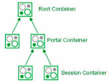
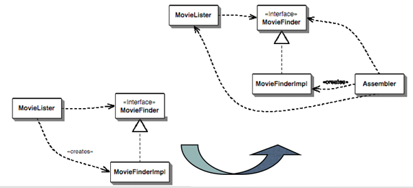
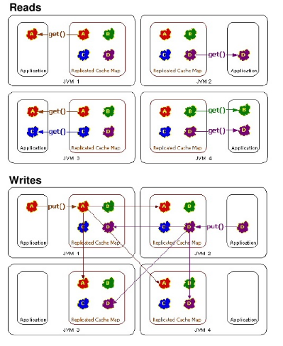
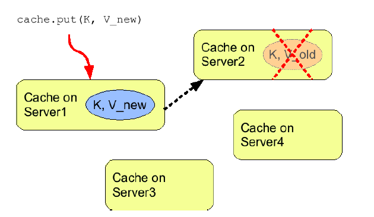

.. _eXo_Kernel:

############
eXo Kernel
############

    eXo Kernel is the basis of all eXo Platform products and modules. In
    this chapter, you will have opportunity to learn about deep topics
    of eXo Kernel via the following topics:

    -  :ref:`eXo Container info <Kernel.ExoContainer>`

       Information about ExoContainer and the container hierarchy.

    -  :ref:`Service configuration for beginners <Kernel.ServiceConfigurationforBeginners>`

       Basic knowledge of modes, services and containers.

    -  :ref:`Service configuration in detail <Kernel.ServiceConfigurationinDetail>`

       Instructions on how to set up a sample service with some
       configurations and how to access the configuration parameters.

    -  :ref:`Container configuration <Kernel.ContainerConfiguration>`

       Information about the container configuration, such as Kernel
       configuration namespace, how configuration files are loaded,
       System property configuration, Variable Syntaxes, Runtime
       configuration profiles, Component request life cycle, and Thread
       Context Holder.

    -  :ref:`Inversion of Control <Kernel.InversionOfControl>`

       Information about the inversion of control design pattern.

    -  :ref:`Services wiring <Kernel.ServicesWiring>`

       Information about the XML schema of the service configuration.xml
       file is, the configuration retrieval and its logging.

    -  :ref:`Component plugin priority <Kernel.ComponentPluginPriority>`

       Instructions on how to use the ``priority`` tag to define the
       component plugin's load priority.

    -  :ref:`Understanding the Listener Service <Kernel.UnderstandingtheListenerService>`

       Description of how the ListenerService works and how to configure
       the ListenerService.

    -  :ref:`Initial context binder <Kernel.InitialContextBinderservice>`

       Information about Initial Context Binder and methods for binding
       reference.

    -  :ref:`Job Scheduler service <Kernel.JobSchedulerService>`

       Information about Job Scheduler service, where and how it is used
       in eXo products and some sample configurations.

    -  :ref:`eXo Cache <Kernel.Cache>`

       Basic and advanced concepts of eXo Cache, sample codes, and more.

    -  :ref:`The data source provider <Kernel.DataSourceProvider>`

       Information about ``DataSourceProvider`` and its default
       configuration.

    -  :ref:`JNDI naming <Kernel.JNDINaming>`

       Basic knowledge of JNDI naming, such as what it is, how it works
       and how it is used.

    -  :ref:`Logs configuration <Kernel.LogConfiguration>`

       Information about logging frameworks that eXo leverages and how
       to configure to use them.

    -  :ref:`Manageability <Kernel.Manageability>`

       Information about the management view of the various sub-systems
       of platform, API of managed framework, and Cache Service example.

    -  :ref:`RPC service <Kernel.RPCService>`

       Information about RPC Service, its configuration and how to use
       the *SingleMethodCallCommand* method.

.. _Kernel.ExoContainer:

==================
eXo Container info
==================

ExoContainer is the main IoC kernel object. The container is responsible
for loading services/components.

-  Behavior is like class loaders

-  A child container sees parent container components

-  Extensively used in eXo Platform

|image0|

===================================
Service configuration for beginners
===================================

By reading this section you are already glancing at the heart of eXo
Kernel. This section provides basic knowledge of modes, services and
containers. Also, you will find out where the service configuration
files should be placed, and the overriding mechanism of configurations.
Finally, you will understand how the container creates the services one
after the other.

**Further reading**

-  To get a deeper look, read this :ref:`Services wiring <Kernel.ServicesWiring>` article. 
   And if you read so much about configuration, you may wonder what the 
   :ref:`XML Schema of the configuration file <Kernel.ContainerConfiguration.ConfigurationNamespace>` looks
   like.

-  If you wish to see examples of service configurations, you should
   study the
   `Core <https://github.com/exoplatform/core/tree/stable/2.5.x>`__
   where you find descriptions of some eXo's core services.

-  Finally, you might wish to read more about
   `PicoContainer <http://picocontainer.codehaus.org/>`__.

Services
~~~~~~~~

Nearly everything could be considered as a service. To get a better
idea, look at the ``$PLATFORM_TOMCAT_HOME/lib`` folder where you find
all deployed ``.jar`` files. For example, see the services for databases
and caching:

-  ``exo.core.component.database-x.x.x.jar``

-  ``exo.kernel.component.cache-x.x.x.jar``

Of course, there are many more services, and in fact, a lot of these
``.jar`` files are services. To find out, open the ``.jar`` file, then
look for ``configuration.xml``. If you see a file named
``configuration.xml``, you are sure to have found a service.

There are 2 places containing this configuration file, including:

-  ``/conf`` that is used by the ``RootContainer``.

-  ``/conf/portal`` that is used by the ``PortalContainer``.

More details about these containers will be described later.

**Interface - Implementation**

It is important to get the idea that you separate the interface and
implementation for a service. That is a good concept to reduce
dependencies on specific implementations. This concept is well known for
JDBC. If you use the standard JDBC (=interface), you can connect any
database (=implementation) to your application. In a similar way, any
service at eXo is defined by a Java interface and may have many
different implementations. The service implementation is then *injected*
by a *container* into the application.

**Singleton**

Each service has to be implemented as a
`singleton <http://en.wikipedia.org/wiki/Singleton_pattern>`__, which
means each service is created only once - in one single instance.

**Service = Component**

You read about services, and think that a service is a **large
application** that does big things. This is not true because a service
may be just a **little component** that reads or transforms a document.
The term "component" is often used instead of "service", so bear in mind
that *a service and a component can safely be considered to be the same
thing*.

Configuration file
~~~~~~~~~~~~~~~~~~~

The ``.jar`` file of a service should contain a default configuration,
you find this configuration in the configuration.xml file which comes
with the jar. A configuration file can specify several services, as well
as there can be several services in one jar file.

For example, open the ``exo.kernel.component.cache-x.x.x.jar`` file,
then open ``/conf/portal/configuration.xml`` inside this jar. You will
see:

.. code:: xml

    <component>
    <key>org.exoplatform.services.cache.CacheService</key> 
    <type>org.exoplatform.services.cache.impl.CacheServiceImpl</type> 
    ...

Here you will note that a service is specified between the
``<component>`` tags. Each service has got a key, which defines the kind
of service. As you imagine, the content of the ``<key>`` tag matches the
*qualified Java interface name*
(``org.exoplatform.services.cache.CacheService``) of the service. The
specific implementation class of the ``CacheService`` is defined in the
``<type>`` tag.

**Parameters** You have already opened some configuration files and seen
that there are more than just ``<key>`` and ``<type>`` tags. You can
provide your service with init parameters. The parameters can be simple
parameters, properties, or object-params. There are also *plugins* and
they are special because the container calls the setters of your service
in order to *inject* your plugin in your service (called *setter
injection*) see :ref:`Service configuration in detail <Kernel.ServiceConfigurationinDetail>`. 
In general your service is free to use init parameters, they are not required.

If you ever need to create your own service, the minimum is to create an
empty interface, an empty class and a constructor for your class -
that's all. You also should put your class and the interface in a
``.jar`` file and add a default configuration file.

Containers
~~~~~~~~~~~

To access a service, you need to use a Container. Let's see the Java
files in
https://github.com/exoplatform/kernel/tree/master/exo.kernel.container/src/main/java/org/exoplatform/container.

Among the classes you see in this directory, you only will be interested
in these three container types:

-  RootContainer: This is a base container. This container plays an
   important role during startup, but you should not use it directly.

-  PortalContainer: This is created at the startup of the portal web
   application (in the **init()** method of the PortalController
   servlet).

-  StandaloneContainer: A context-independent eXo Container. The
   ``StandaloneContainer`` is also used for unit tests.

**Using only one container**

Even if there are several container types, you always use exactly one.
The RootContainer is never directly used. It depends on the execution
mode if you use the PortalContainer or the StandaloneContainer. You will
ask how to find out the execution mode in your application and how to
manage these two modes. It is easy, and you do not have to worry about
it because the **ExoContainerContext** class provides a static method
that allows you to get the right container from anywhere (see 
:ref:`How to get the container <Kernel.Service.HowtoGetContainer>`).

**PicoContainer**

All containers inherit from the ExoContainer class which itself inherits
from a ``PicoContainer``.
`PicoContainer <http://picocontainer.codehaus.org/>`__ is a framework
which allows eXo to apply the IoC (:ref:`Inversion of Control <Kernel.InversionOfControl>`) principles. 
The precise implementation of any service is unknown at compile time. The various
implementations can be used, eXo supplies different implementations but
they also may be delivered by other vendors. The decision of using which
service during runtime is made in configuration files.

These configuration files are read by the container, the container adds
all services to a list or more exactly a Java HashTable. It is
completely correct to suppose that the ``configuration.xml`` you have
already seen plays an important role. But there are more places where a
configuration for a service can be defined as you see in the next
section.

**How to get the container?**

In your Java code, you have to use **ExoContainer myContainer =
ExoContainerContext.getCurrentContainer();** to access the current
container. It does not greatly matter to your application if the current
container is a ``PortalContainer`` or a ``StandaloneContainer``. Once
you have your container, you may access any service registered in the
container using **MyService myService = (MyService)
myContainer.getComponentInstance(MyService.class);**. You easily realize
that ``MyService.class`` is name of the service interface.

Configuration retrieval
~~~~~~~~~~~~~~~~~~~~~~~~

The configuration you find inside the ``.jar`` file is considered as the
default configuration. If you want to override this default
configuration, you can do it in different places outside the ``.jar``.
When the container finds several configurations for the same service,
the configuration which is found later replaces completely the one found
previously. Let's call the *configuration overriding mechanism*.

As both containers, PortalContainer and StandaloneContainer, depend on
the RootContainer, we will start by looking into this one.

The retrieval sequence in short:

1. Default ``RootContainer`` configurations from Jar files at
   ``/conf/configuration.xml``.

2. Configurations from EAR and WAR files at
   ``/META-INF/exo-conf/configuration.xml``. In case of an EAR, if the
   configuration file could be found inside the ``META-INF`` folder, it
   will use only this file and will ignore configuration files in the
   ``META-INF`` folder of the web applications included in the EAR file.

3. External ``RootContainer`` configuration, to be found at
   ``$PLATFORM_TOMCAT_HOME/gatein/conf/configuration.xml``.

**HashTable**: The ``RootContainer`` creates a Java ``HashTable`` which
contains key-value pairs for the services. The qualified interface name
of each service is used as key for the hashtable. Hopefully, you still
remember that the ``<key>`` tag of the configuration file contains the
interface name? The value of each hashtable pair is an object that
contains the service configuration (this means the whole structure
between the ``<component>`` tags of your ``configuration.xml`` file).

The ``RootContainer`` runs over all ``.jar`` files you find in
``$PLATFORM_TOMCAT_HOME/lib`` and looks if there is a configuration file
at ``/conf/configuration.xml``, the services configured in this file are
added to the hashtable. In that way (at the end of this process), the
default configurations for all services are stored in the hashtable.

.. note:: What happens if the same service - recognized by the same qualified
          interface name - is configured in different jars? As the service
          only can exist one time, the configuration of the jar found later
          overrides the previous configuration. You know that the **loading
          order of the jars is unpredictable**, so you **must not depend on
          this**.

If you wish to provide your own configurations for one or several
services, you can do it in a general configuration file that has to be
placed at ``$PLATFORM_TOMCAT_HOME/gatein/conf/configuration.xml``. Here
again, the same rule applies: *The posterior configuration replaces the
previous one*.

The further configuration retrieval depends on the container type.

The PortalContainer takes the hashtable filled by the RootContainer and
continues looking in some more places. Here you get the opportunity to
replace RootContainer configurations by those which are specific to your
portal. Again, the configurations are overridden whenever necessary.

In short, PortalContainer configurations are retrieved in the following
lookup sequence:

1. Default PortalContainer configurations from all Jar files
   (``/conf/portal/configuration.xml``).

2. Web application configurations from the ``portal.war`` file - or the
   *portal* webapp (``/WEB-INF/conf/configuration.xml``).

3. External configuration for services of a named portal, it will be
   found at
   ``$PLATFORM_TOMCAT_HOME/gatein/conf/portal/$portal_name/configuration.xml``.

As you see here, the ``/conf/portal/configuration.xml`` file of each jar
enters the game, they are searched at first. Next, there is nearly
always ``/WEB-INF/conf/configuration.xml`` in the ``portal.war``. In
this file, you will find a lot of import statements that point to other
configuration files in ``portal.war``.

**Multiple Portals**: Be aware that you might set up several different
portals (for example, "admin", "mexico"), each of these portals will use
a different PortalContainer. And each of these PortalContainers can be
configured separately. Like in GateIn, you also will be able to provide
configurations from outside the jars and wars or webapps. Put a
configuration file in
``$PLATFORM_TOMCAT_HOME/gatein/conf/portal/$portal_name/configuration.xml``
where ``$portal_name`` is the name of the portal you want to configure
for. But normally, you only have one portal which is called "portal", so
you use
``$PLATFORM_TOMCAT_HOME/gatein/conf/portal/portal/configuration.xml``.

.. note:: The location of external configuration file can be changed via system property *exo.conf.dir*.

In the same way as the PortalContainer, the StandaloneContainer *takes
over the configuration of the RootContainer*. After that, the
configuration gets a little bit more tricky because standalone
containers can be initialized using an URL. This URL contains a link to
an external configuration. As you probably never need a standalone
configuration, you can safely jump over the remaining confusing words of
this section.

After taking over RootContainer's configuration, there are three cases
which depend on the URL initialization:

-  **Independent configuration by URL**: No other configuration file is
   taken into consideration. The configuration provided by the URL is
   used without any default configurations. This means the container
   creates a new empty hashtable and not any bit of previous
   configuration is used. Apply the following code to do this:

   .. code:: java

       StandaloneContainer.setConfigurationURL(containerConf);

-  **Additional configuration by URL**: The initialization of
   StandaloneContainer is very similar to that of PortalContainer, but
   the last step is slightly different. A configuration file that is
   provided by the URL is used to replace some of the service
   configurations. The code looks like this:

   .. code:: java

       StandaloneContainer.addConfigurationURL(containerConf);

   1. The hashtable is created by the RootContainer.

   2. The default *StandaloneContainer* configurations from ``.jar``
      files at ``/conf/portal/configuration.xml``.

   3. The web application configurations from ``.war`` files
      (``/WEB-INF/conf/configuration.xml``).

   4. The configuration from added URL *containerConf* overrides only
      services configured in the file.

-  **File based configuration**: No URL is involved, in this case the
   sequence is:

   1. The hashtable is created by the RootContainer.

   2. Default *StandaloneContainer* configurations from ``.jar`` files
      at ``/conf/portal/configuration.xml``.

   3. Web applications configurations from ``.war`` files
      (``/WEB-INF/conf/configuration.xml``).

   4. External configuration for *StandaloneContainer* services that is
      found at ``$user_home/exo-configuration.xml``. If
      ``$user_home/exo-configuration.xml`` does not exist and the
      *StandaloneContainer* instance is obtained with the dedicated
      configuration classloader, the container will try to retrieve the
      resource ``conf/exo-configuration.xml`` within the given
      classloader ($user\_home is your home directory like "C:/Documents
      and Settings/Smith").

Service instantiation
~~~~~~~~~~~~~~~~~~~~~~

As you have already learned, the services are all singletons, so that
the container creates only one single instance of each service. The
services are created by calling the constructors (called *constructor
injection*). If there are only zero-arguments constructors
(``Foo public Foo(){}``), there are no problems to be expected. That is
easy.

But now look at
`OrganizationServiceImpl.java <https://github.com/exoplatform/core/tree/stable/2.5.x/exo.core.component.organization.jdbc/src/main/java/org/exoplatform/services/organization/jdbc/OrganizationServiceImpl.java>`__.
This JDBC implementation of BaseOrganizationService interface has only
one constructor:

.. code:: java

    public OrganizationServiceImpl(ListenerService listenerService, DatabaseService dbService);

You see this service depends on two other services. In order to be able
to call this constructor, the container first needs a
``ListenerService`` and a ``DatabaseService``. Therefore, these services
must be instantiated before ``BaseOrganizationService``, because
``BaseOrganizationService`` depends on them.

For this purpose, the container first looks at the constructors of all
services and creates a matrix of service dependencies to call the
services in a proper order. If for any reason there are
interdependencies or circular dependencies, you will get a Java
``Exception``. *In this way, the dependencies are injected by the
container*.

.. note:: What happens if one service has more than one constructor? The
		  container always tries first to use the constructor with a maximum
		  number of arguments, if this is not possible the container continues
		  step by step with constructors that have less arguments until
		  arriving at the zero-argument constructor (if any).

Miscellaneous
~~~~~~~~~~~~~~

Your service can implement the *startable* interface that defines
*start()* and *stop()* methods. These methods are called by the
container at the beginning and the end of the container's lifecycle. In
this way, the lifecycle of your service is managed by the container.

**Retrospection**. Do you remember your last project where you had some
small components and several larger services? How was this organized?
Some services had their own configuration files, others had static
values in the source code. Most components were probably tightly coupled
to the main application, or you called static methods whenever you
needed a service in your Java class. Presumably you even copied the
source code of an earlier project in order to adapt the implementation
to your needs. In short:

-  Each of your service had a proprietary configuration mechanism.

-  The service lifecycles were managed inside of each service or were
   arbitrary.

-  The dependencies between your services were implementation-dependent
   and tightly coupled in your source code.

**New Approach**. You have seen that eXo uses the *Inversion of Control*
(IoC) pattern which means that the control of the services is given to
an independent outside entity (*container* in this case). Now the
container takes care of everything:

-  The *configuration is injected* by external configuration files.

-  The *lifecycle is managed from outside*, because the constructors are
   called by the container. You can achieve an even finer lifecycle
   management if you use the startable interface.

-  The *dependencies are injected* by the service instantiation process.

**Dependency Injection**. You also saw two types of dependency
injections:

-  Constructor injection: The constructor is called by the container.

-  Setter injection: Whenever you use *external-plugins* to provide your
   service with plugins (see :ref:`Service Configuration in Detail <Kernel.ServiceConfigurationinDetail>`).

There are two more Containers called ``RepositoryContainer`` and
``WorkspaceContainer``. These are specificities of eXo JCR, for the sake
of simplicity. You don't need them.

In some cases, the developer of a service does not expect that there
will be several implementations for his service. Therefore he does not
create an interface. In this case the configuration looks like this:

.. code:: xml

    <key>org.exoplatform.services.database.jdbc.DBSchemaCreator</key>
    <type>org.exoplatform.services.database.jdbc.DBSchemaCreator</type>

The key and type tags contain equally the qualified class name.

Since Kernel 2.0.7 and 2.1, it is possible to use system properties in
literal values of component configuration metadata. Thus it is possible
to resolve properties at runtime instead of providing a value at
packaging time.

.. code:: xml

    <component>
      ...
      <init-params>
        <value-param>
          <name>simple_param</name>
          <value>${simple_param_value}</value>
        </value-param>
        <properties-param>
          <name>properties_param</name>
          <property name="value_1" value="properties_param_value_1"/>
          <property name="value_2" value="${properties_param_value_2}"/>
        </properties-param>
        <object-param>
          <name>object_param</name>
          <object type="org.exoplatform.xml.test.Person">
            <field name="address"><string>${person_address}</string></field>
            <field name="male"><boolean>${person_male}</boolean></field>
            <field name="age"><int>${age_value}</int></field>
            <field name="size"><double>${size_value}</double></field>
          </object>
        </object-param>
      </init-params>
    </component>

In case you need to solve problems with your service configuration, you
have to know from which JAR/WAR causes your troubles. Add the JVM system
property ``org.exoplatform.container.configuration.debug`` to get the
related logging.

.. note:: The JVM system property can be added by :ref:`Customizing environment variables <CustomizingEnvironmentVariables>`.
		  If you run eXo Platform in :ref:`dev mode <PLFAdminGuide.InstallationAndStartup.Tomcat.DevAndDebugMode>`,
		  this property is added already.

If this property is set, the container configuration manager reports
(during startup) the configuration retrieval process to the standard
output (System.out).

::

    ......
    Add configuration jar:file:/D:/Projects/eXo/dev/exo-working/exo-tomcat/lib/exo.kernel.container-trunk.jar!/conf/portal/configuration.xml
    Add configuration jar:file:/D:/Projects/eXo/dev/exo-working/exo-tomcat/lib/exo.kernel.component.cache-trunk.jar!/conf/portal/configuration.xml
    Add configuration jndi:/localhost/portal/WEB-INF/conf/configuration.xml import jndi:/localhost/portal/WEB-INF/conf/common/common-configuration.xml
    import jndi:/localhost/portal/WEB-INF/conf/database/database-configuration.xml import jndi:/localhost/portal/WEB-INF/conf/ecm/jcr-component-plugins-configuration.xml
    import jndi:/localhost/portal/WEB-INF/conf/jcr/jcr-configuration.xml
    ......

.. _Kernel.ServiceConfigurationinDetail:

================================
Service configuration in details
================================

This section shows you how to set up a sample service with some
configurations and how to access the configuration parameters. Then it
discusses all details of the configuration file (parameters,
object-params, plugins, imports, and more). It also shows how to access
the configuration values. You may consider this document as a
**reference**, but you can also use this document as a **tutorial** and
read it from the beginning to the end.

Keep in mind that the terms *service* and *component* are
interchangeable in this document.

Sample service
~~~~~~~~~~~~~~~~

**Assumption**

It is assumed that you are working for a publishing company called "La
Verdad" that is going to use eXo Platform, and your boss asks you to
calculate the number of sentences in an article.

Remember that everything is a **service** in eXo Platform, so you decide
to create a simple class. You want to be able to plug different
implementations of your service in the future, so you define an
**interface** that defines your service.

.. code:: java

    package com.laverdad.services; 
    public interface ArticleStatsService {
       public abstract int calcSentences(String article);
    }

A very simple implementation:

.. code:: java

    public class ArticleStatsServiceImpl implements ArticleStatsService {
       public int calcSentences(String article) {
          throw new RuntimeException("Not implemented"); 
       }
    }

That's all! As you see, no special prerequisite is required for a
service.

You should already have prepared your working environment, where you
have a base folder (let's call it our service base folder). If you wish
to try out this example, create this class in the
``com/laverdad/services/ArticleStatsService`` subfolder.

When creating a service, you also should declare its existence to the
**Container**, therefore you create a first simple configuration file.
Copy the following code to a file called ``configuration.xml`` and place
this file in a ``/conf`` subdirectory of your service base folder. As
you already know the container looks for a ``/conf/configuration.xml``
file in each ``.jar`` package.

.. code:: xml

    <?xml version="1.0" encoding="UTF8"?>
    <configuration
        xmlns:xsi="http://www.w3.org/2001/XMLSchema-instance"
        xsi:schemaLocation="http://www.exoplatform.org/xml/ns/kernel_1_2.xsd http://www.exoplatform.org/xml/ns/kernel_1_2.xsd"
        xmlns="http://www.exoplatform.org/xml/ns/kernel_1_2.xsd">
      <component>
        <key>com.laverdad.services.ArticleStatsService</key>
        <type>com.laverdad.services.ArticleStatsServiceImpl</type>
      </component>
    </configuration>

.. note:: You are correctly using the namespace of the configuration schema
          (http://www.exoplatform.org/xml/ns/kernel_1_2.xsd). Most of the
	  	  configuration schema is explained in this article, therefore you do
		  not need to open and understand the schema. For backward
		  compatibility, it is not necessary to declare the schema.

		  When eXo kernel reads a configuration, it loads the file from the
		  kernel jar using the classloader and does not use an internet
		  connection to resolve the file.

**Init parameters**

You see your service has a configuration file, but you wonder how the
service can gain access to its configuration. Imagine that you are asked
to implement two different calculation methods: *fast* and *exact*.

You create one init parameter containing the calculation methods. For
the *exact* method, you wish to configure more details for the service.
Let's enhance the word service configuration file:

.. code:: xml

    <component>
        <key>com.laverdad.services.ArticleStatsService</key>
        <type>com.laverdad.services.ArticleStatsServiceImpl</type>
            <init-params>
                <value-param>
                    <name>calc-method</name>
                    <description>calculation method: fast, exact</description>
                    <value>fast</value>
                </value-param>
                <properties-param>
                    <name>details-for-exact-method</name>
                    <description>details for exact phrase counting</description>
                    <property name="language" value="English" />
                    <property name="variant" value="us" />
                </properties-param>
            </init-params>
    </component>

.. note:: When configuring your service, you are **totally free**. You can
		  provide as many **value-param**, **property-param**, and
		  **properties** as you wish, and you can give them any names or
		  values. You only must respect the xml structure.

Now let's see how our service can read this configuration. The
implementation of the ``calcSentences()`` method serves just as a simple
example. It's up to your imagination to implement the *exact* method.

.. code:: java

    public class ArticleStatsServiceImpl implements ArticleStatsService {

      private String calcMethod = "fast";
      private String variant = "French";
      private String language = "France";
      
      public ArticleStatsServiceImpl(InitParams initParams) {
        super();
        calcMethod = initParams.getValueParam("calc-method").getValue();
        PropertiesParam detailsForExactMethod = initParams.getPropertiesParam("details-for-exact-method");
        if ( detailsForExactMethod != null) {
          language = detailsForExactMethod.getProperty("language");
          variant = detailsForExactMethod.getProperty("variant");
        }
      }
      
      public int calcSentences(String article) {
        if (calcMethod == "fast") {
          // just count the number of periods "." 
          int res = 0;
          int period = article.indexOf('.');
          while (period != -1) {
            res++;
            article = article.substring(period+1);
            period = article.indexOf('.');
          }      
          return  res;
        } 
        throw new RuntimeException("Not implemented");
        }
    }

You see you just have to declare a parameter of
**org.exoplatform.container.xml.InitParams** in your constructor. The
container provides an InitParams object corresponding to the xml tree of
init-param.

As you want to follow the principle of **Inversion of Control**, you
**must not** access the service directly. You need a **Container** to
access the service.

With this command, you get your current container:

-  **ExoContainer myContainer =
   ExoContainerContext.getCurrentContainer();**

Whenever you need one of the services that you have configured, use the
method:

-  **myContainer.getComponentInstance(class)**

In our case:

-  **ArticleStatsService statsService = (ArticleStatsService)
   myContainer.getComponentInstance(ArticleStatsService.class);**

Recapitulation:

.. code:: java

    package com.laverdad.common;

    import org.exoplatform.container.ExoContainer;
    import org.exoplatform.container.ExoContainerContext;
    import com.laverdad.services.*;

    public class Statistics {

      public int makeStatistics(String articleText) {
        ExoContainer myContainer = ExoContainerContext.getCurrentContainer();
        ArticleStatsService statsService = (ArticleStatsService)
            myContainer.getComponentInstance(ArticleStatsService.class);    
        int numberOfSentences = statsService.calcSentences(articleText);
        return numberOfSentences;
      }
      
      public static void main( String args[]) {
       Statistics stats = new Statistics();
       String newText = "This is a normal text. The method only counts the number of periods. "
       + "You can implement your own implementation with a more exact counting. "
       + "Let`s make a last sentence.";
      System.out.println("Number of sentences: " + stats.makeStatistics(newText));
      }
    }

Parameters
~~~~~~~~~~~

See example of the below value-param:

.. code:: xml

    <component>
        <key>org.exoplatform.portal.config.UserACL</key>
        <type>org.exoplatform.portal.config.UserACL</type>
        <init-params>
            ...
            <value-param>
                <name>access.control.workspace</name>
                <description>groups with memberships that have the right to access the User Control Workspace</description>
                <value>*:/platform/administrators,*:/organization/management/executive-board</value>
            </value-param>
            ...
        </init-params>
    </component>

The UserACL class accesses to the **value-param** in its constructor.

.. code:: java

    package org.exoplatform.portal.config;
    public class UserACL {

      public UserACL(InitParams params) {
        UserACLMetaData md = new UserACLMetaData();
        ValueParam accessControlWorkspaceParam = params.getValueParam("access.control.workspace");
        if(accessControlWorkspaceParam != null) md.setAccessControlWorkspace(accessControlWorkspaceParam.getValue());
    ...

Properties are name-value pairs. Both the name and the value are Java
Strings.

Here is an example of Hibernate configuration:

.. code:: xml

    <component>
        <key>org.exoplatform.services.database.HibernateService</key>
        <type>org.exoplatform.services.database.impl.HibernateServiceImpl</type>
        <init-params>
            <properties-param>
                <name>hibernate.properties</name>
                <description>Default Hibernate Service</description>
                <property name="hibernate.show_sql" value="false"/>
                <property name="hibernate.cglib.use_reflection_optimizer" value="true"/>
                <property name="hibernate.connection.url" value="jdbc:hsqldb:file:../temp/data/exodb"/>
                <property name="hibernate.connection.driver_class" value="org.hsqldb.jdbcDriver"/>
                ...
            </properties-param>
        </init-params>
    </component>

In **org.exoplatform.services.database.impl.HibernateServiceImpl**, you
will find that the name "hibernate.properties" of the properties-param
is used to access the properties.

.. code:: java

    package org.exoplatform.services.database.impl;

    public class HibernateServiceImpl implements HibernateService, ComponentRequestLifecycle {
      public HibernateServiceImpl(InitParams initParams, CacheService cacheService) {
        PropertiesParam param = initParams.getPropertiesParam("hibernate.properties");
    ...
    }

Let's have a look at the configuration of the LDAP service. You do not
need to know LDAP, because only parameters are discussed here.

.. code:: xml

    <component>
        <key>org.exoplatform.services.ldap.LDAPService</key>
        <type>org.exoplatform.services.ldap.impl.LDAPServiceImpl</type>
        <init-params>
            <object-param>
                <name>ldap.config</name>
                <description>Default ldap config</description>
                <object type="org.exoplatform.services.ldap.impl.LDAPConnectionConfig">
                    <field  name="providerURL"><string>ldaps://10.0.0.3:636</string></field>
                    <field  name="rootdn"><string>CN=Administrator,CN=Users,DC=exoplatform,DC=org</string></field>
                    <field  name="password"><string>exo</string></field>
                    <field  name="version"><string>3</string></field>
                    <field  name="minConnection"><int>5</int></field>
                    <field  name="maxConnection"><int>10</int></field>
                    <field  name="referralMode"><string>ignore</string></field>
                    <field  name="serverName"><string>active.directory</string></field>
                </object>
            </object-param>
        </init-params>
    </component>

You see here an **object-param** is being used to pass the parameters
inside an object (actually a java bean). It consists of a **name**, a
**description** and exactly one **object**. The object defines the
**type** and a number of **fields**.

Here you see how the service accesses the object:

.. code:: java

    package org.exoplatform.services.ldap.impl;

    public class LDAPServiceImpl implements LDAPService {
    ...
      public LDAPServiceImpl(InitParams params) {
        LDAPConnectionConfig config = (LDAPConnectionConfig) params.getObjectParam("ldap.config")
                                                                   .getObject();
    ...

The passed object is LDAPConnectionConfig which is a classic **java
bean**. It contains all fields and also the appropriate getters and
setters (not listed here). You also can provide default values. The
container creates a new instance of your bean and calls all setters
whose values are configured in the configuration file.

.. code:: java

    package org.exoplatform.services.ldap.impl;

    public class LDAPConnectionConfig {
      private String providerURL        = "ldap://127.0.0.1:389";
      private String rootdn;
      private String password;                                  
      private String version;                                   
      private String authenticationType = "simple";
      private String serverName         = "default";
      private int    minConnection;
      private int    maxConnection;
      private String referralMode       = "follow";
    ...

You see that the types (String, int) of the fields in the configuration
correspond with the bean. Take a short glance at the ``kernel_1_0.xsd``
file to discover more simple types: **string, int, long, boolean, date,
double**.

Also, have a look at a test resource of the types:
`object.xml <https://github.com/exoplatform/kernel/tree/master/exo.kernel.container/src/test/resources/object.xml>`__.

You also can use Java collections to configure your service. See `this
file <https://github.com/exoplatform/kernel/blob/master/exo.kernel.container/src/test/resources/xsd_1_3/sample-configuration-03.xml>`__
for an example. This file defines a default user organization (users,
groups, memberships/roles) of your portal. They use component-plugins
which are explained later. You will see that object-param are used
again.

There are two collections:

-  The first collection is an **ArrayList**. This ArrayList contains
   only one value, but there could be more. The only value is an object
   which defines the field of the **NewUserConfig$JoinGroup** bean.

-  The second collection is a **HashSet** that is a set of strings.

.. code:: xml

    <component-plugin>
        <name>new.user.event.listener</name>
        <set-method>addListenerPlugin</set-method>
        <type>org.exoplatform.services.organization.impl.NewUserEventListener</type>
        <description>this listener assign group and membership to a new created user</description>
        <init-params>
            <object-param>
                <name>configuration</name>
                <description>description</description>
                <object type="org.exoplatform.services.organization.impl.NewUserConfig">
                    <field  name="group">
                    <collection type="java.util.ArrayList">
                    <value>
                    <object type="org.exoplatform.services.organization.impl.NewUserConfig$JoinGroup">
                    <field  name="groupId"><string>/platform/users</string></field>
                    <field  name="membership"><string>member</string></field>
                    </object>
                    </value>               
                    </collection>
                    </field>
                    <field  name="ignoredUser">
                        <collection type="java.util.HashSet">
                        <value><string>root</string></value>
                        <value><string>john</string></value>
                        <value><string>marry</string></value>
                        <value><string>demo</string></value>
                        <value><string>james</string></value>
                        </collection>
                    </field>
                </object>
            </object-param>
        </init-params>
    </component-plugin>

Let's look at the
**org.exoplatform.services.organization.impl.NewUserConfig** bean:

.. code:: java

    public class NewUserConfig {
      private List    role;
      private List    group;
      private HashSet ignoredUser;

      ...

      public void setIgnoredUser(String user) {
        ignoredUser.add(user);

      ...

      static public class JoinGroup {
        public String  groupId;
        public String  membership;
      ...
    }

You see the values of the HashSet are set one by one by the container,
and it's the responsibility of the bean to add these values to its
HashSet.

The JoinGroup object is just an inner class and implements a bean of its
own. It can be accessed like any other inner class using
**NewUserConfig.JoinGroup**.

External plugin
~~~~~~~~~~~~~~~~

The external plugin allows you to add configuration on the fly.

As stated in :ref:`Service configuration for beginners <Kernel.ServiceConfigurationforBeginners>`, the newer
configurations normally **replace** previous configurations. An external
plugin allows you to **add** configuration without replacing previous
configurations.

That can be interesting if you adapt a service configuration for your
project-specific needs (country, language, branch, project, and more).

Let's have a look at the ``TaxonomyPlugin`` configuration of the
``CategoriesService``:

.. code:: xml

    <external-component-plugins>
        <target-component>org.exoplatform.services.cms.categories.CategoriesService</target-component>    
            <component-plugin>
            <name>predefinedTaxonomyPlugin</name>
            <set-method>addTaxonomyPlugin</set-method>
            <type>org.exoplatform.services.cms.categories.impl.TaxonomyPlugin</type>
            <init-params>
                <value-param>
                    <name>autoCreateInNewRepository</name>
                    <value>true</value>
                </value-param>         
                <value-param>
                    <name>repository</name>
                    <value>repository</value>
                </value-param>         
                <object-param>
                    <name>taxonomy.configuration</name>
                    <description>configuration predefined taxonomies to inject in jcr</description>
                    <object type="org.exoplatform.services.cms.categories.impl.TaxonomyConfig">            
                        <field  name="taxonomies">
                            <collection type="java.util.ArrayList">
                                <!-- cms taxonomy -->
                                <value>
                                    <object type="org.exoplatform.services.cms.categories.impl.TaxonomyConfig$Taxonomy">
                                        <field  name="name"><string>cmsTaxonomy</string></field>                              
                                        <field  name="path"><string>/cms</string></field>                                              
                                    </object>
                                </value>
                                <value> 
                                    <object type="org.exoplatform.services.cms.categories.impl.TaxonomyConfig$Taxonomy">
                                        <field  name="name"><string>newsTaxonomy</string></field>                              
                                        <field  name="path"><string>/cms/news</string></field>                                              
                                    </object>
                                </value>
                            </collection>
                        </field>                     
                    </object>
                </object-param>
            </init-params>
        </component-plugin>
    <external-component-plugins>

The **<target-component>** defines the service for which the plugin is
defined. The configuration is injected by the container using a method
that is defined in **<set-method>**. The method has exactly one argument
of the ``org.exoplatform.services.cms.categories.impl.TaxonomyPlugin``
type:

::

    addTaxonomyPlugin(org.exoplatform.services.cms.categories.impl.TaxonomyPlugin plugin)

The content of **<init-params>** corresponds to the structure of the
``TaxonomyPlugin`` object.

.. note:: You can configure the ``CategoriesService`` component using the
		  ``addTaxonomyPlugin`` as often as you wish. You can also call
		  ``addTaxonomyPlugin`` in different configuration files. The
		  ``addTaxonomyPlugin`` method is then called for several times,
		  everything else that depends on the implementation of the method.

Import
~~~~~~~

The import tag allows to import other configuration files using URLs
that are configuration manager specific. For more details about which
supported URLs, refer
:ref:`here <Kernel.ServiceConfigurationinDetail.UnderstandingPrefixesSupportedByConfigurationManager>`.

.. code:: xml

    <import>war:/conf/common/common-configuration.xml</import>
    <import>war:/conf/common/logs-configuration.xml</import>
    <import>war:/conf/database/database-configuration.xml</import>
    <import>war:/conf/jcr/jcr-configuration.xml</import>
    <import>war:/conf/common/portlet-container-configuration.xml</import>
    ... 

System properties
~~~~~~~~~~~~~~~~~~

Since Kernel 2.0.7 and 2.1, it is possible to use system properties in
literal values of component configuration metadata. This makes it
possible to resolve properties at runtime instead of providing a value
at packaging time.

.. code:: xml

    <component>
        <key>org.exoplatform.services.database.HibernateService</key>
        <jmx-name>database:type=HibernateService</jmx-name>
        <type>org.exoplatform.services.database.impl.HibernateServiceImpl</type>
        <init-params>
            <properties-param>
                <name>hibernate.properties</name>
                <description>Default Hibernate Service</description>
                ...
                <property name="hibernate.connection.url" value="${connectionUrl}"/>
                <property name="hibernate.connection.driver_class" value="${driverClass}"/>
                <property name="hibernate.connection.username" value="${username}"/>
                <property name="hibernate.connection.password" value="${password}"/>
                <property name="hibernate.dialect" value="${dialect}"/>
                ...
            </properties-param>
        </init-params>
    </component>

System properties can be set by using the -D option: **java
-DconnectionUrl=jdbc:hsqldb:file:../temp/data/exodb
-DdriverClass=org.hsqldb.jdbcDriver** in the startup commands/scripts.

Prefixes supported by the configuration manager
~~~~~~~~~~~~~~~~~~~~~~~~~~~~~~~~~~~~~~~~~~~~~~~~

The configuration manager allows you to find files using URL with
special prefixes that are described below:

-  ``war``: Finds a file using the *Servlet Context* of your
   ``portal.war`` or any web applications defined as
   *PortalContainerConfigOwner*. For example, in case of the
   ``portal.war``, if the URL is
   ``war:/conf/common/portlet-container-configuration.xml``, it will try
   to get the file from
   ``portal.war/WEB-INF/conf/common/portlet-container-configuration.xml``.

-  ``jar`` or **classpath**: Finds a file that is accessible using the
   *ClassLoader*. For example, ``jar:/conf/my-file.xml`` will be
   understood as trying to find ``conf/my-file.xml`` from the
   *ClassLoader*.

-  **file**: Indicates the configuration manager that it needs to
   interpret the URL as an *absolute path*. For example,
   ``file:///path/to/my/file.xml`` will be understood as an absolute
   path.

-  **ar**: Accesses a file even if it is inside an archive (``.zip``
   file). The used path must be absolute. In case your file is inside an
   archive, you will need to provide the path within the archive using
   "!/" as separator between the path of the archive and the path inside
   the archive. It is also possible to get a file from an archive that
   itself is inside another archive but it is not possible to go any
   further. So for example, here are types of supported URL:

   -  ``ar:/path/to/my/file.xml``: Allows accessing the ``file.xml``
      file. In this case, you could also use ``file:`` for the exact
      same result.

   -  ``ar:/path/to/my/archive.zip!/path/to/my/file.xml``: Allows
      accessing the ``file.xml`` file that is inside ``archive.zip``.

   -  ``ar:/path/to/my/archive.zip!/path/to/my/archive2.zip!/path/to/my/file.xml``:
      Allows accessing the ``file.xml`` file that is inside the archive:
      ``archive2.zip`` which itself is inside ``archive.zip``.

-  *Without prefixes*: It will be understood as a *relative path* from
   the parent directory of the last processed configuration file. For
   example, if the configuration manager is processing the file
   corresponding to ``file:///path/to/my/configuration.xml`` and you
   import ``dir/to/foo.xml`` in this file, the configuration manager
   will try to get the file from ``file:///path/to/my/dir/to/foo.xml``.
   Please note that it works also for other prefixes.

In case you use the configuration manager in a component to get a file
like the example below, it will be relative to the following
directories:

.. code:: java

    //cmanager is org.exoplatform.container.configuration.ConfigurationManager instance
    InputStream is = cmanager.getInputStream("war:/conf/common/locales-config.xml");

-  It will be a relative path to the *exo configuration directory* in
   case of the RootContainer (assuming that the ``configuration.xml``
   file exists there; otherwise it would be hard to know) and from
   ``${exo-configuration-directory}/portal/${portal-container-name}`` in
   case of the PortalContainer (assuming that a ``configuration.xml``
   file exists there; otherwise it would be hard to know).

.. note:: For more details about the eXo configuration directory, refer to the
          :ref:`Configuration Retrieval <Kernel.ServiceConfigurationforBeginners.ConfigurationRetrieval>` section.

.. _Kernel.ContainerConfiguration:

=======================
Container configuration
=======================

eXo Platform uses PicoContainer, which implements the Inversion of
Control (IoC) design pattern. All eXo containers inherit from a
PicoContainer. There are mainly two eXo containers used, each of them
can provide one or several services. Each container service is delivered
in a JAR file. This JAR file may contain a default configuration. The
use of default configurations is recommended and most services provide
it.

When a Pico Container searches for services and its configurations, each
configurable service may be reconfigured to override default values or
set additional parameters. If the service is configured in two or more
places, the configuration override mechanism will be used.

If you are still confused, see the :ref:`Service configuration for beginners <Kernel.ServiceConfigurationforBeginners>` 
section to understand the basics.

Kernel configuration namespace
~~~~~~~~~~~~~~~~~~~~~~~~~~~~~~

To be effective, the namespace URI
http://www.exoplatform.org/xml/ns/kernel_1_2.xsd must be target
namespace of the XML configuration file.

.. code:: xml

    <configuration xmlns:xsi="http://www.w3.org/2001/XMLSchema-instance" 
                   xsi:schemaLocation="http://www.exoplatform.org/xml/ns/kernel_1_2.xsd http://www.exoplatform.org/xml/ns/kernel_1_2.xsd"
                   xmlns="http://www.exoplatform.org/xml/ns/kernel_1_2.xsd">
       ...
    </configuration>

Understanding how configuration files are loaded
~~~~~~~~~~~~~~~~~~~~~~~~~~~~~~~~~~~~~~~~~~~~~~~~~

This section introduces:

-  :ref:`Configuration retrieval <Kernel.ContainerConfiguration.UnderstandingHowConfigurationFilesLoaded.ConfigurationRetrieval>`

   The configuration retrieval order and general notes.

-  :ref:`Advanced concepts for PortalContainers <Kernel.ContainerConfiguration.UnderstandingHowConfigurationFilesLoaded.AdvancedConceptsForPortalContainers>`

   A set of features that have been designed to extend portal
   applications, such as GateIn.

.. _Kernel.ContainerConfiguration.UnderstandingHowConfigurationFilesLoaded.ConfigurationRetrieval:

Configuration retrieval
-------------------------

The container performs the following steps to make eXo Container
configuration retrieval, depending on the container type.

**Configuration retrieval order for PortalContainer**

The container is initialized by looking into different locations. This
container is used by portal applications. Configurations are overloaded
in the following lookup sequence:

1. Default RootContainer configurations from ``.jar`` files at
   ``/conf/configuration.xml``.

2. Configurations from ``.ear`` and ``.war`` files at
   ``/META-INF/exo-conf/configuration.xml``. In case of an ``.ear``, if
   the configuration could be found inside the ``META-INF`` folder, it
   will use only this file and will ignore configuration files in the
   ``META-INF`` folder of the web applications included in the ``.ear``
   file.

3. External RootContainer configuration can be found at
   ``$AS_HOME/exo-conf/configuration.xml``.

4. Default PortalContainer configurations from ``.jar`` files at
   ``/conf/portal/configuration.xml``.

5. Web applications configurations from ``.war`` files at
   ``/WEB-INF/conf/configuration.xml``.

6. External configuration for services of named portal can be found at
   ``$AS_HOME/exo-conf/portal/$PORTAL_NAME/configuration.xml``.

**Configuration retrieval for StandaloneContainer**

The container is initialized by looking into different locations. This
container is used by non-portal applications. Configurations are
overloaded in the following lookup sequence:

1. Default StandaloneContainer configurations from JAR files at
   ``/conf/configuration.xml``.

2. Default StandaloneContainer configurations from JAR files at
   ``/conf/portal/configuration.xml``.

3. Web applications configurations from WAR files at
   ``/WEB-INF/conf/configuration.xml``.

4. Then depending on the StandaloneContainer configuration URL
   initialization:

   -  If configuration URL was initialized to be added to services
      defaults, as below:

      .. code:: java

          // add configuration to the default services configurations from JARs/WARs
          StandaloneContainer.addConfigurationURL(containerConf);

      Configuration from added URL *containerConf* will override only
      services configured in the file.

   -  If configuration URL is not initialized at all, it will be found
      at ``$AS_HOME/exo-configuration.xml``. If
      ``$AS_HOME/exo-configuration.xml`` does not exist, the container
      will look for it at ``$AS_HOME/exo-conf/exo-configuration.xml``
      location and if it is still not found and the StandaloneContainer
      instance obtained with the dedicated configuration ClassLoader,
      the container will try to retrieve the resource
      ``conf/exo-configuration.xml`` within the given ClassLoader.

**General notes about the configuration retrieval**

-  *$AS\_HOME* is application server home directory, or ``user.dir`` JVM
   system property value in case of Java Standalone application. The
   application server home is:

   -  For Jonas, the value of the variable *${jonas.base}.*

   -  For Jetty, the value of the variable *${jetty.home}.*

   -  For Websphere, the value of the variable *${was.install.root}.*

   -  For Weblogic, the value of the variable *${wls.home}*.

   -  For Glassfish, the value of the variable
      *${com.sun.aas.instanceRoot}*.

   -  For Tomcat, the value of the variable *${catalina.home}*.

-  *$PORTAL\_NAME* is the name of portal web application.

-  External configuration location can be overridden with System
   property *exo.conf.dir*. If the property exists, its value will be
   used as path to eXo configuration directory, i.e. to
   ``$AS_HOME/exo-conf``. In this particular usecase, you do not need to
   use any prefix to import other files. For instance, if your
   configuration file is
   ``$AS_HOME/exo-conf/portal/PORTAL_NAME/configuration.xml`` and you
   want to import the configuration file
   ``$AS_HOME/exo-conf/portal/PORTAL_NAME/mySubConfDir/myConfig.xml``,
   you can do it by adding *<import>mySubConfDir/myConfig.xml</import>*
   to your configuration file.

-  The name of the configuration folder that is by default *"exo-conf"*,
   can be changed thanks to the System property: *exo.conf.dir.name*.

       **Warning**

       Even if you modify the configuration folder, it will remain
       "exo-conf" for the files that are retrieved from the META-INF
       folder. This affects only the externalized configuration files.

-  The search looks for a configuration file in each jar/war available
   from the classpath using the current thread context classloader.
   During the search, these configurations are added to a set. If the
   service was configured previously and the current jar contains a new
   configuration of that service, the latest (from the current jar/war)
   will replace the previous one. The last one will be applied to the
   service during the services start phase.

-  To be able to retrieve the configuration files inside the ``.ear``
   and ``.war`` files, Kernel does a lookup inside the standard folders
   where the archives are deployed. If for some reasons, you would need
   to redefine the list of folders where the archives are deployed, you
   can use the System property: *exo.archive.dirs* and set it to a comma
   separated list of paths relative to the ``$AS_HOME``.

    **Warning**

    -  The ``.ear`` and ``.war`` files from which Kernel gets the
       configuration files for the RootContainer, are found thanks to a
       lookup inside the standard deployment folders, but so far those
       folders are only properly defined in case of Tomcat and
       Jetty. For other application servers, you will need to use the
       System property described in the previous note.

    -  Take care to have no dependencies between configurations from
       ``.jar`` files (``/conf/portal/configuration.xml`` and
       ``/conf/configuration.xml``) since we have no way to know in
       advance the loading order of those configurations. In other
       words, if you want to overload some configuration located in the
       ``/conf/portal/configuration.xml`` file of a given ``.jar`` file,
       you must not do it from the ``/conf/portal/configuration.xml``
       file of another ``.jar`` but from another configuration file
       loaded after configurations from ``.jar`` files:
       */conf/portal/configuration.xml.*

After processing all configurations available in system, the container
will initialize it and start each service in order of the dependency
injection (DI).

The user/developer should be careful when configuring the same service
in different configuration files. It is recommended to configure a
service in its own JAR only. Or, in case of a portal configuration,
strictly reconfigure the services in portal ``.war`` files or in an
external configuration.

There are services that can be (or should be) configured more than once.
This depends on the business logic of the service. A service may
initialize the same resource (shared with other services) or may add a
particular object to a set of objects (shared with other services too).
In the first case, it is critical who will be the last, i.e. whose
configuration will be used. In the second case, it does not matter who
is the first and who is the last (if the parameter objects are
independent).

**Getting the effective configuration at runtime**

The effective configuration of StandaloneContainer, RootContainer and/or
PortalContainer can be known thanks to the *getConfigurationXML()*
method that is exposed through JMX at the container's level. This method
will give you the effective configuration in XML format that has been
really interpreted by Kernel. This could be helpful to understand how a
given component or plugin has been initialized.

.. _Kernel.ContainerConfiguration.UnderstandingHowConfigurationFilesLoaded.AdvancedConceptsForPortalContainers:

Advanced concepts for PortalContainers
----------------------------------------

Since eXo JCR 1.12, we added a set of new features that have been
designed to extend portal applications, such as GateIn.

Adding new configuration files from a WAR file
^^^^^^^^^^^^^^^^^^^^^^^^^^^^^^^^^^^^^^^^^^^^^^

A ServletContextListener called
org.exoplatform.container.web.PortalContainerConfigOwner is added to
notify that a web application provides some configurations to the portal
container, and this configuration file is
``WEB-INF/conf/configuration.xml`` available in the web application
itself.

If your ``.war`` file contains some configurations to add to the
PortalContainer, simply add the following lines in your ``web.xml``
file.

.. code:: xml

    <?xml version="1.0" encoding="ISO-8859-1" ?>
    <!DOCTYPE web-app PUBLIC "-//Sun Microsystems, Inc.//DTD Web Application 2.3//EN"
                     "http://java.sun.com/dtd/web-app_2_3.dtd">
    <web-app>
    ...
      <!-- ================================================================== -->
      <!--           LISTENER                                                 -->
      <!-- ================================================================== -->
      <listener>
        <listener-class>org.exoplatform.container.web.PortalContainerConfigOwner</listener-class>
      </listener>
    ...
    </web-app>

Creating your PortalContainers from a .war file
^^^^^^^^^^^^^^^^^^^^^^^^^^^^^^^^^^^^^^^^^^^^^^^

A ServletContextListener called
org.exoplatform.container.web.PortalContainerCreator is added to create
the current portal containers that have been registered. It is assumed
that all the web applications have already been loaded before calling
PortalContainerCreator.contextInitialized.

.. note:: In eXo Platform, the PortalContainerCreator is already managed by the ``starter.war/ear`` file.

Defining a PortalContainer with its dependencies and its settings
^^^^^^^^^^^^^^^^^^^^^^^^^^^^^^^^^^^^^^^^^^^^^^^^^^^^^^^^^^^^^^^^^

Now we can define precisely a portal container and its dependencies and
settings thanks to the PortalContainerDefinition that currently contains
the name of the portal container, the name of the rest context, the name
of the realm, the web application dependencies ordered by loading
priority (for example, the first dependency must be loaded at first and
so on) and the settings.

To be able to define a PortalContainerDefinition, we first need to
ensure that a PortalContainerConfig has been defined at the
RootContainer level. See an example below:

.. code:: xml

      <component>
        <!-- The full qualified name of the PortalContainerConfig -->
        <type>org.exoplatform.container.definition.PortalContainerConfig</type>
        <init-params>
          <!-- The name of the default portal container -->
          <value-param>
            <name>default.portal.container</name>
            <value>myPortal</value>
          </value-param>
          <!-- The name of the default rest ServletContext -->
          <value-param>
            <name>default.rest.context</name>
            <value>myRest</value>
          </value-param>
          <!-- The name of the default realm -->
          <value-param>
            <name>default.realm.name</name>
            <value>my-exo-domain</value>
          </value-param>
         <!-- Indicates whether the unregistered webapps have to be ignored -->
         <value-param>
            <name>ignore.unregistered.webapp</name>
            <value>true</value>
         </value-param>
          <!-- The default portal container definition -->
          <!-- It cans be used to avoid duplicating configuration -->
          <object-param>
            <name>default.portal.definition</name>
            <object type="org.exoplatform.container.definition.PortalContainerDefinition">
              <!-- All the dependencies of the portal container ordered by loading priority -->
              <field name="dependencies">
                <collection type="java.util.ArrayList">
                  <value>
                    <string>foo</string>
                  </value>
                  <value>
                    <string>foo2</string>
                  </value>
                  <value>
                    <string>foo3</string>
                  </value>
                </collection>
              </field>        
              <!-- A map of settings tied to the default portal container -->
              <field name="settings">
                <map type="java.util.HashMap">
                  <entry>
                    <key>
                      <string>foo5</string>
                    </key>
                    <value>
                      <string>value</string>
                    </value>
                  </entry>
                  <entry>
                    <key>
                      <string>string</string>
                    </key>
                    <value>
                      <string>value0</string>
                    </value>
                  </entry>
                  <entry>
                    <key>
                      <string>int</string>
                    </key>
                    <value>
                      <int>100</int>
                    </value>
                  </entry>
                </map>
              </field>
              <!-- The path to the external properties file -->
              <field name="externalSettingsPath">
                <string>classpath:/org/exoplatform/container/definition/default-settings.properties</string>
              </field>
            </object>
          </object-param>
        </init-params>
      </component>

+-----------------------------------+-----------------------------------------------------------------------------------------------------------------------------------------------------------------------------------------------------------------------------------------------------------------------------+
| default.portal.container (\*)     | The name of the default portal container. This field is optional.                                                                                                                                                                                                           |
+-----------------------------------+-----------------------------------------------------------------------------------------------------------------------------------------------------------------------------------------------------------------------------------------------------------------------------+
| default.rest.context (\*)         | The name of the default rest ServletContext. This field is optional.                                                                                                                                                                                                        |
+-----------------------------------+-----------------------------------------------------------------------------------------------------------------------------------------------------------------------------------------------------------------------------------------------------------------------------+
| default.realm.name (\*)           | The name of the default realm. This field is optional.                                                                                                                                                                                                                      |
+-----------------------------------+-----------------------------------------------------------------------------------------------------------------------------------------------------------------------------------------------------------------------------------------------------------------------------+
| ignore.unregistered.webapp (\*)   | Indicates whether the unregistered webapps have to be ignored. If a webapp has not been registered as a dependency of any portal container, the application will use the value of this parameter to know what to do:                                                        |
|                                   |                                                                                                                                                                                                                                                                             |
|                                   | -  If it is set to *false*, this webapp will be considered by default as a dependency of all the portal containers.                                                                                                                                                         |
|                                   |                                                                                                                                                                                                                                                                             |
|                                   | -  If it is set to *true*, this webapp will not be considered by default as a dependency of any portal container, it will be simply ignored.                                                                                                                                |
|                                   |                                                                                                                                                                                                                                                                             |
|                                   | This field is optional and this parameter is set to *false* by default.                                                                                                                                                                                                     |
+-----------------------------------+-----------------------------------------------------------------------------------------------------------------------------------------------------------------------------------------------------------------------------------------------------------------------------+
| default.portal.definition         | The definition of the default portal container. This field is optional. The expected type is org.exoplatform.container.definition.PortalContainerDefinition that is described below. The parameters defined in this PortalContainerDefinition will be the default values.   |
+-----------------------------------+-----------------------------------------------------------------------------------------------------------------------------------------------------------------------------------------------------------------------------------------------------------------------------+

Table: Descriptions of the fields of PortalContainerConfig

.. note:: All the values of the parameters marked with a (\*) can be set via
		  System properties and also via variables loaded by the
		  *PropertyConfigurator*. For example, in eXo Platform, it would be
		  all the variables that can be defined via the *exo.properties* file.
		  See :ref:`Configuration overview <Configuration.ConfigurationOverview>` 
		  for the ``exo.properties`` file.

A new PortalContainerDefinition can be defined at the RootContainer
level thanks to an external plugin, see an example below:

.. code:: xml

      <external-component-plugins>
        <!-- The full qualified name of the PortalContainerConfig -->
        <target-component>org.exoplatform.container.definition.PortalContainerConfig</target-component>
        <component-plugin>
          <!-- The name of the plugin -->
          <name>Add PortalContainer Definitions</name>
          <!-- The name of the method to call on the PortalContainerConfig in order to register the PortalContainerDefinitions -->
          <set-method>registerPlugin</set-method>
          <!-- The full qualified name of the PortalContainerDefinitionPlugin -->
          <type>org.exoplatform.container.definition.PortalContainerDefinitionPlugin</type>
          <init-params>
            <object-param>
              <name>portal</name>
              <object type="org.exoplatform.container.definition.PortalContainerDefinition">
                <!-- The name of the portal container -->
                <field name="name">
                  <string>myPortal</string>
                </field>
                <!-- The name of the context name of the rest web application -->
                <field name="restContextName">
                  <string>myRest</string>
                </field>
                <!-- The name of the realm -->
                <field name="realmName">
                  <string>my-domain</string>
                </field>
                <!-- All the dependencies of the portal container ordered by loading priority -->
                <field name="dependencies">
                  <collection type="java.util.ArrayList">
                    <value>
                      <string>foo</string>
                    </value>
                    <value>
                      <string>foo2</string>
                    </value>
                    <value>
                      <string>foo3</string>
                    </value>
                  </collection>
                </field>
                <!-- A map of settings tied to the portal container -->
                <field name="settings">
                  <map type="java.util.HashMap">
                    <entry>
                      <key>
                        <string>foo</string>
                      </key>
                      <value>
                        <string>value</string>
                      </value>
                    </entry>
                    <entry>
                      <key>
                        <string>int</string>
                      </key>
                      <value>
                        <int>10</int>
                      </value>
                    </entry>
                    <entry>
                      <key>
                        <string>long</string>
                      </key>
                      <value>
                        <long>10</long>
                      </value>
                    </entry>
                    <entry>
                      <key>
                        <string>double</string>
                      </key>
                      <value>
                        <double>10</double>
                      </value>
                    </entry>
                    <entry>
                      <key>
                        <string>boolean</string>
                      </key>
                      <value>
                        <boolean>true</boolean>
                      </value>
                    </entry>                                
                  </map>
                </field>            
                <!-- The path to the external properties file -->
                <field name="externalSettingsPath">
                  <string>classpath:/org/exoplatform/container/definition/settings.properties</string>
                </field>
              </object>
            </object-param>
          </init-params>
        </component-plugin>
      </external-component-plugins>

See descriptions about fields of a PortalContainerDefinition when it is
used to define a new portal container:

+------------------------+---------------------------------------------------------------------------------------------------------------------------------------------------------------------------------------------------------------------------------------------------------------------------------------------------------------------------------------------------------------------------------------------------------------------------------------------------------------------------------------------------------------------------------------------------------------------------+
| name (\*)              | The name of the portal container. This field is mandatory.                                                                                                                                                                                                                                                                                                                                                                                                                                                                                                                |
+------------------------+---------------------------------------------------------------------------------------------------------------------------------------------------------------------------------------------------------------------------------------------------------------------------------------------------------------------------------------------------------------------------------------------------------------------------------------------------------------------------------------------------------------------------------------------------------------------------+
| restContextName (\*)   | The name of the context name of the REST web application. This field is optional. The default value will be defined at the PortalContainerConfig level.                                                                                                                                                                                                                                                                                                                                                                                                                   |
+------------------------+---------------------------------------------------------------------------------------------------------------------------------------------------------------------------------------------------------------------------------------------------------------------------------------------------------------------------------------------------------------------------------------------------------------------------------------------------------------------------------------------------------------------------------------------------------------------------+
| realmName (\*)         | The name of the realm. This field is optional. The default value will be defined at the PortalContainerConfig level.                                                                                                                                                                                                                                                                                                                                                                                                                                                      |
+------------------------+---------------------------------------------------------------------------------------------------------------------------------------------------------------------------------------------------------------------------------------------------------------------------------------------------------------------------------------------------------------------------------------------------------------------------------------------------------------------------------------------------------------------------------------------------------------------------+
| dependencies           | All the dependencies of the portal container ordered by loading priority. This field is optional. The default value will be defined at the PortalContainerConfig level. The dependencies are in fact the list of the context names of the web applications from which the portal container depends. The dependency order is really crucial since it will be interpreted the same way by several components of the platform. All those components will consider the first element in the list less important than the second element and so on. It is currently used to:   |
|                        |                                                                                                                                                                                                                                                                                                                                                                                                                                                                                                                                                                           |
|                        | -  Know the loading order of all the dependencies.                                                                                                                                                                                                                                                                                                                                                                                                                                                                                                                        |
|                        |                                                                                                                                                                                                                                                                                                                                                                                                                                                                                                                                                                           |
|                        | -  If we have several PortalContainerConfigOwner,                                                                                                                                                                                                                                                                                                                                                                                                                                                                                                                         |
|                        |                                                                                                                                                                                                                                                                                                                                                                                                                                                                                                                                                                           |
|                        |    -  The ServletContext of all the PortalContainerConfigOwner will be unified. If you use the unified ServletContext (*PortalContainer.getPortalContext()*) to get a resource, it will try to get the resource in the ServletContext of the most important PortalContainerConfigOwner (i.e. last in the dependency list). And if it does not find, it will try with the second most important PortalContainerConfigOwner and so on.                                                                                                                                      |
|                        |                                                                                                                                                                                                                                                                                                                                                                                                                                                                                                                                                                           |
|                        |    -  The ClassLoader of all the PortalContainerConfigOwner will be unified, if we use the unified ClassLoader (*PortalContainer.getPortalClassLoader()*) to get a resource, it will try to get the resource in the ClassLoader of the most important PortalContainerConfigOwner (i.e. last in the dependency list) and if it can find it, it will try with the second most important PortalContainerConfigOwner and so on.                                                                                                                                               |
+------------------------+---------------------------------------------------------------------------------------------------------------------------------------------------------------------------------------------------------------------------------------------------------------------------------------------------------------------------------------------------------------------------------------------------------------------------------------------------------------------------------------------------------------------------------------------------------------------------+
| settings               | A java.util.Map of internal parameters that we would like to tie the portal container. Those parameters could have any type of value. This field is optional. If some internal settings are defined at the PortalContainerConfig level, the two maps of settings will be merged. If a setting with the same name is defined in both maps, it will keep the value defined at the PortalContainerDefinition level.                                                                                                                                                          |
+------------------------+---------------------------------------------------------------------------------------------------------------------------------------------------------------------------------------------------------------------------------------------------------------------------------------------------------------------------------------------------------------------------------------------------------------------------------------------------------------------------------------------------------------------------------------------------------------------------+
| externalSettingsPath   | The path of the external properties file to load as default settings to the portal container. This field is optional. If some external settings are defined at the PortalContainerConfig level, the two maps of settings will be merged. If a setting with the same name is defined in both maps, it will keep the value defined at the PortalContainerDefinition level. The external properties files can be either of type "properties" or of type "xml". The path will be interpreted as follows:                                                                      |
|                        |                                                                                                                                                                                                                                                                                                                                                                                                                                                                                                                                                                           |
|                        | 1. The path does not contain any prefix of types: "classpath:", "jar:", "ar:", or "file:". It is assumed that the file could be externalized that can apply the following rules:                                                                                                                                                                                                                                                                                                                                                                                          |
|                        |                                                                                                                                                                                                                                                                                                                                                                                                                                                                                                                                                                           |
|                        |    -  If a file exists at *${exo-conf-dir}/portal/${portalContainerName}/${externalSettingsPath}*, this file will be loaded.                                                                                                                                                                                                                                                                                                                                                                                                                                              |
|                        |                                                                                                                                                                                                                                                                                                                                                                                                                                                                                                                                                                           |
|                        |    -  If no file exists at the previous path, we then pass the path to the ConfigurationManager to be interpreted.                                                                                                                                                                                                                                                                                                                                                                                                                                                        |
|                        |                                                                                                                                                                                                                                                                                                                                                                                                                                                                                                                                                                           |
|                        | 2. If the path contains a prefix, we then assume that the path should be interpreted by the ConfigurationManager.                                                                                                                                                                                                                                                                                                                                                                                                                                                         |
+------------------------+---------------------------------------------------------------------------------------------------------------------------------------------------------------------------------------------------------------------------------------------------------------------------------------------------------------------------------------------------------------------------------------------------------------------------------------------------------------------------------------------------------------------------------------------------------------------------+

Descriptions of the fields of a PortalContainerDefinition when it is
used to define the default portal container:

+------------------------+-------------------------------------------------------------------------------------------------------------------------------------------------------------------------------------------------------------------------------------------------------------+
| name (\*)              | The name of the portal container. This field is optional. The default portal name will be:                                                                                                                                                                  |
|                        |                                                                                                                                                                                                                                                             |
|                        | 1. If this field is not empty, then the default value will be the value of this field.                                                                                                                                                                      |
|                        |                                                                                                                                                                                                                                                             |
|                        | 2. If this field is empty and the value of the parameter *default.portal.container* is not empty, then the default value will be the value of the parameter.                                                                                                |
|                        |                                                                                                                                                                                                                                                             |
|                        | 3. If this field and the parameter *default.portal.container* are both empty, the default value will be *"portal".*                                                                                                                                         |
+------------------------+-------------------------------------------------------------------------------------------------------------------------------------------------------------------------------------------------------------------------------------------------------------+
| restContextName (\*)   | The name of the context name of the REST web application. This field is optional. The default value will be:                                                                                                                                                |
|                        |                                                                                                                                                                                                                                                             |
|                        | 1. If this field is not empty, then the default value will be the value of this field.                                                                                                                                                                      |
|                        |                                                                                                                                                                                                                                                             |
|                        | 2. If this field is empty and the value of the parameter *default.rest.context* is not empty, then the default value will be the value of the parameter.                                                                                                    |
|                        |                                                                                                                                                                                                                                                             |
|                        | 3. If this field and the parameter *default.rest.context* are both empty, the default value will be *"rest".*                                                                                                                                               |
+------------------------+-------------------------------------------------------------------------------------------------------------------------------------------------------------------------------------------------------------------------------------------------------------+
| realmName (\*)         | The name of the realm. This field is optional. The default value will be:                                                                                                                                                                                   |
|                        |                                                                                                                                                                                                                                                             |
|                        | 1. If this field is not empty, then the default value will be the value of this field.                                                                                                                                                                      |
|                        |                                                                                                                                                                                                                                                             |
|                        | 2. If this field is empty and the value of the parameter *default.realm.name* is not empty, then the default value will be the value of the parameter.                                                                                                      |
|                        |                                                                                                                                                                                                                                                             |
|                        | 3. If both this field and the parameter *default.realm.name* are empty, the default value will be *"exo-domain"*.                                                                                                                                           |
+------------------------+-------------------------------------------------------------------------------------------------------------------------------------------------------------------------------------------------------------------------------------------------------------+
| dependencies           | All the dependencies of the portal container ordered by loading priority. This field is optional. If the value of this field is not empty, it will be the default list of dependencies.                                                                     |
+------------------------+-------------------------------------------------------------------------------------------------------------------------------------------------------------------------------------------------------------------------------------------------------------+
| settings               | A java.util.Map of internal parameters that we would like to tie the default portal container. Those parameters could have any type of value. This field is optional.                                                                                       |
+------------------------+-------------------------------------------------------------------------------------------------------------------------------------------------------------------------------------------------------------------------------------------------------------+
| externalSettingsPath   | The path of the external properties file to load as default settings to the default portal container. This field is optional. The external properties files can be either of "properties" type or of "xml" type. The path will be interpreted as follows:   |
|                        |                                                                                                                                                                                                                                                             |
|                        | 1. If the path does not contain any prefix of types: "classpath:", "jar:" or "file:", we assume that the file could be externalized, so we apply the following rules:                                                                                       |
|                        |                                                                                                                                                                                                                                                             |
|                        |    -  If a file exists at *${exo-conf-dir}/portal/${externalSettingsPath}*, we will load this file.                                                                                                                                                         |
|                        |                                                                                                                                                                                                                                                             |
|                        |    -  If no file exists at the previous path, we then pass the path to the ConfigurationManager to be interpreted.                                                                                                                                          |
|                        |                                                                                                                                                                                                                                                             |
|                        | 2. If the path contains a prefix, we then assume that the path can be interpreted by the ConfigurationManager.                                                                                                                                              |
+------------------------+-------------------------------------------------------------------------------------------------------------------------------------------------------------------------------------------------------------------------------------------------------------+

Internal and external settings are both optional, but if we give a
non-empty value for both, the application will merge the settings. If
the same setting name exists in both settings, we apply the following
rules:

1. If the value of the external setting is *null*, we ignore the value.

2. If the value of the external setting is not *null* and the value of
   the internal setting is *null*, the final value will be the external
   setting value that is of String type.

3. If both values are not null, we will have to convert the external
   setting value into the target type which is the type of the internal
   setting value, thanks to the static method *valueOf(String)*, the
   following sub-rules are then applied:

   -  If the method cannot be found, the final value will be the
      external setting value that is of String type.

   -  If the method can be found and the external setting value is an
      empty String, we ignore the external setting value.

   -  If the method can be found and the external setting value is not
      an empty String but the method call fails, we ignore the external
      setting value.

   -  If the method can be found and the external setting value is not
      an empty String and the method call succeeds, the final value will
      be the external setting value that is of type of the internal
      setting value.

PortalContainer settings
^^^^^^^^^^^^^^^^^^^^^^^^

We can inject the value of the portal container settings into the portal
container configuration files thanks to the variables of which name
starts with "*portal.container.*", so to get the value of a setting
called "*foo*", just use the following syntax *${portal.container.foo}*.
You can also use internal variables, such as:

+--------------------------+---------------------------------------------------------------------------------------+
| portal.container.name    | Gives the name of the current portal container.                                       |
+--------------------------+---------------------------------------------------------------------------------------+
| portal.container.rest    | Gives the context name of the rest web application of the current portal container.   |
+--------------------------+---------------------------------------------------------------------------------------+
| portal.container.realm   | Gives the realm name of the current portal container.                                 |
+--------------------------+---------------------------------------------------------------------------------------+

Table: Definition of the internal variables

You can find below an example of how to use the variables:

.. code:: xml

    <configuration xmlns:xsi="http://www.w3.org/2001/XMLSchema-instance" xsi:schemaLocation="http://www.exoplatform.org/xml/ns/kernel_1_2.xsd http://www.exoplatform.org/xml/ns/kernel_1_2.xsd"
      xmlns="http://www.exoplatform.org/xml/ns/kernel_1_2.xsd">
      <component>
        <type>org.exoplatform.container.TestPortalContainer$MyComponent</type>
        <init-params>
          <!-- The name of the portal container -->
          <value-param>
            <name>portal</name>
            <value>${portal.container.name}</value>
          </value-param>
          <!-- The name of the rest ServletContext -->
          <value-param>
            <name>rest</name>
            <value>${portal.container.rest}</value>
          </value-param>
          <!-- The name of the realm -->
          <value-param>
            <name>realm</name>
            <value>${portal.container.realm}</value>
          </value-param>
          <value-param>
            <name>foo</name>
            <value>${portal.container.foo}</value>
          </value-param>
          <value-param>
            <name>before foo after</name>
            <value>before ${portal.container.foo} after</value>
          </value-param>
        </init-params>
      </component>
    </configuration>

In the properties file corresponding to the external settings, you can
reuse variables previously defined (in the external settings or in the
internal settings) to create a new variable. In this case, the prefix
"*portal.container.*" is not needed, see an example below:

::

    my-var1=value 1
    my-var2=value 2
    complex-value=${my-var1}-${my-var2}

In the external and internal settings, you can also create variables
based on value of System parameters. The System parameters can either be
defined at launch time or thanks to the PropertyConfigurator (see next
section for more details). See an example below:

::

    temp-dir=${java.io.tmpdir}${file.separator}my-temp

However, for the internal settings, you can use System parameters only
to define settings of java.lang.String type.

It can be also very useful to define a generic variable in the settings
of the default portal container, the value of this variable will change
according to the current portal container. See an example below:

::

    my-generic-var=ABC ${name}

If this variable is defined at the default portal container level, the
value of this variable for a portal container named *"foo"* will be ABC
foo.

.. _Kernel.PortalContainer.DynamicSettings:

Adding dynamically settings and/or dependencies to a PortalContainer
^^^^^^^^^^^^^^^^^^^^^^^^^^^^^^^^^^^^^^^^^^^^^^^^^^^^^^^^^^^^^^^^^^^^

It is possible to use component-plugin elements to dynamically change a
PortalContainerDefinition. In the example below, we add the dependency
foo to the default portal container and to the portal containers called
foo1 and foo2:

.. code:: xml

    <external-component-plugins>
      <!-- The full qualified name of the PortalContainerConfig -->
      <target-component>org.exoplatform.container.definition.PortalContainerConfig</target-component>
      <component-plugin>
        <!-- The name of the plugin -->
        <name>Change PortalContainer Definitions</name>
        <!-- The name of the method to call on the PortalContainerConfig in order to register the changes on the PortalContainerDefinitions -->
        <set-method>registerChangePlugin</set-method>
        <!-- The full qualified name of the PortalContainerDefinitionChangePlugin -->
        <type>org.exoplatform.container.definition.PortalContainerDefinitionChangePlugin</type>
        <init-params>
          <values-param>
            <name>add.profiles</name>
            <value>custom-profile-1</value>
            <value>custom-profile-2</value>
          </values-param>
          <value-param>
            <name>apply.default</name>
            <value>true</value>
          </value-param>
          <values-param>
            <name>apply.specific</name>
            <value>foo1</value>
            <value>foo2</value>
          </values-param>  
          <object-param>
            <name>change</name>
            <object type="org.exoplatform.container.definition.PortalContainerDefinitionChange$AddDependencies">
              <!-- The list of name of the dependencies to add -->
              <field name="dependencies">
                <collection type="java.util.ArrayList">
                  <value>
                    <string>foo</string>
                  </value>
                </collection>
              </field>
            </object>
          </object-param>     
        </init-params>
      </component-plugin>
    </external-component-plugins>

+-----------------------+---------------------------------------------------------------------------------------------------------------------------------------------------------------------------------------------------------------------------------------------------------------------------------------------------------------------------------------------------------------------+
| apply.all (\*)        | Indicates whether changes have to be applied to all the portal containers or not. The default value of this field is false. This field is a ValueParam and is not mandatory.                                                                                                                                                                                        |
+-----------------------+---------------------------------------------------------------------------------------------------------------------------------------------------------------------------------------------------------------------------------------------------------------------------------------------------------------------------------------------------------------------+
| apply.default (\*)    | Indicates whether the changes have to be applied to the default portal container or not. The default value of this field is false. This field is a ValueParam and is not mandatory.                                                                                                                                                                                 |
+-----------------------+---------------------------------------------------------------------------------------------------------------------------------------------------------------------------------------------------------------------------------------------------------------------------------------------------------------------------------------------------------------------+
| apply.specific (\*)   | A set of specific portal container names to which we want to apply the changes. This field is a ValuesParam and is not mandatory.                                                                                                                                                                                                                                   |
+-----------------------+---------------------------------------------------------------------------------------------------------------------------------------------------------------------------------------------------------------------------------------------------------------------------------------------------------------------------------------------------------------------+
| add.profiles          | A set of specific profiles that will be injected in portal container when started.                                                                                                                                                                                                                                                                                  |
+-----------------------+---------------------------------------------------------------------------------------------------------------------------------------------------------------------------------------------------------------------------------------------------------------------------------------------------------------------------------------------------------------------+
| Other parameters      | Other parameters are ObjectParam of PortalContainerDefinitionChangetype. Those parameters are in fact the list of changes that we want to apply to one or several portal containers. If the list of changes is empty, the component plugin will be ignored. The supported implementations of PortalContainerDefinitionChange are described later in this section.   |
+-----------------------+---------------------------------------------------------------------------------------------------------------------------------------------------------------------------------------------------------------------------------------------------------------------------------------------------------------------------------------------------------------------+

Table: Descriptions of the fields of a
PortalContainerDefinitionChangePlugin

.. note:: All the value of the parameters marked with a (\*) can be set via
		  System properties and also via variables loaded by the
		  *PropertyConfigurator*. For example, in eXo Platform, it would be
		  all the variables that can be defined in the ``exo.properties``
		  file. See :ref:`Configuration overview <Configuration.ConfigurationOverview>` for
		  the ``exo.properties`` file.

To identify the portal containers to which the changes have to be
applied, we use the following algorithm:

1. If the ``apply.all`` parameter is true, the corresponding changes
   will be applied to all the portal containers and the other parameters
   will be ignored. Otherwise, go to next step.

2. If the ``apply.default`` parameter is true and the ``apply.specific``
   parameter is null, the corresponding changes will be applied to the
   default portal container only.

3. If the ``apply.default`` parameter is true and the ``apply.specific``
   parameter is not null, the corresponding changes will be applied to
   the default portal container and the given list of specific portal
   containers.

4. If the ``apply.default`` parameter is false or is not set and the
   parameter ``apply.specific`` is null, the corresponding changes will
   be applied to the default portal container only.

5. If the ``apply.default`` parameter is false or is not set and the
   ``apply.specific`` parameter is not null, the corresponding changes
   will be applied to the given list of specific portal containers.

**Existing implementations of PortalContainerDefinitionChange**

The modifications that can be applied to a PortalContainerDefinition
must be a class of PortalContainerDefinitionChange type. eXo Platform
proposes out of the box some implementations that we describe in the
next sub-sections.

**AddDependencies**

This modification adds a list of dependencies at the end of the list of
dependencies defined into the PortalContainerDefinition. The full
qualified name is
*org.exoplatform.container.definition.PortalContainerDefinitionChange$AddDependencies*.

+----------------+-----------------------------------------------------------------------------------------------------------------------------------------------------+
| dependencies   | A list of *String* corresponding to the list of name of the dependencies to add. If the value of this field is empty, the change will be ignored.   |
+----------------+-----------------------------------------------------------------------------------------------------------------------------------------------------+

Table: Descriptions of the fields of an AddDependencies

See an example below that will add foo at the end of the dependency list
of the default portal container:

.. code:: xml

    <external-component-plugins>
      <!-- The full qualified name of the PortalContainerConfig -->
      <target-component>org.exoplatform.container.definition.PortalContainerConfig</target-component>
      <component-plugin>
        <!-- The name of the plugin -->
        <name>Change PortalContainer Definitions</name>
        <!-- The name of the method to call on the PortalContainerConfig in order to register the changes on the PortalContainerDefinitions -->
        <set-method>registerChangePlugin</set-method>
        <!-- The full qualified name of the PortalContainerDefinitionChangePlugin -->
        <type>org.exoplatform.container.definition.PortalContainerDefinitionChangePlugin</type>
        <init-params>
          <value-param>
            <name>apply.default</name>
            <value>true</value>
          </value-param>
          <object-param>
            <name>change</name>
            <object type="org.exoplatform.container.definition.PortalContainerDefinitionChange$AddDependencies">
              <!-- The list of name of the dependencies to add -->
              <field name="dependencies">
                <collection type="java.util.ArrayList">
                  <value>
                    <string>foo</string>
                  </value>
                </collection>
              </field>
            </object>
          </object-param>     
        </init-params>
      </component-plugin>
    </external-component-plugins>

**AddDependenciesBefore**

This modification adds a list of dependencies before a given target
dependency in the list of dependencies of the PortalContainerDefinition.
The full qualified name is
*org.exoplatform.container.definition.PortalContainerDefinitionChange$AddDependenciesBefore*.

+----------------+------------------------------------------------------------------------------------------------------------------------------------------------------------------------------------------------------------------------+
| dependencies   | A list of *String* corresponding to the list of name of the dependencies to add. If the value of this field is empty, the change will be ignored.                                                                      |
+----------------+------------------------------------------------------------------------------------------------------------------------------------------------------------------------------------------------------------------------+
| target         | The name of the dependency before which we would like to add the new dependencies. If this field is null or the target dependency cannot be found, the new dependencies will be added in first position of the list.   |
+----------------+------------------------------------------------------------------------------------------------------------------------------------------------------------------------------------------------------------------------+

Table: Descriptions of the fields of an AddDependenciesBefore

See an example below, that will add foo before foo2 in the dependency
list of the default portal container:

.. code:: xml

    <external-component-plugins>
      <!-- The full qualified name of the PortalContainerConfig -->
      <target-component>org.exoplatform.container.definition.PortalContainerConfig</target-component>
      <component-plugin>
        <!-- The name of the plugin -->
        <name>Change PortalContainer Definitions</name>
        <!-- The name of the method to call on the PortalContainerConfig in order to register the changes on the PortalContainerDefinitions -->
        <set-method>registerChangePlugin</set-method>
        <!-- The full qualified name of the PortalContainerDefinitionChangePlugin -->
        <type>org.exoplatform.container.definition.PortalContainerDefinitionChangePlugin</type>
        <init-params>
          <value-param>
            <name>apply.default</name>
            <value>true</value>
          </value-param>
          <object-param>
            <name>change</name>
            <object type="org.exoplatform.container.definition.PortalContainerDefinitionChange$AddDependenciesBefore">
              <!-- The list of name of the dependencies to add -->
              <field name="dependencies">
                <collection type="java.util.ArrayList">
                  <value>
                    <string>foo</string>
                  </value>
                </collection>
              </field>
              <!-- The name of the target dependency -->
              <field name="target">
                <string>foo2</string>
              </field>
            </object>
          </object-param>     
        </init-params>
      </component-plugin>
    </external-component-plugins>

**AddDependenciesAfter**

This modification adds a list of dependencies after a given target
dependency in the list of dependencies of the PortalContainerDefinition.
The full qualified name is
*org.exoplatform.container.definition.PortalContainerDefinitionChange$AddDependenciesAfter*.

+----------------+--------------------------------------------------------------------------------------------------------------------------------------------------------------------------------------------------------------------------+
| dependencies   | A list of *String* corresponding to the list of name of the dependencies to add. If the value of this field is empty, the change will be ignored.                                                                        |
+----------------+--------------------------------------------------------------------------------------------------------------------------------------------------------------------------------------------------------------------------+
| target         | The name of the dependency after which we would like to add the new dependencies. If this field is null or the target dependency cannot be found, the new dependencies will be added in the last position of the list.   |
+----------------+--------------------------------------------------------------------------------------------------------------------------------------------------------------------------------------------------------------------------+

Table: Descriptions of the fields of an AddDependenciesAfter

See an example below that will add foo after foo2 in the dependency list
of the default portal container:

.. code:: xml

    <external-component-plugins>
      <!-- The full qualified name of the PortalContainerConfig -->
      <target-component>org.exoplatform.container.definition.PortalContainerConfig</target-component>
      <component-plugin>
        <!-- The name of the plugin -->
        <name>Change PortalContainer Definitions</name>
        <!-- The name of the method to call on the PortalContainerConfig in order to register the changes on the PortalContainerDefinitions -->
        <set-method>registerChangePlugin</set-method>
        <!-- The full qualified name of the PortalContainerDefinitionChangePlugin -->
        <type>org.exoplatform.container.definition.PortalContainerDefinitionChangePlugin</type>
        <init-params>
          <value-param>
            <name>apply.default</name>
            <value>true</value>
          </value-param>
          <object-param>
            <name>change</name>
            <object type="org.exoplatform.container.definition.PortalContainerDefinitionChange$AddDependenciesAfter">
              <!-- The list of name of the dependencies to add -->
              <field name="dependencies">
                <collection type="java.util.ArrayList">
                  <value>
                    <string>foo</string>
                  </value>
                </collection>
              </field>
              <!-- The name of the target dependency -->
              <field name="target">
                <string>foo2</string>
              </field>
            </object>
          </object-param>     
        </init-params>
      </component-plugin>
    </external-component-plugins>

**AddSettings**

This modification adds new settings to a PortalContainerDefinition. The
full qualified name is
*org.exoplatform.container.definition.PortalContainerDefinitionChange$AddSettings*.

+------------+--------------------------------------------------------------------------------------------------------------------------------------+
| settings   | A map of *<String, Object>* corresponding to the settings to add. If the value of this field is empty, the change will be ignored.   |
+------------+--------------------------------------------------------------------------------------------------------------------------------------+

Table: Descriptions of the fields of an AddSettings

See an example below that will add the settings string and stringX to
the settings of the default portal container:

.. code:: xml

    <external-component-plugins>
      <!-- The full qualified name of the PortalContainerConfig -->
      <target-component>org.exoplatform.container.definition.PortalContainerConfig</target-component>
      <component-plugin>
        <!-- The name of the plugin -->
        <name>Change PortalContainer Definitions</name>
        <!-- The name of the method to call on the PortalContainerConfig in order to register the changes on the PortalContainerDefinitions -->
        <set-method>registerChangePlugin</set-method>
        <!-- The full qualified name of the PortalContainerDefinitionChangePlugin -->
        <type>org.exoplatform.container.definition.PortalContainerDefinitionChangePlugin</type>
        <init-params>
          <value-param>
            <name>apply.default</name>
            <value>true</value>
          </value-param>
          <object-param>
            <name>change</name>
            <object type="org.exoplatform.container.definition.PortalContainerDefinitionChange$AddSettings">
              <!-- The settings to add to the to the portal containers -->
              <field name="settings">
                <map type="java.util.HashMap">
                  <entry>
                    <key>
                      <string>string</string>
                    </key>
                    <value>
                      <string>value1</string>
                    </value>
                  </entry>
                  <entry>
                    <key>
                      <string>stringX</string>
                    </key>
                    <value>
                      <string>value1</string>
                    </value>
                  </entry>
                </map>
              </field>
            </object>
          </object-param>     
        </init-params>
      </component-plugin>
    </external-component-plugins>

Getting the actual list of dependencies
^^^^^^^^^^^^^^^^^^^^^^^^^^^^^^^^^^^^^^^

When you have a complex project with a lot of extensions, it could be
interesting to know the actual list of dependencies ordered by priority.
You can get this list at server startup by simply adding the
``org.exoplatform.container.configuration.debug`` system property to
your launch command. You will then get an info message in your log file
as below:

::

    The dependencies ordered by priority of the portal container 'portal' are: portal, dashboard, exoadmin, eXoGadgets, eXoGadgetServer, rest, web.
                

Disabling dynamically a portal container
^^^^^^^^^^^^^^^^^^^^^^^^^^^^^^^^^^^^^^^^

It is possible to use component-plugin elements to dynamically disable
one or several portal containers. In the example below, we disable the
portal container named foo:

.. code:: xml

    <external-component-plugins>
      <!-- The full qualified name of the PortalContainerConfig -->
      <target-component>org.exoplatform.container.definition.PortalContainerConfig</target-component>
      <component-plugin>
        <!-- The name of the plugin -->
        <name>Disable a PortalContainer</name>
        <!-- The name of the method to call on the PortalContainerConfig in order to register the changes on the PortalContainerDefinitions -->
        <set-method>registerDisablePlugin</set-method>
        <!-- The full qualified name of the PortalContainerDefinitionDisablePlugin -->
        <type>org.exoplatform.container.definition.PortalContainerDefinitionDisablePlugin</type>
        <init-params>
          <!-- The list of the name of the portal containers to disable -->
          <values-param>
            <name>names</name>
            <value>foo</value>
          </values-param>
        </init-params>
      </component-plugin>
    </external-component-plugins>

+--------------+-------------------------------------------------------------+
| names (\*)   | The list of the name of the portal containers to disable.   |
+--------------+-------------------------------------------------------------+

Table: Descriptions of the fields of a
PortalContainerDefinitionDisablePlugin

.. note:: All the value of the parameters marked with a (\*) can be set via
		  System properties and also via variables loaded by the
		  PropertyConfigurator*. For example, in eXo Platform, it would be
		  all the variables that can be defined in the ``exo.properties``
		  file. See :ref:`Configuration overview <Configuration.ConfigurationOverview>` for
		  the ``exo.properties`` file.

To prevent any accesses to a web application corresponding to
PortalContainer that has been disabled, you need to make sure that the
following Http Filter (or its subclass) has been added to your
``web.xml`` in first position as below:

.. code:: xml

    <filter>
      <filter-name>PortalContainerFilter</filter-name>
      <filter-class>org.exoplatform.container.web.PortalContainerFilter</filter-class>
    </filter>  

    <filter-mapping>
      <filter-name>PortalContainerFilter</filter-name>
      <url-pattern>/*</url-pattern>
    </filter-mapping>

.. note:: It is only possible to disable a portal container when at least one PortalContainerDefinition has been registered.

eXo container hot reloading
~~~~~~~~~~~~~~~~~~~~~~~~~~~~~

When eXo Platform is running in the :ref:`Dev mode <PLFDevGuide.GettingStarted.DevMode>`, you can reload all the
eXo containers, one given portal container or a set of portal
containers.

**Manual hot reloading**

You can manually do the hot reloading for your eXo containers by using
the JMX console and accessing the ``exo:container=root`` MBean which
provides 2 operations related to the hot reloading, including:

-  ``reload()``: This method allows reloading all the containers
   (**RootContainer** included).

-  ``reload(String portalContainerName)``: This method allows reloading
   only one given portal container.

**Automatic hot reloading**

In the Dev mode, if a web application is redeployed for some reasons,
the eXo Kernel will detect it. If the web app is a valid
:ref:`extension <PLFDevGuide.eXoAdd-ons.PortalExtension>` that means you
defined the *org.exoplatform.container.web.PortalContainerConfigOwner*
listener in ``web.xml`` of this web app, it will first check if the
configuration of the **RootContainer** has changed. If so, it will
automatically reload everything. Otherwise, it will reload only the
affected portal containers.

System property configuration
~~~~~~~~~~~~~~~~~~~~~~~~~~~~~~

A new property configurator service has been developed for taking care
of configuring system properties from the inline kernel configuration or
from specified property files.

The services is scoped at the root container level because it is used by
all the services in the different portal containers in the application
runtime.

The properties init param takes a property declared to configure various
properties.

.. code:: xml

    <component>
      <key>PropertyManagerConfigurator</key>
      <type>org.exoplatform.container.PropertyConfigurator</type>
      <init-params>
        <properties-param>
          <name>properties</name>
          <property name="foo" value="bar"/>
        </properties-param>
      </init-params>
    </component>

The properties URL init param allow to load an external file by
specifying its URL. Both property and XML format are supported, see the
javadoc of the *java.util.Properties* class for more information. When a
property file is loaded, the various property declarations are loaded in
the order in which the properties are declared sequentially in the file.

.. code:: xml

    <component>
      <key>PropertyManagerConfigurator</key>
      <type>org.exoplatform.container.PropertyConfigurator</type>
      <init-params>
        <value-param>
          <name>properties.url</name>
          <value>classpath:configuration.properties</value>
        </value-param>
      </init-params>
    </component>

In the properties file corresponding to the external properties, you can
reuse variables before defining to create a new variable. In this case,
the prefix "*portal.container.*" is not needed, see an example below:

::

    my-var1=value 1
    my-var2=value 2
    complex-value=${my-var1}-${my-var2}

It is possible to replace the properties URL init param by a system
property that overwrites it. The name of that property is
*exo.properties.url*.

Variable syntaxes
~~~~~~~~~~~~~~~~~~

All the variables that we described in the previous sections can be
defined thanks to 2 possible syntaxes which are *${variable-name}* or
*${variable-name:default-value}*.

-  The first syntax does not define any default value. So if the
   variable is not set, the value will be *${variable-name}* to indicate
   that it could not be resolved.

-  The second syntax allows you to define the default value after the
   semicolon. So if the variable is not set, the value will be the given
   default value.

Runtime configuration profiles
~~~~~~~~~~~~~~~~~~~~~~~~~~~~~~~~

The kernel configuration is able to handle configuration profiles at
runtime (as opposed to the packaging time).

Profiles activation
--------------------

An active profile list is obtained during the boot of the root container
and is composed of the system property *exo.profiles* - a
comma-separated list - and a server specific profile value (tomcat for
Tomcat).

::

    # runs GateIn on Tomcat with the profiles tomcat and foo
    sh gatein.sh -Dexo.profiles=foo

Profiles configuration
------------------------

Profiles are configured in the configuration files of eXo Kernel.

Profile activation occurs at XML to configuration object unmarshalling
time. It is based on a "profile" attribute that is present on some of
the XML elements of the configuration files. To enable this, the kernel
configuration schema has been upgraded to **kernel\_1\_1.xsd**. The
configuration is based on the following rules:

1. Any kernel element without *profiles* attribute will create a
   configuration object.

2. Any kernel element having a *profiles* attribute containing at least
   one of the active profiles will create a configuration object.

3. Any kernel element having a *profiles* attribute matching none of the
   active profile will not create a configuration object.

4. Resolution of duplicates (such as two components with same type) is
   left up to the kernel.

A configuration element is *profiles* capable when it carries a profiles
element.

**Component element**

The component element declares a component when activated. It will
shadow any element with the same key declared before in the same
configuration file:

.. code:: xml

    <component>
      <key>Component</key>
      <type>Component</type>
    </component>

    <component profiles="foo">
      <key>Component</key>
      <type>FooComponent</type>
    </component>

**Component plugin element**

The component-plugin element is used to dynamically extend the
configuration of a given component. Thanks to the profiles, the
component-plugins could be enabled or disabled:

.. code:: xml

    <external-component-plugins>
      <target-component>Component</target-component>
      <component-plugin profiles="foo">
        <name>foo</name>
        <set-method>addPlugin</set-method>
        <type>type</type>
        <init-params>
          <value-param>
            <name>param</name>
            <value>empty</value>
          </value-param>
        </init-params>
      </component-plugin>
    </external-component-plugins>

**Import element**

The import element imports a referenced configuration file when
activated:

.. code:: xml

    <import>empty</import>
    <import profiles="foo">foo</import>
    <import profiles="bar">bar</import>

**Init param element**

The init param element configures the parameter argument of the
construction of a component service:

.. code:: xml

    <component>
      <key>Component</key>
      <type>ComponentImpl</type>
      <init-params>
        <value-param>
          <name>param</name>
          <value>empty</value>
        </value-param>
        <value-param profiles="foo">
          <name>param</name>
          <value>foo</value>
        </value-param>
        <value-param profiles="bar">
          <name>param</name>
          <value>bar</value>
        </value-param>
      </init-params>
    </component>

**Value collection element**

The value collection element configures one of the values of collection
data:

.. code:: xml

    <object type="org.exoplatform.container.configuration.ConfigParam">
      <field name="role">
        <collection type="java.util.ArrayList">
          <value><string>manager</string></value>
          <value profiles="foo"><string>foo_manager</string></value>
          <value profiles="foo,bar"><string>foo_bar_manager</string></value>
        </collection>
      </field>
    </object>

**Field configuration element**

The field configuration element configures the field of an object:

.. code:: xml

    <object-param>
      <name>test.configuration</name>
      <object type="org.exoplatform.container.configuration.ConfigParam">
        <field name="role">
          <collection type="java.util.ArrayList">
            <value><string>manager</string></value>
          </collection>
        </field>
        <field name="role" profiles="foo,bar">
          <collection type="java.util.ArrayList">
            <value><string>foo_bar_manager</string></value>
          </collection>
        </field>
        <field name="role" profiles="foo">
          <collection type="java.util.ArrayList">
            <value><string>foo_manager</string></value>
          </collection>
        </field>
      </object>
    </object-param>

Profiles injection by configuration
-------------------------------------

A set of profiles can be injected in PortalContainer using PortalContainerDefinitionChangePlugin configuration as described in :ref:`Portal container dynamic settings <Kernel.PortalContainer.DynamicSettings>`.

Profiles injection by class
-------------------------------------

PortalContainer profiles can be injected through a Service Provider that inherits the Service Provider interface `org.exoplatform.container.ExoProfileExtension`.
For example, you can define a new class :

.. code:: java

    package org.exoplatform.example;

    public class CustomProfileExtension implements org.exoplatform.container.ExoProfileExtension {
      @Override
      public Set<String> getProfiles() {
        return Collections.singleton("custom-profile");
      }
    }

And then add a file under META-INF/services/org.exoplatform.container.ExoProfileExtension with content, the FQN of the defined service:
``org.exoplatform.example.CustomProfileExtension``

Component request lifecycle
~~~~~~~~~~~~~~~~~~~~~~~~~~~~

The component request lifecycle is an interface that defines a contract
for a component for being involved into a request:

.. code:: java

    public interface ComponentRequestLifecycle
    {
       /**
        * Start a request.
        * @param container the related container
        */
       void startRequest(ExoContainer container);
     
       /**
        * Ends a request.
        * @param container the related container
        */
       void endRequest(ExoContainer container);
    }

The container passed is the container to which the component is related.
This contract is often used to set up a thread local based context that
will be demarcated by a request.

For instance, in the GateIn portal context, a component request
lifecycle is triggered for user requests. Another example is the initial
data import in GateIn that demarcates using callbacks made to that
interface.

The RequestLifeCycle class has several statics methods that are used to
schedule the component request lifecycle of components. Its main
responsibility is to perform scheduling while respecting the constraint
to execute the request lifecycle of a component only once even if it can
be scheduled several times.

**Scheduling a component request lifecycle**

.. code:: java

    RequestLifeCycle.begin(component);
    try
    {
       // Do something
    }
    finally
    {
       RequestLifeCycle.end();
    }

**Scheduling a container request lifecycle**

Scheduling a container triggers the component request lifecycle of all
the components that implement the ComponentRequestLifeCycle interface.
If one of the components has already been scheduled before, it will not
be scheduled again. If the local value is true, then the looked
components will be those of the containers. If it is false, then the
scheduler will also look at the components in the ancestor containers.

.. code:: java

    RequestLifeCycle.begin(container, local);
    try
    {
       // Do something
    }
    finally
    {
       RequestLifeCycle.end();
    }

**Portal request lifecycle**

Each portal request triggers the lifecycle of the associated portal
container.

**JMX request lifecycle**

When a JMX bean is invoked, the request lifecycle of the container to
which it belongs is scheduled. Indeed, JMX is an entry point of the
system that may need component to have a request lifecycle triggered.

Thread Context Holder
~~~~~~~~~~~~~~~~~~~~~~

A thread context holder defines a component that holds variables of
*ThreadLocal* type whose value is required by the component to work
normally and cannot be recovered. This component is mainly used when we
want to do a task asynchronously. To ensure that the task will be
executed in the same conditions as if it would be executed
synchronously, we need to transfer the thread context from the original
thread to the executor thread.

.. code:: java

    public interface ThreadContextHolder
    {
       /**
        * Gives the value corresponding to the context of the thread
        * @return a new instance of {@link ThreadContext} if there are some
        * valuable {@link ThreadLocal} variables to share otherwise <code>null</code>
        * is expected
        */
       ThreadContext getThreadContext();
    }

.. note:: This interface must be used with caution, only the most important
          components that have *ThreadLocal* variables whose value cannot be
          recovered should implement this interface.

To be able to transfer the values of all the *ThreadLocal* variables
(provided thanks to a ThreadContext instance) of all the registered
components of *ThreadContextHolder* type, you can simply use a thread
context handler as below:

.. code:: java

    ////////////////////////////////////////////////////////
    // Steps to be done in the context of the initial thread
    ////////////////////////////////////////////////////////

    // Create a new instance of ThreadContextHandler for a given ExoContainer
    ThreadContextHandler handler = new ThreadContextHandler(container);
    // Stores into memory the current values of all the Thread Local variables
    // of all the registered ThreadContextHolder of the eXo container.
    handler.store();

    ...
    ////////////////////////////////////////////////////////
    // Steps to be done in the context of the executor thread
    ////////////////////////////////////////////////////////
    try {
      // Pushes values stored into memory into all the Thread Local variables
      // of all the registered ThreadContextHolder of the eXo Container
      handler.push();
      ...
    } finally {
      // Restores all the Thread Local variables of all the registered ThreadContextHolder
      // of the eXo Container
      handler.restore();
    }

.. _Kernel.InversionOfControl:

====================
Inversion Of Control
====================

The services are not responsible for the instantiation of the components
on which they depend.

This architecture provides a loosely coupled design where the
implementation of dependant services can be transparently exchanged.

This pattern has several names:

-  Hollywood principle: "don't call me, I will call you"

-  Inversion of Control

-  Dependency injection

Don't let the object create itself the instances of the object that it
references. This job is delegated to the container (assembler in the
picture).

|image1|

There are two ways to inject a dependency:

-  Using a constructor:

   .. code:: java

       public ServiceA(ServiceB serviceB)

-  Using setter methods:

   .. code:: java

       public void setServiceB(ServiceB serviceB)

When a client service cannot be stored in the container, then the
service locator pattern is used:

.. code:: java

    public ServiceA(){
       this.serviceB =Container.getInstance().getService(ServiceB.class);
    }

-  Ease Unit test (use of Mock objects)

-  Ease Maintainability

-  Ease Refactoring

-  Component reuse ( POJOs != EJBs)

.. _Kernel.ServicesWiring:

===============
Services wiring
===============

The container package is responsible of building a hierarchy of
containers. Each service will then be registered in one container or the
other according to the XML configuration file it is defined in. It is
important to understand that there can be several PortalContainer
instances that all are children of the RootContainer.

The behavior of the hierarchy is similar to a class loader one. Hence,
when you look up a service that depends on another one, the container
will look for it in the current container. If it cannot be found, it
will look in the parent container. In that way, you can load all the
reusable business logic components in the same container (here the
RootContainer) and differentiate the service implementation from one
portal instance to the other by just loading different service
implementations in two sibling PortalContainers.

Therefore, if you look at the Portal Container as a service repository
for all the business logics in a portal instance, then you understand
why several PortalContainers allow you to manage several portals (each
one deployed as a single war) in the same server by just changing XML
configuration files.

The default configuration XML files are packaged in the service jar.
There are three ``configuration.xml`` files, one for each container
type. In that XML file, we define the list of services and their init
parameters that will be loaded in the corresponding container.

As there can be several portal container instances per JVM, it is
important to be able to configure the loaded services per instance.
Therefore, all the default configuration files located in the service
implementation jar can be overridden from the portal war. For more
information, refer to :ref:`Service configuration for beginners <Kernel.ServiceConfigurationforBeginners>`.

After deploying, you will find the ``configuration.xml`` file in
``webapps/portal/WEB-INF/conf``. Use component registration tags. Let's
look at the *key* tag that defines the interface and the *type* tag that
defines the implementation. Note that the key tag is not mandatory, but
it improves performance.

.. code:: xml

    <!-- Portlet container hooks -->
      <component>
        <key>org.exoplatform.services.portletcontainer.persistence.PortletPreferencesPersister</key>
        <type>org.exoplatform.services.portal.impl.PortletPreferencesPersisterImpl</type>
      </component>

Register plugins that can act as listeners or external plugin to bundle
some plugin classes in other jar modules. The usual example is the
Hibernate service to which we can add *hbm* mapping files even if those
are deployed in another Maven artifact.

.. code:: xml

    <external-component-plugins>
      <target-component>org.exoplatform.services.database.HibernateService</target-component>
      <component-plugin> 
        <name>add.hibernate.mapping</name>
        <set-method>addPlugin</set-method>
        <type>org.exoplatform.services.database.impl.AddHibernateMappingPlugin</type>
        <init-params>
          <values-param>
            <name>hibernate.mapping</name>
            <value>org/exoplatform/services/portal/impl/PortalConfigData.hbm.xml</value>
            <value>org/exoplatform/services/portal/impl/PageData.hbm.xml</value>
            <value>org/exoplatform/services/portal/impl/NodeNavigationData.hbm.xml</value>
          </values-param>        
        </init-params>
      </component-plugin>
    </external-component-plugins>

In that sample, we target the **HibernateService** and we will call its
``addPlugin()`` method with an argument of the
**AddHibernateMappingPlugin** type. That object will first be filled
with the init parameters.

Therefore, it is possible to define services that will be able to
receive plugins without implementing any framework interface.

Another example of use is the case of listeners as in the following code
where a listener is added to the OrganisationService and will be called
each time a new user is created:

.. code:: xml

    <external-component-plugins>
      <target-component>org.exoplatform.services.organization.OrganizationService</target-component>
      <component-plugin>
        <name>portal.new.user.event.listener</name>
        <set-method>addListenerPlugin</set-method>
        <type>org.exoplatform.services.portal.impl.PortalUserEventListenerImpl</type>
        <description>this listener create the portal configuration for the new user</description>
        <init-params>
          <object-param>
            <name>configuration</name>
            <description>description</description>
            <object type="org.exoplatform.services.portal.impl.NewPortalConfig">
              <field  name="predefinedUser">
                <collection type="java.util.HashSet">
                  <value><string>admin</string></value>
                  <value><string>exo</string></value>
                  <value><string>company</string></value>
                  <value><string>community</string></value>
                  <value><string>portal</string></value>
                  <value><string>exotest</string></value>
                </collection>
              </field>
              <field  name="templateUser"><string>template</string></field>
              <field  name="templateLocation"><string>war:/conf/users</string></field>
            </object>
          </object-param>
        </init-params>
      </component-plugin>
    ...

In the previous XML configuration, we refer to the organization service
and we will call its method, that is **addListenerPlugin** with an
object of **PortalUserEventListenerImpl** type. Each time a new user
will be created (apart from the predefined ones in the list above),
methods of the **PortalUserEventListenerImpl** will be called by the
service.

As you can see, there are several types of init parameters, from a
simple value param which binds a key with a value to a more complex
object mapping that fills a JavaBean with the info defined in the XML.

There are many other examples, such as the Scheduler Service where you
can add a job with a simple XML configuration, or the JCR Service where
you can add a NodeType from your own ``configuration.xml`` file.

When the RootContainer is starting, it looks for configuration files in
each jar available from the classpath at jar path:
``/conf/portal/configuration.xml`` and from each war at path:
``/WEB-INF/conf/configuration.xml``. These configurations are added to a
set. If a component is configured in a previous jar and the current jar
contains a new configuration of that component, the latest (from the
current jar) will replace the previous configuration.

After the search of all configurations available on the system, the
container will initialize the configuration set and start each component
in order of the dependency injection (DI).

So, in general, the user/developer should be careful when configuring
the same components in different configuration files. It is recommended
to configure a service in its own jar only. Or, in case of a portal
configuration, strictly reconfigure the component in portal files.

But, there are components that can be (or should be) configured more
than one time. This depends on the business logic of the component. A
component may initialize the same resource (shared with other players)
or may add a particular object to a set of objects (shared with other
players too). In the first case, it is critical who will be the last,
for example, whose configuration will be used. In the second case, it
does not matter who is the first and who is the last (if the parameter
objects are independent).

To debug problems with configuration of components, it is important to
know from which jar/war the problem comes. For that purpose, as a user
or developer, you can set JVM system property
**org.exoplatform.container.configuration.debug**, in the command line:

::

    java -Dorg.exoplatform.container.configuration.debug ...

With this property, the container configuration manager will report
configuration adding process to the standard output (System.out) like
this:

::

    ...
    Add configuration jar:file:/D:/Projects/eXo/dev/exo-working/exo-tomcat/lib/exo.kernel.container-trunk.jar!/conf/portal/configuration.xml
    Add configuration jar:file:/D:/Projects/eXo/dev/exo-working/exo-tomcat/lib/exo.kernel.component.cache-trunk.jar!/conf/portal/configuration.xml
    Add configuration jndi:/localhost/portal/WEB-INF/conf/configuration.xml
        import jndi:/localhost/portal/WEB-INF/conf/common/common-configuration.xml
        import jndi:/localhost/portal/WEB-INF/conf/database/database-configuration.xml
        import jndi:/localhost/portal/WEB-INF/conf/ecm/jcr-component-plugins-configuration.xml
        import jndi:/localhost/portal/WEB-INF/conf/jcr/jcr-configuration.xml 
    ...

.. _Kernel.ComponentPluginPriority:

=========================
Component plugin priority
=========================

Since Kernel 2.0.6, it is possible to set up order of loading for
ComponentPlugin. Use the '**priority**' tag to define plugin's load
priority. By default, all plugins have the priority '0'. If you want one
plugin to be loaded later than the others, simply set its priority to
**higher than zero**.

See the simple example of fragment of a ``configuration.xml``.

.. code:: xml

    ...
    <component>
      <type>org.exoplatform.services.Component1</type>
    </component>

    <external-component-plugins>
      <target-component>org.exoplatform.services.Component1</target-component>

      <component-plugin>
        <name>Plugin1</name>
        <set-method>addPlugin</set-method>
        <type>org.exoplatform.services.plugins.Plugin1</type>
        <description>description</description>
        <priority>1</priority>
      </component-plugin>

      <component-plugin>
        <name>Plugin2</name>
        <set-method>addPlugin</set-method>
        <type>org.exoplatform.services.plugins.Plugin2</type>
        <description>description</description>
        <priority>2</priority>
      </component-plugin>

    </external-component-plugins>

    <external-component-plugins>
      <target-component>org.exoplatform.services.Component1</target-component>
      <component-plugin>
        <name>Plugin3</name>
        <set-method>addPlugin</set-method>
        <type>org.exoplatform.services.plugins.Plugin3</type>
        <description>description</description>
      </component-plugin>
    </external-component-plugins>
    ...

In this example, 'Plugin3' will be loaded first because it has the
default priority '0'. Next one is 'Plugin1' and the last is 'Plugin2'.

.. _Kernel.UnderstandingtheListenerService:

==================================
Understanding the Listener Service
==================================

Inside eXo, an event mechanism allows to trigger and listen to events
under specific conditions. This mechanism is used in several places in
eXo such as login/logout time.

This section will first describe how the ListenerService works and then
it will show you how to configure the ListenerService.

**Related documents**

-  :ref:`Service configuration for beginners <Kernel.ServiceConfigurationforBeginners>`

-  :ref:`Service configuration in detail <Kernel.ServiceConfigurationinDetail>`

-  :ref:`Container configuration <Kernel.ContainerConfiguration>`

How does it work?
~~~~~~~~~~~~~~~~~~~

Listeners must be subclasses of
**org.exoplatform.services.listener.Listener**.

To register a listener, you need to call the addListener() method.

.. code:: java

    /**
     * This method is used to register a {@link Listener} to the events of the same
     * name. It is similar to addListener(listener.getName(), listener)
     * 
     * @param listener the listener to notify any time an even of the same name is
     * triggered
     */
    public void addListener(Listener listener)

    /**
     * This method is used to register a new {@link Listener}. Any time an
     * event of the given event name has been triggered, the {@link Listener} will be
     * notified.
     * This method will:
     * <ol>
     * <li>Check if it exists a list of listeners that have been registered for the
     * given event name, create a new list if no list exists</li>
     * <li>Add the listener to the list</li>
     * </ol>
     * @param eventName The name of the event to listen to
     * @param listener The Listener to notify any time the event with the given
     * name is triggered
     */
    public void addListener(String eventName, Listener listener)

By convention, we use the listener name as the name of the event to
listen to.

To trigger an event, an application can call one of the broadcast()
methods of ListenerService.

.. code:: java

    /**
     * This method is used to broadcast an event. This method should: 1. Check if
     * there is a list of listener that listen to the event name. 2. If there is a
     * list of listener, create the event object with the given name , source and
     * data 3. For each listener in the listener list, invoke the method
     * onEvent(Event)
     * 
     * @param <S> The type of the source that broadcast the event
     * @param <D> The type of the data that the source object is working on
     * @param name The name of the event
     * @param source The source object instance
     * @param data The data object instance
     * @throws Exception 
     */
    public <S, D> void broadcast(String name, S source, D data) throws Exception {
       ...
    }

    /**
     * This method is used when a developer want to implement his own event object
     * and broadcast the event. The method should: 1. Check if there is a list of
     * listener that listen to the event name. 2. If there is a list of the
     * listener, For each listener in the listener list, invoke the method
     * onEvent(Event)
     * 
     * @param <T> The type of the event object, the type of the event object has
     *          to be extended from the Event type
     * @param event The event instance
     * @throws Exception
     */
    public <T extends Event> void broadcast(T event) throws Exception {
       ...
    }

The boadcast() methods retrieve the name of the event and find the
registered listeners with the same name and call the method onEvent() on
each listener found.

Each listener is a class that extends
org.exoplatform.services.listener.Listener, and this superclass itself
extends org.exoplatform.container.component.BaseComponentPlugin, as you
can see below:

.. code:: java

    public abstract class Listener<S, D> extends BaseComponentPlugin {

       /**
        * This method should be invoked when an event with the same name is
        * broadcasted
        */
       public abstract void onEvent(Event<S, D> event) throws Exception;
    }

    **Warning**

    As you can see we use generics to limit the source of the event to
    the type 'S' and the data of the event to the type 'D', so we expect
    that listeners implement the method onEvent() with the corresponding
    types

Each listener is also a ComponentPlugin with a name and a description,
in other words, the name of the listener will be the name given in the
configuration file, for more details see the next section.

.. code:: java

    public interface ComponentPlugin {
       public String getName();

       public void setName(String name);

       public String getDescription();

       public void setDescription(String description);
    }

Some events may take a lot of time and you do not need to process them
immediately, in that case, you can make your listener asynchronous. To
do so, just mark your Listener implementation with the annotation
``@Asynchronous``.

.. code:: java

    @Asynchronous
    public class AsynchListenerWithException<S,D> extends Listener<S,D>
    {
       @Override
       public void onEvent(Event<S,D> event) throws Exception
       {
         // some expensive operation
       }
    }

Now, our AsynchListener will be executed in separate thread thanks to an
``ExecutorService``.

By default, the pool size of the ``ExecutorService`` is 1, you can
change it by configuration as next:

.. code:: xml

       <component>
          <key>org.exoplatform.services.listener.ListenerService</key>
          <type>org.exoplatform.services.listener.ListenerService</type>

          <init-params>
             <value-param>
                <name>asynchPoolSize</name>
                <value>5</value>
             </value-param>
          </init-params>
       </component>

How to configure a listener?
~~~~~~~~~~~~~~~~~~~~~~~~~~~~~

All listeners are in fact a ComponentPlugin so they must be configured
as below:

.. code:: xml

    <?xml version="1.0" encoding="ISO-8859-1"?>
    <configuration>
    ...
      <external-component-plugins>
        <!-- The full qualified name of the ListenerService --> 
        <target-component>org.exoplatform.services.listener.ListenerService</target-component>

        <component-plugin>
        <!-- The name of the listener that is also the name of the target event -->
          <name>${name-of-the-target-event}</name>
          <!-- The name of the method to call on the ListenerService in order to register the Listener -->
          <set-method>addListener</set-method>
          <!-- The full qualified name of the Listener -->
          <type>${the-FQN-of-the-listener}</type>
        </component-plugin>

      </external-component-plugins>
    </configuration>

Concrete example
~~~~~~~~~~~~~~~~~

The org.exoplatform.services.security.ConversationRegistry uses the
ListenerService to notify that a user has just signed in or just left
the application. For example, when a new user signs in, the following
code is called:

.. code:: java

    listenerService.broadcast("exo.core.security.ConversationRegistry.register", this, state);

This code will in fact create a new Event of which name is
"exo.core.security.ConversationRegistry.register", source is the current
instance of ConversationRegistry and data is the given state. The
ListenerService will call the method onEvent(Event<ConversationRegistry,
ConversationState> event) on all the listeners which name is
"exo.core.security.ConversationRegistry.register".

In the example below, we define a Listener that will listen to the event
"exo.core.security.ConversationRegistry.register".

.. code:: xml

    <?xml version="1.0" encoding="ISO-8859-1"?>
    <configuration>
    ...
      <external-component-plugins>
        <!-- The full qualified name of the ListenerService --> 
        <target-component>org.exoplatform.services.listener.ListenerService</target-component>

        <component-plugin>
          <!-- The name of the listener that is also the name of the target event -->
          <name>exo.core.security.ConversationRegistry.register</name>
          <!-- The name of the method to call on the ListenerService in order to register the Listener -->
          <set-method>addListener</set-method>
          <!-- The full qualified name of the Listener -->
          <type>org.exoplatform.forum.service.AuthenticationLoginListener</type>
        </component-plugin>

      </external-component-plugins>
    </configuration>
    ...

.. _Kernel.InitialContextBinderservice:

======================
Initial Context Binder
======================

Initial Context Binder is responsible for binding references at runtime,
persisting in file and automatically rebinding. The Java temp directory
is used to persist references in the ``bind-references.xml`` file by
default. In case it is necessary to define a special file, it can be
done by adding parameter to the
:ref:`InitialContextInitializer <Kernel.JNDINaming>` configuration.

Service provide methods for binding reference:

.. code:: java

    public void bind(String bindName, String className, String factory, String factoryLocation, Map<String, String> refAddr) throws NamingException, FileNotFoundException, XMLStreamExcept

-  bindName - Name of binding

-  className - The fully-qualified name of the class of the object to
   which this Reference refers.

-  factory - The name of the factory class for creating an instance of
   the object to which this Reference refers.

-  factoryLocation - The location of the factory class.

-  refAddr - Object's properties map.

.. code:: java

    public void bind(String bindName, Reference ref) throws NamingException, FileNotFoundException, XMLStreamExcept

Returns reference associated with the defined name:

.. code:: java

    public Reference getReference(String bindName)

Unbind the Reference with the defined name:

.. code:: java

    public void unbind(String bindName) throws NamingException, FileNotFoundException, XMLStreamException

.. _Kernel.JobSchedulerService:

=====================
Job Scheduler service
=====================

**Job scheduler** defines a job to execute a given number of times
during a given period. It is a service that is in charge of unattended
background executions, commonly known for historical reasons as batch
processing. It is used to create and run jobs automatically and
continuously, to schedule event-driven jobs and reports.

Job Scheduler service is widely used in eXo products. Here are some
examples of Jobs:

-  ECMS Change state job: A user plans a time to publish a content, and
   the job scans data to find out and publish the planned content in
   schedule.

-  Forum Recount active users job, as its name suggests, updates the
   number of active users.

-  Calendar Reminder job that reminds attendees of incoming events.

By using Job Scheduler service, you do not need to take care how and
when your job is triggered in Java code. Just write a Job (a class
implements Job interface of Quartz library) and configure plugin for
JobSchedulerService and it is done.

How does Job Scheduler work?
~~~~~~~~~~~~~~~~~~~~~~~~~~~~~

Jobs are scheduled to run when a given Trigger occurs. Triggers can be
created with nearly any combination of the following directives:

-  at a certain time of day (to the millisecond)

-  on certain days of the week

-  on certain days of the month

-  on certain days of the year

-  *not* on certain days listed within a registered Calendar (such as
   business holidays)

-  repeated for a specific number of times

-  repeated until a specific time/date

-  repeated indefinitely

-  repeated with a delay interval

Jobs are named by their creator and can also be organized into named
groups. Triggers may also be named and placed into groups, in order to
easily organize them within the Scheduler. Jobs can be added to the
Scheduler once, but registered with multiple Triggers. Within a J2EE
environment, Jobs can perform their work as part of a distributed (XA)
transaction.

(Source: quartz-scheduler.org)

How can Job Scheduler service be used in Kernel?
---------------------------------------------------

Kernel leverages `Quartz <http://www.quartz-scheduler.org>`__ for its
Scheduler service and wraps ``org.quartz.Scheduler`` in
``org.exoplatform.services.scheduler.impl.QuartzScheduler`` for easier
service wiring and configuration like any other services. To work with
Quartz in Kernel, you will mostly work with
``org.exoplatform.services.scheduler.JobSchedulerService`` (implemented
by ``org.exoplatform.services.scheduler.impl.JobSchedulerServiceImpl``).

To use ``JobSchedulerService``, you can configure it as a component in
``configuration.xml``. Because ``JobSchedulerService`` requires
``QuartzScheduler`` and ``QueueTasks``, you also have to configure these
two components.

.. code:: xml

    <?xml version="1.0" encoding="UTF-8"?>
    <configuration
        xmlns:xsi="http://www.w3.org/2001/XMLSchema-instance"
        xsi:schemaLocation="http://www.exoplatform.org/xml/ns/kernel_1_2.xsd http://www.exoplatform.org/xml/ns/kernel_1_2.xsd"
        xmlns="http://www.exoplatform.org/xml/ns/kernel_1_2.xsd">
        <component>
            <type>org.exoplatform.services.scheduler.impl.QuartzSheduler</type>
        </component>
        <component>
            <type>org.exoplatform.services.scheduler.QueueTasks</type>
        </component>
        <component>
            <key>org.exoplatform.services.scheduler.JobSchedulerService</key>
            <type>org.exoplatform.services.scheduler.impl.JobSchedulerServiceImpl</type>
        </component>
    </configuration>

Samples
---------

Follow this to write a simple and complete job.

Create a Maven project that contains:

-  A Java class: ``src/main/java/com/acme/samples/DumbJob.java``.

-  A configuration xml:
   ``src/main/resources/conf/portal/configuration.xml``.

Here is the ``pom.xml``:

.. code:: xml

    <project>
        <modelVersion>4.0.0</modelVersion>
        <groupId>com.acme.samples</groupId>
        <artifactId>dumb-job</artifactId>
        <version>1.0.0</version>
        <packaging>jar</packaging>
        <dependencies>
            <dependency>
                <groupId>org.quartz-scheduler</groupId>
                <artifactId>quartz</artifactId>
                <version>2.1.7</version>
                <scope>provided</scope>
            </dependency>
            <!-- You need this dependency because you'll use eXo Log -->
            <dependency>
                <groupId>org.exoplatform.kernel</groupId>
                <artifactId>exo.kernel.commons</artifactId>
                <version>2.4.13-GA</version>
            </dependency>
        </dependencies>
        <build>
            <finalName>dumb-job</finalName>
        </build>
    </project>

eXo Kernel makes it easier to work with Job Scheduler service. All you
need is to define your Job implementation and add configuration for it.

Defining a job
^^^^^^^^^^^^^^

Here is ``DumbJob.java``:

.. code:: java

    package com.acme.samples;

    import org.quartz.Job;
    import org.quartz.JobExecutionContext;
    import org.quartz.JobExecutionException;
    import org.exoplatform.services.log.Log;
    import org.exoplatform.services.log.ExoLogger;
    import org.exoplatform.services.mail.MailService;
    import org.exoplatform.services.mail.Message;

    public class DumbJob implements Job {
        
        private static final Log log = ExoLogger.getLogger(DumbJob.class);
        
        public void execute(JobExecutionContext context) throws JobExecutionException {
            log.info("DumbJob is running!!!");
        }
    }

All jobs are required to implement the method *execute* of
*org.quartz.Job* interface. This method will be called when a job is
triggered. With *DumbJob*, you just use logging to see that it will
work.

Job configuration
^^^^^^^^^^^^^^^^^

In ``conf/portal/configuration.xml``, you add
*external-component-plugin* for
*org.exoplatform.services.scheduler.JobSchedulerService*. You can use
these methods below for setting component plugin:

-  **addPeriodJob**

.. code:: java

    public void addPeriodJob(ComponentPlugin plugin) throws Exception;

The component plugin for this method must be
*org.exoplatform.services.scheduler.PeriodJob*. This type of job is used
to perform actions that are executed in a period of time. You generally
configure when this job starts, when it ends, how many times it is
executed and the time interval between executions. In this sample you
configure the job to execute every minute (60000 millisecond).

.. code:: xml

    <configuration>
        <external-component-plugins>
            <target-component>org.exoplatform.services.scheduler.JobSchedulerService</target-component>
            <component-plugin>
                <name>DumbJob</name>
                <set-method>addPeriodJob</set-method>
                <type>org.exoplatform.services.scheduler.PeriodJob</type>
                <description>DumbJob</description>
                <init-params>
                    <properties-param>
                        <name>job.info</name>
                        <description>DumbJob</description>
                        <property name="jobName" value="DumbJob" />
                        <property name="groupName" value="DumbGroup" />
                        <property name="job" value="com.acme.samples.DumbJob" />
                        <property name="repeatCount" value="0" />
                        <property name="period" value="60000" />
                        <property name="startTime" value="+45" />
                        <property name="endTime" value="" />
                    </properties-param>
                </init-params>
            </component-plugin>
        </external-component-plugins>
    </configuration>

-  **addCronJob**

.. code:: java

    public void addCronJob(ComponentPlugin plugin) throws Exception;

The component plugin for this method must be the type of
*org.exoplatform.services.scheduler.CronJob*. This is used to perform
actions at specified time with Unix cron-like definitions. For example,
at 12pm every day => "0 0 12 \* \* ?"; or at 10:15am every Monday,
Tuesday, Wednesday, Thursday and Friday => "0 15 10 ? \* MON-FRI". To
see more about Cron expression, please refer to: `CRON
expression <http://en.wikipedia.org/wiki/CRON_expression>`__. Here is an
example:

.. code:: xml

    <configuration>
        <external-component-plugins>
            <target-component>org.exoplatform.services.scheduler.JobSchedulerService</target-component>
            <component-plugin>
                <name>CronJob Plugin</name>
                <set-method>addCronJob</set-method>
                <type>org.exoplatform.services.scheduler.CronJob</type>
                <description>cron job configuration</description>
                <init-params>
                    <properties-param>
                        <name>cronjob.info</name>
                        <description>dumb job executed by cron expression</description>
                        <property name="jobName" value="DumbJob"/>
                        <property name="groupName" value="DumbJobGroup"/>
                        <property name="job" value="com.acme.samples.DumbJob"/>
                        <!-- The job will be performed at 10:15am every day -->
                        <property name="expression" value="0 15 10 * * ?"/> 
                    </properties-param>
                </init-params>
            </component-plugin>
        </external-component-plugins>
    </configuration>

-  **addGlobalJobListener** and **addJobListener**

.. code:: java

    public void addGlobalJobListener(ComponentPlugin plugin) throws Exception;

.. code:: java

    public void addJobListener(ComponentPlugin plugin) throws Exception;

The component plugin for two methods above must be the type of
*org.quartz.JobListener*. This job listener is used so that it will be
informed when a *org.quartz.JobDetail* executes.

.. code:: java

    public void addGlobalTriggerListener(ComponentPlugin plugin) throws Exception;

.. code:: java

    public void addTriggerListener(ComponentPlugin plugin) throws Exception;

The component plugin for two methods above must be the type of
*org.quartz.TriggerListener*. This trigger listener is used so that it
will be informed when a *org.quartz.Trigger* fires.

Reference
~~~~~~~~~~

If you want to further understand Job Scheduler, read the following
links:

-  http://www.quartz-scheduler.org/

-  http://en.wikipedia.org/wiki/Job_scheduler

-  http://www.theserverside.com/news/1364726/Job-Scheduling-in-J2EE-Applications

-  http://technet.microsoft.com/en-us/library/cc720070%28WS.10%29.aspx

.. _Kernel.Cache:

=========
eXo Cache
=========

This section will provide you all the basic knowledge about eXo Cache,
from basic concepts to advanced concepts, sample codes, and more.

Basic concepts
~~~~~~~~~~~~~~~

All applications on the top of eXo JCR that need a cache, can rely on an
org.exoplatform.services.cache.ExoCache instance that is managed by the
org.exoplatform.services.cache.CacheService. The main implementation of
this service is org.exoplatform.services.cache.impl.CacheServiceImpl
which depends on the org.exoplatform.services.cache.ExoCacheConfig in
order to create new ExoCache instances. See the below example of
org.exoplatform.services.cache.CacheService definition:

.. code:: xml

    <component>
        <key>org.exoplatform.services.cache.CacheService</key>
        <jmx-name>cache:type=CacheService</jmx-name>
        <type>org.exoplatform.services.cache.impl.CacheServiceImpl</type>
        <init-params>
          <object-param>
            <name>cache.config.default</name>
            <description>The default cache configuration</description>
            <object type="org.exoplatform.services.cache.ExoCacheConfig">
              <field name="name"><string>default</string></field>
              <field name="maxSize"><int>300</int></field>
              <field name="liveTime"><long>600</long></field>
              <field name="implementation"><string>org.exoplatform.services.cache.concurrent.ConcurrentFIFOExoCache</string></field> 
            </object>
          </object-param>
        </init-params>
      </component>

.. note:: The ExoCacheConfig that has the name "default" will be the default configuration of all the ExoCache instances.

See the below example about how to define a new ExoCacheConfig via an
*external-component-plugin*:

.. code:: xml

    <external-component-plugins>
        <target-component>org.exoplatform.services.cache.CacheService</target-component>
        <component-plugin>
            <name>addExoCacheConfig</name>
            <set-method>addExoCacheConfig</set-method>
            <type>org.exoplatform.services.cache.ExoCacheConfigPlugin</type>
            <description>Configures the cache for SEO service</description>
            <init-params>
                <object-param>
                    <name>cache.config.wcm.seo</name>
                    <description>The cache configuration for SEO</description>
                    <object type="org.exoplatform.services.cache.ExoCacheConfig">
                        <field name="name">
                            <string>wcm.seo</string>
                        </field>
                        <field name="maxSize">
                            <int>${wcm.cache.seoservice.capacity:300}</int>
                        </field>
                        <field name="liveTime">
                            <long>${wcm.cache.seoservice.timetolive:600}</long>
                        </field>
                        <field name="implementation">
                            <string>org.exoplatform.services.cache.concurrent.ConcurrentFIFOExoCache</string>
                        </field>
                    </object>
                </object-param>
            </init-params>
        </component-plugin>
    </external-component-plugins>

+---------------------+------------------------------------------------------+
| ``name``            | Name of the cache. This field is mandatory since it  |
|                     | will be used to retrieve the ExoCacheConfig          |
|                     | corresponding to a given cache name.                 |
+---------------------+------------------------------------------------------+
| ``label``           | Label of the cache. This field is optional. It is    |
|                     | mainly used to indicate the purpose of the cache.    |
+---------------------+------------------------------------------------------+
| ``maxSize``         | The maximum numbers of elements in cache. This field |
|                     | is mandatory.                                        |
+---------------------+------------------------------------------------------+
| ``liveTime``        | The amount of time (in seconds) that an element is   |
|                     | not written or read before it is evicted. This field |
|                     | is mandatory.                                        |
+---------------------+------------------------------------------------------+
| ``implementation``  | The full qualified name of the cache implementation  |
|                     | to use. This field is optional. This field is only   |
|                     | used for simple cache implementation. The default    |
|                     | and main implementation is                           |
|                     | org.exoplatform.services.cache.concurrent.Concurrent |
|                     | FIFOExoCache                                         |
|                     | that only works with local caches with FIFO as       |
|                     | eviction policy. For more complex implementation,    |
|                     | see the next sections.                               |
+---------------------+------------------------------------------------------+
| ``logEnabled``      | Indicates if the log is enabled. This field is       |
|                     | optional. This field is used for backward            |
|                     | compatibility.                                       |
+---------------------+------------------------------------------------------+

Table: Descriptions of the fields of ExoCacheConfig

Advanced concepts
~~~~~~~~~~~~~~~~~~

In a replicated cache all nodes in a cluster hold all keys i.e. if a key
exists on one node, it will also exist on all other nodes. A replicated
cache does not partition data, instead, it replicates the data to all
nodes.

Replicated mode can be synchronous or asynchronous. Synchronous
replication blocks the caller (e.g. on a cache.put(key, value)) until
the modifications have been replicated successfully to all the nodes in
the cluster. Asynchronous replication performs replication in the
background, and write operations return immediately. Asynchronous
replication is not recommended, because communication errors, or errors
that happen on remote nodes are not reported to the caller.

|image2|

In case you have big values or non-serializable values and you need a
replicated cache to at least invalidate the data when it is needed, you
can use the invalidation mode that will work on top of any replicated
cache implementations. This is possible thanks to the class
*org.exoplatform.services.cache.invalidation.InvalidationExoCache* which
is actually a decorator whose idea is to replicate the hash code of the
value in order to know if it is needed or not to invalidate the local
data. If the new hash code of the value is the same as the old value, we
don't invalidate the old value. This is required to avoid the following
infinite loop that we will face with invalidation mode proposed out of
the box by Infinispan, as in the following example:

1. Cluster node #1 puts (key1, value1) into the cache.

2. On cluster node #2 key1 is invalidated by put call in node. #1

3. Node #2 re-loads key1 and puts (key1, value1) into the cache.

4. On cluster node #1 key1 is invalidated, so we get back to step #1.

In the use case above, thanks to the *InvalidationExoCache*, since the
value loaded at step 3 has the same hash code as the value loaded as
step 1, the step 4 will not invalidate the data on the cluster node #1.

Invalidation mode can be synchronous or asynchronous. When synchronous,
a write blocks until all nodes in the cluster have evicted the stale
value. When asynchronous, the originator broadcasts invalidation
messages but doesn’t wait for responses. That means other nodes still
see the stale value for a while after the write completed on the
originator.

|image3|

There are 2 ways to use the invalidation mode:

1. By configuration: simply set the parameter ``cacheMode`` to
   **syncInvalidation** or **asyncInvalidation**\ in your eXo Cache
   configuration.

2. Programmatically: You can wrap your eXo cache instance in an
   InvalidationExoCache (for synchronous invalidation) or
   **AsyncInvalidationExoCache** (for asynchronous invalidation) using
   the available public constructors. You can wrap your eXo cache
   instance in an **InvalidationExoCache** yourself using the available
   public constructors.

.. note:: The invalidation will be efficient if and only if the hash code
		  method is properly implemented, in other words 2 value objects
		  representing the same data need to return the same hash code
		  otherwise the infinite loop described above will still happen.

**Advantages/disadvantages of each cache mode**

+--------------------------+--------------------------+--------------------------+
| Cache strategy           | Advantage                | Disadvantage             |
+==========================+==========================+==========================+
| Synchronous replication  | All remote data updated  | Blocked put/remove       |
|                          | instantly                | operation on cluster     |
+--------------------------+--------------------------+--------------------------+
| Asynchronous replication | Put/remove operation is  | Remote cache data is not |
|                          | more performed.Do not    | up to date instantly.    |
|                          | wait for update remote   | Risk of failed           |
|                          | cluster nodes.           | replicated data.         |
+--------------------------+--------------------------+--------------------------+
| Synchronous Invalidation | Remote data invalidate   | Blocked put/remove       |
|                          | instantly.Reduce         | operation on cluster.    |
|                          | sent/recive jgroups      | Cost of access           |
|                          | bytes.Reduce cahce size. | databases.               |
+--------------------------+--------------------------+--------------------------+
| Asynchronous             | Reduce sent/recive       | Remote cache data is not |
| Invalidation             | jgroups bytes.Reduce     | invalidate instantly.    |
|                          | cahce size               | Risk of failed           |
|                          |                          | invalidate data. Cost of |
|                          |                          | access databases.        |
+--------------------------+--------------------------+--------------------------+

If the data that you want to store into your eXo Cache instance takes a
lot of time to load and/or you would like to prevent multiple concurrent
loading of the same data, you can use
*org.exoplatform.services.cache.future.FutureExoCache* on top of your
eXo Cache instance in order to delegate the loading of your data to a
loader that will be called only once whatever the total number of
concurrent threads looking for it. See below an example of how the
FutureExoCache can be used:

.. code:: java

    import org.exoplatform.services.cache.future.Loader;
    import org.exoplatform.services.cache.future.FutureExoCache;
    ...
       // Define first your loader and choose properly your context object in order
       // to be able to reuse the same loader for different FutureExoCache instances
       Loader<String, String, String> loader = new Loader<String, String, String>()
       { 
          public String retrieve(String context, String key) throws Exception
          {
             return "Value loaded thanks to the key = '" + key + "' and the context = '" + context + "'";
          }
       };
       // Create your FutureExoCache from your eXo cache instance and your loader
       FutureExoCache<String, String, String> myFutureExoCache = new FutureExoCache<String, String, String>(loader, myExoCache);
       // Get your data from your future cache instance
       System.out.println(myFutureExoCache.get("my context", "foo"));

eXo Cache extension
~~~~~~~~~~~~~~~~~~~~~

In the previous versions of eXo Kernel, it was quite complex to
implement your own ExoCache because it was not open enough. Since Kernel
2.0.8, it is possible to easily integrate your favorite cache provider
in eXo Products.

You just need to implement your own ExoCacheFactory and register it in
an eXo container, as described below:

.. code:: java

    package org.exoplatform.services.cache;
    ...
    public interface ExoCacheFactory {
      
      /**
       * Creates a new instance of {@link org.exoplatform.services.cache.ExoCache}
       * @param config the cache to create
       * @return the new instance of {@link org.exoplatform.services.cache.ExoCache}
       * @exception ExoCacheInitException if an exception happens while initializing the cache
       */
      public ExoCache createCache(ExoCacheConfig config) throws ExoCacheInitException;  
    }

As you can see, there is only one method which can be seen as a
converter of an ExoCacheConfig to get an instance of ExoCache. Once you
created your own implementation, you can simply register your factory by
adding a file ``conf/portal/configuration.xml`` with the following
content:

.. code:: xml

    <configuration>
      <component>
        <key>org.exoplatform.services.cache.ExoCacheFactory</key>
        <type>org.exoplatform.tutorial.MyExoCacheFactoryImpl</type>
        ...
      </component>   
    </configuration>

.. note:: Since Kernel 2.3.0-CR1, if the configuration is not a sub class of
		  ExoCacheConfig and the implementation given in the configuration is
		  the full qualified name of an existing implementation of eXo Cache,
		  we will assume that the user expects to have an instance of this eXo
		  Cache type so we will not use the configured cache factory.

eXo Cache based on Infinispan
~~~~~~~~~~~~~~~~~~~~~~~~~~~~~~~

When you add the related jar file in your classpath, the eXo service
container will use the default configuration provided in the library
itself but of course you can still redefine the configuration if you
wish as you can do with any components.

The default configuration of the factory is:

.. code:: xml

    <configuration>  
    <component> 
        <key>org.exoplatform.services.cache.ExoCacheFactory</key> 
        <type>org.exoplatform.services.cache.impl.infinispan.ExoCacheFactoryImpl</type> 
        <init-params> 
            <value-param> 
                <name>cache.config.template</name> 
                <value>${exo.cache.config.template:jar:/conf/platform/cache/infinispan/local/cache-config.xml}</value>
            </value-param> 
            <value-param profiles="cluster"> 
                <name>cache.config.template</name> 
                <value>${exo.cache.config.template:jar:/conf/platform/cache/infinispan/cluster/cache-config.xml}</value> 
            </value-param> 
            <value-param profiles="cluster"> 
                <name>cache.async.config.template</name> 
                <value>${exo.cache.async.config.template:jar:/conf/platform/cache/infinispan/cluster/cache-async-config.xml}</value> 
            </value-param> 
        </init-params> 
    </component>  
    </configuration>

As you can see the factory requires one single parameter which is
``cache.config.template``, this parameter allows you to define the
location of the default configuration template of your infinispan. In
the default configuration, we ask the eXo container to get the file
shipped into the jar at
``/conf/portal/cache-configuration-template.xml``.

The default configuration template aims to be the skeleton from which we
will create any type of infinispan cache instance, thus it must be very
generic.

.. note:: All the cache instances for which we configure the same cluster name will also share the same EmbeddedCacheManager.

If for a given reason, you need to use a specific configuration for a
cache, you can register one thanks to an **external plugin**, see an
example below:

.. code:: xml

    <configuration>
      ...
      <external-component-plugins>
        <target-component>org.exoplatform.services.cache.ExoCacheFactory</target-component>
        <component-plugin>
          <name>addConfig</name>
          <set-method>addConfig</set-method>
          <type>org.exoplatform.services.cache.impl.infinispan.ExoCacheFactoryConfigPlugin</type>
          <description>add Custom Configurations</description>
          <init-params>
            <value-param>
              <name>myCustomCache</name>
              <value>jar:/conf/portal/custom-cache-configuration.xml</value>
            </value-param>         
          </init-params>
        </component-plugin>    
      </external-component-plugins> 
      ...   
    </configuration>

In the example above, I call the method
``addConfig(ExoCacheFactoryConfigPlugin plugin)`` on the current
implementation of ``ExoCacheFactory`` which is actually the infinispan
implementation.

In the init-params block, you can define a set of value-param blocks and
for each value-param, we expect the name of cache that needs a specific
configuration as name and the location of your custom configuration as
value.

In this example, we indicated to the factory that we would like that the
cache myCustomCache use the configuration available at
``jar:/conf/portal/custom-cache-configuration.xml``.

.. note:: All the cache instances that will rely on the cache configuration
          located at the same location will share the same EmbeddedCacheManager.

**Understanding a cache creator**

The factory for infinispan, delegates the cache creation to
ExoCacheCreator that is defined as below:

.. code:: java

    package org.exoplatform.services.cache.impl.infinispan;
    ...
    public interface ExoCacheCreator {

       /**
        * Creates an eXo cache according to the given configuration {@link org.exoplatform.services.cache.ExoCacheConfig}
        * @param config the configuration of the cache to apply
        * @param confBuilder the configuration builder of the infinispan cache
        * @param cacheGetter a {@link Callable} instance from which we can get the cache
        * @exception ExoCacheInitException if an exception happens while initializing the cache
        */
       public ExoCache<Serializable, Object> create(ExoCacheConfig config, ConfigurationBuilder confBuilder, 
                Callable<Cache<Serializable, Object>> cacheGetter) throws ExoCacheInitException;

       /**
        * Returns the type of {@link org.exoplatform.services.cache.ExoCacheConfig} expected by the creator  
        * @return the expected type
        */
       public Class &lt;? extends ExoCacheConfig&gt; getExpectedConfigType();

       /**
        * Returns a set of all the implementations expected by the creator. This is mainly used to be backward compatible
        * @return the expected by the creator
        */
       public Set<String> getExpectedImplementations();
    }

The ExoCacheCreator allows you to define any kind of infinispan cache
instance that you would like to have. It has been designed to give you
the ability to have your own type of configuration and to always be
backward compatible.

In an ExoCacheCreator, you need to implement 3 methods which are:

-  *create*: this method is used to create a new ExoCache from the
   ExoCacheConfig, an inifinispan cache configuration and a Callable
   object to allow you to get the cache instance.

-  >\ *getExpectedConfigType*: this method is used to indicate the
   factory the subtype of ExoCacheConfig supported by the creator.

-  >\ *getExpectedImplementations*: this method is used to indicate the
   factory the values of the field implementation of ExoCacheConfig that
   is supported by the creator. This is used for backward compatibility,
   in other words you can still configure your cache with an instance of
   ExoCacheConfig.

**Register a cache creator**

You can register any cache creator you want thanks to an *external
plugin*, see an example below:

.. code:: xml

     <external-component-plugins>
        <target-component>org.exoplatform.services.cache.ExoCacheFactory</target-component>
        <component-plugin>
          <name>addCreator</name>
          <set-method>addCreator</set-method>
          <type>org.exoplatform.services.cache.impl.infinispan.ExoCacheCreatorPlugin</type>
          <description>add Exo Cache Creator</description>
          <init-params>
            <object-param>
              <name>Test</name>
              <description>The cache creator for testing purpose</description>
              <object type="org.exoplatform.services.cache.impl.infinispan.TestExoCacheCreator"></object>
            </object-param>       
          </init-params>
        </component-plugin>
      </external-component-plugins>

In the example above, I call the method
``addCreator(ExoCacheCreatorPlugin plugin)`` on the current
implementation of ExoCacheFactory which is actually the infinispan
implementation.

In the init-params block, you can define a set of object-param blocks
and for each object-param, we expect any object definition of type
ExoCacheCreator.

In this example, we register the cache creator related to the eviction
policy Test.

**The cache creators available**

By default, no cache creator are defined, so you need to define them
yourself by adding them in your configuration files.

**Generic Cache Creator**

This is the generic cache creator that allows you to use any eviction
strategies defined by default in Infinispan.

.. code:: xml

    ..
    <object-param>
      <name>GENERIC</name>
      <description>The generic cache creator</description>
      <object type="org.exoplatform.services.cache.impl.infinispan.generic.GenericExoCacheCreator">
        <field name="implementations">
          <collection type="java.util.HashSet">
                <value> 
                    <string>NONE</string> 
                </value> 
                <value> 
                    <string>LRU</string> 
                </value> 
                <value> 
                    <string>UNORDERED</string>
                </value> 
                <value> 
                    <string>MANUAL</string> 
                </value> 
                <value> 
                    <string>LIRS</string> 
                </value>
          </collection>        
        </field>
        <field name="defaultStrategy"><string>${my-value}</string></field>
        <field name="defaultMaxIdle"><long>${my-value}</long></field>
        <field name="defaultWakeUpInterval"><long>${my-value}</long></field>
      </object>
    </object-param>
    ...         
        

+-----------------------------+-----------------------------------------------+
| implementations             | This is the list of all the implementations   |
|                             | supported by the cache creator. Actualy, it   |
|                             | is a subset of the full list of the eviction  |
|                             | strategies supported by infinispan to which   |
|                             | you want to give access to. In the            |
|                             | configuraton above, you have the full list of |
|                             | all the eviction strategies currently         |
|                             | supported by infinispan 8.2. This field is    |
|                             | used to manage the backward compatibility.    |
+-----------------------------+-----------------------------------------------+
| defaultStrategy             | This is the name of the default eviction      |
|                             | strategy to use. By default the value is LRU. |
|                             | This value is only used when we define a      |
|                             | cache of this type with the old               |
|                             | configuration.                                |
+-----------------------------+-----------------------------------------------+
| defaultMaxIdle              | This is the default value of the field        |
|                             | maxIdle described in the section dedicated to |
|                             | this cache type. By default the value is      |
|                             | -1.This value is only used when we define a   |
|                             | cache of this type with the old               |
|                             | configuration.                                |
+-----------------------------+-----------------------------------------------+
| defaultWakeUpInterval       | This is the default value of the field        |
|                             | wakeUpInterval described in the section       |
|                             | dedicated to this cache type. By default the  |
|                             | value is 5000. This value is only used when   |
|                             | we define a cache of this type with the old   |
|                             | configuration.                                |
+-----------------------------+-----------------------------------------------+

Table: Fields description

**How to define an infinispan cache instance?**

All the eviction strategies proposed by default in infinispan rely on
the generic cache creator.

.. code:: xml

    ...
           <object-param>
                <name>myCache</name>
                <description>myCache configuration</description>
                <object type="org.exoplatform.services.cache.impl.infinispan.generic.GenericExoCacheConfig">
                    <field name="name"><string>myCacheName</string></field>
                    <field name="strategy"><int>${my-value}</int></field>
                    <field name="maxEntries"><long>${my-value}</long></field>
                    <field name="lifespan"><long>${my-value}</long></field>
                    <field name="maxIdle"><long>${my-value}</long></field>
                    <field name="wakeUpInterval"><long>${my-value}</long></field>
                    <field name="cacheMode"><string>${my-value}</string></field>
                </object>
          </object-param> 
    ...     

+-----------------+-------------------------------------------------------------------------+
| strategy        | The name of the strategy to use such as LIRS, LRU, UNORDERED, MANUAL    |
|                 | and NONE(to disable eviction, it is the default value). You can         |
|                 | find                                                                    |
|                 | :ref:`below <Kernel.Cache.eXo_Cache_based_Infinispan.EvictionStrategy>` |
|                 | more details about each strategy mode.                                  |
+-----------------+-------------------------------------------------------------------------+
| maxEntries      | Maximum number of entries in a cache instance. If selected value is not |
|                 | a power of two the actual value will default to the least power of two  |
|                 | larger than selected value. -1 means no limit which is also the default |
|                 | value.                                                                  |
+-----------------+-------------------------------------------------------------------------+
| lifespan        | Maximum lifespan of a cache entry, after which the entry is expired     |
|                 | cluster-wide, in milliseconds. -1 means the entries never expire which  |
|                 | is also the default value.                                              |
+-----------------+-------------------------------------------------------------------------+
| cacheMode       | It is the cache topology which could take these values: **local**: Data |
|                 | is not replicated and it is the default value, **replication**: Data is |
|                 | replicated synchronously, **asyncReplication**: Data is replicated      |
|                 | asynchronously, **syncInvalidation**: Data is invalidated synchronously |
|                 | and **asyncInvalidation**: Data invalidated asynchronously.             |
+-----------------+-------------------------------------------------------------------------+
| maxIdle         | Maximum idle time a cache entry will be maintained in the cache, in     |
|                 | milliseconds. If the idle time is exceeded, the entry will be expired   |
|                 | cluster-wide. -1 means the entries never expire which is also the       |
|                 | default value.                                                          |
+-----------------+-------------------------------------------------------------------------+
| wakeUpInterval  | Interval between subsequent eviction runs, in milliseconds. If you wish |
|                 | to disable the periodic eviction process altogether, set wakeupInterval |
|                 | to -1. The default value is 5000.                                       |
+-----------------+-------------------------------------------------------------------------+

Table: Fields description

.. note:: For the fields ``maxIdle`` and ``wakeUpInterval`` needed by infinispan, we will use the default values provided by the creator.

			-  **NONE**: This eviction strategy disables the eviction thread. It is
			   the default configuration.

			-  **LRU**: If LRU eviction strategy is used, cache entries are selected
			   for eviction using a well known least-recently-used pattern.

			-  **UNORDERED**: UNORDERED eviction strategy is a legacy eviction
			   strategy that has been deprecated. If UNORDERED strategy is specified
			   LRU eviction algorithm will be used.

			-  **MANUAL**: This eviction strategy is identical to NONE, in that it
			   disables automatic eviction altogether, but signals the intention
			   that the user wants to evict entries manually. The effect is to
			   disable misleading warning validation messages.

			-  **LIRS**: This eviction strategy relies on history information of
			   cache entries accesses using so called Inter-Reference Recency (a.k.a
			   IRR) and the Recency.

.. _Kernel.DataSourceProvider:

====================
Data source provider
====================

The *DataSourceProvider* is a service used to give access to a data
source in a uniform manner. It gives the ability to support data sources
that are managed by the application server.

The service offers the following methods:

+----------------------------------------+--------------------------------------------------------------------------------------------------------------------------------------------------------------------------------------------------------------------------------------------------------------------------------------------------------------+
| getDataSource(String dataSourceName)   | Tries to get the data source from a JNDI lookup. If it can be found and the data source is defined as managed, the service will wrap the original *DataSource* instance in a new *DataSource* instance that is aware of its *managed* state. Otherwise, it will return the original *DataSource* instance.   |
+----------------------------------------+--------------------------------------------------------------------------------------------------------------------------------------------------------------------------------------------------------------------------------------------------------------------------------------------------------------+
| isManaged(String dataSourceName)       | Indicates whether or not the given data source is managed.                                                                                                                                                                                                                                                   |
+----------------------------------------+--------------------------------------------------------------------------------------------------------------------------------------------------------------------------------------------------------------------------------------------------------------------------------------------------------------+

Table: List methods

The configuration of the *DataSourceProvider* should be defined only if
you use managed data sources since by default all the data sources are
considered as not managed. See below the default configuration:

.. code:: xml

    <configuration>
    ....  
       <component>
          <key>org.exoplatform.services.jdbc.DataSourceProvider</key>
          <type>org.exoplatform.services.jdbc.impl.DataSourceProviderImpl</type>
          <init-params>
             <!--  Indicates that the data source needs to check if a tx is active
                  to decide if the provided connection needs to be managed or not.
                  If it is set to false, the data source will provide only
                  managed connections if the data source itself is managed.  -->
             <!--value-param>
                <name>check-tx-active</name>
                <value>true</value>
             </value-param-->
             <!-- Indicates that all the data sources are managed 
                  If set to true the parameter never-managed and 
                  managed-data-sources will be ignored -->
             <!--value-param>
                <name>always-managed</name>
                <value>true</value>
             </value-param-->
             <!-- Indicates the list of all the data sources that are 
                  managed, each value tag can contain a list of
                  data source names separated by a comma, in the
                  example below we will register ds-foo1, ds-foo2 
                  and ds-foo3 as managed data source. If always-managed
                  and/or never-managed is set true this parameter is ignored -->
             <!--values-param>
                <name>managed-data-sources</name>
                <value>ds-foo1, ds-foo2</value>
                <value>ds-foo3</value>
             </values-param-->
          </init-params>
       </component>  
    ...
    </configuration>

+--------------------------+-------------------------------------------------------------------------------------------------------------------------------------------------------------------------------------------------------------------------------------------------------------------------------------------------------------------------------------------------------------------------------------------------------------------------------------------------------------------------------------------------------------+
| *check-tx-active*        | Indicates that the data source needs to check if a transaction is active to decide if the provided connection needs to be managed or not. If this parameter is set to *false*, the data source will provide only managed connections if the data source itself is managed. By default, this parameter is set to *true*. If this parameter is set to *true*, it will need the *TransactionService* to work properly, so you need to ensure that the *TransactionService* is defined in your configuration.   |
+--------------------------+-------------------------------------------------------------------------------------------------------------------------------------------------------------------------------------------------------------------------------------------------------------------------------------------------------------------------------------------------------------------------------------------------------------------------------------------------------------------------------------------------------------+
| *always-managed*         | Indicates that all the data sources are managed. If this parameter is set to *true*, the *never-managed* and *managed-data-sources* parameters will be ignored, so it will consider all the data sources as managed. By default, this parameter is set to *false*.                                                                                                                                                                                                                                          |
+--------------------------+-------------------------------------------------------------------------------------------------------------------------------------------------------------------------------------------------------------------------------------------------------------------------------------------------------------------------------------------------------------------------------------------------------------------------------------------------------------------------------------------------------------+
| *managed-data-sources*   | This parameter indicates the list of all the data sources that are managed, each value tag can contain a list of data source names separated by a comma. If *always-managed* and/or *never-managed* is set to *true*, this parameter is ignored.                                                                                                                                                                                                                                                            |
+--------------------------+-------------------------------------------------------------------------------------------------------------------------------------------------------------------------------------------------------------------------------------------------------------------------------------------------------------------------------------------------------------------------------------------------------------------------------------------------------------------------------------------------------------+

.. _Kernel.JNDINaming:

===========
JNDI naming
===========

This section provides you basic knowledge of the JNDI naming. Make sure
you understand the `Java Naming and Directory InterfaceTM (JNDI) <http://www.oracle.com/technetwork/java/jndi/docs/index.html>`__
concepts before using this service.

We need to configure JNDI environment properties and Reference binding
with the eXo container standard mechanism.

The Naming service covers:

-  Configuring the current Naming Context Factory implemented as an
   ExoContainer Component
   org.exoplatform.services.naming.InitialContextInitializer.

-  Binding Objects (References) to the current Context using
   org.exoplatform.services.naming.BindReferencePlugin component plugin.

**JNDI System property initialization**

After the start time, the Context Initializer
(**org.exoplatform.services.naming.InitialContextInitializer**)
traverses all initial parameters (that concern the Naming Context)
configured in default-properties and mandatory-properties (see
Configuration examples), then:

-  For default-properties: Checks if this property is already set as a
   System property (System.getProperty(name)) and if not, set it. Using
   those properties is recommended with a third party - Naming service
   provider.

-  For mandatory-properties: Sets the property without checking.

Standard JNDI properties:

-  java.naming.factory.initial

-  java.naming.provider.url

and others (see JNDI docs)

**JNDI reference binding**

Another responsibility of Context Initializer
org.exoplatform.services.naming.InitialContextInitializer is binding of
preconfigured references to the naming context. For this purpose, it
uses a standard eXo component plugin mechanism and in particular the
org.exoplatform.services.naming.BindReferencePlugin component plugin.
The configuration of this plugin includes three mandatory value
parameters:

-  bind-name: Name of the binding reference.

-  class-name: Type of the binding reference.

-  factory: The object factory type.

Also, there is ref-addresses property parameter with a set of
references' properties (see Configuration examples). Context Initializer
uses those parameters to bind the necessary reference automatically.

The InitialContextInitializer configuration example:

.. code:: xml

      <component>
        <type>org.exoplatform.services.naming.InitialContextInitializer</type>
        <init-params>
          <value-param>.
            <name>bindings-store-path</name>.
            <value>bind-references.xml</value>.
          </value-param>.
          <value-param> 
            <name>overload-context-factory</name> 
            <value>true</value> 
          </value-param>
          <properties-param>
            <name>default-properties</name>
            <description>Default initial context properties</description>
            <property name="java.naming.factory.initial" value="org.exoplatform.services.naming.SimpleContextFactory"/>
          </properties-param>
          <properties-param>
            <name>mandatory-properties</name>
            <description>Mandatory initial context properties</description>
            <property name="java.naming.provider.url" value="rmi://localhost:9999"/>
          </properties-param>
        </init-params>
      </component>

where:

**binding-store-path** is file path that stores bound data sources at
runtime.

**overload-context-factory** allows overloading the default initial
context factory by a context factory that is ExoContainer aware and that
is able to delegate to the original initial context factory if it
detects that it is not in the eXo scope. By default, the feature is
disabled since it is only required on AS that does not share the objects
by default like Tomcat.

The BindReferencePlugin component plugin configuration example (for JDBC
datasource):

.. code:: xml

      <component-plugins> 
        <component-plugin> 
          <name>bind.datasource</name>
          <set-method>addPlugin</set-method>
          <type>org.exoplatform.services.naming.BindReferencePlugin</type>
          <init-params>
            <value-param>
              <name>bind-name</name>
              <value>jdbcjcr</value>
            </value-param>
            <value-param>
              <name>class-name</name>
              <value>javax.sql.DataSource</value>
            </value-param>  
            <value-param>
              <name>factory</name>
              <value>org.apache.commons.dbcp.BasicDataSourceFactory</value>
            </value-param>
            <properties-param>
              <name>ref-addresses</name>
              <description>ref-addresses</description>
              <property name="driverClassName" value="org.hsqldb.jdbcDriver"/>
              <property name="url" value="jdbc:hsqldb:file:target/temp/data/portal"/>
              <property name="username" value="sa"/>
              <property name="password" value=""/>
            </properties-param>     
          </init-params>    
      </component-plugin>

-  SimpleContextFactory is created for testing purposes only, do not use
   it for production.

-  In J2EE environment, use Naming Factory objects provided with the
   Application Server.

.. _Kernel.LogConfiguration:

==================
Logs configuration
==================

In order to accommodate the different target runtime where it can be
deployed, eXo is capable of leveraging several logging systems. eXo lets
you choose the underlying logging engine to use and even configure that
engine (as a quick alternative to doing it directly in your runtime
environment).

The currently supported logging engines are:

-  Apache Log4J

-  JDK's Logging

-  Apache Commons Logging (which is itself a pluggable logging
   abstraction)

Logs Configuration Initializer
~~~~~~~~~~~~~~~~~~~~~~~~~~~~~~~

eXo lets you choose whatever logging engine you want as this is
generally influenced by the AS runtime or internal policy.

This is done through an eXo component called
``org.exoplatform.services.log.LogConfigurationInitializer`` that reads
init parameters and configures logging system according to them.

The parameters:

-  configurator - an implementation of the ``LogConfigurator`` interface
   with one method configure() that accepts a list of properties (3rd
   init parameter) to configure the underlying log system using the
   concrete mechanism. Again, there are three configurators for the most
   known log systems (commons, log4j, jdk).

-  properties - properties to configure the concrete log system (system
   properties for commons, ``log4j.properties`` or
   ``logging.properties`` for commons, log4j and jdk respectively).

Configuration examples
~~~~~~~~~~~~~~~~~~~~~~~~

`Log4J <http://logging.apache.org/log4j/>`__ is a very popular and
flexible logging system.

.. code:: xml

      <component>
        <type>org.exoplatform.services.log.LogConfigurationInitializer</type>
        <init-params>
          <value-param>
            <name>configurator</name>
            <value>org.exoplatform.services.log.impl.Log4JConfigurator</value>
          </value-param>
          <properties-param>
            <name>properties</name>
            <description>Log4J properties</description>
            <property name="log4j.rootLogger" value="DEBUG, stdout, file"/>
            <property name="log4j.appender.stdout" value="org.apache.log4j.ConsoleAppender"/>
            <property name="log4j.appender.stdout.layout" value="org.apache.log4j.PatternLayout"/>
            <property name="log4j.appender.stdout.layout.ConversionPattern" value="%d {dd.MM.yyyy HH:mm:ss} %c {1}: %m (%F, line %L) %n"/>
            <property name="log4j.appender.file" value="org.apache.log4j.FileAppender"/>
            <property name="log4j.appender.file.File" value="jcr.log"/>
            <property name="log4j.appender.file.layout" value="org.apache.log4j.PatternLayout"/>
            <property name="log4j.appender.file.layout.ConversionPattern" value="%d{dd.MM.yyyy HH:mm:ss} %m (%F, line %L) %n"/>
          </properties-param >
        </init-params>
      </component>

**Assigning logger level for classes or components**

You can set logger level for class or group of classes by setting the
next property:

.. code:: xml

    <property name="log4j.category.{component or class name}" value="DEBUG"/>

For example:

-  We want to log all debug messages for the
   ``org.exoplatform.services.jcr.impl.core.SessionDataManager`` class
   that lies in the **exo.jcr.component.core** component:

.. code:: xml

    <property name="log4j.category.exo.jcr.component.core.SessionDataManager" value="DEBUG"/>

-  Or we want to log all debug messages for all classes in the
   **exo.jcr.component.core** component:

.. code:: xml

    <property name="log4j.category.exo.jcr.component.core" value="DEBUG"/>

-  Or we want to log all messages for all Kernel components:

.. code:: xml

    <property name="log4j.category.exo.kernel" value="DEBUG"/>

JDK logging (aka JUL) is the built-in logging framework introduced in
JDK 1.4. It is a good option for Tomcat AS.

-  Set the System properties ``LOG_OPTS``:

::

    LOG_OPTS="-Dorg.apache.commons.logging.Log=org.apache.commons.logging.impl.Jdk14Logger"

-  Edit your ``logs-configuration.xml``:

.. code:: xml

    <component>
        <type>org.exoplatform.services.log.LogConfigurationInitializer</type>
        <init-params>
          <value-param>
            <name>configurator</name>
            <value>org.exoplatform.services.log.impl.Jdk14Configurator</value>
          </value-param>
          <properties-param>
            <name>properties</name>
            <description>jdk1.4 Logger properties</description>
            <property name="handlers" value="java.util.logging.ConsoleHandler"/>
            <property name=".level" value="FINE"/>
            <property name="java.util.logging.ConsoleHandler.level" value="FINE"/>
          </properties-param>
        </init-params>
      </component>

SimpleLog is a minimal logging system distributed with Commons Logging.
This is used when nothing else is available or when you seek simplicity.

.. code:: xml

      <component>
        <type>org.exoplatform.services.log.LogConfigurationInitializer</type>
        <init-params>
          <value-param>
            <name>configurator</name>
            <value>org.exoplatform.services.log.impl.SimpleExoLogConfigurator</value>
          </value-param>
          <properties-param>
            <name>properties</name>
            <description>SimpleLog properties</description>
            <property name="org.apache.commons.logging.simplelog.defaultlog" value="debug"/>
            <property name="org.apache.commons.logging.simplelog.showdatetime" value="true"/>
          </properties-param>
        </init-params>
      </component>

.. _Kernel.Manageability:

=============
Manageability
=============

The Kernel has a framework for exposing a management view of the various
sub-systems of the platform. The management view is a term for defining
how we can access relevant information about the system and how we can
apply management operations. JMX is the "de facto" standard for exposing
a management view in the Java Platform but we take in consideration
other kinds of views, such as REST web services. Therefore, the
framework is not tied to JMX, yet it provides a JMX part to define more
precisely details related to the JMX management view.

Managed framework API
~~~~~~~~~~~~~~~~~~~~~~~

The managed frameworks defines an API for exposing a management view of
objects. The API is targeted for internal use and is not a public API.
The framework leverages 5 Java annotations to describe the management
view from an object.

**@org.exoplatform.management.annotations.Managed annotation**

The @Managed annotates elements that wants to expose a management view
to a management layer.

-  **@Managed for objects**

   The framework will export a management view for the objects
   annotated.

-  **@Managed for getter/setter**

   Defines a managed property. An annotated getter defines a read
   property, and an annotated setter defines a write property. If
   matching getter/setter is annotated, it defines a read/write
   property.

-  **@Managed on method**

   Defines a managed operation.

**@org.exoplatform.management.annotations.ManagedDescription**

The @ManagedDescription annotation provides a description of a managed
element. It is valid to annotated object or methods. It takes a string
(that is the description value) as sole argument.

**@org.exoplatform.management.annotations.ManagedName**

The @ManagedName annotation provides an alternative name for managed
properties. It is used to accommodate legacy methods of an object that
can be renamed for compatibility reasons. It takes a string (that is the
name value) as sole argument.

**@org.exoplatform.management.annotations.ManagedBy**

The @ManagedBy annotation defines a delegate class for exposing a
management view. The sole argument of the annotation are class literals.
The delegate class must provide a constructor with the managed object as
argument.

JMX management view
~~~~~~~~~~~~~~~~~~~~~

**@org.exoplatform.management.jmx.annotations.Property annotation**

The @Property annotation is used within other annotations, such as
@NameTemplate or @NamingContext. It should be seen as a structural way
for a list of properties. A property is made of a key and a value. The
value can either be a string literal or it can be surrounded by curly
brace to be a dynamic property. A dynamic property is resolved against
the instance of the object at runtime.

**@org.exoplatform.management.jmx.annotations.NameTemplate annotation**

The @NameTemplate defines a template that is used at registration time
of a managed object to create the JMX object name. The template is
formed of properties.

.. code:: java

    @NameTemplate({
      @Property(key="container", value="workspace"),
      @Property(key="name", value="{Name}")})

**@org.exoplatform.management.jmx.annotations.NamingContext annotation**

The @NamingContext annotation defines a set of properties which are used
within a management context. It allows propagating properties down to
managed objects which are defined by an object implementing the
ManagementAware interface. The goal is to scope different instances of
the same class that would have the same object name otherwise.

.. code:: java

    @NamingContext(@Property(key="workspace", value="{Name}"))

Example
~~~~~~~~

The cache service delegates most of the work to the CacheServiceManaged
class by using the @ManagedBy annotation. At runtime when a new cache is
created, it calls the CacheServiceManaged class in order to let the
CacheServiceManaged object register the cache.

.. code:: java

    @ManagedBy(CacheServiceManaged.class)
    public class CacheServiceImpl implements CacheService {

      CacheServiceManaged managed;
      ...
      synchronized private ExoCache createCacheInstance(String region) throws Exception {
        ...
        if (managed != null) {
          managed.registerCache(simple);
        }
        ...
      }
    }

The ExoCache interface is annotated to define its management view. The
@NameTemplate is used to produce object name values when ExoCache
instances are registered.

.. code:: java

    @Managed
    @NameTemplate({@Property(key="service", value="cache"), @Property(key="name", value="{Name}")})
    @ManagedDescription("Exo Cache")
    public interface ExoCache {

      @Managed
      @ManagedName("Name")
      @ManagedDescription("The cache name")
      public String getName();

      @Managed
      @ManagedName("Capacity")
      @ManagedDescription("The maximum capacity")
      public int getMaxSize();

      @Managed
      @ManagedDescription("Evict all entries of the cache")
      public void clearCache() throws Exception;

      ...
    }

The CacheServiceManaged is the glue code between the CacheService and
the management view. The main reason is that only eXo services are
registered automatically against the management view. Any other managed
bean must be registered manually for now. Therefore, it needs to know
about the management layer via the management context. The management
context allows an object implementing the ManagementAware interface to
receive a context to perform further registration of managed objects.

.. code:: java

    @Managed
    public class CacheServiceManaged implements ManagementAware {

      /** . */
      private ManagementContext context;

      /** . */
      private CacheServiceImpl cacheService;

      public CacheServiceManaged(CacheServiceImpl cacheService) {
        this.cacheService = cacheService;

        //
        cacheService.managed = this;
      }

      public void setContext(ManagementContext context) {
        this.context = context;
      }

      void registerCache(ExoCache cache) {
        if (context != null) {
          context.register(cache);
        }
      }
    }

.. note:: When the object of an annotated component is created, it will be
		  registered to MBean server. It does not mean you always obtain an
		  MBean object right after the server started. A component instance is
		  created at its first called, or if it is required during creation of
		  another component. Otherwise to have your component created (and
		  registered to MBean server automatically) during server startup, you
		  may implement ``org.picocontainer.Startable``, as the example below.

.. code:: java

    import org.picocontainer.Startable;

    @Managed
    @ManagedDescription("a sample MBean")
    @NameTemplate({ @Property(key = "name", value = "MyService"),
        @Property(key = "view", value = "samples"),
        @Property(key = "type", value = "com.acme") })
    public class MyService implements Startable {
        ...
        public void start() {}
        public void stop() {}
        ...
    }

.. _Kernel.RPCService:

===========
RPC Service
===========

The *RPCService* is only needed in a cluster environment that is used to
communicate with other cluster nodes. It allows executing a command on
all the cluster nodes or on a coordinator, for example, the oldest node
in the cluster. The *RPCService* has been designed to rely on JGroups
capabilities and should not be used for heavy load. It can be used, for
example, to notify other nodes that something happened or to collect
some information from the other nodes.

The *RPCService* relies on 3 main interfaces:

-  The *org.exoplatform.services.rpc.RPCService* that defines the
   service itself.

-  The *org.exoplatform.services.rpc.RemoteCommand* that defines the
   command we can execute on other nodes.

-  The *org.exoplatform.services.rpc.TopologyChangeListener* that
   defines the listeners that will be notified anytime the topology of
   the cluster changes.

The arguments that will be given to the *RemoteCommand* must be
*Serializable* and its return type also in order to prevent any issue
due to the serialization. To prevent the execution of any
*RemoteCommand* that could be malicious and to allow
non-\ *Serializable* command, you need to register the command first
before using it. Since the service will keep only one instance of
*RemoteCommand* per command Id, the implementation of the
*RemoteCommand* must be thread safe.

To be usable, all the *RemoteCommand*\ s must be registered before being
used on all the cluster nodes, which means the command registration must
be done in the constructor of your component. If you try to launch a
command that has been registered but the *RPCService* is not yet
launched, you will get an *RPCException* due to an illegal state. You
will be able to execute a command only once your component has been
started.

See an example below:

.. code:: java

    public class MyService implements Startable
    {
       private RPCService rpcService;
       private RemoteCommand sayHelloCommand;
       
       public MyService(RPCService rpcService)
       {
          this.rpcService = rpcService;
          // Register the command before that the RPCService is started
          sayHelloCommand = rpcService.registerCommand(new RemoteCommand()
          {
             public Serializable execute(Serializable[] args) throws Throwable
             {
                System.out.println("Hello !");
                return null;
             }

             public String getId()
             {
                return "hello-world-command";
             }
          });
       }

       public void start()
       {
          // Since the RPCService is a dependency of RPCService, it will be started before
          // so I can execute my command
          try
          {
             // This will make all the nodes say "Hello !"
             rpcService.executeCommandOnAllNodes(sayHelloCommand, false);
          }
          catch (SecurityException e)
          {
             e.printStackTrace();
          }
          catch (RPCException e)
          {
             e.printStackTrace();
          }
       }

       public void stop()
       {
       }
    }

In this example, we register the *sayHelloCommand* command in the
constructor of *MyService* and we execute this command in the start
method.

.. note:: We expect to have one *RPCService* instance per *PortalContainer*.

Configuration
~~~~~~~~~~~~~~

The configuration of the *RPCService* should be added only in a cluster
environment. See below an example of configuration:

.. code:: xml

    <configuration>
    ....  
      <component>
        <key>org.exoplatform.services.rpc.RPCService</key>
        <type>org.exoplatform.services.rpc.impl.RPCServiceImpl</type>
        <init-params>
          <value-param>
            <name>jgroups-configuration</name>
            <value>classpath:/udp.xml</value>
          </value-param>
          <value-param>
            <name>jgroups-cluster-name</name>
            <value>RPCService-Cluster</value>
          </value-param>
          <value-param>
            <name>jgroups-default-timeout</name>
            <value>0</value>
          </value-param>
          <value-param>
            <name>allow-failover</name>
            <value>true</value>
          </value-param>
          <value-param>
            <name>retry-timeout</name>
            <value>20000</value>
          </value-param>
        </init-params>
      </component>   
    ...
    </configuration>

See below an example of configuration in case you intend to use JGroups
3 (which is mandatory if you use Infinispan as underlying cache):

.. code:: xml

    <configuration>
    ....  
      <component>
        <key>org.exoplatform.services.rpc.RPCService</key>
        <type>org.exoplatform.services.rpc.jgv3.RPCServiceImpl</type>
        <init-params>
          <value-param>
            <name>jgroups-configuration</name>
            <value>classpath:/udp.xml</value>
          </value-param>
          <value-param>
            <name>jgroups-cluster-name</name>
            <value>RPCService-Cluster</value>
          </value-param>
          <value-param>
            <name>jgroups-default-timeout</name>
            <value>0</value>
          </value-param>
          <value-param>
            <name>allow-failover</name>
            <value>true</value>
          </value-param>
          <value-param>
            <name>retry-timeout</name>
            <value>20000</value>
          </value-param>
        </init-params>
      </component>   
    ...
    </configuration>

The implementation for JGroups 3 is available in the
*exo.kernel.component.ext.rpc.impl.jgroups.v3-X.Y.Z.jar* library.

+-----------------------------+--------------------------------------------------------------------------------------------------------------------------------------------------------------------------------------------------------------------------------------------------------------------------------------------------+
| *jgroups-configuration*     | The location of the configuration of jgroups. This parameter is mandatory.                                                                                                                                                                                                                       |
+-----------------------------+--------------------------------------------------------------------------------------------------------------------------------------------------------------------------------------------------------------------------------------------------------------------------------------------------+
| *jgroups-cluster-name*      | The name of the cluster. This parameter is optional and its default value is *RPCService-Cluster*. Since we could have several instances of the *RPCService*, the final name will be "${jgroups-cluster-name}-${container-name}".                                                                |
+-----------------------------+--------------------------------------------------------------------------------------------------------------------------------------------------------------------------------------------------------------------------------------------------------------------------------------------------+
| *jgroups-default-timeout*   | The default timeout to use if the timeout is not given. If no response could be get after this timeout, an exception will be thrown. This parameter is optional and its default value is 0 which means that we do not use any timeout by default. This parameter is expressed in milliseconds.   |
+-----------------------------+--------------------------------------------------------------------------------------------------------------------------------------------------------------------------------------------------------------------------------------------------------------------------------------------------+
| *allow-failover*            | Indicates whether a command on the coordinator needs to be relaunched or not if the coordinator seems to have left the cluster. This parameter only affects the behavior of the methods *executeCommandOnCoordinator*. This parameter is optional and its default value is true.                 |
+-----------------------------+--------------------------------------------------------------------------------------------------------------------------------------------------------------------------------------------------------------------------------------------------------------------------------------------------+
| *retry-timeout*             | The maximum amount of time to wait until the new coordinator is elected. This parameter is linked to the *allow-failover* parameter, and thus used in the exact same conditions. This parameter is optional and its default value is 20000. This parameter is expressed in milliseconds.         |
+-----------------------------+--------------------------------------------------------------------------------------------------------------------------------------------------------------------------------------------------------------------------------------------------------------------------------------------------+

Single Method Call Command
~~~~~~~~~~~~~~~~~~~~~~~~~~~~

Most of the time we only need to call a method on a given object that
can be done thanks to the
*org.exoplatform.services.rpc.SingleMethodCallCommand* which is the
implementation of a *RemoteCommand* proposed by default. This command
will dynamically execute a method on a given object.

.. code:: java

    // Register the command first (to be done before that the RPCService has been started)
    RemoteCommand commandGetName = rpcService.registerCommand(new SingleMethodCallCommand(myService, "getName"));
    ...
    // Execute the command on the coordinator (can be done only after having started the RPCService)
    String name = rpcService.executeCommandOnCoordinator(commandGetName, true);
    // Print the name
    System.out.println("Name : " + name);

This code:

1. Register a *SingleMethodCallCommand* that will call *getName()* on
   the Object *myService* anytime the command is executed.

2. Execute the command synchronously on the coordinator, assuming that
   the same command (with the same ID) has already been registered on
   the coordinator.

3. Print the name received from the coordinator.

.. note:: -  Like any *RemoteCommand*, the *SingleMethodCallCommand* has to be
             registered before being executed and before the *RPCService* is
             launched.

          -  Like any *RemoteCommand*, the *SingleMethodCallCommand* can be
             executed only once the *RPCService* is launched.

          -  The *SingleMethodCallCommand* allows only public methods. If you
             try to register a non-public method, an *RPCException* will be
             thrown at creation level.

