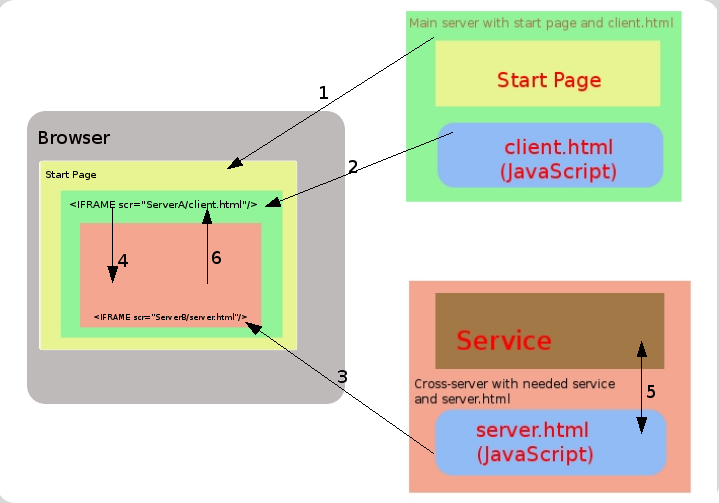
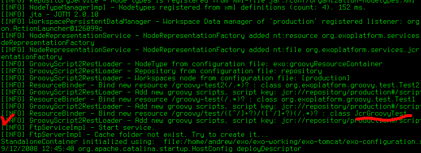
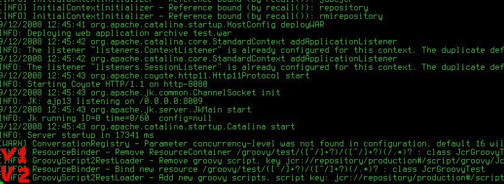
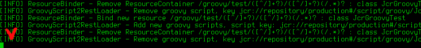
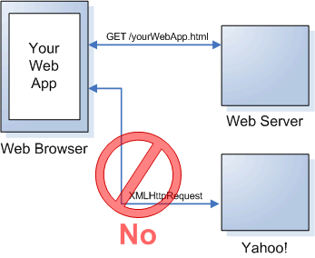

.. _eXo_Web_Services:

#################
eXo Web Services
#################

    The Web Services module allows eXo technology to integrate with
    external products and services.

    It is implementation of API for RESTful Web Services with
    extensions, Servlet and cross-domain AJAX web-frameworks and
    JavaBean-JSON transformer.

    You will have a comprehensive knowledge of eXo Web Services via the
    following topics:

    -  :ref:`Introduction to Representational State Transfer (REST) <WS.Introduction>`

       Common knowledge of REST.

    -  :ref:`Overwriting default providers <WS.OverwritingDefaultProviders>`

       Instructions on how to overwrite the default providers in the eXo
       JAX-RS implementation.

    -  :ref:`Rest Services List <WS.RestServicesList>`

       Instructions on how to get the list of services in the HTML and
       JSON formats.

    -  :ref:`Groovy scripts as REST services <WS.GroovyScripts>`

       Instructions on how to use Groovy scripts as REST services via
       the main content, such as loading script and saving it in JCR,
       instantiation, deploying newly created class as RESTful service,
       script lifecycle management, getting node UUID example, and
       Groovy script restrictions.

    -  :ref:`Framework for cross-domain AJAX <WS.CrossDomainAJAX>`

       Instructions on how to use a framework to cross-domain AJAX
       provided by eXo Web Services.

.. _WS.Introduction:

======================================================
Introduction to Representational State Transfer (REST)
======================================================

``Representational State Transfer (REST)`` is a style of software
architecture for distributed hypermedia systems, such as World Wide Web.
The term was introduced in the doctoral dissertation in 2000 by Roy
Fielding, one of the principal authors of the Hypertext Transfer
Protocol (HTTP) specification, and has come into widespread use in the
networking community.

REST strictly refers to a collection of network architecture principles
that outline how resources are defined and addressed. The term is often
used in a looser sense to describe any simple interface that transmits
domain-specific data over HTTP without an additional messaging layer,
such as SOAP or session tracking via HTTP cookies.

The key abstraction of information in REST is a ``resource``. Any
information that can be named can be a resource: a document or image, a
temporal service (e.g. "today's weather in Los Angeles"), a collection
of other resources, a non-virtual object (e.g. a person), and so on. In
other words, any concept that might be the target of an author's
hypertext reference must fit within the definition of a resource. A
resource is a conceptual mapping to a set of entities, not the entity
that corresponds to the mapping at any particular point in time.

REST uses a ``resource identifier ``\ to identify the particular
resource involved in an interaction between components. REST connectors
provide a generic interface for accessing and manipulating the value set
of a resource, regardless of how the membership function is defined or
the type of software that is handling the request. URL or URN are the
examples of a resource identifier.

REST components perform actions with a resource by using a
``representation`` to capture the current or intended state of that
resource and transferring that representation between components. A
representation is a sequence of bytes, plus ``representation
    metadata ``\ to describe those bytes. Other commonly used but less
precise names for a representation include: ``document, file, and
    HTTP message entity, instance, or variant``. A representation
consists of data, metadata describing the data, and, on occasion,
metadata to describe the metadata (usually for the purpose of verifying
message integrity). Metadata are in the form of **name-value** pairs,
where the name corresponds to a standard that defines the value's
structure and semantics. The data format of a representation is known as
a media type.

+---------------------------+-----------------------------------------------------------+
| Data Element              | Modern Web Examples                                       |
+===========================+===========================================================+
| resource                  | the intended conceptual target of a hypertext reference   |
+---------------------------+-----------------------------------------------------------+
| resource identifier       | URL, URN                                                  |
+---------------------------+-----------------------------------------------------------+
| representation            | HTML document, JPEG image                                 |
+---------------------------+-----------------------------------------------------------+
| representation metadata   | media type, last-modified time                            |
+---------------------------+-----------------------------------------------------------+
| resource metadata         | source link, alternates, vary                             |
+---------------------------+-----------------------------------------------------------+
| control data              | if-modified-since, cache-control                          |
+---------------------------+-----------------------------------------------------------+

Table: REST Data Elements

REST uses various ``connector`` types to encapsulate the activities of
accessing resources and transferring resource representations. The
connectors present an abstract interface for component communication,
enhancing simplicity by providing a complete separation of concepts and
hiding the underlying implementation of resources and communication
mechanisms.

+-------------+---------------------------------------+
| Connector   | Modern Web Examples                   |
+=============+=======================================+
| client      | libwww, libwww-perl                   |
+-------------+---------------------------------------+
| server      | libwww, Apache API, NSAPI             |
+-------------+---------------------------------------+
| cache       | browser cache, Akamai cache network   |
+-------------+---------------------------------------+
| resolver    | bind (DNS lookup library)             |
+-------------+---------------------------------------+
| tunnel      | SOCKS, SSL after HTTP CONNECT         |
+-------------+---------------------------------------+

Table: REST Connectors

The primary connector types are client and server. The essential
difference between the two is that a client initiates communication by
making a request, whereas a server listens to connections and responds
to requests to supply access to its services. A component may include
both client and server connectors.

An important part of RESTful architecture is a well-defined interface to
communicate. In particular, it is a set of HTTP methods, such as POST,
GET, PUT and DELETE. These methods are often compared with the CREATE,
READ, UPDATE, DELETE (CRUD) operations associated with database
technologies. An analogy can also be made:

-  PUT is analogous to CREATE or PASTE OVER,

-  GET to READ or COPY,

-  POST to UPDATE or PASTE AFTER, and

-  DELETE to DELETE or CUT.

.. note:: The RESTful architecture is not limited to those methods, one good example of extension is the WebDAV protocol.

The ``CRUD`` (Create, Read, Update and Delete) verbs are designed to
operate with atomic data within context of a database transaction. REST
is designed around the atomic transfer of a more complex state and can
be viewed as a mechanism for transferring structured information from
one application to another.

HTTP separates notions of a web server and a web browser. This allows
the implementation of each to vary from the other based on the
client/server principle. When being used RESTfully, HTTP is
``stateless``. Each message contains all information necessary to
understand the request.

As a result, neither the client nor the server needs to remember any
communication-state between messages. Any state retained by the server
must be modeled as a resource.

You should read `Oracle Documentation <http://docs.oracle.com/javaee/6/tutorial/doc/giepu.html>`__
for more knowledge about REST.

.. _WS.OverwritingDefaultProviders:

=============================
Overwriting default providers
=============================

This section will show you how to overwrite the default providers in eXo
JAX-RS implementation.

There is set of providers embedded in eXo JAX-RS implementation.

Implementations of MessageBodyReader and MessageBodyWriters are taking
care about serialization/deserialization of message body (HTTP
request/response's body).

The next set of media and Java types are processed automatically, thanks
to embedded Readers (Writers).

+----------------------------------------------------+---------------------------------------------------------------------------------------------------------------------------------------------------------------------------+
| Media Type                                         | Java Type                                                                                                                                                                 |
+====================================================+===========================================================================================================================================================================+
| \*/\*                                              | byte[]                                                                                                                                                                    |
+----------------------------------------------------+---------------------------------------------------------------------------------------------------------------------------------------------------------------------------+
| \*/\*                                              | javax.activation.DataSource                                                                                                                                               |
+----------------------------------------------------+---------------------------------------------------------------------------------------------------------------------------------------------------------------------------+
| \*/\*                                              | java.io.File                                                                                                                                                              |
+----------------------------------------------------+---------------------------------------------------------------------------------------------------------------------------------------------------------------------------+
| \*/\*                                              | java.io.InputStream                                                                                                                                                       |
+----------------------------------------------------+---------------------------------------------------------------------------------------------------------------------------------------------------------------------------+
| \*/\*                                              | java.io.Reader                                                                                                                                                            |
+----------------------------------------------------+---------------------------------------------------------------------------------------------------------------------------------------------------------------------------+
| \*/\*                                              | java.lang.String                                                                                                                                                          |
+----------------------------------------------------+---------------------------------------------------------------------------------------------------------------------------------------------------------------------------+
| \*/\*                                              | javax.ws.rs.core.StreamingOutput (Writer ONLY)                                                                                                                            |
+----------------------------------------------------+---------------------------------------------------------------------------------------------------------------------------------------------------------------------------+
| application/json                                   | 1. Object with simple constructor + get/set methods; 2. Java Collection (java.uitl.List<T>, java.uitl.Set<T>, java.util.Map<String, T>, etc) where T as described in 1.   |
+----------------------------------------------------+---------------------------------------------------------------------------------------------------------------------------------------------------------------------------+
| application/x-www-form-urlencoded                  | javax.ws.rs.core.MultivaluedMap<String, String>                                                                                                                           |
+----------------------------------------------------+---------------------------------------------------------------------------------------------------------------------------------------------------------------------------+
| multipart/\*                                       | java.util.Iterator<org.apache.commons.fileupload.FileItem>                                                                                                                |
+----------------------------------------------------+---------------------------------------------------------------------------------------------------------------------------------------------------------------------------+
| application/xml, application/xhtml+xml, text/xml   | javax.xml.bind.JAXBElement                                                                                                                                                |
+----------------------------------------------------+---------------------------------------------------------------------------------------------------------------------------------------------------------------------------+
| application/xml, application/xhtml+xml, text/xml   | Object with JAXB annotations                                                                                                                                              |
+----------------------------------------------------+---------------------------------------------------------------------------------------------------------------------------------------------------------------------------+
| application/xml, application/xhtml+xml, text/xml   | javax.xml.transform.stream.StreamSource                                                                                                                                   |
+----------------------------------------------------+---------------------------------------------------------------------------------------------------------------------------------------------------------------------------+
| application/xml, application/xhtml+xml, text/xml   | javax.xml.transform.sax.SAXSource                                                                                                                                         |
+----------------------------------------------------+---------------------------------------------------------------------------------------------------------------------------------------------------------------------------+
| application/xml, application/xhtml+xml, text/xml   | javax.xml.transform.dom.DOMSource                                                                                                                                         |
+----------------------------------------------------+---------------------------------------------------------------------------------------------------------------------------------------------------------------------------+

Table: Embedded Reader and Writers of message body

In some cases, it may be required to use alternative provider for the
same media and Java type, but such changes must not impact to any other
services.

To overwrite default JAX-RS provider(s):

1. Deploy your own RESTful service(s) by using the subclass of
   **javax.ws.rs.core.Application** (hereinafter Application).

2. Your service does NOT NEED to implement the marker interface
   ResourceContainer and MUST NOT be configured as component of eXo
   Container. Instead, Application must be configured as component of
   eXo Container.

3. If RESTful services or providers require some dependencies from eXo
   Container, Application should inject it by own constructor and then
   delegate to services or providers. As an alternative method,
   **getClasses()** may be used for delivering services/providers
   classes instead of instances. In this case, services/providers will
   work in the per-request mode and RESTful framework will take care
   about resolving dependencies.

The following example shows how to use the Jackson JSON provider instead
of embedding in the eXo RESTful framework.

Create the subclass of **javax.ws.rs.core.Application** with code as
bellow and add it to the eXo Container configuration.

.. code:: java

    package org.exoplatform.test.jackson;

    import org.codehaus.jackson.jaxrs.JacksonJaxbJsonProvider;

    import java.util.HashSet;
    import java.util.Set;

    import javax.ws.rs.core.Application;

    public class Application1 extends Application
    {
       @Override
       public Set<Class<?>> getClasses()
       {
          Set<Class<?>> cls = new HashSet<Class<?>>(1);
          cls.add(Resource1.class);
          return cls;
       }

       @Override
       public Set<Object> getSingletons()
       {
          Set<Object> objs = new HashSet<Object>(1);
          objs.add(new JacksonJaxbJsonProvider());
          return objs;
       }
    }

In this example, it is assumed that Resource1 is Java class that carries
JAX-RS annotations and uses JSON. In this case, the RESTful framework
will use **JacksonJaxbJsonProvider** for serializing/deserializing all
messages to/from Resource1. But it will not impact other services.

.. _WS.RestServicesList:

==================
Rest Services List
==================

The **RestServicesList** service provides information about REST
services deployed to the application server.

-  Path - Path to the service.

-  Regex - Service's URL regular expression.

-  FQN - The full qualified name of service's class.

The list can be provided in two formats: HTML and JSON.

.. note:: The class does not implement
          **org.exoplatform.services.rest.resource.ResourceContainer** and
          must never be bound to the RESTful framework by using eXoContainer.
          This service must work as per-request resource.
          
**HTML format**

To get the list of services in HTML format, use the **listHTML()**
method:

.. code:: java

    @GET
    @Produces({MediaType.TEXT_HTML})
    public byte[] listHTML()
    {
       ...
    }  

To do this, perform a simple GET request to the **RestServicesList**
link.

For example, the ``curl -u root:exo http://localhost:8080/rest/``
command will return such HTML code:

.. code:: html

    <!DOCTYPE html PUBLIC "-//W3C//DTD XHTML 1.0 Strict//EN" >
    <html>
       <head>
          <title>eXo JAXRS Implementation</title>
       </head>
       <body>
          <h3 style="text-align:center;">Root resources</h3>
          <table   width="90%"   style="table-layout:fixed;">
             <tr>
                <th>Path</th>
                <th>Regex</th>
                <th>FQN</th>
             </tr>
             <tr>
                <td>script/groovy</td>
                <td>/script/groovy(/.*)?</td>
                <td>org.exoplatform.services.jcr.ext.script.groovy.GroovyScript2RestLoader</td>
             </tr>
             <tr>
                <td>/lnkproducer/</td>
                <td>/lnkproducer(/.*)?</td>
                <td>org.exoplatform.services.jcr.webdav.lnkproducer.LnkProducer</td>
             </tr>
             <tr>
                <td>/registry/</td>
                <td>/registry(/.*)?</td>
                <td>org.exoplatform.services.jcr.ext.registry.RESTRegistryService</td>
             </tr>
             <tr>
                <td>/jcr</td>
                <td>/jcr(/.*)?</td>
                <td>org.exoplatform.services.jcr.webdav.WebDavServiceImpl</td>
             </tr>
             <tr>
                <td>/</td>
                <td>(/.*)?</td>
                <td>org.exoplatform.services.rest.ext.service.RestServicesList</td>
             </tr>
          </table>
       </body>
    </html>

If you perform the same request with your browser, you will see the
table with the list of deployed services like this:

+-----------------+-------------------------+------------------------------------------------------------------------------+
| Path            | Regex                   | FQN                                                                          |
+=================+=========================+==============================================================================+
| script/groovy   | /script/groovy(/.\*)?   | ``org.exoplatform.services.jcr.ext.script.groovy.GroovyScript2RestLoader``   |
+-----------------+-------------------------+------------------------------------------------------------------------------+
| /lnkproducer/   | /lnkproducer(/.\*)?     | ``org.exoplatform.services.jcr.webdav.lnkproducer.LnkProducer``              |
+-----------------+-------------------------+------------------------------------------------------------------------------+
| /registry/      | /registry(/.\*)?        | ``org.exoplatform.services.jcr.ext.registry.RESTRegistryService``            |
+-----------------+-------------------------+------------------------------------------------------------------------------+
| /jcr            | /jcr(/.\*)?             | ``org.exoplatform.services.jcr.webdav.WebDavServiceImpl``                    |
+-----------------+-------------------------+------------------------------------------------------------------------------+
| /               | (/.\*)?                 | ``org.exoplatform.services.rest.ext.service.RestServicesList``               |
+-----------------+-------------------------+------------------------------------------------------------------------------+

**JSON format**

To get the list of services in HTML format, use the **listJSON()**
method:

.. code:: java

    @GET
    @Produces({MediaType.APPLICATION_JSON})
    public RootResourcesList listJSON()
    {
       ...
    }

To do this, add the "Accept:application/json" header to your GET
request.

For example, the ``curl -u root:exo http://localhost:8080/rest/ -H
      "Accept:application/json"`` command will return such JSON:

::

    {"rootResources":[
       {
          "fqn":"org.exoplatform.services.jcr.ext.script.groovy.GroovyScript2RestLoader",
          "regex":"/script/groovy(/.*)?",
          "path":"script/groovy"
       },
       {
          "fqn":"org.exoplatform.services.jcr.webdav.lnkproducer.LnkProducer",
          "regex":"/lnkproducer(/.*)?",
          "path":"/lnkproducer/"
       },
       {
          "fqn":"org.exoplatform.services.jcr.ext.registry.RESTRegistryService",
          "regex":"/registry(/.*)?",
          "path":"/registry/"
       },
       {
          "fqn":"org.exoplatform.services.jcr.webdav.WebDavServiceImpl",
          "regex":"/jcr(/.*)?",
          "path":"/jcr"
       },
       {
          "fqn":"org.exoplatform.services.rest.ext.service.RestServicesList",
          "regex":"(/.*)?",
          "path":"/"
       }
    ]}

.. _WS.GroovyScripts:

===============================
Groovy scripts as REST services
===============================

This section describes how to use Groovy scripts as REST services via
the following topics:

-  :ref:`Loading and saving script in JCR <WS.GroovyScripts.LoadingScriptAndSavingInJCR>`

-  :ref:`Instantiation <WS.GroovyScripts.Instantiation>`

-  :ref:`Auto re-deploying <WS.GroovyScripts.RedeployingScriptOnSourceCodeChange>`

-  :ref:`Script lifecycle management <WS.GroovyScripts.ScriptLifecycleManagement>`

-  :ref:`Getting node UUID example <WS.GroovyScripts.GettingNodeUUIDExample>`

In this section, the RESTful service is considered to be compatible with
the JSR-311 specification.

.. _Loading and saving script in JCR <WS.GroovyScripts.LoadingScriptAndSavingInJCR:

Loading and saving script in JCR
~~~~~~~~~~~~~~~~~~~~~~~~~~~~~~~~~~

There are two ways to save a script in JCR. The first way is to save it
at server startup time by using ``configuration.xml`` and the second way
is to upload the script via HTTP.

.. _LoadingScriptAtStartupTime:

**Loading script at startup time**

This way can be used for loading prepared scripts. To use this way, you
need to configure
**org.exoplatform.services.jcr.ext.script.groovy.GroovyScript2RestLoaderPlugin**.
See the simple configuration example below.

.. code:: xml

    <external-component-plugins>
      <target-component>org.exoplatform.services.jcr.ext.script.groovy.GroovyScript2RestLoader</target-component>
      <component-plugin>
        <name>test</name>
        <set-method>addPlugin</set-method>
        <type>org.exoplatform.services.jcr.ext.script.groovy.GroovyScript2RestLoaderPlugin</type>
        <init-params>
          <value-param>
            <name>repository</name>
            <value>repository</value>
          </value-param>
          <value-param>
            <name>workspace</name>
            <value>production</value>
          </value-param>
          <value-param>
            <name>node</name>
            <value>/script/groovy</value>
          </value-param>
          <properties-param>
            <name>JcrGroovyTest.groovy</name>
            <property name="autoload" value="true" />
            <property name="path" value="file:/home/andrew/JcrGroovyTest.groovy" />
          </properties-param>
        </init-params>
      </component-plugin>
    </external-component-plugins>

-  The first value-param sets JCR repository.

-  The second value-param sets workspace.

-  The third one sets JCR node where scripts from plugin will be stored.

If the specified node does not exist, it will be created. The list of
scripts is set by **properties-params**. Name of each properties-param
will be used as node name for stored script. The **autoload** property
deploys this script at startup time, and the **path** property sets the
source of script to be loaded. In this example, the single script is
loaded from the local file: ``/home/andrew/JcrGroovyTest.groovy``.

**Loading script via HTTP**

This is sample of HTTP requests. In this example, the script is loaded
from the ``test.groovy`` file.

::

    andrew@ossl:~> curl -u root:exo \
    -X POST \
    -H 'Content-type:script/groovy' \
    --data-binary @test.groovy \
    http://localhost:8080/rest/script/groovy/add/repository/production/script/groovy/test.groovy

This example imitates sending data with the HTML form
('**multipart/form-data**'). The **autoload** parameter is optional. If
the **autoload** parameter is set to "true" (**autoload=true**), the
script will be instantiated and deployed immediately.

::

    andrew@ossl:~> curl -u root:exo \
    -X POST \
    -F "file=@test.groovy;name=test" \
    -F "autoload=true" \
    http://localhost:8080/rest/script/groovy/add/repository/production/script/groovy/test1.groovy

.. _WS.GroovyScripts.Instantiation:

Instantiation
~~~~~~~~~~~~~~

**org.exoplatform.services.script.groovy.GroovyScriptInstantiator** is
part of the **exo.core.component.script.groovy** project.
**GroovyScriptInstantiator** can load script from specified URL and
parse stream that contains Groovy source code. It has possibility of
injecting the component from Container in the Groovy Class constructor.
See the configuration example:

.. code:: xml

    <component>
      <type>org.exoplatform.services.script.groovy.GroovyScriptInstantiator</type>
    </component>

.. note:: You should keep one class per one Groovy file. This is the same for
		  interface and its implementation. However, the Groovy parser is
		  limited that does not have the **Class[] parseClass(InputStream)**
		  or **Collection parseClass(InputStream)** type but only **Class
		  parseClass(InputStream)** instead.

.. _WS.GroovyScripts.RedeployingScriptOnSourceCodeChange:

Auto re-deploying
~~~~~~~~~~~~~~~~~~

As described in previous sections, **GroovyScript2RestLoader** can be
configured to deploy the scripts automatically at server startup time.

It can also be configured to detect if source code of a deployed script
has changed and re-deploy it. Once again, it works on the scripts that
have **exo:autoload** property set to "true".

Example of configuration:

.. code:: xml

    <component>
        <type>org.exoplatform.services.jcr.ext.script.groovy.GroovyScript2RestLoader</type>
        <init-params>
          <object-param>
            <name>observation.config</name>
            <object type="org.exoplatform.services.jcr.ext.script.groovy.ObservationListenerConfiguration">
              <field name="repository">
                <string>repository</string>
              </field>
              <field name="workspaces">
                <collection type="java.util.ArrayList">
                  <value>
                    <string>production</string>
                  </value>
                </collection>
              </field>
            </object>
          </object-param>
        </init-params>
    </component>

In the example above, the JCR workspace "production" will be checked for
autoload scripts. At once, this workspace will listen to changes in the
script's source code (**jcr:data** property).

.. _WS.GroovyScripts.ScriptLifecycleManagement:

Script lifecycle management
~~~~~~~~~~~~~~~~~~~~~~~~~~~~

If **GroovyScript2RestLoader** is configured as described in the
previous section, all "autoload" scripts will be deployed. In the first
section, the script from ``/home/andrew/JcrGroovyTest.groovy`` is copied
to the JCR node: ``/script/groovy/JcrGroovyTest.groovy`` - repository
"repository" and workspace "production". Similarly to `Loading a script
via HTTP <#LoadingScriptViaHTTP>`__, you can use **curl commands** to
manage the script lifecycle.

1. Undeploy the script, which is already deployed:

   ::

		andrew@ossl:~> curl -u root:exo \
		-X GET \
		http://localhost:8080/rest/script/groovy/load/repository/production/script/groovy/JcrGroovyTest.groovy?state=false

2. Deploy it again:

   ::

		andrew@ossl:~> curl -u root:exo \
		-X GET \
		http://localhost:8080/rest/script/groovy/load/repository/production/script/groovy/JcrGroovyTest.groovy?state=true

   Or more simple:

   ::

		andrew@ossl:~> curl -u root:exo \
		-X GET \
		http://localhost:8080/rest/script/groovy/load/repository/production/script/groovy/JcrGroovyTest.groovy

3. Disable the scripts autoloading:

   .. note:: This does not change the current state.

   ::

		andrew@ossl:~> curl -u root:exo \
		-X GET \
		http://localhost:8080/rest/script/groovy/repository/production/script/groovy/JcrGroovyTest.groovy/autoload?state=false

4. Enable it again:

   ::

		andrew@ossl:~> curl -u root:exo \
		-X GET \
		http://localhost:8080/rest/script/groovy/autoload/repository/production/script/groovy/JcrGroovyTest.groovy?state=true

   Or more simpe:

   ::

		andrew@ossl:~> curl -u root:exo \
		-X GET \
		http://localhost:8080/rest/script/groovy/autoload/repository/production/script/groovy/JcrGroovyTest.groovy

5. Change the script source code:

   ::

		andrew@ossl:~> curl -u root:exo \
		-X POST \
		-H 'Content-type:script/groovy' \
		--data-binary @JcrGroovyTest.groovy \
		http://localhost:8080/rest/script/groovy/update/repository/production/script/groovy/JcrGroovyTest.groovy

   This example imitates sending data with HTML form ('**multipart/form-data**'):

   ::

		andrew@ossl:~> curl -u root:exo \
		-X POST \
		-F "file=@JcrGroovyTest.groovy;name=test" \
		http://localhost:8080/rest/script/groovy/update/repository/production/script/groovy/JcrGroovyTest.groovy

6. Remove script from JCR:

   ::

		andrew@ossl:~> curl -u root:exo \
		-X GET \
		http://localhost:8080/rest/script/groovy/delete/repository/production/script/groovy/JcrGroovyTest.groovy

.. _WS.GroovyScripts.GettingNodeUUIDExample:

Getting node UUID example
~~~~~~~~~~~~~~~~~~~~~~~~~~~

Now you are going to try a simple example of Groovy RESTfull service.
There is one limitation to your Groovy script that you should use Java
style code and decline to use dynamic types anywhere except in private
methods and fields.

1. Create a script with the following code and save it to your home
   directory: ``/home/andrew/JcrGroovyTest.groovy``.

   .. code:: java

				import javax.jcr.Node
				import javax.jcr.Session
				import javax.ws.rs.GET
				import javax.ws.rs.Path
				import javax.ws.rs.PathParam
				import org.exoplatform.services.jcr.RepositoryService
				import org.exoplatform.services.jcr.ext.app.ThreadLocalSessionProviderService

				@Path("groovy/test/{repository}/{workspace}")
				public class JcrGroovyTest {
				  private RepositoryService                 repositoryService
				  private ThreadLocalSessionProviderService sessionProviderService

				  public JcrGroovyTest(RepositoryService repositoryService,
									   ThreadLocalSessionProviderService sessionProviderService) {
					this.repositoryService = repositoryService
					this.sessionProviderService = sessionProviderService
				  }

				  @GET
				  @Path("{path:.*}")
				  public String nodeUUID(@PathParam("repository") String repository,
										 @PathParam("workspace") String workspace,
										 @PathParam("path") String path) {
					Session ses = null
					try {
					  ses = sessionProviderService.getSessionProvider(null).getSession(workspace, repositoryService.getRepository(repository))
					  Node node = (Node) ses.getItem("/" + path)
					  return node.getUUID() + "\n"
					} finally {
					  if (ses != null)
						ses.logout()
					}
				  }

2. Configure **GroovyScript2RestLoaderPlugin** as described in 
   :ref:`Loading script at startup time <LoadingScriptAtStartupTime>`, 
   then start the server. If configuration is correct and script does not 
   have syntax error, you should see the service is deployed:

   |image0|

3. Create a folder 'test' in the repository "production" via WebDAV. Now,
   you can try to access this service. Open another console and type
   command:

   ::

		andrew@ossl:~> curl -u root:exo \
		http://localhost:8080/rest/groovy/test/repository/production/test

   At this time it should have exception, because the JCR node "/test" is
   not referenceable and has not UUID. You will fix it in next steps by
   adding the mixin **mix:referenceable**.

4. Open the script from local source code:
   ``/home/andrew/JcrGroovyTest.groovy``, then add the following code and
   save:

   .. code:: java

				@POST
				@Path("{path:.*}")
				public void addReferenceableMixin(@PathParam("repository") String repository,
				@PathParam("workspace") String workspace,
				@PathParam("path") String path) {
				Session ses = null
				try {
				ses = sessionProviderService.getSessionProvider(null).getSession(workspace, repositoryService.getRepository(repository))
				Node node = (Node) ses.getItem("/" + path)
				node.addMixin("mix:referenceable")
				ses.save()
				} finally {
				if (ses != null)
				ses.logout()
				}
				}

5. Upload the new source code to the server by the following command:

   ::

		andrew@ossl:~> curl -i -v -u root:exo \
		-X POST \
		--data-binary @JcrGroovyTest.groovy \
		-H 'Content-type:script/groovy' \
		http://localhost:8080/rest/script/groovy/update/repository/production/script/groovy/JcrGroovyTest.groovy

   The ``/script/groovy/JcrGroovyTest.groovy`` node has the
   **exo:autoload=true** property, so the script will be re-deployed
   automatically and you will see:

   |image1|

6. Access the newly created method by the command:

   ::

		andrew@ossl:~> curl -u root:exo \
		-X POST \
		http://localhost:8080/rest/groovy/test/repository/production/test

   The method should run quietly, without any logs. Now, get the UUID node:

   ::

		andrew@ossl:~> curl -u root:exo \
		http://localhost:8080/rest/groovy/test/repository/production/test
		1b8c88d37f0000020084433d3af4941f

   The UUID node: 1b8c88d37f0000020084433d3af4941f

7. You do not need this script any more, so remove it from JCR:

   ::

		andrew@ossl:~> curl -u root:exo \
		http://localhost:8080/rest/script/groovy/delete/repository/production/script/groovy/JcrGroovyTest.groovy

   |image2|
   
.. _WS.CrossDomainAJAX:   
   
===============================
Framework for cross-domain AJAX
===============================

eXo Web Service provides a framework to cross-domain AJAX. This section
shows you how to use this framework.

You can checkout the source code at
https://github.com/exoplatform/ws/tree/master/exo.ws.frameworks.javascript.cross-domain-ajax.

**Motivation**

The **XmlHttpRequest** objects are bound by the same origin security
policy of browsers, which prevents a page from accessing data from
another server. This has put a serious limitation on the AJAX
developers. That is, you can use **XmlHttpRequests** to make background
calls to a server, but it has to be the same server that served up the
current page. Visit
http://www.mozilla.org/projects/security/components/same-origin.html for
more details.

|image3|

But actually, writing client web applications that use this object can
be tricky given restrictions imposed by web browsers on network
connections across domains. So you need to find the way to bypass this
limitation of AJAX.

**Working scheme**

To describe the method for the cross-domain AJAX solution, consider the
following scheme that contains 3 components:

1. User agent (a browser).

2. ServerA contains a main page with dedicated client and server IFRAMEs
(see below) and an HTML client page (``client.html``) referenced from
the IFRAME client. This client page contains the dedicated script to
push data for request into the IFRAME server.

3. ServerB contains remote service that wants to get access to and an
HTML server page (``server.html``) referenced from the IFRAME server.
This server page contains a dedicated script to push the requested data
into the IFRAME client.

|image4|

**Working sequence**

1. A browser requests the Start page from ServerA, so the Start page is
retrieved from ServerA.

2. Create one IFRAME element ("client iframe") in the Start page IFRAME
and insert it in the document from ServerA (``client.html``).

3. In "client iframe", create one IFRAME element ("server iframe") and
insert it in the document from ServerB (``server.html``). Documents
(``client.html`` and ``server.html``) contain special script that can
transfer data between iframes.

4. "Client iframe" transfers information about HTTP method and URL that
you want to do cross-domain request to "server iframe".

5. "Server iframe" does simple **XmlHttpRequest** to the service that
you need (it can do that because it downloads from the same domain) and
gets information from service.

6. "Server iframe" transfers data to "client iframe" and now you get
information that you want.

**How to use?**

1. Place the ``client.html`` and ``xda.js`` files in ServerA.

2. Place the ``server.html`` file in ServerB.

3. Declare ``xda.js`` in the main page:
   ````.

4. Create the JS function which performs cross domain call as in the
   following example:

   .. code:: html

				

5. Use this function (here it is bound to a button's onclick event):
   ``<button onclick='test()'>test cross-domain</button>``.

   

