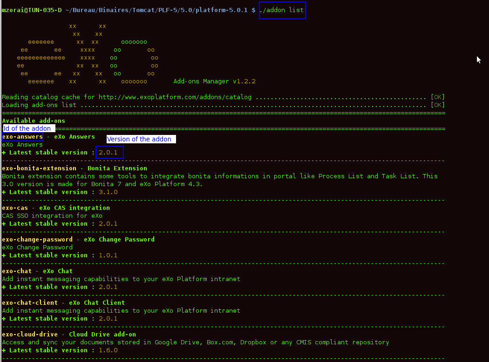
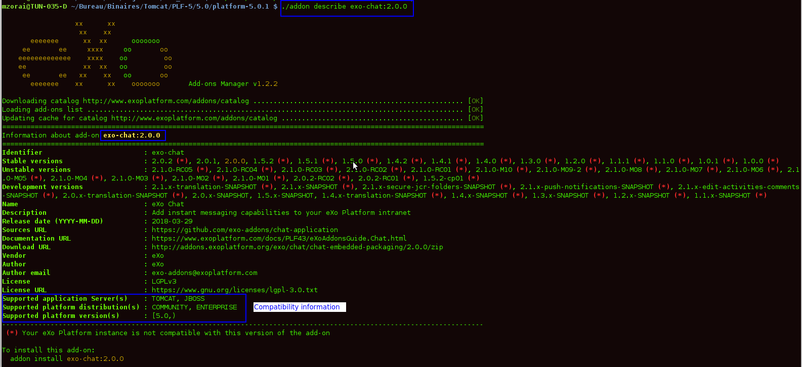
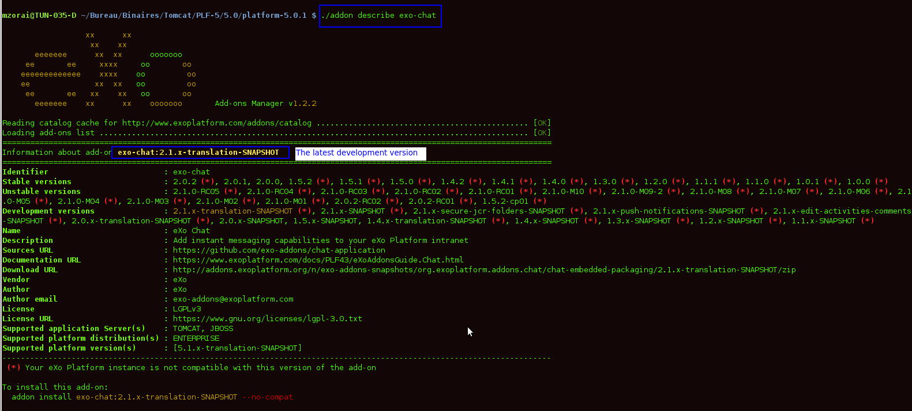
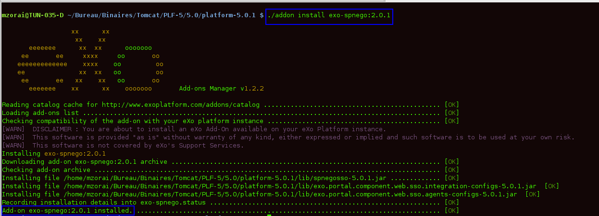
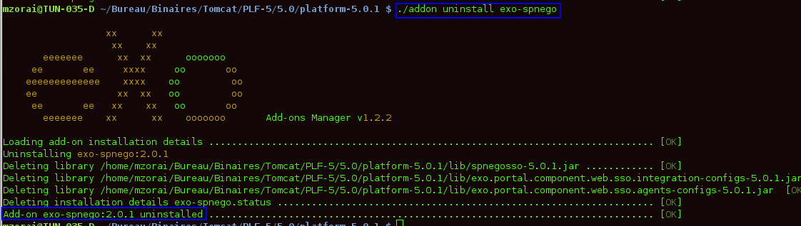

.. _eXo_addons:

##################
Add-ons Management
##################

    An add-on could be a set of extensions, customizations, xml
    configurations, applications, templates or any new services packaged
    in a zip archive. In other words, an add-on could be whatever that
    extends eXo Platform capabilities by adding services, resources, and
    more.

    The easiest way to manage add-ons is to use the eXo Add-ons Manager
    that is shipped by default in all 4.3 editions. The eXo Add-ons
    Manager defines a standard approach of packaging,
    installing/uninstalling and updating the available add-ons. With the
    eXo Add-ons Manager, you, as administrators, can enhance your
    management of the add-ons installed on the eXo Platform instances via the
    Command Line Interface (known as CLI), in a simple manner.

    Basically, start with the launch scripts:

    -  ``$PLATFORM_HOME/addon`` (Windows, Linux / Mac OX)

    -  ``$PLATFORM_HOME/addon.bat`` (Windows)

    When running the ``addon`` script only, you can view different sets
    of commands, arguments and options. The global syntax is in the
    format ``addon [command] [arguments] [options]``, where:

    -  [command] is either of: *list, install, uninstall, describe*.

    -  [arguments] are ones specific to an add-on (Id and version).

    -  [options] are switch options that can be global or specific to
       the command (started with **--** or **-**).

    Also, you could add the following useful options:

    -  ``--help / -h`` - Views all the needed information of the command
       line program.

    -  ``--verbose / -v`` - Prints the verbose log for
       debugging/diagnostic purpose.

    By walking through the following topics in this chapter, you will
    know how to manage add-ons in eXo Platform via the CLI:

    -  :ref:`Listing add-ons <AddonsManagement.Listing>`

    -  :ref:`Describing add-ons <AddonsManagement.Describing>`

    -  :ref:`Installing/Uninstalling add-ons <AddonsManagement.InstallingUninstalling>`

    -  :ref:`Installing/Uninstalling add-ons in a docker container <AddonsManagement.InstallingUninstallingInDocker>`

.. _AddonsManagement.Listing:

===============
Listing add-ons
===============

Use the ``list`` command to view add-ons of the catalog and their needed
information (Id and versions).

::

    addon list [--snapshots] [--unstable] [--installed] [--outdated] [--catalog=$URL] [--no-cache] [--offline] [--verbose] [--batch-mode]

|image0|

With the ``addon list`` command (without any options), only add-ons that
have **at least one stable version** are displayed. And for each listed
add-on, only **the last stable version** is displayed.

Also, add the following options:

 - ``--snapshots``: Displays add-ons that have stable or development versions. For each listed add-on, only the last stable and the last development versions are displayed.                                         

 - ``--unstable``: Displays add-ons that have stable or unstable versions. For each listed add-on, only the last stable and the last unstable versions are displayed.                                         

 - ``--installed``: Displays add-ons (including stable and development versions) that are already installed in eXo Platform.
                     		 
 - ``--outdated``: Displays stable add-ons that have newer versions than ones installed in eXo Platform - based on the `aether generic version order <http://download.eclipse.org/aether/aether-c ore/0.9.0.M2/apidocs/org/eclipse/aether/util/version/GenericVersionScheme.html>`__.                  

 - ``--no-cache``: Displays add-ons by re-downloading the `remote catalog <http://www.exoplatform.com/addons/catalog>`__.                                              

 - ``--offline``: Displays add-ons by the cached and local catalogs (without the network access).                      

 - ``--catalog=$URL``: Displays add-ons by a remote catalog URL where URL is an alternative location for the catalog (for example, http://example.org/remote.json).          

 - ``--no-compat``: Displays add-ons that ignores the compatibility check of application servers, editions and version range (corresponding to *supportedApplicationServers*, *supportedDistributions* and *compatibility* respectively in each catalog entry).               

 - ``--batch-mode``: Displays add-ons without the ASCII art logo (eXo art text displayed right after the command on the CLI).                                              

.. _AddonsManagement.Describing:

==================
Describing add-ons
==================

Use the ``describe`` command to display more information of an
individual add-on (for example, available versions, name, description,
license).

::

    addon describe addonId[:addonVersion] [--no-cache] [--offline] [--catalog=$URL] [--batch-mode]

For instance, to see information of the *exo-chat* add-on with
version 5.0.1, use this command:
``addon describe exo-chat:version``

|image1|

You will see that the add-on version is compatible with eXo Platform
Enterprise Edition 5.0.1 (both Tomcat and Jboss).

In case you do not include the *addonVersion*, the eXo Add-ons Manager
will display information of the latest development version of that
add-on:

|image2|

The usage of the other options is in the same way as the ``list``
command.

.. _AddonsManagement.InstallingUninstalling:

===============================
Installing/Uninstalling add-ons
===============================

**Installing an add-on**

Use the ``install`` command to control installation of an add-on.

::

    addon install addonId [--snapshots] [--unstable] [--force] [--no-compat] [--conflict=skip|overwrite] [--catalog=$URL] [--no-cache] [--offline] [--verbose] [--batch-mode]

Or:

::

    addon install addonId:addonVersion [--force] [--no-compat] [--conflict=skip|overwrite] [--catalog=$URL] [--no-cache] [--offline] [--verbose][--batch-mode]

|image3|

.. note:: Some eXo add-ons require the end-users to accept terms of a license
          agreement before installation. So, after clicking the ``install``
          command on the CLI, remember to hit Enter key (for several times) to
          continue, and finally type "Yes" on the CLI to accept the license
          agreement. You can get out of these interactions by adding the
          ``--batch-mode`` option that allows the complete auto-installation.

By using the ``addon install addonId`` command only, the most recent
stable version of the add-on will be installed. Before choosing a
specific version for installation you should check all related
information of this add-on by using :ref:`Describing command <AddonsManagement.Describing>`.

Also, add the following options:

+--------------------------+--------------------------------------------------+
| ``--snapshots``          | Installs the most recent development version of  |
|                          | the add-on. However, if the last stable version  |
|                          | of this add-on is more recent than the last      |
|                          | development one, the last stable one will be     |
|                          | installed.                                       |
+--------------------------+--------------------------------------------------+
| ``--unstable``           | Installs the last unstable version of the        |
|                          | add-on, based on the `aether generic version     |
|                          | order <http://download.eclipse.org/aether/aether |
|                          | -core/0.9.0.M2/apidocs/org/eclipse/aether/util/v |
|                          | ersion/GenericVersionScheme.html>`__.            |
|                          | However, if the last stable version of this      |
|                          | add-on is more recent than the last unstable     |
|                          | one, the last stable one will be installed.      |
+--------------------------+--------------------------------------------------+
| ``:addonVersion``        | Installs a specific version of the add-on.       |
+--------------------------+--------------------------------------------------+
| ``--no-compat``          | Installs the add-on that ignores the             |
|                          | compatibility check of application servers,      |
|                          | editions and version range declared in each      |
|                          | catalog entry (corresponding to                  |
|                          | *supportedApplicationServers*,                   |
|                          | *supportedDistributions* and *compatibility*     |
|                          | respectively). This option is often used when    |
|                          | you meet error messages of the compatibility     |
|                          | (for example, app server not supported,          |
|                          | distribution enterprise required, not compatible |
|                          | to {eXoplatform\_version}).                      |
+--------------------------+--------------------------------------------------+
| ``--conflict=skip|overwr | Installs the add-on that ignores the files       |
| ite``                    | conflict. This option is used when you meet an   |
|                          | error message of the aborted installation.       |
|                          |                                                  |
|                          | -  ``--conflict=skip``: The conflicted files are |
|                          |    ignored with one log for each file: "File     |
|                          |    $FILE already exists. Skipped.".              |
|                          |                                                  |
|                          | -  ``--conflict=overwrite``: The conflicted      |
|                          |    files are overwritten by the one contained in |
|                          |    the add-on with one log for each file: "File  |
|                          |    $FILE already exists. Overwritten.".          |
|                          |                                                  |                                                                           
+--------------------------+--------------------------------------------------+
| ``--offline``            | Installs the add-on that already exists in the   |
|                          | local archives without downloading. You will get |
|                          | an informational message: "Using addonId archive |
|                          | from local archives directory.".                 |
+--------------------------+--------------------------------------------------+
| ``--force``              | Enforces the reinstallation if the add-on is     |
|                          | detected to have already been installed.         |
+--------------------------+--------------------------------------------------+
| ``--catalog``,           | Uses in the same way as the ``list`` command.    |
| ``--no-cache``           |                                                  |
+--------------------------+--------------------------------------------------+

**Uninstalling an add-on**

Use the ``uninstall`` command to remove an add-on that is already
installed, regardless of its stable or development version.

::

    addon uninstall addonId [--verbose] [--batch-mode] [--conflict=overwrite]

|image4|

.. _AddonsManagement.InstallingUninstallingInDocker:

=====================================================
Installing/Uninstalling add-ons in a docker container
=====================================================

**Installing an add-on in a docker container**

To install add-ons you can use the ``-e EXO_ADDON_LIST`` option. It will
instruct docker to install a list of indicated add-ons before it starts
eXo Platform.

This command starts eXo Platform and installs the add-ons exo-tasks and
exo-answers version 1.3.x-SNAPSHOT:

::

    docker run -d \
    -p 8080:8080 \
    -e EXO_ADDONS_LIST="exo-tasks:1.3.x-SNAPSHOT,exo-answers:1.3.x-SNAPSHOT" \
    exoplatform/exo-community

Where ``EXO_ADDONS_LIST`` contains the list of add-ons that you want to
install in your eXo Platform docker container.

The execution of this command will launch the server startup in
background i.e it will not display the server log startup. To display
it, just run this command:

::

    docker logs --follow <CONTAINER_ID>

Where the CONTANIER\_ID could be known when executing this command:

::

    docker ps -a

Displaying the container logs will print the stacktrace about addons
installation:

::

    # ------------------------------------ #
    # eXo add-ons installation start ...
    # ------------------------------------ #
    # installing add-ons from EXO_ADDONS_LIST environment variable:
    eXo Add-ons Manager v1.2.0-M08
    -------------------------------------------------------------------------------
    Downloading catalog http://www.exoplatform.com/addons/catalog ............ [OK]
    Loading add-ons list ..................................................... [OK]
    Updating cache for catalog http://www.exoplatform.com/addons/catalog ..... [OK]
    Checking compatibility of the add-on with your eXo platform instance ..... [OK]
    [WARN]  DISCLAIMER : You are about to install an eXo Add-On available on your eXo Platform instance.
    [WARN]  This software is provided "as is" without warranty of any kind, either expressed or implied and such software is to be used at your own risk.
    [WARN]  This software is not covered by eXo's Support Services.
    Installing exo-tasks:1.3.x-SNAPSHOT
    Downloading add-on exo-tasks:1.3.x-SNAPSHOT archive ...................... [OK]
    Checking add-on archive .................................................. [OK]
    Installing file /opt/exo/webapps/task-management.war ..................... [OK]
    Installing file /opt/exo/lib/task-management-services.jar ................ [OK]
    Installing file /opt/exo/lib/task-management-integration.jar ............. [OK]
    Recording installation details into exo-tasks.status ..................... [OK]
    Add-on exo-tasks:1.3.x-SNAPSHOT installed. ............................... [OK]
    eXo Add-ons Manager v1.2.0-M08
    -------------------------------------------------------------------------------
    Reading catalog cache for http://www.exoplatform.com/addons/catalog ...... [OK]
    Loading add-ons list ..................................................... [OK]
    Checking compatibility of the add-on with your eXo platform instance ..... [OK]
    [WARN]  DISCLAIMER : You are about to install an eXo Add-On available on your eXo Platform instance.
    [WARN]  This software is provided "as is" without warranty of any kind, either expressed or implied and such software is to be used at your own risk.
    [WARN]  This software is not covered by eXo's Support Services.
    Installing exo-answers:1.3.x-SNAPSHOT
    Downloading add-on exo-answers:1.3.x-SNAPSHOT archive .................... [OK]
    Checking add-on archive .................................................. [OK]
    Installing file /opt/exo/lib/answers-services-1.3.x-SNAPSHOT.jar ......... [OK]
    Installing file /opt/exo/webapps/faq.war ................................. [OK]
    Installing file /opt/exo/lib/answers-plf-integration-1.3.x-SNAPSHOT.jar .. [OK]
    Installing file /opt/exo/webapps/answers-extension.war ................... [OK]
    Recording installation details into exo-answers.status ................... [OK]
    Add-on exo-answers:1.3.x-SNAPSHOT installed. ............................. [OK]
    # ------------------------------------ #
    # eXo add-ons installation done.
    # ------------------------------------ #

**Add-ons listing in a docker container**

To list the available add-ons in a running eXo Platform docker container, run
this command:

::

    docker exec <CONTAINER_ID> /opt/exo/addon list

To know the add-ons alreadly installed, you should execute this command
in a running eXo Platform container:

::

    docker exec <CONTAINER_ID> /opt/exo/addon list --installed

An example for this command output:

::

    Loading add-on details from exo-tasks.status ............................. [OK]
    Loading add-on details from exo-answers.status ........................... [OK]
    Loading add-on details from exo-es-embedded.status ....................... [OK]
    ===============================================================================
    Installed add-ons
    ===============================================================================
    exo-tasks -  eXo Tasks
    task and project management for personal and team productivity 
    + Installed version : 1.3.x-SNAPSHOT
    -------------------------------------------------------------------------------
    exo-answers - eXo Answers
    eXo Answers 
    + Installed version : 1.3.x-SNAPSHOT
    -------------------------------------------------------------------------------
    exo-es-embedded - ElasticSearch Embedded in eXo Platform
    Embed ElasticSearch into eXo Platform 
    + Installed version : 2.0.0-M08
    -------------------------------------------------------------------------------

    To uninstall an add-on:
        addon uninstall <addonId>

**Uninstalling an add-on in a docker container**

To uninstall an add-on, you should add this parameter
``EXO_ADDONS_REMOVE_LIST`` with the a comma separated list of add-ons to
uninstall:

::

    docker run -d \
    -p 8080:8080 \
    -e EXO_ADDONS_REMOVE_LIST="exo-tasks:1.3.x-SNAPSHOT,exo-answers:1.3.x-SNAPSHOT" \
    exoplatform/exo-community

