.. _webconferencing:

###################
Making Video Calls
###################

    Users can make audio or video conference calls directly from
    eXo Platform's web interface thanks to the eXo Web Conferencing add-on.
    It comes built-in with the Enterprise edition.

    Here is summary of what eXo Web conferencing allows you to do:

    -  As an end user, you can place audio or video calls with other
       users directly from the web interface

    -  As an administrator of the platform, it lets you manage and
       configure Web Conferencing via an administrative interface.

    In this chapter, we discuss how to:

:ref:`Place a call <placing-call>`

:ref:`Receive a video call <receiving-call>`

:ref:`Administrate Web Conferencing <administrating-webconf>`

.. _placing-call:

==============
Placing a call
==============

Starting from the 5.0 version of eXo Platform it is possible to make
one-to-one video calls through the Web Conferencing add-on.

.. warning:: * The video call functionality operates with the standard
				`WebRTC <https://webrtc.org/>`__ and requires modern web browsers.
			 * Web Conferencing is not supported for the browser IE11. Check the
				full list of supported web browsers in `this
				file <https://www.exoplatform.com/terms-conditions/supported-environments.pdf>`__.
			 * One-to-one video calls are not available for mobile devices.

To use the Web Conferencing functionality and make video call with
another user, you just need to click on the Call button |image0|.

The Call button is available in many places:

-  When moussing over a user's avatar in the activity stream.

   |image1|

-  When accessing a user's profile, near the user's display name.

   |image2|

-  In the chat room.

   |image3|

-  In mini chat room windows.

   |image4|

Pressing the Call button emits a call and generates a separate browser
window which displays your face if you activated your camera in your
last call. It also emits ringtone, which indicates that an outgoing call
is in progress. The ringtone stops when the callee answers the call.

|image5|

 .. note:: 1. If you are using the feature for the first time, when you press the
			Call button, the call screen appears and contains a popup asking if
			you want to allow the browser to access your microphone and camera:
			**In Firefox:**

			|image6|

			**In Chrome:**

			|image7|

		   2. To process to the call, you need to click on the Allow button.

		   3. If you press on Block or Don't Allow, the call is interrupted:

			|image8|

		   4. Video sharing and microphone settings remember your previous status.
			For example, if you have muted your microphone in a previous
			session, the call starts with sound muted. If you have unshared your
			camera, the call starts without streaming your video stream.

When starting the call i.e. after pressing the Call button, at first it
shows your camera stream, and when communication is established with
your partner, it displays their video stream (if they have enabled it).
After that, your own video stream is miniaturised on the bottom-right
corner.

The video call window contains three buttons to control the call:

-  |image9|: This allows you to mute/unmute your audio.

-  |image10|: This allows you to share/unshare your video stream.

-  |image11|: This allows you to end the video call. Clicking on this
   button terminates the call and closes the call window.

   It is also possible to terminate the call by clicking on the Close
   button |image12| of the call screen's web page.

If your callee declines the call, a a hang-up sound is played on your
local output and then the call window displays a message which indicates
that the call has been stopped.

|image13|

.. _Multiple-connectors:

Multiple connectors
~~~~~~~~~~~~~~~~~~~~~~~~~

If many connectors are installed and enabled for Web Conferencing, the
Call button will be a pulldown which allows to select which provider
that you want to use.

This pulldown **remembers your last selected settings**, and displays
these by default.

|image14|

For each call provider who needs an IM account, a new entry is added in
the IM-field pulldown of users’ profiles.

|image15|

.. _receiving-call:

================
Receiving a call
================

When someone calls you and your chat status is "Available" or "Away",
you will hear a ringtone indicating an incoming call and you will also
receive a notification window no matter which page of the PRODUCT portal
you are on.

|image16|

The notification window appears in the bottom right of your screen and
contains:

-  The caller's avatar.

-  A message which states, "[the user's display name]" is calling you,
   where the user's display name is the full name of the caller.

-  Two buttons, "Answer" and "Decline".

When you click on the Answer button, you accept the call and it opens
the call window which displays your camera stream. While the connection
is established, it also displays your caller's camera stream and your
own camera stream is miniaturised in the bottom-right corner.

When you click on the Decline button, you refuse the call and it
dismisses the incoming popover.

   .. note:: 1. Clicking on the Close button |image17| of the notification window allows you to also decline the call.

			 2. The same stands for :ref:`Placing a call <MakingVideoCalls>`, the camera and microphone settings remember previous status.

.. _administrating-webconf:

===============================
Administrating Web Conferencing
===============================

The Web Conferencing add-on comes with an administrative interface which
allows administrators to enable/disable providers and configure
settings.

|image18|

.. note:: In the previous illustration, multiple providers are available,
			which is not the case in the standard Web Conferencing add-on that
			comes built-in with eXo Platform. In standard distributions, only WebRTC
			connector is available. Other providers will be available on
			different add-ons, but they are not supported.

To access the administration page:

-  You should be part of the group **platform/administrators**.

-  Click |image19| --> Web Conferencing on the top navigation bar.

|image20|

To enable or disable a provider, you just need to move over the radio
button of the Active field:

|image21|

To add a server for the WebRTC provider, you should click on |image22|
button and, a form WebRTC Settings appears.

|image23|

Click on the |image24| button to add an
`ICE <https://en.wikipedia.org/wiki/Interactive_Connectivity_Establishment>`__
server URL. It could be `STUN <https://en.wikipedia.org/wiki/STUN>`__ or
`TURN <https://en.wikipedia.org/wiki/Traversal_Using_Relays_around_NAT>`__
type. The user can add credentials for the ICE server depending on the
server setup.

There are public STUN and TURN servers which can be used by any user. In
fact the Web Conferencing add-on comes with a default STUN server.

In production environments, it is highly recommended to use a dedicated
ICE server which is not the default one,as it produces warnings in the
platform logs.

 .. note:: 	* Configuring an ICE server for WebRTC is optional as it falls back to
			"peer-to-peer" connectivity, but this will not work well accross
			networks.

			* WebRTC allows you to specify multiple STUN/TURN servers which can be
			optionally secured with credentials. The ICE protocol will use this
			list of servers to help with WebRTC peers connectivity.

Here are some examples of STUN/TURN servers which can be used to
configure your WebRTC:

* `XIRSYS <https://xirsys.com/>`__

* `Coturn <https://github.com/coturn/coturn/wiki/Downloads>`__

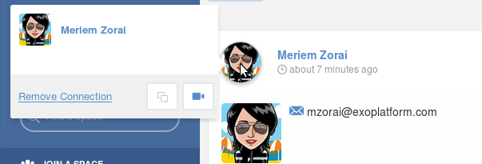
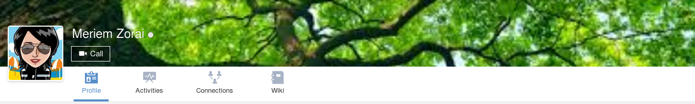
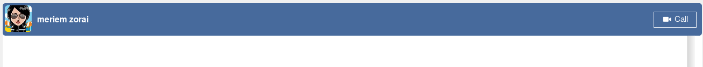
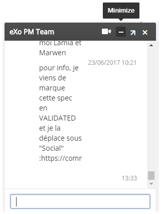
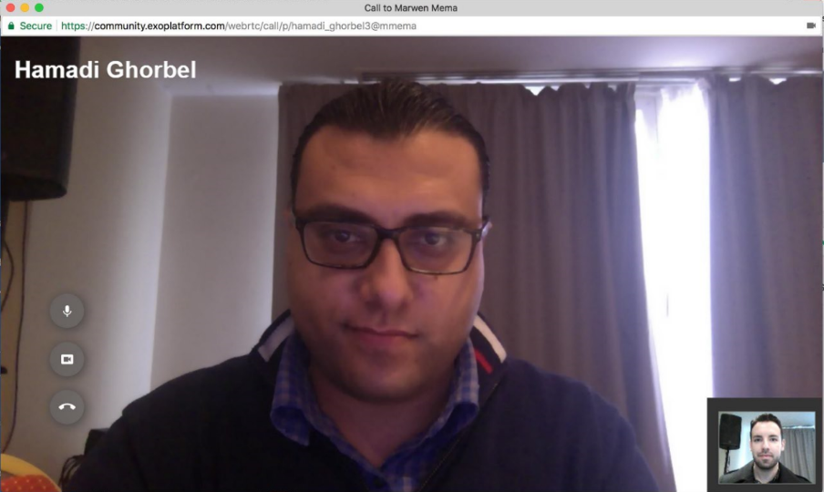
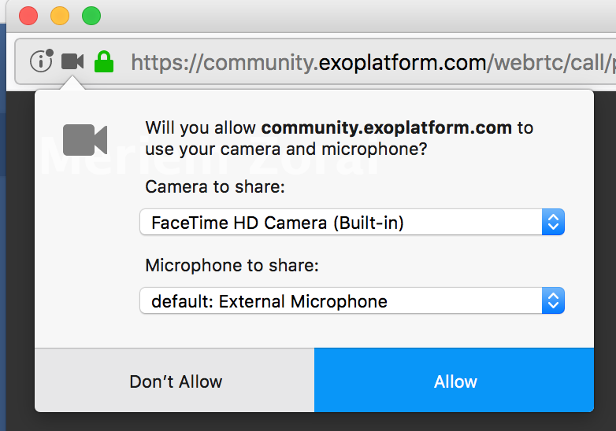
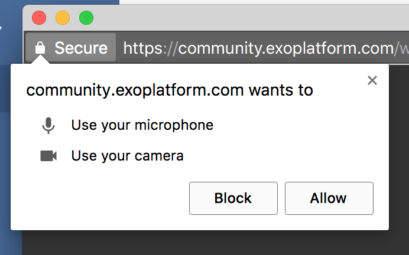
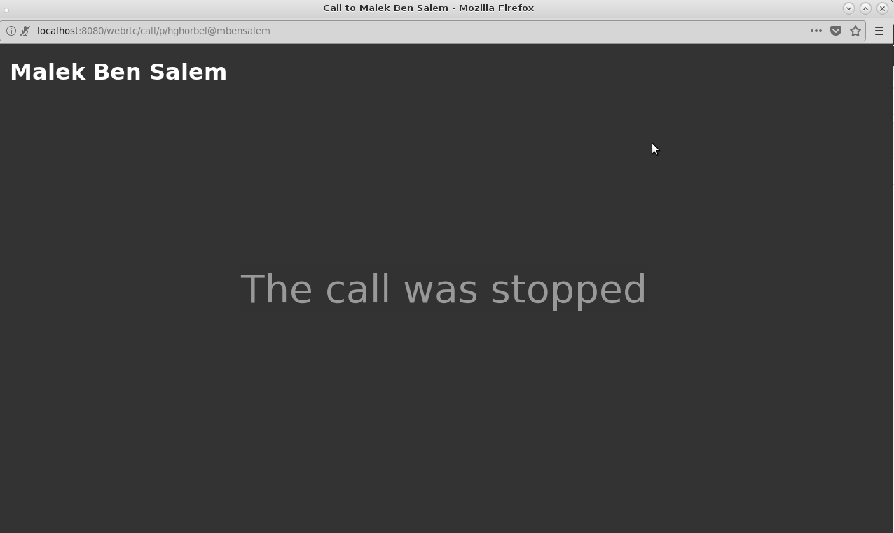
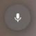

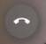

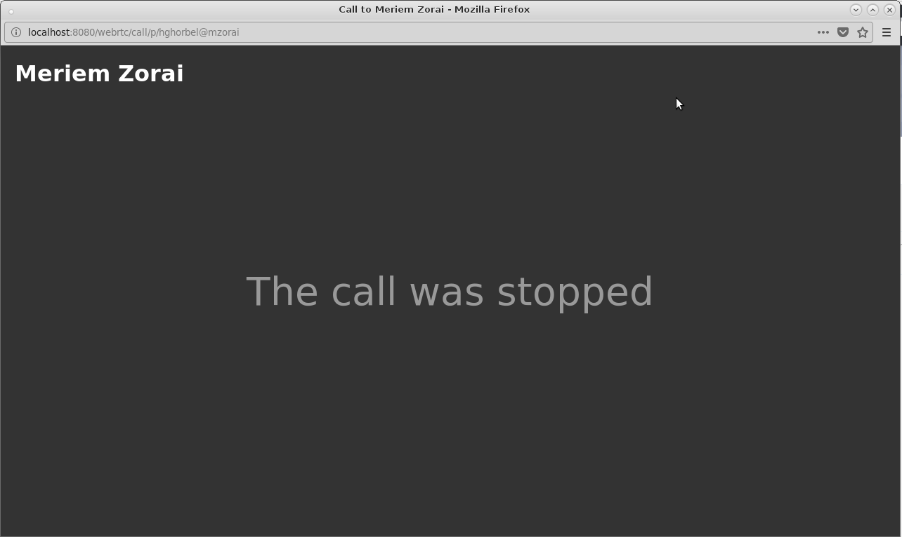
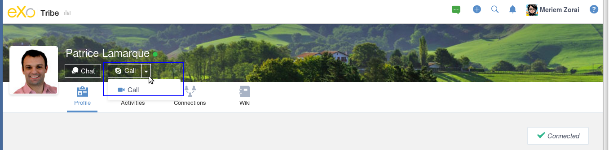
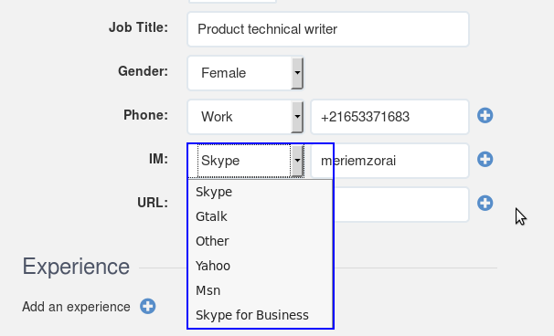
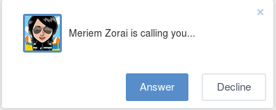

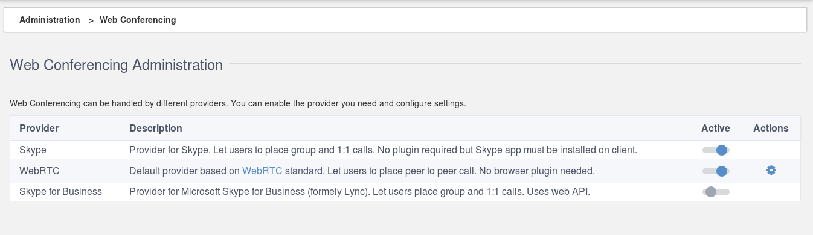

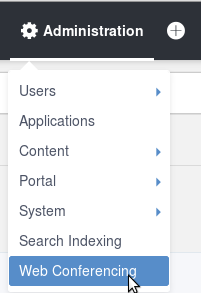
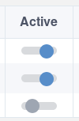

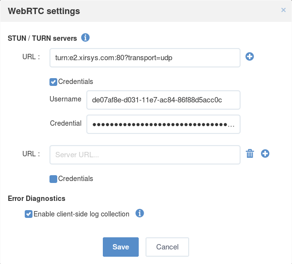

