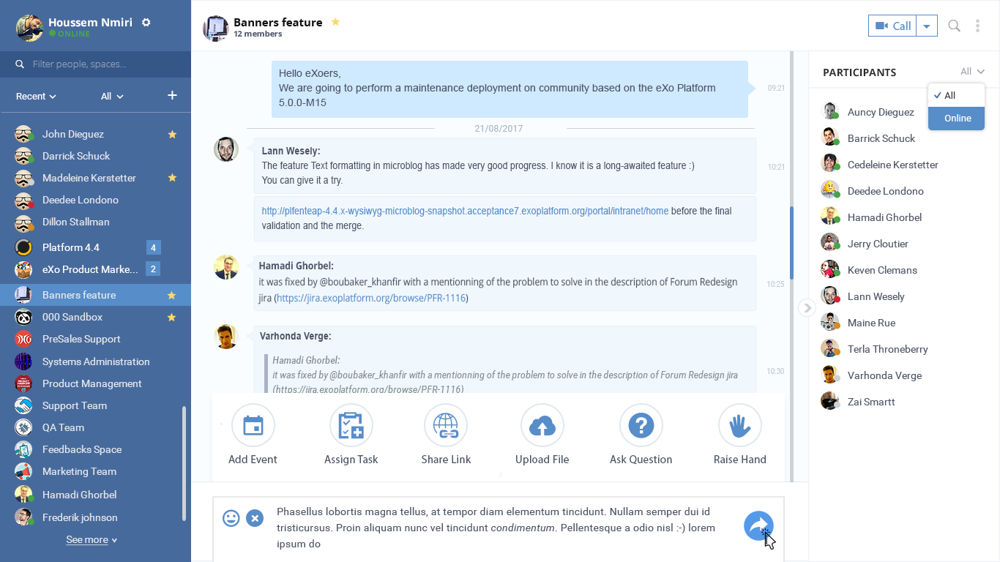
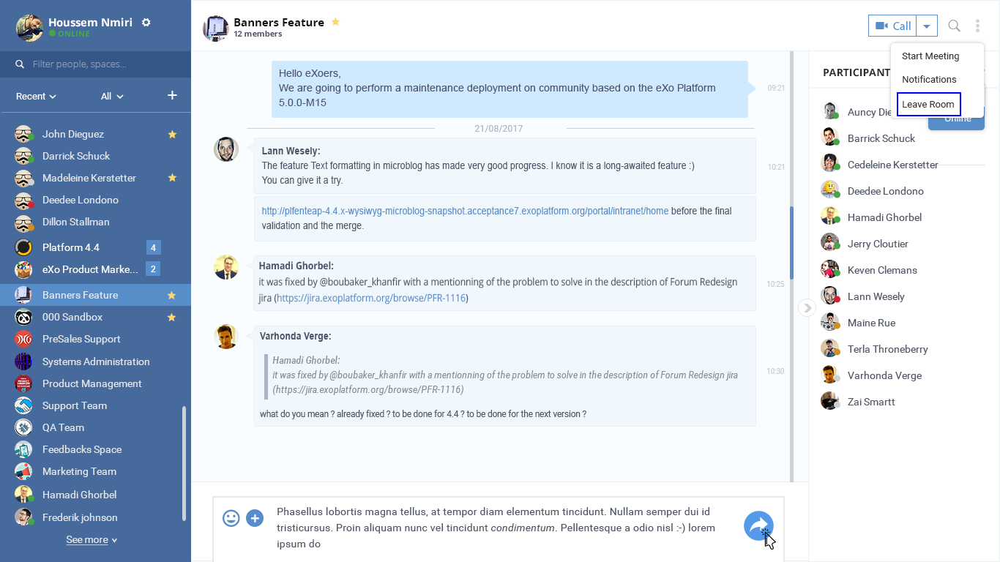
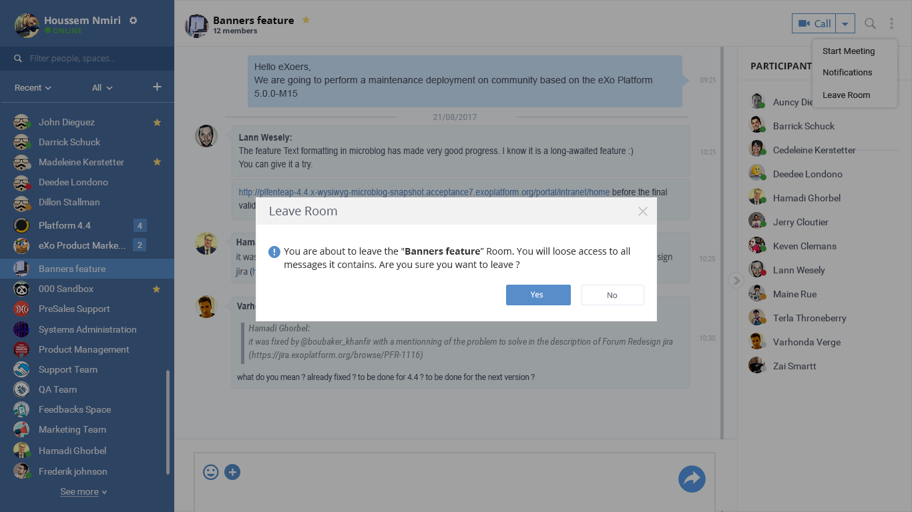
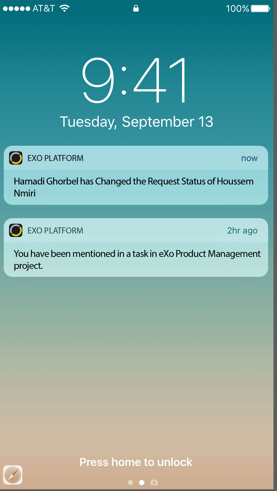
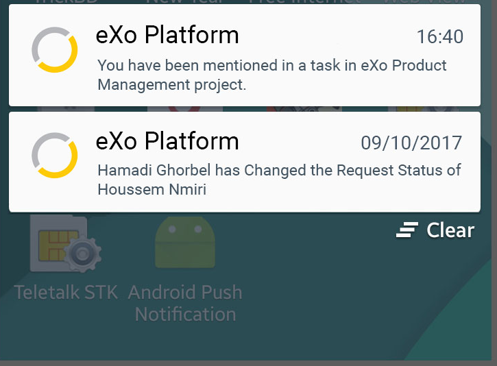
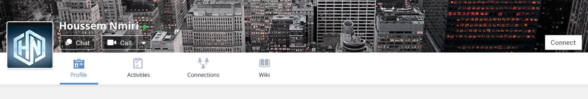
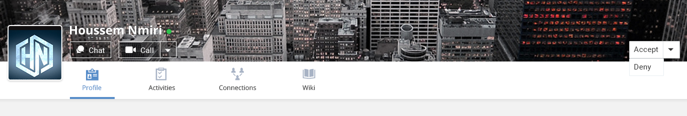
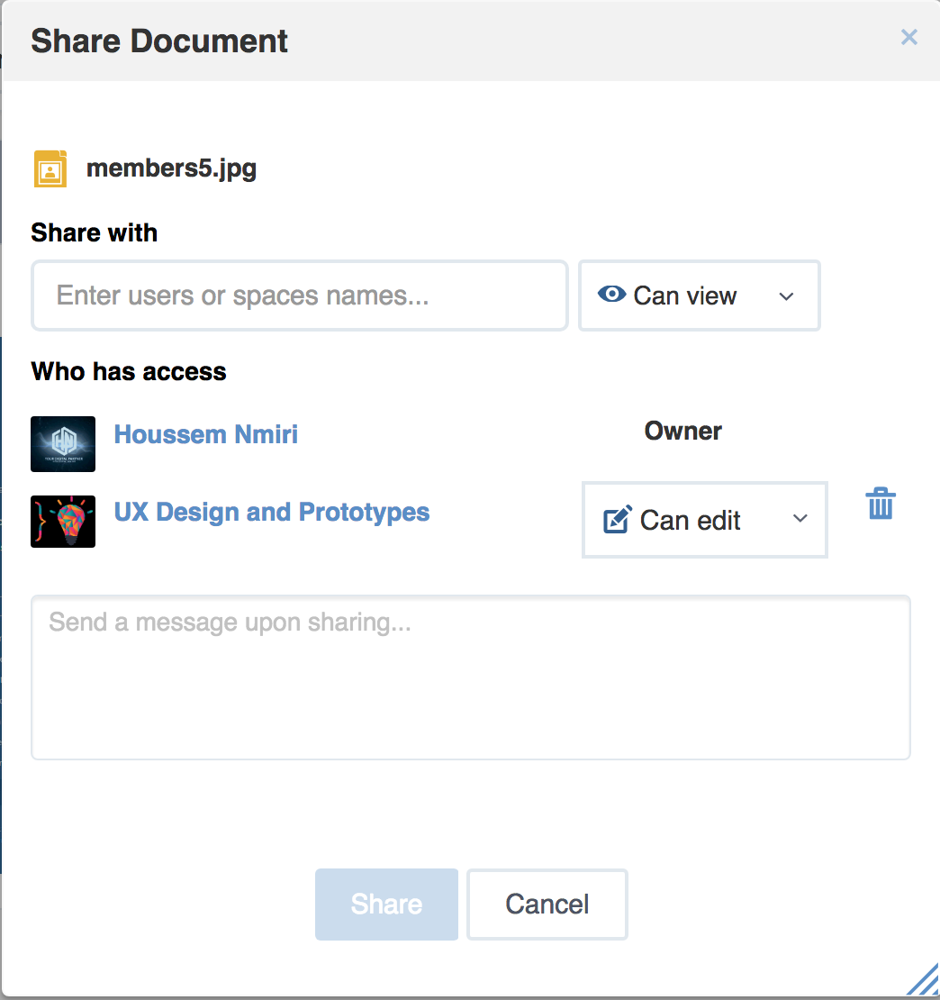

.. _whatsnew:

#################################
What's new in eXo Platform 5.1?
#################################

.. _FunctionalNovelties:

==================================
New features in eXo Platform 5.1?
==================================

Many great enhancements come up in eXo Platform 5.1. Thanks to eXo teams 
and Community members who participated by contributing ideas, discussing 
and voting for the new features.

**Chat UX and UI Improvement**

eXo Chat application was redesigned in order to:

- Make it easier to use 

- Facilitate the way to sort and filter discussions

A new Ux was also introduced for mobile users.

|image0|

**Leave Chat Room**

In addition to improving the Chat UI and UX, a new feature is added to
the 5.1 version: The possibility to the user to leave a chat room by 
himself.

|image1|

|image2|

**Mobile push notifications**

With the 5.1 version, you are instantly notified about news in your 
community through the mobile push notifications for Android and iOS 
mobile devives.

|image3|

|image4|

**Move "Connect" button to the profile banner**

The connect button has been moved in the profile banner same as for the 
Chat and Call buttons.
This move aims to facilitate user's connections from their profiles and 
also to facilitate the accept or deny request.

|image5|

|image6|

**Tasks permission**

Managing tasks permission is, henceforth, assigned to some roles such as:
The tasks project manager, the task's creator and the task's reporter.

**Share file improvement suggestion**

The "Add user" button is removed to make easier the file sharing. You 
just need to select users, the right to attribute and then share the 
file.

|image7|

**Welcome to my Wiki**

In the wiki application, no more generic message, you will have a 
welcome page having the location specification. For example, if you are 
in a personal wiki application, you will got this messge "Welcome to 
user's name wiki".

|image8|
 
If you are in a space's wiki, you will see the message "Welcome to 
space's name wiki".

|image9|

.. _TechnicalNovelties:

========================================
Technical novelties in eXo Platform 5.1
========================================

**Upgrades**

In the version 5.0, many tools/applications used by eXo Platform were 
upgraded to newer  versions in order to benefit from their latest 
updates and improvements: 

- Tomcat 8.5

- JBoss EAP 7.0

- Elasticseach 5.6 

- Infinispan 8

- Groovy 2.4

- JQuery 3.2 

- Shindig 2.5

**Performances and scalability**

In eXo Platform 5.0, we insisted on improving the performance and the 
scalability by changing some strategies, configurations and data 
storage.  

- Cache strategy and configuration

- New cache on organization service

- Files indexing in Elasticsearch

- Storage of all spaces members in Social database tables

**Migrations**

With eXo Platform 5.0, some data were migrated from JCR to database to 
improve performance and scalability:

- Notifications and settings in JPA dataset

- ECMS files are indexed in Elasticsearch

- Space members stored in Social database tables 

Many other improvements and refinements were also done in :

- Customizing skin: No more need to duplicate the whole project 
  platform-ui.

- Extending the IM list of user profile is now doable through UI.

- When indexing JCR workspace, old indexes are always existing until the 
  end of indexation.

- An Mbean is added to reload Javascript.

- A new minify attribute allowing to enable/disable the minification.

- Compilation of Javascript scripts by Google Closure Compiler to ES5.

- Improve the Upgrade plugin framework: Add configuration to define the 
  target version.

- Add the possibility to define a group of users able to manage all 
  spaces.

- eXo Platform 5.0 could be ran with Java9.

- Improvements on Elasticsearch mappings.

- Copying URL feature does not use Flash anymore but it relies on 
  Javascript clipboard feature.

- Javascript errors are no more logged into WebUI popups but in console.
    

.. |image8| image:: images/usersWiki.png
.. |image9| image:: images/spaceWiki.png
