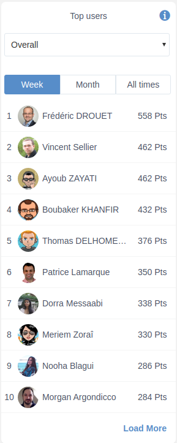
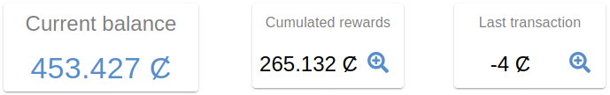
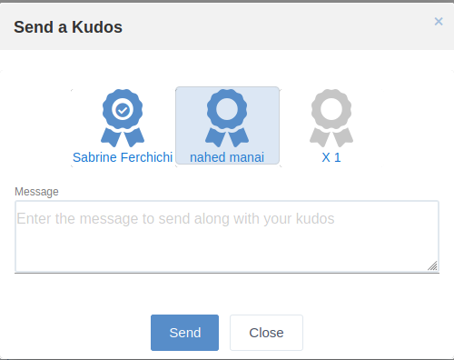
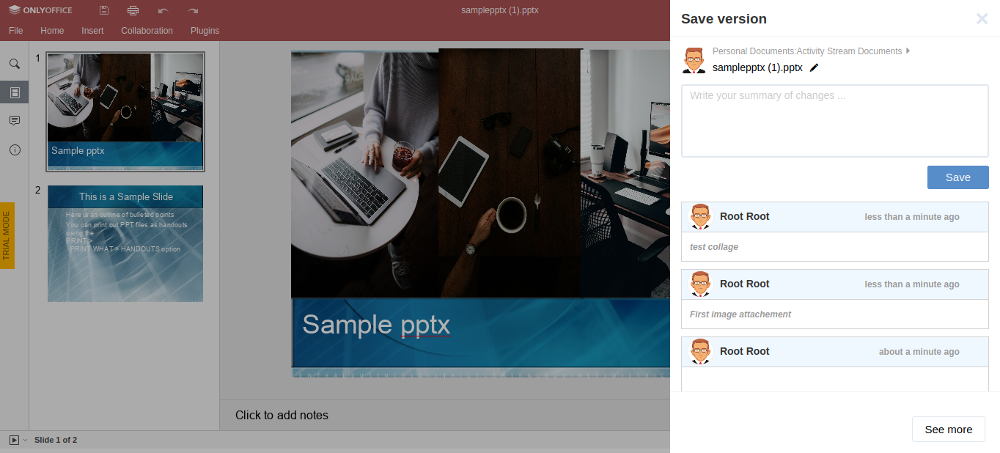
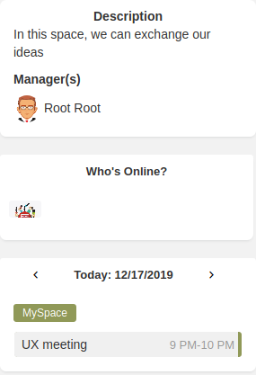
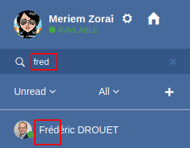

.. _whatsnew:

#################################
What's new in eXo Platform 5.3?
#################################

.. _FunctionalNovelties:

==================================
New features in eXo Platform 5.3?
==================================

Many great enhancements come up in eXo Platform 5.3. Thanks to eXo teams 
and community members who participated by contributing ideas, discussing 
and voting for the new features.

Functional features
~~~~~~~~~~~~~~~~~~~~

:ref:`Gamification <Gamification>`

Enhance your collaborators' engagement and motivate them to adopt a positive behavior with our gamification add-on.

|image0|

|image2|

:ref:`Rewards <UserWallet>`

Discover our rewarding system allowing to recognize employees engagement through digital wallet, kudos and perk store.

|image1|

|image3|

|image4|

:ref:`OnlyOffice Connector <OnlyOffice>`

eXo partenered with OnlyOffice editors to allow users the co-editing of MS Office documents.
 
|image5| 

:ref:`Company branding <BrandingeXoPlatform>`

Brand your eXo Platform server by setting your company logo easily.

|image6|

:ref:`Space templates <Create-Space>`

With space templates feature, create a space with the template which the most matches your needs

|image7|

:ref:`Space widgets <Create-Space>`

New widgets are available on spaces' homepages to display descriptions, managers and events.

|image8|

Other user experience improvements
~~~~~~~~~~~~~~~~~~~~~~~~~~~~~~~~~~~~

:ref:`Home button in Desktop Chat application <Chat>`

A new 'home' button was added to the chat application on Desktop to easily go back the platform's homepage.

|image9|

:ref:`Confirm before refreshing a page <Share-AS>`

A confirmation popup appears when refreshing a page where you already typed some data.

|image10|
 
 
:ref:`Open space applications by right-click <ManagingSpaceApplication>`

With eXo Platform 5.3, it is possible to open a space's application in an another tab with a right-click.

:ref:`Chat contacts filtering does not consider accents <Use-search-bar>`

Chat contact filtering is no more sensitive to accents with eXo Platform 5.3.

|image11|

:ref:`Allow to disable Login History by configuration <Configuration.loginHistory>`

With the new property ``exo.audit.login.enabled``, it is possible to enable or disable the login history.

:ref:`Remove uploaded files from chat <Upload-file-chat>`

With eXo Platform 5.3, you can delete an attached file in chat discussion.

.. _TechnicalNovelties:

========================================
Technical novelties in eXo Platform 5.3
========================================

As usual, eXo Platform continues to devote efforts to enhance security and performance.
In fact, in eXo Platform 5.3, new :ref:`parameters <ESClient>` has been introduced allowing to configure max 
concurrent requests to elasticsearch.

We also made some tools upgrades such as Vue.js and Vuetify. 
We invite you to read the whole tutorial to develop Vuetify and Vue.js Portlets through 
this :ref:`link <PLFDevGuide.DevelopingApplications.DevelopingPortlet.Vuetify>`.

.. |image4| image:: images/whatsNew/PerkStore.png

.. |image6| image:: images/platform/branding_page.png
.. |image7| image:: images/social/add_space_settings_tab.png

.. |image10| image:: images/whatsNew/confirmation_popup_Chrome.png

