.. _whatsnew:

#################################
What's new in eXo Platform 5.3?
#################################

.. _FunctionalNovelties:

==================================
New features in eXo Platform 6.0?
==================================

Many great enhancements come up in eXo Platform 6.0. Thanks to eXo teams 
and community members who participated by contributing ideas, discussing 
and voting for the new features.

Functional features
~~~~~~~~~~~~~~~~~~~~

:ref:`Digital Workplace <DWHomepage>`

A new portal, named DW, more elegant and user-friendly comes with the V6 to facilitate your daily work through a snapshot page which summarizes 
the recent activities and gives you quick access to different parts of the platform (Orders, Spaces, Connections, and much more...)

|image0|

:ref:`News <News>`

Keep your community informed about your latest news through an easy to use application.

|image1|

|image2|

:ref:`Application Center <Managing-Fav-Apps>`

With the V6, we centralized all our applications in an application center to facilitate their access. We also added the possibility to favorite/unfavorites apps.

|image3|

|image4|

:ref:`Group Binding <SpaceGroupsBinding>`

Go faster with users addition to a space with the space group binding feature.

|image5|

:ref:`Cloud drives <CloudDrives>`

Connect your platform to your One drive or Google drive to easily share files

|image6|

:ref:`CKeditor 5 as notes editor <Wiki>`

An easier and more confortable editor to facilitate notes creation. Discover the wiki edition with CKeditor 5.

|image7|

:ref:`New composer <Share-AS>`

Post to your streams with a new composer in a drawer form easier to use and more elegant.

|image8|

Other user experience improvements
~~~~~~~~~~~~~~~~~~~~~~~~~~~~~~~~~~~~

:ref:`New UX for spaces and connections <SAccess-Space>`

A new UX is introduced for both Spaces and People displaying them in flipping cards.

|image9|

|image10|

:ref:`Unified search new UI <Search>`

A new UI for unified search results with an improved algorithm for better results

|image11|

:ref:`Chat drawer <Chat>`

Chat discussions are easier to access now through the chat drawer.

|image12|

.. _TechnicalNovelties:

========================================
Technical novelties in eXo Platform 6.0
========================================

As usual, eXo Platform continues to devote efforts to enhance security and performance.
In fact, eXo Platform 6.0 has a lightweight core with a revamped architecture for more modularity.

Take a look into the :ref:`Breaking Changes <Upgrade.BreakingChanges>` section for more details.

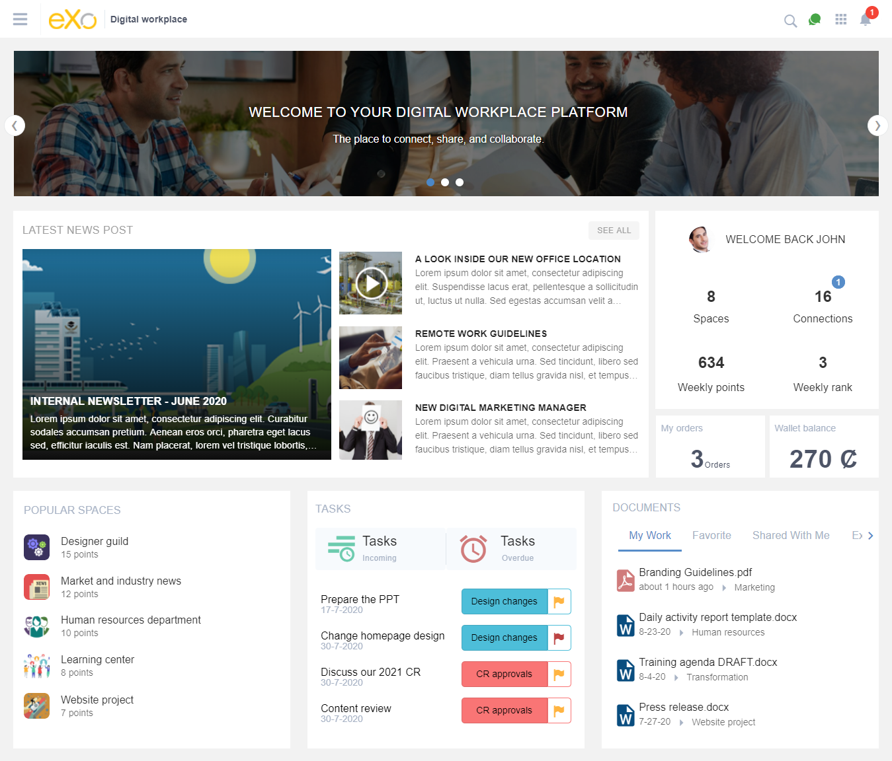
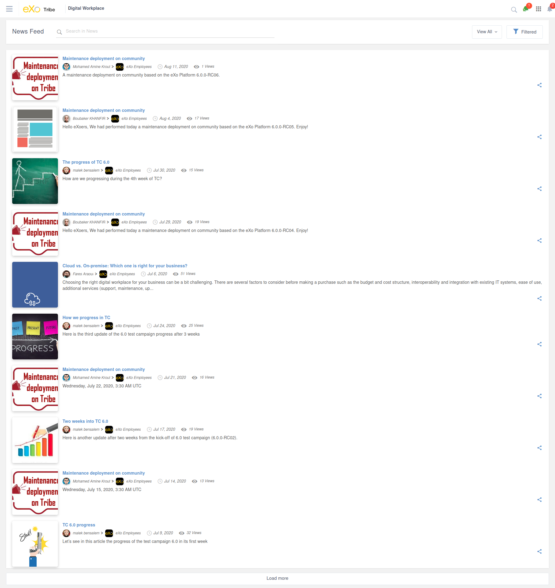
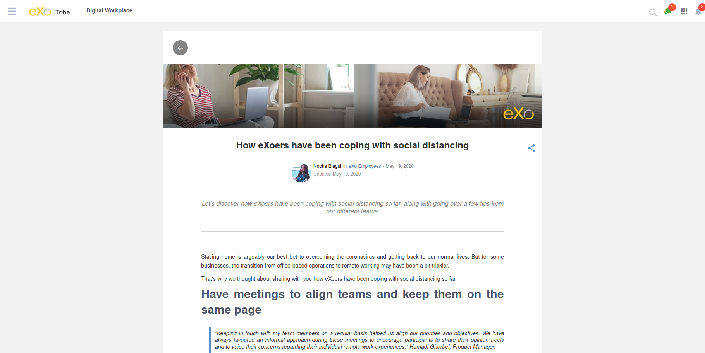
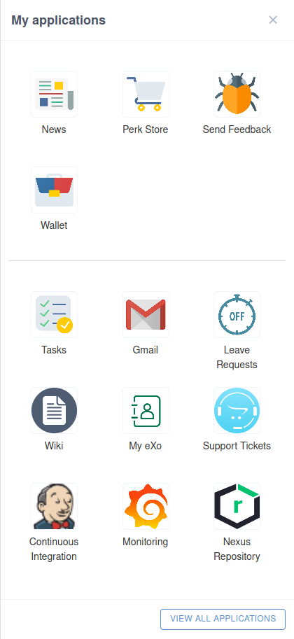
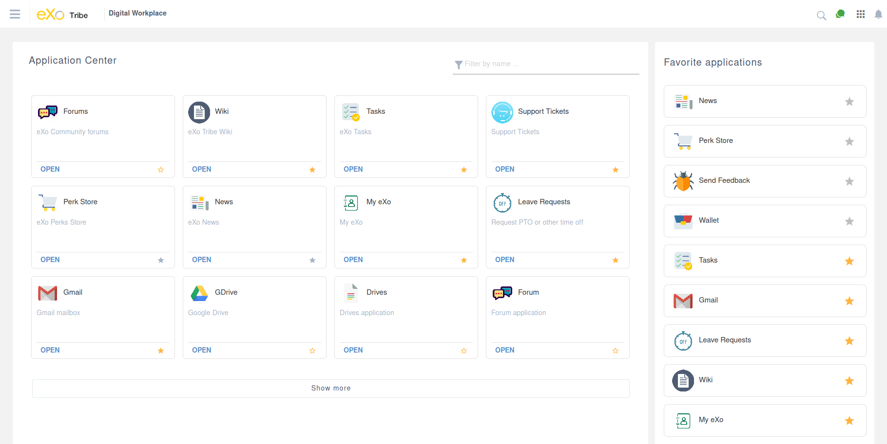
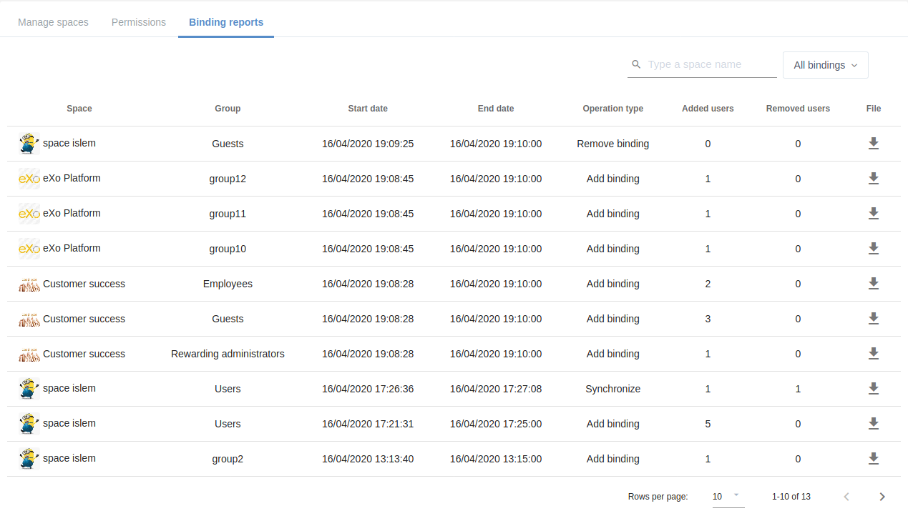

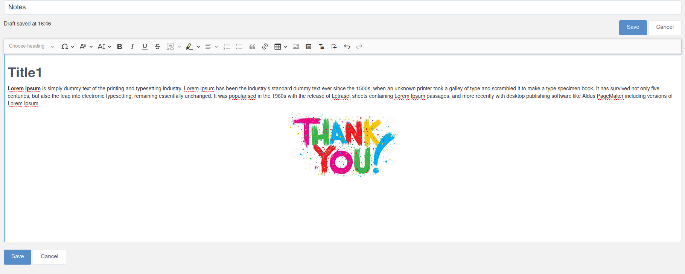
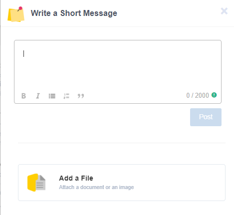
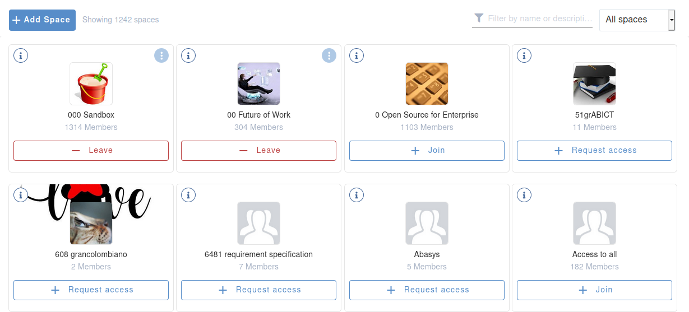
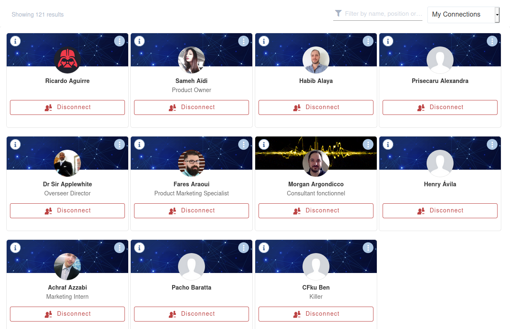
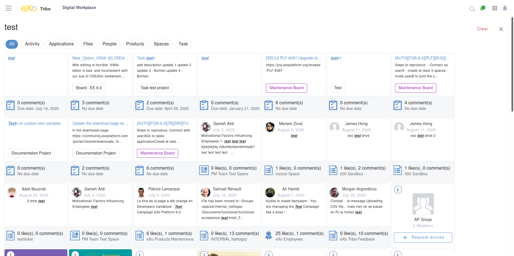

