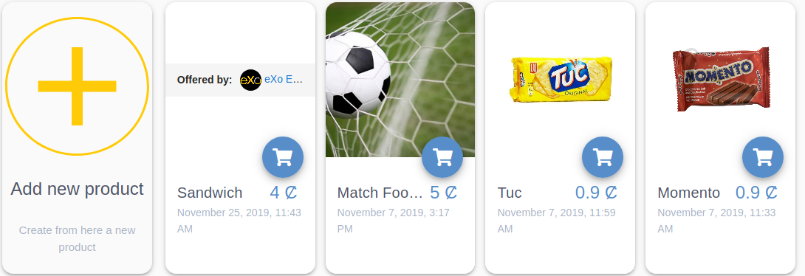

.. _whatsnew:

#################################
What's new in eXo Platform 5.3?
#################################

.. _FunctionalNovelties:

==================================
New features in eXo Platform 5.3?
==================================

Many great enhancements come up in eXo Platform 5.3. Thanks to eXo teams 
and community members who participated by contributing ideas, discussing 
and voting for the new features.

Functional features
~~~~~~~~~~~~~~~~~~~~

:ref:`Gamification <Gamification>`

Enhance your collaborators' engagement and motivate them to adopt a positive behavior with our gamification add-on.

|image0|

|image2|

:ref:`Rewards <UserWallet>`

Discover our rewarding system allowing to recognize employees engagement through digital wallet, kudos and perk store.

|image1|

|image3|

|image4|

:ref:`OnlyOffice Connector <OnlyOffice>`

eXo partenered with OnlyOffice editors to allow users the co-editing of MS Office documents.
 
|image5| 

:ref:`Company branding <BrandingeXoPlatform>`

Brand your eXo Platform server by setting your company logo easily.

|image6|

:ref:`Space templates <Create-Space>`

With space templates feature, create a space with the template which the most matches your needs

|image7|

:ref:`Space widgets <Create-Space>`

New widgets are available on spaces' homepages to display descriptions, managers and events.

|image8|

Other user experience improvements
~~~~~~~~~~~~~~~~~~~~~~~~~~~~~~~~~~~~

:ref:`Search bar filter in chat <Use-search-bar>`

Clear more easily the search filter in chat rooms, simply
by clicking on the cross icon.

|image5|

:ref:`Create event drawer <CreatingNewEvent>`

Creating a new event has been redesigned as an elegant drawer panel for better usability:

|image6|
 
 
:ref:`Unread messages badge in mini chat <miniChat>`

Keep track of unread messages that arrive while you've scrolled up.

|image7|

We also tweaked some UIs :

-  Added more spacing at the left and right of the activities for a better readability.
-  Unified the "Show more" button with the new style used across eXo Platform.

.. _TechnicalNovelties:

========================================
Technical novelties in eXo Platform 5.3
========================================

**Security**

Our continuous effort to improve security lead us to 
change some default permissions to avoid folder listing cases through WebDAV.

**Platform RDBMS**

We continued to decrease our dependency on JCR 
for data persistence. Now, the following components rely on the relational 
**database** storage for better speed and manageability :

-  Product information
-  Login history
-  Wiki
-  Files
-  Social
-  Notifications
-  Email queue
-  Settings

You can learn more about all data structures in 
:ref:`this tutorial <PLFRefGuide.PLFDevelopment.DataStructure>`.

.. |image2| image:: images/whatsNew/Badges.png

.. |image5| image:: images/whatsNew/OnlyOffice.png
.. |image6| image:: images/platform/branding_page.png
.. |image7| image:: images/social/add_space_settings_tab.png

