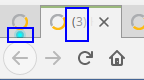
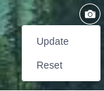

.. _whatsnew:

#################################
What's new in eXo Platform 5.2?
#################################

.. _FunctionalNovelties:

==================================
New features in eXo Platform 5.2?
==================================

Many great enhancements come up in eXo Platform 5.2. Thanks to eXo teams 
and Community members who participated by contributing ideas, discussing 
and voting for the new features.

Functional features
~~~~~~~~~~~~~~~~~~~~

:ref:`Spaces Administration <UserGuide.AdministratingSpaces>`

With the spaces administration new feature it is possible to define:

- Who can create new spaces

- Who can manage spaces

|image0|

:ref:`Edit activities and comments <Editing-Activities>`

With eXo Platform 5.2, you can now edit your activities and comments.

|image1|

:ref:`Empty choice for gender field <About-me>`

It is possible to choose to not reveal your gender by selecting the empty choice.

:ref:`Mark all as read in All Notifications page <On-site>`

You can mark your all on-site notifications as read only by one click.

|image2|

:ref:`Number of unread messages in the browser tab <On-site>`

When you are not on the platform webpage and that you receive chat messages,
a number of the unread messages appears in the tab to grab your attention.

|image3|

:ref:`Turn back the default avatar or banner <On-site>`

With eXo Platform 5.2, you can revert your chosen banner or avatar and back to the default one.
It is also applicable for space banners and avatars.

|image4|

UX features
~~~~~~~~~~~~

:ref:`Search bar filter in chat <Use-search-bar>`

When you use the search bar to filter chat rooms, you can easily clear your filter
by clickin on the cross icon.

|image5|

:ref:`Create event drawer <CreatingNewEvent>`

The create event popup was redesigned for better usability and ergonomy.

|image6|
 
:ref:`Badge of new received messages in the mini chat <miniChat>`

When you scroll up into the mini chat discussion and that your interlocutor 
sends you new chat messages, a badge with the number of unread messages appears 
near to the display name.

|image7|

In addition to the above UX improvements, we also:

-  Added more spacing at  the left and right of the activities for a better vision.

-  Unified the "Show more" button with the new UX style used in eXo Platform.

.. _TechnicalNovelties:

========================================
Technical novelties in eXo Platform 5.2
========================================

**Upgrades**

eXo Platform 5.1 now supports JBoss EAP 7.1. This new version comes with 
some `improvements <https://www.redhat.com/en/blog/red-hat-releases-jboss-eap-71>`__ 
and fixes some issues which impacted eXo Platform:

  -  "Remember me" token not recognized in Jboss EAP 7.0 (`PLF-7787 <https://jira.exoplatform.org/browse/PLF-7787>`__)
  
  -  Instance id of a cluster node is not added on the JSESSIONID cookie (`PLF-7854 <https://jira.exoplatform.org/browse/PLF-7854>`__)

**Performances and scalability**

In eXo Platform 5.1 we continued our effort on improving the performance 
and the scalability by changing some strategies, configurations and data 
storage:

-  Users/Groups/Roles import in database: a new job is implemented to 
   import IDM data  in IDM database asynchronously and periodically.
  
-  Smarter data user synchronization: only mandatory data are imported 
   in database during synchronization, other user's data are imported on 
   login or when it is required (lazy import).
  
**Migrations**

-  As cited in the previous section, eXo Chat has a new design. 
   Moreover, from a technical point of view, it has been implemented 
   using a new frontend framework (Vue.js).

-  Chat favorites data has also been changed. An upgrade plugin runs on 
   eXo Platform 5.1 startup to migrate existing data to the new format.

**Some others Improvements**

-  Harmonize cache configuration in cluster and local modes.

-  Improve Mbean cache naming: All caches are now named with the 
   following pattern: ``<project>.<cacheName>``

-  ``cluster.node.name`` parameter automatically generated when not set.

-  ``upgrade.properties file`` is not needed anymore, upgrade plugins 
   are automatically triggered.

.. |image0| image:: images/platform/SpacesAdministration.png
.. |image1| image:: images/platform/delete_edit.png
.. |image2| image:: images/social/MArkAllRead.png

.. |image5| image:: images/chat/filter_3.png
.. |image6| image:: images/calendar/Add_event_drawer.png
.. |image7| image:: images/chat/unread_chat_msg.png

