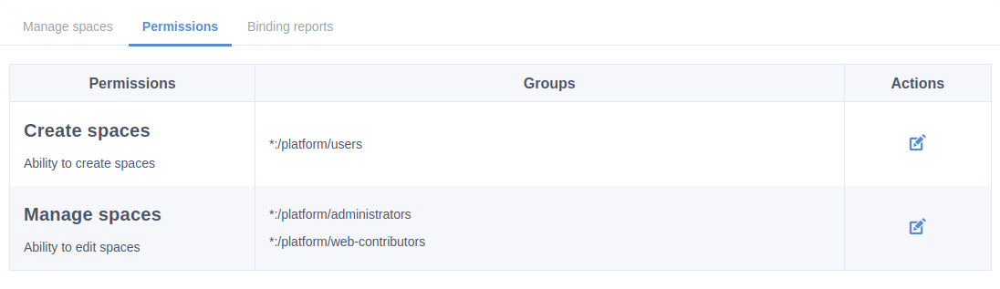
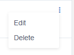

.. _whatsnew:

#################################
What's new in eXo Platform 5.2?
#################################

.. _FunctionalNovelties:

==================================
New features in eXo Platform 5.2?
==================================

Many great enhancements come up in eXo Platform 5.2. Thanks to eXo teams 
and community members who participated by contributing ideas, discussing 
and voting for the new features.

Functional features
~~~~~~~~~~~~~~~~~~~~

:ref:`Spaces Administration <UserGuide.AdministratingSpaces>`

With the spaces administration feature, administrators now have a way to define:

- Who can create new spaces
- Who can manage spaces

|image0|

:ref:`Edit activities and comments <Editing-Activities>`

Users can now edit their own activities and comments in the activity stream.

|image1|

:ref:`Empty choice for gender field <About-me>`

User can now decide to not indicate their gender on their profile.

:ref:`Mark all as read in All Notifications page <On-site>`

Users can mark their all on-site notifications as read with a single click.

|image2|

:ref:`Number of unread messages in the browser tab <On-site>`

The number of the unread chat messages is now dynamically updated in the page title  
so that users can easily know when there is something requiring their attention just by
you're working on other browser tabs.

|image3|

:ref:`Reset the default avatar or banner <On-site>`

Users can now reset their banner or avatar by reverting to the default one.
It is also applicable for spaces.

|image4|

Other user experience improvements
~~~~~~~~~~~~

:ref:`Search bar filter in chat <Use-search-bar>`

Clear more easily the search filter in chat rooms, simply
by clicking on the cross icon.

|image5|

:ref:`Create event drawer <CreatingNewEvent>`

Creating a new event has been redesigned as an elegant drawer panel for better usability:

|image6|
 
 
:ref:`Badge of new received messages in the mini chat <miniChat>`

When you scroll down into the mini chat discussion and that your interlocutor 
sends you new chat messages, a badge with the number of unread messages appears 
next to the display name.

|image7|

We also tweaked some UIs :

-  Added more spacing at the left and right of the activities for a better readability.
-  Unified the "Show more" button with the new style used across eXo Platform.

.. _TechnicalNovelties:

========================================
Technical novelties in eXo Platform 5.2
========================================

**Security**

Our continuous effort to improve security lead us to 
change some default permissions to avoid folder listing cases through WebDAV.

**Platform RDBMS**

We continued to decrease our dependency on JCR 
to store data. Now, the following components rely on the relational 
**database** storage for better speed and manageability :

-  Product information
-  Login history
-  Wiki
-  Files
-  Social
-  Notifications
-  Email queue
-  Settings

You can learn more about our data structure through 
:ref:`this tutorial <PLFRefGuide.PLFDevelopment.DataStructure>`.

.. |image2| image:: images/social/MArkAllRead.png
.. |image3| image:: images/social/Notifications_Web_tab.png
.. |image4| image:: images/social/update_reset_banner.png
.. |image5| image:: images/chat/filter_3.png

.. |image7| image:: images/chat/unread_chat_msg.png

