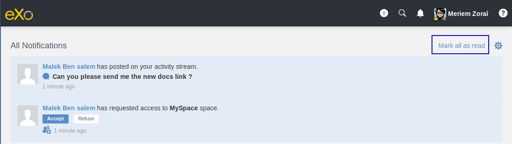

.. _whatsnew:

#################################
What's new in eXo Platform 5.2?
#################################

.. _FunctionalNovelties:

==================================
New features in eXo Platform 5.2?
==================================

Many great enhancements come up in eXo Platform 5.2. Thanks to eXo teams 
and Community members who participated by contributing ideas, discussing 
and voting for the new features.

Functional features
~~~~~~~~~~~~~~~~~~~~

:ref:`Spaces Administration <UserGuide.AdministratingSpaces>`

With the spaces administration new feature it is possible to define:

- Who can create new spaces

- Who can manage spaces

|image0|

:ref:`Edit activities and comments <Editing-Activities>`

With eXo Platform 5.2, you can now edit your activities and comments.

|image1|

:ref:`Empty choice for gender field <About-me>`

It is possible to choose to not reveal your gender by selecting the empty choice.

:ref:`Mark all as read in All Notifications page <On-site>`

You can mark your all on-site notifications as read only by one click.

|image2|

:ref:`Number of unread messages in the browser tab <On-site>`

When you are not on the platform webpage and that you receive chat messages,
a number of the unread messages appears in the tab to grab your attention.

|image3|

:ref:`Turn back the default avatar or banner <On-site>`

With eXo Platform 5.2, you can revert your chosen banner or avatar and back to the default one.
It is also applicable for space banners and avatars.

|image4|

UX features
~~~~~~~~~~~~

:ref:`Search bar filter in chat <Use-search-bar>`

When you use the search bar to filter chat rooms, you can easily clear your filter
by clickin on the cross icon.

|image5|

:ref:`Create event drawer <CreatingNewEvent>`

The create event popup was redesigned for better usability and ergonomy.

|image6|
 
:ref:`Badge of new received messages in the mini chat <miniChat>`

When you scroll up into the mini chat discussion and that your interlocutor 
sends you new chat messages, a badge with the number of unread messages appears 
near to the display name.

|image7|

In addition to the above UX improvements, we also:

-  Added more spacing at  the left and right of the activities for a better vision.

-  Unified the "Show more" button with the new UX style used in eXo Platform.

.. _TechnicalNovelties:

========================================
Technical novelties in eXo Platform 5.2
========================================

**Security**

In eXo Platform 5.2 we continued our effort on improving the security by 
changing some permissions and avoiding the WebDAV browsing into JCR folders.

**Platform RDBMS**

As we made in previos versions, we decreased the usage of JCR to store data 
and we opted to the **data base** to store data related to :

-  Product information
-  Login history
-  Wiki
-  Files
-  Social
-  Activities and comments
-  Notifications
-  Email queue
-  Settings

You can learn more about our data structure through 
:ref:`this tutorial <PLFRefGuide.PLFDevelopment.DataStructure>`.

.. |image0| image:: images/platform/SpacesAdministration.png
.. |image1| image:: images/platform/delete_edit.png

.. |image3| image:: images/social/Notifications_Web_tab.png
.. |image4| image:: images/social/update_reset_banner.png
.. |image5| image:: images/chat/filter_3.png
.. |image6| image:: images/calendar/Add_event_drawer.png
.. |image7| image:: images/chat/unread_chat_msg.png

